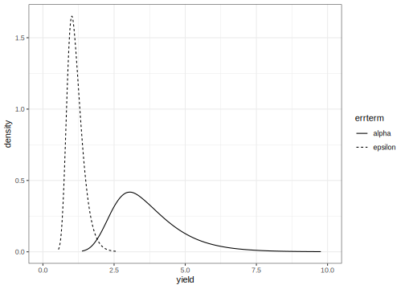
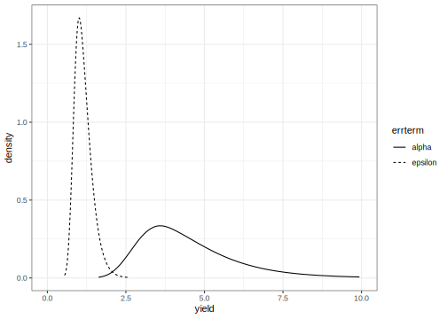
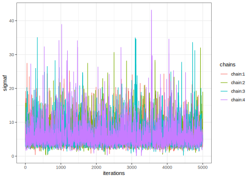
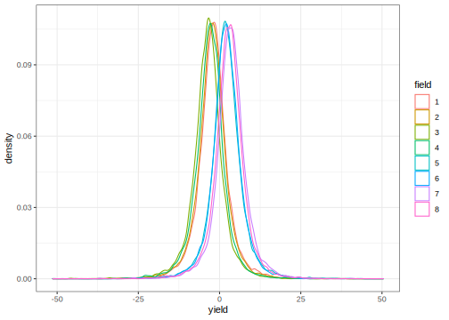
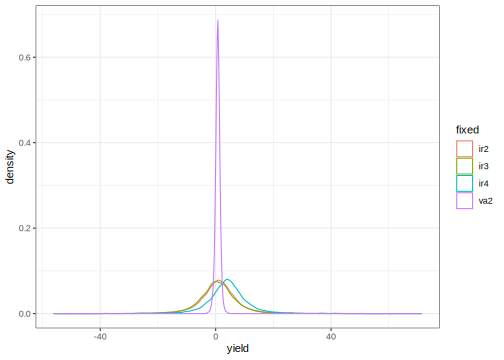

Split Plot Design
================
[Julian Faraway](https://julianfaraway.github.io/)
07 July 2022

-   <a href="#data" id="toc-data">Data</a>
-   <a href="#mixed-effect-model" id="toc-mixed-effect-model">Mixed Effect
    Model</a>
-   <a href="#inla" id="toc-inla">INLA</a>
-   <a href="#informative-gamma-priors-on-the-precisions"
    id="toc-informative-gamma-priors-on-the-precisions">Informative Gamma
    priors on the precisions</a>
-   <a href="#penalized-complexity-prior"
    id="toc-penalized-complexity-prior">Penalized Complexity Prior</a>
-   <a href="#stan" id="toc-stan">STAN</a>
-   <a href="#diagnostics" id="toc-diagnostics">Diagnostics</a>
-   <a href="#output-summaries" id="toc-output-summaries">Output
    summaries</a>
-   <a href="#posterior-distributions"
    id="toc-posterior-distributions">Posterior Distributions</a>
-   <a href="#package-version-info" id="toc-package-version-info">Package
    version info</a>

See the [introduction](index.md) for an overview.

This example is discussed in more detail in my book [Extending the
Linear Model with R](https://julianfaraway.github.io/faraway/ELM/)

Required libraries:

``` r
library(faraway)
library(ggplot2)
library(lme4)
library(pbkrtest)
library(RLRsim)
library(INLA)
library(knitr)
library(rstan, quietly=TRUE)
library(brms)
library(mgcv)
```

# Data

In an agricultural field trial, the objective was to determine the
effects of two crop varieties and four different irrigation methods.
Eight fields were available, but only one type of irrigation may be
applied to each field. The fields may be divided into two parts with a
different variety planted in each half. The whole plot factor is the
method of irrigation, which should be randomly assigned to the fields.
Within each field, the variety is randomly assigned.

Load in and plot the data:

``` r
data(irrigation, package="faraway")
summary(irrigation)
```

         field   irrigation variety     yield     
     f1     :2   i1:4       v1:8    Min.   :34.8  
     f2     :2   i2:4       v2:8    1st Qu.:37.6  
     f3     :2   i3:4               Median :40.1  
     f4     :2   i4:4               Mean   :40.2  
     f5     :2                      3rd Qu.:42.7  
     f6     :2                      Max.   :47.6  
     (Other):4                                    

``` r
ggplot(irrigation, aes(y=yield, x=field, shape=variety, color=irrigation)) + geom_point()
```

<!-- -->

# Mixed Effect Model

The irrigation and variety are fixed effects, but the field is a random
effect. We must also consider the interaction between field and variety,
which is necessarily also a random effect because one of the two
components is random. The fullest model that we might consider is:

_{ij} + f_k + (vf)_{jk} + \epsilon_{ijk}")

where
_{ij}")
are fixed effects; the rest are random having variances
,

and
.
Note that we have no
_{ik}")
term in this model. It would not be possible to estimate such an effect
since only one type of irrigation is used on a given field; the factors
are not crossed. Unfortunately, it is not possible to distinguish the
variety within the field variation. We would need more than one
observation per variety within each field for us to separate the two
variabilities. We resort to a simpler model that omits the variety by
field interaction random effect:

_{ij} + f_k +  \epsilon_{ijk}")

We fit this model with:

``` r
lmod <- lme4::lmer(yield ~ irrigation * variety + (1|field), irrigation)
faraway::sumary(lmod)
```

    Fixed Effects:
                           coef.est coef.se
    (Intercept)            38.50     3.03  
    irrigationi2            1.20     4.28  
    irrigationi3            0.70     4.28  
    irrigationi4            3.50     4.28  
    varietyv2               0.60     1.45  
    irrigationi2:varietyv2 -0.40     2.05  
    irrigationi3:varietyv2 -0.20     2.05  
    irrigationi4:varietyv2  1.20     2.05  

    Random Effects:
     Groups   Name        Std.Dev.
     field    (Intercept) 4.02    
     Residual             1.45    
    ---
    number of obs: 16, groups: field, 8
    AIC = 65.4, DIC = 91.8
    deviance = 68.6 

The fixed effects don’t look very significant. We could use a parametric
bootstrap to test this but it’s less work to use the `pbkrtest` package
which implements the Kenward-Roger approximation. First test the
interaction:

``` r
lmoda <- lmer(yield ~ irrigation + variety + (1|field),data=irrigation)
pbkrtest::KRmodcomp(lmod, lmoda)
```

    large : yield ~ irrigation * variety + (1 | field)
    small : yield ~ irrigation + variety + (1 | field)
          stat  ndf  ddf F.scaling p.value
    Ftest 0.25 3.00 4.00         1    0.86

We can drop the interaction. Now test for a variety effect:

``` r
lmodi <- lmer(yield ~ irrigation + (1|field), irrigation)
KRmodcomp(lmoda, lmodi)
```

    large : yield ~ irrigation + variety + (1 | field)
    small : yield ~ irrigation + (1 | field)
          stat  ndf  ddf F.scaling p.value
    Ftest 1.58 1.00 7.00         1    0.25

The variety can go also. Now check the irrigation method.

``` r
lmodv <- lmer(yield ~  variety + (1|field), irrigation)
KRmodcomp(lmoda, lmodv)
```

    large : yield ~ irrigation + variety + (1 | field)
    small : yield ~ variety + (1 | field)
          stat  ndf  ddf F.scaling p.value
    Ftest 0.39 3.00 4.00         1    0.77

This can go also. As a final check, lets compare the null model with no
fixed effects to the full model.

``` r
lmodn <- lmer(yield ~  1 + (1|field), irrigation)
KRmodcomp(lmod, lmodn)
```

    large : yield ~ irrigation * variety + (1 | field)
    small : yield ~ 1 + (1 | field)
          stat  ndf  ddf F.scaling p.value
    Ftest 0.38 7.00 4.48     0.903    0.88

This confirms the lack of statistical significance for the variety and
irrigation factors.

We can check the significance of the random effect (field) term with:

``` r
RLRsim::exactRLRT(lmod)
```


        simulated finite sample distribution of RLRT.
        
        (p-value based on 10000 simulated values)

    data:  
    RLRT = 6.11, p-value = 0.011

We can see that there is a significant variation among the fields.

# INLA

Integrated nested Laplace approximation is a method of Bayesian
computation which uses approximation rather than simulation. More can be
found on this topic in [Bayesian Regression Modeling with
INLA](http://julianfaraway.github.io/brinla/) and the [chapter on
GLMMs](https://julianfaraway.github.io/brinlabook/chaglmm.html)

Use the most recent computational methodology:

``` r
inla.setOption(inla.mode="experimental")
inla.setOption("short.summary",TRUE)
```

Try the default INLA fit

``` r
formula <- yield ~ irrigation + variety +f(field, model="iid")
result <- inla(formula, family="gaussian", data=irrigation)
summary(result)
```

    Fixed effects:
                   mean    sd 0.025quant 0.5quant 0.975quant   mode kld
    (Intercept)  38.464 2.642     33.195   38.458     43.770 38.451   0
    irrigationi2  0.954 3.711     -6.500    0.961      8.365  0.970   0
    irrigationi3  0.557 3.711     -6.896    0.564      7.970  0.572   0
    irrigationi4  4.032 3.712     -3.433    4.043     11.433  4.056   0
    varietyv2     0.750 0.591     -0.429    0.750      1.928  0.750   0

    Model hyperparameters:
                                             mean    sd 0.025quant 0.5quant 0.975quant  mode
    Precision for the Gaussian observations 0.890 0.426      0.295    0.814      1.931 0.662
    Precision for field                     0.098 0.062      0.023    0.084      0.258 0.057

     is computed 

Default looks more plausible than [one way](pulp.md) and
[RBD](penicillin.md) examples.

Compute the transforms to an SD scale for the field and error. Make a
table of summary statistics for the posteriors:

``` r
sigmaalpha <- inla.tmarginal(function(x) 1/sqrt(exp(x)),result$internal.marginals.hyperpar[[2]])
sigmaepsilon <- inla.tmarginal(function(x) 1/sqrt(exp(x)),result$internal.marginals.hyperpar[[1]])
restab=sapply(result$marginals.fixed, function(x) inla.zmarginal(x,silent=TRUE))
restab=cbind(restab, inla.zmarginal(sigmaalpha,silent=TRUE))
restab=cbind(restab, inla.zmarginal(sigmaepsilon,silent=TRUE))
colnames(restab) = c("mu","ir2","ir3","ir4","v2","alpha","epsilon")
data.frame(restab)
```

                   mu     ir2     ir3     ir4       v2  alpha epsilon
    mean       38.464  0.9547 0.55753  4.0328  0.74975 3.6703  1.1522
    sd          2.642  3.7114  3.7114  3.7115  0.59056  1.187 0.28441
    quant0.025 33.194 -6.5015 -6.8972 -3.4346 -0.42928 1.9757 0.72197
    quant0.25  36.844 -1.3068 -1.7042  1.7735  0.38193 2.8224 0.94808
    quant0.5   38.452 0.95213 0.55451  4.0337  0.74832 3.4489  1.1064
    quant0.75  40.064   3.206  2.8086  6.2863   1.1147 4.2834   1.309
    quant0.975 43.759  8.3504  7.9546  11.418   1.9257  6.587  1.8307

Also construct a plot the SD posteriors:

``` r
ddf <- data.frame(rbind(sigmaalpha,sigmaepsilon),errterm=gl(2,nrow(sigmaalpha),labels = c("alpha","epsilon")))
ggplot(ddf, aes(x,y, linetype=errterm))+geom_line()+xlab("yield")+ylab("density")+xlim(0,10)
```

<!-- -->

Posteriors look OK.

# Informative Gamma priors on the precisions

Now try more informative gamma priors for the precisions. Define it so
the mean value of gamma prior is set to the inverse of the variance of
the residuals of the fixed-effects only model. We expect the two error
variances to be lower than this variance so this is an overestimate. The
variance of the gamma prior (for the precision) is controlled by the
`apar` shape parameter.

``` r
apar <- 0.5
lmod <- lm(yield ~ irrigation+variety, data=irrigation)
bpar <- apar*var(residuals(lmod))
lgprior <- list(prec = list(prior="loggamma", param = c(apar,bpar)))
formula = yield ~ irrigation+variety+f(field, model="iid", hyper = lgprior)
result <- inla(formula, family="gaussian", data=irrigation)
summary(result)
```

    Fixed effects:
                   mean    sd 0.025quant 0.5quant 0.975quant   mode kld
    (Intercept)  38.481 3.168     32.156   38.471     44.870 38.460   0
    irrigationi2  0.935 4.459     -8.056    0.946      9.851  0.960   0
    irrigationi3  0.539 4.459     -8.449    0.549      9.457  0.562   0
    irrigationi4  4.003 4.460     -5.009    4.020     12.899  4.041   0
    varietyv2     0.750 0.578     -0.402    0.750      1.901  0.750   0

    Model hyperparameters:
                                             mean    sd 0.025quant 0.5quant 0.975quant  mode
    Precision for the Gaussian observations 0.894 0.423      0.299    0.819      1.924 0.669
    Precision for field                     0.068 0.045      0.014    0.057      0.183 0.037

     is computed 

Compute the summaries as before:

``` r
sigmaalpha <- inla.tmarginal(function(x) 1/sqrt(exp(x)),result$internal.marginals.hyperpar[[2]])
sigmaepsilon <- inla.tmarginal(function(x) 1/sqrt(exp(x)),result$internal.marginals.hyperpar[[1]])
restab=sapply(result$marginals.fixed, function(x) inla.zmarginal(x,silent=TRUE))
restab=cbind(restab, inla.zmarginal(sigmaalpha,silent=TRUE))
restab=cbind(restab, inla.zmarginal(sigmaepsilon,silent=TRUE))
colnames(restab) = c("mu","ir2","ir3","ir4","v2","alpha","epsilon")
data.frame(restab)
```

                   mu     ir2     ir3    ir4       v2  alpha epsilon
    mean       38.482 0.93538 0.53953 4.0032  0.74976 4.4843  1.1485
    sd         3.1693  4.4609  4.4609 4.4612  0.57778 1.5662 0.28154
    quant0.025 32.155 -8.0563 -8.4495 -5.009 -0.40223 2.3457 0.72329
    quant0.25  36.573 -1.7297 -2.1261  1.342  0.38726 3.3714 0.94636
    quant0.5   38.464 0.93505 0.53842 4.0089  0.74836 4.1605  1.1028
    quant0.75  40.361   3.592  3.1956 6.6639   1.1094 5.2545  1.3035
    quant0.975 44.858   9.833  9.4397 12.882   1.8988  8.409  1.8207

Make the plots:

``` r
ddf <- data.frame(rbind(sigmaalpha,sigmaepsilon),errterm=gl(2,nrow(sigmaalpha),labels = c("alpha","epsilon")))
ggplot(ddf, aes(x,y, linetype=errterm))+geom_line()+xlab("yield")+ylab("density")+xlim(0,10)
```

<!-- -->

Posteriors look OK.

# Penalized Complexity Prior

In [Simpson et al (2015)](http://arxiv.org/abs/1403.4630v3), penalized
complexity priors are proposed. This requires that we specify a scaling
for the SDs of the random effects. We use the SD of the residuals of the
fixed effects only model (what might be called the base model in the
paper) to provide this scaling.

``` r
lmod <- lm(yield ~ irrigation+variety, irrigation)
sdres <- sd(residuals(lmod))
pcprior <- list(prec = list(prior="pc.prec", param = c(3*sdres,0.01)))
formula <- yield ~ irrigation+variety+f(field, model="iid", hyper = pcprior)
result <- inla(formula, family="gaussian", data=irrigation)
summary(result)
```

    Fixed effects:
                   mean    sd 0.025quant 0.5quant 0.975quant   mode kld
    (Intercept)  38.472 2.897     32.691   38.466     44.292 38.457   0
    irrigationi2  0.945 4.075     -7.241    0.953      9.086  0.963   0
    irrigationi3  0.549 4.075     -7.636    0.555      8.691  0.566   0
    irrigationi4  4.019 4.076     -4.179    4.030     12.148  4.046   0
    varietyv2     0.750 0.580     -0.407    0.750      1.906  0.750   0

    Model hyperparameters:
                                             mean    sd 0.025quant 0.5quant 0.975quant  mode
    Precision for the Gaussian observations 0.892 0.423      0.297    0.818      1.924 0.668
    Precision for field                     0.079 0.050      0.019    0.068      0.207 0.047

     is computed 

Compute the summaries as before:

``` r
sigmaalpha <- inla.tmarginal(function(x) 1/sqrt(exp(x)),result$internal.marginals.hyperpar[[2]])
sigmaepsilon <- inla.tmarginal(function(x) 1/sqrt(exp(x)),result$internal.marginals.hyperpar[[1]])
restab=sapply(result$marginals.fixed, function(x) inla.zmarginal(x,silent=TRUE))
restab=cbind(restab, inla.zmarginal(sigmaalpha,silent=TRUE))
restab=cbind(restab, inla.zmarginal(sigmaepsilon,silent=TRUE))
colnames(restab) = c("mu","ir2","ir3","ir4","v2","alpha","epsilon")
data.frame(restab)
```

                   mu     ir2     ir3     ir4       v2  alpha epsilon
    mean       38.472 0.94532 0.54873  4.0189  0.74976 4.0697  1.1496
    sd          2.896  4.0738  4.0737  4.0739  0.57998  1.284 0.28253
    quant0.025  32.69 -7.2423 -7.6374 -4.1805 -0.40688 2.2061 0.72334
    quant0.25  36.677 -1.5657 -1.9625  1.5101  0.38638 3.1509 0.94672
    quant0.5   38.459  0.9426 0.54553  4.0199  0.74835 3.8407  1.1035
    quant0.75  40.245   3.445  3.0481  6.5209   1.1103 4.7447   1.305
    quant0.975 44.279  9.0682   8.673  12.131   1.9034 7.1999  1.8245

Make the plots:

``` r
ddf <- data.frame(rbind(sigmaalpha,sigmaepsilon),errterm=gl(2,nrow(sigmaalpha),labels = c("alpha","epsilon")))
ggplot(ddf, aes(x,y, linetype=errterm))+geom_line()+xlab("yield")+ylab("density")+xlim(0,10)
```

<!-- -->

Posteriors look OK. Not much difference between the three priors tried
here.

# STAN

[STAN](https://mc-stan.org/) performs Bayesian inference using MCMC. Set
up STAN to use multiple cores. Set the random number seed for
reproducibility.

``` r
rstan_options(auto_write = TRUE)
options(mc.cores = parallel::detectCores())
set.seed(123)
```

Fit the model. Requires use of STAN command file
[irrigation.stan](stancode/irrigation.stan). We have used uninformative
priors for the fixed effects and the two variances. Prepare data in a
format consistent with the command file. Needs to be a list.

``` r
irridat <- with(irrigation,list(N=length(yield), y=yield, field=as.numeric(field), irrigation=as.numeric(irrigation), variety=as.numeric(variety)))
```

Fit the model in three steps:

``` r
rt <- stanc(file="stancode/irrigation.stan")
sm <- stan_model(stanc_ret = rt, verbose=FALSE)
```

    Running /Library/Frameworks/R.framework/Resources/bin/R CMD SHLIB foo.c
    clang -mmacosx-version-min=10.13 -I"/Library/Frameworks/R.framework/Resources/include" -DNDEBUG   -I"/Library/Frameworks/R.framework/Versions/4.2/Resources/library/Rcpp/include/"  -I"/Library/Frameworks/R.framework/Versions/4.2/Resources/library/RcppEigen/include/"  -I"/Library/Frameworks/R.framework/Versions/4.2/Resources/library/RcppEigen/include/unsupported"  -I"/Library/Frameworks/R.framework/Versions/4.2/Resources/library/BH/include" -I"/Library/Frameworks/R.framework/Versions/4.2/Resources/library/StanHeaders/include/src/"  -I"/Library/Frameworks/R.framework/Versions/4.2/Resources/library/StanHeaders/include/"  -I"/Library/Frameworks/R.framework/Versions/4.2/Resources/library/RcppParallel/include/"  -I"/Library/Frameworks/R.framework/Versions/4.2/Resources/library/rstan/include" -DEIGEN_NO_DEBUG  -DBOOST_DISABLE_ASSERTS  -DBOOST_PENDING_INTEGER_LOG2_HPP  -DSTAN_THREADS  -DUSE_STANC3 -DSTRICT_R_HEADERS  -DBOOST_PHOENIX_NO_VARIADIC_EXPRESSION  -DBOOST_NO_AUTO_PTR  -include '/Library/Frameworks/R.framework/Versions/4.2/Resources/library/StanHeaders/include/stan/math/prim/fun/Eigen.hpp'  -D_REENTRANT -DRCPP_PARALLEL_USE_TBB=1   -I/usr/local/include   -fPIC  -Wall -g -O2  -c foo.c -o foo.o
    In file included from <built-in>:1:
    In file included from /Library/Frameworks/R.framework/Versions/4.2/Resources/library/StanHeaders/include/stan/math/prim/fun/Eigen.hpp:22:
    In file included from /Library/Frameworks/R.framework/Versions/4.2/Resources/library/RcppEigen/include/Eigen/Dense:1:
    In file included from /Library/Frameworks/R.framework/Versions/4.2/Resources/library/RcppEigen/include/Eigen/Core:88:
    /Library/Frameworks/R.framework/Versions/4.2/Resources/library/RcppEigen/include/Eigen/src/Core/util/Macros.h:628:1: error: unknown type name 'namespace'
    namespace Eigen {
    ^
    /Library/Frameworks/R.framework/Versions/4.2/Resources/library/RcppEigen/include/Eigen/src/Core/util/Macros.h:628:16: error: expected ';' after top level declarator
    namespace Eigen {
                   ^
                   ;
    In file included from <built-in>:1:
    In file included from /Library/Frameworks/R.framework/Versions/4.2/Resources/library/StanHeaders/include/stan/math/prim/fun/Eigen.hpp:22:
    In file included from /Library/Frameworks/R.framework/Versions/4.2/Resources/library/RcppEigen/include/Eigen/Dense:1:
    /Library/Frameworks/R.framework/Versions/4.2/Resources/library/RcppEigen/include/Eigen/Core:96:10: fatal error: 'complex' file not found
    #include <complex>
             ^~~~~~~~~
    3 errors generated.
    make: *** [foo.o] Error 1

``` r
system.time(fit <- sampling(sm, data=irridat))
```

       user  system elapsed 
      4.963   0.337   1.885 

We get several kinds of warning. The easiest way to solve this is simply
running more iterations.

``` r
system.time(fit <- sampling(sm, data=irridat, iter=10000))
```

       user  system elapsed 
     19.990   0.423   6.673 

# Diagnostics

First for the error SD

``` r
pname <- "sigmay"
muc <- rstan::extract(fit, pars=pname,  permuted=FALSE, inc_warmup=FALSE)
mdf <- reshape2::melt(muc)
ggplot(mdf,aes(x=iterations,y=value,color=chains)) + geom_line() + ylab(mdf$parameters[1])
```

<!-- -->

which is satisfactory. The same for the field SD:

``` r
pname <- "sigmaf"
muc <- rstan::extract(fit, pars=pname,  permuted=FALSE, inc_warmup=FALSE)
mdf <- reshape2::melt(muc)
ggplot(mdf,aes(x=iterations,y=value,color=chains)) + geom_line() + ylab(mdf$parameters[1])
```

<!-- -->

which also looks reasonable.

# Output summaries

Examine the output for the parameters we are mostly interested in:

``` r
print(fit, pars=c("mu","ir2","ir3","ir4","va2","sigmaf","sigmay","fld"))
```

    Inference for Stan model: irrigation.
    4 chains, each with iter=10000; warmup=5000; thin=1; 
    post-warmup draws per chain=5000, total post-warmup draws=20000.

            mean se_mean   sd   2.5%   25%   50%   75% 97.5% n_eff Rhat
    mu     38.29    0.09 5.25  27.36 35.76 38.38 40.93 48.97  3187    1
    ir2     1.23    0.13 7.35 -13.26 -2.42  1.14  4.75 16.40  3315    1
    ir3     0.81    0.12 7.45 -13.87 -2.93  0.70  4.37 15.63  3798    1
    ir4     4.27    0.14 7.44 -10.14  0.61  4.12  7.70 19.53  2990    1
    va2     0.74    0.01 0.80  -0.92  0.28  0.74  1.21  2.31 14718    1
    sigmaf  6.21    0.07 3.68   2.34  3.89  5.18  7.33 16.23  2532    1
    sigmay  1.52    0.01 0.58   0.85  1.14  1.38  1.74  3.02  3421    1
    fld[1] -1.89    0.09 5.23 -12.51 -4.51 -1.91  0.61  9.11  3225    1
    fld[2] -2.30    0.06 5.01 -12.94 -4.81 -2.22  0.30  7.79  6510    1
    fld[3] -3.63    0.06 5.17 -14.49 -6.09 -3.51 -1.02  6.54  6380    1
    fld[4] -2.99    0.07 5.07 -13.60 -5.48 -2.84 -0.34  6.85  5435    1
    fld[5]  2.15    0.09 5.24  -8.18 -0.50  1.98  4.66 13.24  3200    1
    fld[6]  2.11    0.06 5.01  -8.38 -0.41  2.10  4.71 12.25  6580    1
    fld[7]  3.50    0.06 5.17  -7.05  0.97  3.49  6.08 14.20  6469    1
    fld[8]  2.93    0.07 5.05  -7.40  0.39  2.96  5.48 13.07  5528    1

    Samples were drawn using NUTS(diag_e) at Thu Jul  7 14:33:09 2022.
    For each parameter, n_eff is a crude measure of effective sample size,
    and Rhat is the potential scale reduction factor on split chains (at 
    convergence, Rhat=1).

We see the posterior mean, SE and SD of the samples. We see some
quantiles from which we could construct a 95% credible interval (for
example). The `n_eff` is a rough measure of the sample size taking into
account the correlation in the samples. The effective sample sizes for
the primary parameters is good enough for most purposes. The

statistics are good.

# Posterior Distributions

Plot the posteriors for the variance components

``` r
postsig <- rstan::extract(fit, pars=c("sigmay","sigmaf"))
ref <- reshape2::melt(postsig,value.name="yield")
ggplot(data=ref,aes(x=yield, color=L1))+geom_density()+guides(color=guide_legend(title="SD"))+xlim(0,20)
```

<!-- -->

We see that the error SD can be localized much more than the field SD.
We can also look at the field effects:

``` r
opre <- rstan::extract(fit, pars="fld")
ref <- reshape2::melt(opre, value.name="yield")
ggplot(data=ref,aes(x=yield, color=factor(Var2)))+geom_density()+guides(color=guide_legend(title="field"))
```

<!-- -->

We are looking at the differences from the overall mean. We see that all
eight field distributions clearly overlap zero. There is a distinction
between the first four and the second four fields. We can also look at
the “fixed” effects:

``` r
opre <- rstan::extract(fit, pars=c("ir2","ir3","ir4","va2"))
ref <- reshape2::melt(opre)
colnames(ref)[2:3] <- c("yield","fixed")
ggplot(data=ref,aes(x=yield, color=fixed))+geom_density()
```

<!-- -->

We are looking at the differences from the reference level. We see that
all four distributions clearly overlap zero although we are able to
locate the difference between the varieties more precisely than the
difference between the fields.

# Package version info

``` r
sessionInfo()
```

    R version 4.2.0 (2022-04-22)
    Platform: x86_64-apple-darwin17.0 (64-bit)
    Running under: macOS Big Sur/Monterey 10.16

    Matrix products: default
    BLAS:   /Library/Frameworks/R.framework/Versions/4.2/Resources/lib/libRblas.0.dylib
    LAPACK: /Library/Frameworks/R.framework/Versions/4.2/Resources/lib/libRlapack.dylib

    locale:
    [1] en_GB.UTF-8/en_GB.UTF-8/en_GB.UTF-8/C/en_GB.UTF-8/en_GB.UTF-8

    attached base packages:
    [1] parallel  stats     graphics  grDevices utils     datasets  methods   base     

    other attached packages:
     [1] mgcv_1.8-40         nlme_3.1-157        brms_2.17.0         Rcpp_1.0.8.3        rstan_2.26.13      
     [6] StanHeaders_2.26.13 knitr_1.39          INLA_22.06.20-2     sp_1.4-7            foreach_1.5.2      
    [11] RLRsim_3.1-8        pbkrtest_0.5.1      lme4_1.1-29         Matrix_1.4-1        ggplot2_3.3.6      
    [16] faraway_1.0.8      

    loaded via a namespace (and not attached):
      [1] minqa_1.2.4          colorspace_2.0-3     ellipsis_0.3.2       ggridges_0.5.3       markdown_1.1        
      [6] base64enc_0.1-3      rstudioapi_0.13      Deriv_4.1.3          farver_2.1.0         DT_0.23             
     [11] fansi_1.0.3          mvtnorm_1.1-3        bridgesampling_1.1-2 codetools_0.2-18     splines_4.2.0       
     [16] shinythemes_1.2.0    bayesplot_1.9.0      jsonlite_1.8.0       nloptr_2.0.3         broom_0.8.0         
     [21] shiny_1.7.1          compiler_4.2.0       backports_1.4.1      assertthat_0.2.1     fastmap_1.1.0       
     [26] cli_3.3.0            later_1.3.0          htmltools_0.5.2      prettyunits_1.1.1    tools_4.2.0         
     [31] igraph_1.3.1         coda_0.19-4          gtable_0.3.0         glue_1.6.2           reshape2_1.4.4      
     [36] dplyr_1.0.9          posterior_1.2.2      V8_4.2.0             vctrs_0.4.1          svglite_2.1.0       
     [41] iterators_1.0.14     crosstalk_1.2.0      tensorA_0.36.2       xfun_0.31            stringr_1.4.0       
     [46] ps_1.7.0             mime_0.12            miniUI_0.1.1.1       lifecycle_1.0.1      gtools_3.9.2.1      
     [51] MASS_7.3-57          zoo_1.8-10           scales_1.2.0         colourpicker_1.1.1   promises_1.2.0.1    
     [56] Brobdingnag_1.2-7    inline_0.3.19        shinystan_2.6.0      yaml_2.3.5           curl_4.3.2          
     [61] gridExtra_2.3        loo_2.5.1            stringi_1.7.6        highr_0.9            dygraphs_1.1.1.6    
     [66] checkmate_2.1.0      boot_1.3-28          pkgbuild_1.3.1       systemfonts_1.0.4    rlang_1.0.2         
     [71] pkgconfig_2.0.3      matrixStats_0.62.0   distributional_0.3.0 evaluate_0.15        lattice_0.20-45     
     [76] purrr_0.3.4          labeling_0.4.2       rstantools_2.2.0     htmlwidgets_1.5.4    processx_3.5.3      
     [81] tidyselect_1.1.2     plyr_1.8.7           magrittr_2.0.3       R6_2.5.1             generics_0.1.2      
     [86] DBI_1.1.2            pillar_1.7.0         withr_2.5.0          xts_0.12.1           abind_1.4-5         
     [91] tibble_3.1.7         crayon_1.5.1         utf8_1.2.2           rmarkdown_2.14       grid_4.2.0          
     [96] callr_3.7.0          threejs_0.3.3        digest_0.6.29        xtable_1.8-4         tidyr_1.2.0         
    [101] httpuv_1.6.5         RcppParallel_5.1.5   stats4_4.2.0         munsell_0.5.0        shinyjs_2.1.0       
