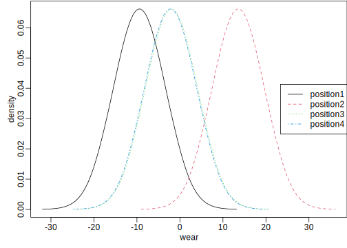

# Crossed Effects Design
[Julian Faraway](https://julianfaraway.github.io/)
2023-07-04

- [Data](#data)
- [Mixed Effect Model](#mixed-effect-model)
- [INLA](#inla)
  - [Informative Gamma priors on the
    precisions](#informative-gamma-priors-on-the-precisions)
  - [Penalized Complexity Prior](#penalized-complexity-prior)
- [STAN](#stan)
  - [Diagnostics](#diagnostics)
  - [Output Summary](#output-summary)
  - [Posterior Distributions](#posterior-distributions)
- [BRMS](#brms)
- [MGCV](#mgcv)
- [GINLA](#ginla)
- [Discussion](#discussion)
- [Package version info](#package-version-info)

See the [introduction](index.md) for an overview.

This example is discussed in more detail in my book [Extending the
Linear Model with R](https://julianfaraway.github.io/faraway/ELM/)

Required libraries:

``` r
library(faraway)
library(ggplot2)
library(lme4)
library(pbkrtest)
library(RLRsim)
library(INLA)
library(knitr)
library(cmdstanr)
register_knitr_engine(override = FALSE)
library(brms)
library(mgcv)
```

# Data

Effects are said to be crossed when they are not nested. When at least
some crossing occurs, methods for nested designs cannot be used. We
consider a latin square example.

In an experiment, four materials, A, B, C and D, were fed into a
wear-testing machine. The response is the loss of weight in 0.1 mm over
the testing period. The machine could process four samples at a time and
past experience indicated that there were some differences due to the
position of these four samples. Also some differences were suspected
from run to run. Four runs were made. The latin square structure of the
design may be observed:

``` r
data(abrasion, package="faraway")
matrix(abrasion$material,4,4)
```

         [,1] [,2] [,3] [,4]
    [1,] "C"  "A"  "D"  "B" 
    [2,] "D"  "B"  "C"  "A" 
    [3,] "B"  "D"  "A"  "C" 
    [4,] "A"  "C"  "B"  "D" 

We can plot the data

``` r
ggplot(abrasion,aes(x=material, y=wear, shape=run, color=position))+geom_point(position = position_jitter(width=0.1, height=0.0))
```


# Mixed Effect Model

Since we are most interested in the choice of material, treating this as
a fixed effect is natural. We must account for variation due to the run
and the position but were not interested in their specific values
because we believe these may vary between experiments. We treat these as
random effects.

``` r
mmod <- lmer(wear ~ material + (1|run) + (1|position), abrasion)
faraway::sumary(mmod)
```

    Fixed Effects:
                coef.est coef.se
    (Intercept) 265.75     7.67 
    materialB   -45.75     5.53 
    materialC   -24.00     5.53 
    materialD   -35.25     5.53 

    Random Effects:
     Groups   Name        Std.Dev.
     run      (Intercept)  8.18   
     position (Intercept) 10.35   
     Residual              7.83   
    ---
    number of obs: 16, groups: run, 4; position, 4
    AIC = 114.3, DIC = 140.4
    deviance = 120.3 

We test the random effects:

``` r
mmodp <- lmer(wear ~ material + (1|position), abrasion)
mmodr <- lmer(wear ~ material + (1|run), abrasion)
exactRLRT(mmodp, mmod, mmodr)
```


        simulated finite sample distribution of RLRT.
        
        (p-value based on 10000 simulated values)

    data:  
    RLRT = 4.59, p-value = 0.013

``` r
exactRLRT(mmodr, mmod, mmodp)
```


        simulated finite sample distribution of RLRT.
        
        (p-value based on 10000 simulated values)

    data:  
    RLRT = 3.05, p-value = 0.036

We see both are statistically significant.

We can test the fixed effect:

``` r
mmod <- lmer(wear ~ material + (1|run) + (1|position), abrasion,REML=FALSE)
nmod <- lmer(wear ~ 1+ (1|run) + (1|position), abrasion,REML=FALSE)
KRmodcomp(mmod, nmod)
```

    large : wear ~ material + (1 | run) + (1 | position)
    small : wear ~ 1 + (1 | run) + (1 | position)
          stat  ndf  ddf F.scaling p.value
    Ftest 25.1  3.0  6.0         1 0.00085

We see the fixed effect is significant.

We can compute confidence intervals for the parameters:

``` r
confint(mmod, method="boot")
```

                      2.5 %   97.5 %
    .sig01       0.0000e+00  12.5333
    .sig02       1.8436e-06  16.5199
    .sigma       2.4259e+00   8.3602
    (Intercept)  2.5195e+02 281.0293
    materialB   -5.4967e+01 -36.9024
    materialC   -3.2826e+01 -14.9419
    materialD   -4.4024e+01 -26.1152

The lower ends of the confidence intervals for the random effect SDs are
zero (or close).

# INLA

Integrated nested Laplace approximation is a method of Bayesian
computation which uses approximation rather than simulation. More can be
found on this topic in [Bayesian Regression Modeling with
INLA](http://julianfaraway.github.io/brinla/) and the [chapter on
GLMMs](https://julianfaraway.github.io/brinlabook/chaglmm.html)

Use the most recent computational methodology:

``` r
inla.setOption(inla.mode="experimental")
inla.setOption("short.summary",TRUE)
```

``` r
formula <- wear ~ material + f(run, model="iid") + f(position, model="iid")
result <- inla(formula, family="gaussian", data=abrasion)
summary(result)
```

    Fixed effects:
                   mean     sd 0.025quant 0.5quant 0.975quant    mode kld
    (Intercept) 260.990  7.105    246.227  261.228    274.386 261.219   0
    materialB   -38.829 10.048    -57.736  -39.178    -17.917 -39.164   0
    materialC   -18.242  9.962    -37.176  -18.523      2.305 -18.511   0
    materialD   -28.890 10.004    -47.806  -29.206     -8.159 -29.194   0

    Model hyperparameters:
                                                mean       sd 0.025quant 0.5quant 0.975quant    mode
    Precision for the Gaussian observations 5.00e-03 2.00e-03      0.002 5.00e-03       0.01   0.005
    Precision for run                       2.25e+04 1.98e+04   2052.772 1.71e+04   73866.77 151.506
    Precision for position                  2.03e+04 1.84e+04   2079.742 1.52e+04   68440.36 159.336

     is computed 

The run and position precisions look far too high. Need to change the
default prior.

## Informative Gamma priors on the precisions

Now try more informative gamma priors for the random effect precisions.
Define it so the mean value of gamma prior is set to the inverse of the
variance of the residuals of the fixed-effects only model. We expect the
error variances to be lower than this variance so this is an
overestimate. The variance of the gamma prior (for the precision) is
controlled by the `apar` shape parameter.

``` r
apar <- 0.5
lmod <- lm(wear ~ material, abrasion)
bpar <- apar*var(residuals(lmod))
lgprior <- list(prec = list(prior="loggamma", param = c(apar,bpar)))
formula = wear ~ material+f(run, model="iid", hyper = lgprior)+f(position, model="iid", hyper = lgprior)
result <- inla(formula, family="gaussian", data=abrasion)
summary(result)
```

    Fixed effects:
                   mean    sd 0.025quant 0.5quant 0.975quant    mode kld
    (Intercept) 264.352 9.844    244.591  264.359    284.134 264.368   0
    materialB   -43.734 5.293    -53.734  -43.947    -32.494 -43.927   0
    materialC   -22.289 5.267    -32.338  -22.469    -11.194 -22.450   0
    materialD   -33.381 5.280    -43.403  -33.578    -22.212 -33.559   0

    Model hyperparameters:
                                             mean    sd 0.025quant 0.5quant 0.975quant  mode
    Precision for the Gaussian observations 0.023 0.013      0.007    0.021      0.055 0.021
    Precision for run                       0.012 0.009      0.002    0.009      0.036 0.010
    Precision for position                  0.008 0.006      0.001    0.007      0.024 0.008

     is computed 

Results are more credible.

Compute the transforms to an SD scale for the random effect terms. Make
a table of summary statistics for the posteriors:

``` r
sigmarun <- inla.tmarginal(function(x) 1/sqrt(exp(x)),result$internal.marginals.hyperpar[[2]])
sigmapos <- inla.tmarginal(function(x) 1/sqrt(exp(x)),result$internal.marginals.hyperpar[[3]])
sigmaepsilon <- inla.tmarginal(function(x) 1/sqrt(exp(x)),result$internal.marginals.hyperpar[[1]])
restab=sapply(result$marginals.fixed, function(x) inla.zmarginal(x,silent=TRUE))
restab=cbind(restab, inla.zmarginal(sigmarun,silent=TRUE))
restab=cbind(restab, inla.zmarginal(sigmapos,silent=TRUE))
restab=cbind(restab, inla.zmarginal(sigmaepsilon,silent=TRUE))
colnames(restab) = c("mu","B -- A","C -- A","D -- A","run","position","epsilon")
data.frame(restab) |> kable()
```

|            | mu     | B….A    | C….A    | D….A    | run    | position | epsilon |
|:-----------|:-------|:--------|:--------|:--------|:-------|:---------|:--------|
| mean       | 264.35 | -43.738 | -22.292 | -33.385 | 11.13  | 13.091   | 7.1978  |
| sd         | 9.832  | 5.286   | 5.2607  | 5.2733  | 4.0644 | 5.0471   | 1.8877  |
| quant0.025 | 244.6  | -53.733 | -32.337 | -43.403 | 5.3119 | 6.4294   | 4.2646  |
| quant0.25  | 258.12 | -47.185 | -25.706 | -36.816 | 8.2207 | 9.5271   | 5.8422  |
| quant0.5   | 264.34 | -43.965 | -22.485 | -33.595 | 10.396 | 11.981   | 6.9265  |
| quant0.75  | 270.53 | -40.547 | -19.099 | -30.193 | 13.234 | 15.47    | 8.2627  |
| quant0.975 | 284.08 | -32.525 | -11.225 | -22.243 | 21.092 | 25.911   | 11.634  |

Also construct a plot the SD posteriors:

``` r
ddf <- data.frame(rbind(sigmarun,sigmapos,sigmaepsilon),errterm=gl(3,nrow(sigmarun),labels = c("run","position","epsilon")))
ggplot(ddf, aes(x,y, linetype=errterm))+geom_line()+xlab("wear")+ylab("density")+xlim(0,35)
```


Posteriors look OK although no weight given to smaller values.

## Penalized Complexity Prior

In [Simpson et al (2015)](http://arxiv.org/abs/1403.4630v3), penalized
complexity priors are proposed. This requires that we specify a scaling
for the SDs of the random effects. We use the SD of the residuals of the
fixed effects only model (what might be called the base model in the
paper) to provide this scaling.

``` r
lmod <- lm(wear ~ material, abrasion)
sdres <- sd(residuals(lmod))
pcprior <- list(prec = list(prior="pc.prec", param = c(3*sdres,0.01)))
formula = wear ~ material+f(run, model="iid", hyper = pcprior)+f(position, model="iid", hyper = pcprior)
result <- inla(formula, family="gaussian", data=abrasion)
summary(result)
```

    Fixed effects:
                   mean    sd 0.025quant 0.5quant 0.975quant    mode kld
    (Intercept) 264.208 8.433    247.206  264.249    281.011 264.252   0
    materialB   -43.526 5.581    -54.015  -43.795    -31.546 -44.616   0
    materialC   -22.114 5.549    -32.666  -22.341    -10.302 -22.320   0
    materialD   -33.189 5.565    -43.707  -33.438    -21.291 -34.259   0

    Model hyperparameters:
                                             mean    sd 0.025quant 0.5quant 0.975quant  mode
    Precision for the Gaussian observations 0.025 0.018      0.006    0.021      0.072 0.021
    Precision for run                       0.018 0.015      0.003    0.015      0.057 0.016
    Precision for position                  0.011 0.007      0.002    0.009      0.030 0.010

     is computed 

Compute the summaries as before:

``` r
sigmarun <- inla.tmarginal(function(x) 1/sqrt(exp(x)),result$internal.marginals.hyperpar[[2]])
sigmapos <- inla.tmarginal(function(x) 1/sqrt(exp(x)),result$internal.marginals.hyperpar[[3]])
sigmaepsilon <- inla.tmarginal(function(x) 1/sqrt(exp(x)),result$internal.marginals.hyperpar[[1]])
restab=sapply(result$marginals.fixed, function(x) inla.zmarginal(x,silent=TRUE))
restab=cbind(restab, inla.zmarginal(sigmarun,silent=TRUE))
restab=cbind(restab, inla.zmarginal(sigmapos,silent=TRUE))
restab=cbind(restab, inla.zmarginal(sigmaepsilon,silent=TRUE))
colnames(restab) = c("mu","B -- A","C -- A","D -- A","run","position","epsilon")
data.frame(restab) |> kable()
```

|            | mu     | B….A    | C….A    | D….A    | run    | position | epsilon |
|:-----------|:-------|:--------|:--------|:--------|:-------|:---------|:--------|
| mean       | 264.21 | -43.531 | -22.119 | -33.194 | 8.9706 | 11.344   | 7.3444  |
| sd         | 8.4234 | 5.5726  | 5.5407  | 5.5565  | 3.484  | 4.0011   | 2.4403  |
| quant0.025 | 247.21 | -54.014 | -32.665 | -43.706 | 4.214  | 5.7853   | 3.7362  |
| quant0.25  | 258.87 | -47.153 | -25.697 | -36.795 | 6.4973 | 8.4965   | 5.5923  |
| quant0.5   | 264.23 | -43.814 | -22.359 | -33.457 | 8.2617 | 10.552   | 6.9398  |
| quant0.75  | 269.54 | -40.214 | -18.802 | -29.878 | 10.676 | 13.347   | 8.6535  |
| quant0.975 | 280.97 | -31.582 | -10.337 | -21.326 | 17.7   | 21.298   | 13.231  |

Make the plots:

``` r
ddf <- data.frame(rbind(sigmarun,sigmapos,sigmaepsilon),errterm=gl(3,nrow(sigmarun),labels = c("run","position","epsilon")))
ggplot(ddf, aes(x,y, linetype=errterm))+geom_line()+xlab("wear")+ylab("density")+xlim(0,35)
```


Posteriors put more weight on lower values compared to gamma prior.

# STAN

[STAN](https://mc-stan.org/) performs Bayesian inference using MCMC. I
use `cmdstanr` to access Stan from R.

You see below the Stan code to fit our model. Rmarkdown allows the use
of Stan chunks (elsewhere I have R chunks). The chunk header looks like
this.

STAN chunk will be compiled to ‘mod’. Chunk header is:

    cmdstan, output.var="mod", override = FALSE

``` stan
/*
Latin square style design
*/
data {
  int<lower=0> N;
  int<lower=0> Nt;
  array[N] int<lower=1,upper=Nt> treat;
  array[N] int<lower=1,upper=Nt> blk1;
  array[N] int<lower=1,upper=Nt> blk2;
  array[N] real y;
  real<lower=0> sdscal;
}
parameters {
  vector[Nt] eta1;
  vector[Nt] eta2;
  vector[Nt] trt;
  real<lower=0> sigmab1;
  real<lower=0> sigmab2;
  real<lower=0> sigmaeps;
}
transformed parameters {
  vector[Nt] bld1;
  vector[Nt] bld2;
  vector[N] yhat;

  bld1 = sigmab1 * eta1;
  bld2 = sigmab2 * eta2;

  for (i in 1:N)
    yhat[i] = trt[treat[i]] + bld1[blk1[i]] + bld2[blk2[i]];

}
model {
  eta1 ~ normal(0, 1);
  eta2 ~ normal(0, 1);
  sigmab1 ~ cauchy(0, 2.5*sdscal);
  sigmab2 ~ cauchy(0, 2.5*sdscal);
  sigmaeps ~ cauchy(0, 2.5*sdscal);

  y ~ normal(yhat, sigmaeps);
}
```

We have used uninformative priors for the fixed effects and half-cauchy
priors for the three variances. We view the code here:

Prepare data in a format consistent with the command file. Needs to be a
list:

``` r
sdscal <- sd(residuals(lm(wear ~ material, abrasion)))
abrdat <- list(N=16, Nt=4, treat=as.numeric(abrasion$material), blk1=as.numeric(abrasion$run), blk2=as.numeric(abrasion$position), y=abrasion$wear, sdscal=sdscal)
```

Do the MCMC sampling:

``` r
fit <- mod$sample(
  data = abrdat, 
  seed = 123, 
  chains = 4, 
  parallel_chains = 4,
  refresh = 500 # print update every 500 iters
)
```

    Running MCMC with 4 parallel chains...

    Chain 1 Iteration:    1 / 2000 [  0%]  (Warmup) 
    Chain 2 Iteration:    1 / 2000 [  0%]  (Warmup) 
    Chain 3 Iteration:    1 / 2000 [  0%]  (Warmup) 
    Chain 4 Iteration:    1 / 2000 [  0%]  (Warmup) 
    Chain 1 Iteration:  500 / 2000 [ 25%]  (Warmup) 
    Chain 1 Iteration: 1000 / 2000 [ 50%]  (Warmup) 
    Chain 1 Iteration: 1001 / 2000 [ 50%]  (Sampling) 
    Chain 1 Iteration: 1500 / 2000 [ 75%]  (Sampling) 
    Chain 2 Iteration:  500 / 2000 [ 25%]  (Warmup) 
    Chain 2 Iteration: 1000 / 2000 [ 50%]  (Warmup) 
    Chain 2 Iteration: 1001 / 2000 [ 50%]  (Sampling) 
    Chain 3 Iteration:  500 / 2000 [ 25%]  (Warmup) 
    Chain 3 Iteration: 1000 / 2000 [ 50%]  (Warmup) 
    Chain 3 Iteration: 1001 / 2000 [ 50%]  (Sampling) 
    Chain 4 Iteration:  500 / 2000 [ 25%]  (Warmup) 
    Chain 4 Iteration: 1000 / 2000 [ 50%]  (Warmup) 
    Chain 4 Iteration: 1001 / 2000 [ 50%]  (Sampling) 
    Chain 1 Iteration: 2000 / 2000 [100%]  (Sampling) 
    Chain 2 Iteration: 1500 / 2000 [ 75%]  (Sampling) 
    Chain 2 Iteration: 2000 / 2000 [100%]  (Sampling) 
    Chain 3 Iteration: 1500 / 2000 [ 75%]  (Sampling) 
    Chain 3 Iteration: 2000 / 2000 [100%]  (Sampling) 
    Chain 4 Iteration: 1500 / 2000 [ 75%]  (Sampling) 
    Chain 4 Iteration: 2000 / 2000 [100%]  (Sampling) 
    Chain 1 finished in 0.3 seconds.
    Chain 2 finished in 0.3 seconds.
    Chain 3 finished in 0.3 seconds.
    Chain 4 finished in 0.3 seconds.

    All 4 chains finished successfully.
    Mean chain execution time: 0.3 seconds.
    Total execution time: 0.5 seconds.

We have not used an overall mean. If we want an overall mean parameter,
we have to set up dummy variables. We can do this but it requires more
work.

## Diagnostics

Extract the draws into a convenient dataframe format:

``` r
draws_df <- fit$draws(format = "df")
```

For the error SD:

``` r
ggplot(draws_df,
       aes(x=.iteration,y=sigmab1,color=factor(.chain))) + geom_line() +
  labs(color = 'Chain', x="Iteration")
```


Looks OK

For the block two (position) SD:

``` r
ggplot(draws_df,
       aes(x=.iteration,y=sigmab2,color=factor(.chain))) + geom_line() +
  labs(color = 'Chain', x="Iteration")
```


Everything looks reasonable.

## Output Summary

``` r
parsint = c("trt","sigmaeps","sigmab1","sigmab2")
fit$summary(parsint)
```

    # A tibble: 7 × 10
      variable  mean median    sd   mad     q5   q95  rhat ess_bulk ess_tail
      <chr>    <num>  <num> <num> <num>  <num> <num> <num>    <num>    <num>
    1 trt[1]   265.  265.   12.5  11.2  244.   285.   1.02     382.     304.
    2 trt[2]   219.  220.   12.5  10.9  198.   239.   1.01     417.     280.
    3 trt[3]   241.  241.   12.6  11.0  219.   261.   1.02     397.     275.
    4 trt[4]   230.  230.   12.3  11.3  209.   250.   1.01     392.     314.
    5 sigmaeps  10.3   9.54  3.67  3.11   5.76  17.3  1.01     607.     600.
    6 sigmab1   11.8   9.94  8.36  6.13   2.13  27.7  1.01     663.     668.
    7 sigmab2   15.3  12.5  10.5   6.86   3.68  35.7  1.01     530.     425.

The effective sample sizes are a bit low so we might want to rerun this
with more iterations if we care about the tails in particular.

## Posterior Distributions

We can use extract to get at various components of the STAN fit. First
consider the SDs for random components:

``` r
sdf = stack(draws_df[,parsint[-1]])
colnames(sdf) = c("wear","SD")
levels(sdf$SD) = parsint[-1]
ggplot(sdf, aes(x=wear,color=SD)) + geom_density() +xlim(0,60)
```


As usual the error SD distribution is a bit more concentrated. We can
see some weight at zero for the random effects in contrast to the INLA
posteriors.

Now the treatment effects:

``` r
sdf = stack(draws_df[,startsWith(colnames(draws_df),"trt")])
colnames(sdf) = c("wear","trt")
levels(sdf$trt) = LETTERS[1:4]
ggplot(sdf, aes(x=wear,color=trt)) + geom_density() 
```


We can see that material A shows some separation from the other levels.

# BRMS

[BRMS](https://paul-buerkner.github.io/brms/) stands for Bayesian
Regression Models with STAN. It provides a convenient wrapper to STAN
functionality. We specify the model as in `lmer()` above. I have used
more than the standard number of iterations because this reduces some
problems and does not cost much computationally.

``` r
suppressMessages(bmod <- brm(wear ~ material + (1|run) + (1|position), data=abrasion,iter=10000, cores=4, backend = "cmdstanr"))
```

We get some minor warnings. We can obtain some posterior densities and
diagnostics with:

``` r
plot(bmod, variable = "^s", regex=TRUE)
```


We have chosen only the random effect hyperparameters since this is
where problems will appear first. Looks OK. We can see some weight is
given to values of the random effect SDs close to zero.

We can look at the STAN code that `brms` used with:

``` r
stancode(bmod)
```

    // generated with brms 2.19.0
    functions {
      
    }
    data {
      int<lower=1> N; // total number of observations
      vector[N] Y; // response variable
      int<lower=1> K; // number of population-level effects
      matrix[N, K] X; // population-level design matrix
      // data for group-level effects of ID 1
      int<lower=1> N_1; // number of grouping levels
      int<lower=1> M_1; // number of coefficients per level
      array[N] int<lower=1> J_1; // grouping indicator per observation
      // group-level predictor values
      vector[N] Z_1_1;
      // data for group-level effects of ID 2
      int<lower=1> N_2; // number of grouping levels
      int<lower=1> M_2; // number of coefficients per level
      array[N] int<lower=1> J_2; // grouping indicator per observation
      // group-level predictor values
      vector[N] Z_2_1;
      int prior_only; // should the likelihood be ignored?
    }
    transformed data {
      int Kc = K - 1;
      matrix[N, Kc] Xc; // centered version of X without an intercept
      vector[Kc] means_X; // column means of X before centering
      for (i in 2 : K) {
        means_X[i - 1] = mean(X[ : , i]);
        Xc[ : , i - 1] = X[ : , i] - means_X[i - 1];
      }
    }
    parameters {
      vector[Kc] b; // population-level effects
      real Intercept; // temporary intercept for centered predictors
      real<lower=0> sigma; // dispersion parameter
      vector<lower=0>[M_1] sd_1; // group-level standard deviations
      array[M_1] vector[N_1] z_1; // standardized group-level effects
      vector<lower=0>[M_2] sd_2; // group-level standard deviations
      array[M_2] vector[N_2] z_2; // standardized group-level effects
    }
    transformed parameters {
      vector[N_1] r_1_1; // actual group-level effects
      vector[N_2] r_2_1; // actual group-level effects
      real lprior = 0; // prior contributions to the log posterior
      r_1_1 = sd_1[1] * z_1[1];
      r_2_1 = sd_2[1] * z_2[1];
      lprior += student_t_lpdf(Intercept | 3, 234.5, 13.3);
      lprior += student_t_lpdf(sigma | 3, 0, 13.3)
                - 1 * student_t_lccdf(0 | 3, 0, 13.3);
      lprior += student_t_lpdf(sd_1 | 3, 0, 13.3)
                - 1 * student_t_lccdf(0 | 3, 0, 13.3);
      lprior += student_t_lpdf(sd_2 | 3, 0, 13.3)
                - 1 * student_t_lccdf(0 | 3, 0, 13.3);
    }
    model {
      // likelihood including constants
      if (!prior_only) {
        // initialize linear predictor term
        vector[N] mu = rep_vector(0.0, N);
        mu += Intercept;
        for (n in 1 : N) {
          // add more terms to the linear predictor
          mu[n] += r_1_1[J_1[n]] * Z_1_1[n] + r_2_1[J_2[n]] * Z_2_1[n];
        }
        target += normal_id_glm_lpdf(Y | Xc, mu, b, sigma);
      }
      // priors including constants
      target += lprior;
      target += std_normal_lpdf(z_1[1]);
      target += std_normal_lpdf(z_2[1]);
    }
    generated quantities {
      // actual population-level intercept
      real b_Intercept = Intercept - dot_product(means_X, b);
    }

We see that `brms` is using student t distributions with 3 degrees of
freedom for the priors. For the three error SDs, this will be truncated
at zero to form half-t distributions. You can get a more explicit
description of the priors with `prior_summary(bmod)`. These are
qualitatively similar to the the PC prior used in the INLA fit.

We examine the fit:

``` r
summary(bmod)
```

     Family: gaussian 
      Links: mu = identity; sigma = identity 
    Formula: wear ~ material + (1 | run) + (1 | position) 
       Data: abrasion (Number of observations: 16) 
      Draws: 4 chains, each with iter = 10000; warmup = 5000; thin = 1;
             total post-warmup draws = 20000

    Group-Level Effects: 
    ~position (Number of levels: 4) 
                  Estimate Est.Error l-95% CI u-95% CI Rhat Bulk_ESS Tail_ESS
    sd(Intercept)    11.11      6.00     1.66    25.93 1.00     5128     4525

    ~run (Number of levels: 4) 
                  Estimate Est.Error l-95% CI u-95% CI Rhat Bulk_ESS Tail_ESS
    sd(Intercept)     9.09      5.78     0.84    23.21 1.00     4867     5937

    Population-Level Effects: 
              Estimate Est.Error l-95% CI u-95% CI Rhat Bulk_ESS Tail_ESS
    Intercept   264.35      8.34   247.86   280.80 1.00     6625     6930
    materialB   -45.74      7.62   -61.14   -30.46 1.00    11331     9515
    materialC   -24.01      7.60   -39.60    -8.93 1.00    10882     9079
    materialD   -35.27      7.76   -51.11   -19.65 1.00    10327     8224

    Family Specific Parameters: 
          Estimate Est.Error l-95% CI u-95% CI Rhat Bulk_ESS Tail_ESS
    sigma    10.14      3.45     5.41    18.47 1.00     3013     5624

    Draws were sampled using sample(hmc). For each parameter, Bulk_ESS
    and Tail_ESS are effective sample size measures, and Rhat is the potential
    scale reduction factor on split chains (at convergence, Rhat = 1).

The results are consistent with those seen previously.

# MGCV

It is possible to fit some GLMMs within the GAM framework of the `mgcv`
package. An explanation of this can be found in this
[blog](https://fromthebottomoftheheap.net/2021/02/02/random-effects-in-gams/)

``` r
gmod = gam(wear ~ material + s(run,bs="re") + s(position,bs="re"),
           data=abrasion, method="REML")
```

and look at the summary output:

``` r
summary(gmod)
```


    Family: gaussian 
    Link function: identity 

    Formula:
    wear ~ material + s(run, bs = "re") + s(position, bs = "re")

    Parametric coefficients:
                Estimate Std. Error t value Pr(>|t|)
    (Intercept)   265.75       7.67   34.66  5.0e-09
    materialB     -45.75       5.53   -8.27  7.8e-05
    materialC     -24.00       5.53   -4.34  0.00349
    materialD     -35.25       5.53   -6.37  0.00039

    Approximate significance of smooth terms:
                 edf Ref.df    F p-value
    s(run)      2.44      3 4.37   0.031
    s(position) 2.62      3 6.99   0.012

    R-sq.(adj) =  0.877   Deviance explained = 94.3%
    -REML = 50.128  Scale est. = 61.25     n = 16

We get the fixed effect estimates. We also get tests on the random
effects (as described in this
[article](https://doi.org/10.1093/biomet/ast038). The hypothesis of no
variation is rejected for both the run and the position. This is
consistent with earlier findings.

We can get an estimate of the operator and error SD:

``` r
gam.vcomp(gmod)
```


    Standard deviations and 0.95 confidence intervals:

                std.dev  lower  upper
    s(run)       8.1790 3.0337 22.051
    s(position) 10.3471 4.1311 25.916
    scale        7.8262 4.4446 13.781

    Rank: 3/3

The point estimates are the same as the REML estimates from `lmer`
earlier. The confidence intervals are different. A bootstrap method was
used for the `lmer` fit whereas `gam` is using an asymptotic
approximation resulting in substantially different results. Given the
problems of parameters on the boundary present in this example, the
bootstrap results appear more trustworthy.

The random effect estimates for the fields can be found with:

``` r
coef(gmod)
```

      (Intercept)     materialB     materialC     materialD      s(run).1      s(run).2      s(run).3      s(run).4 
        265.75000     -45.75000     -24.00000     -35.25000      -0.20343      -2.03434       9.96826      -7.73049 
    s(position).1 s(position).2 s(position).3 s(position).4 
         -9.40487      13.56051      -1.96846      -2.18718 

# GINLA

In [Wood (2019)](https://doi.org/10.1093/biomet/asz044), a simplified
version of INLA is proposed. The first construct the GAM model without
fitting and then use the `ginla()` function to perform the computation.

``` r
gmod = gam(wear ~ material + s(run,bs="re") + s(position,bs="re"),
           data=abrasion, fit = FALSE)
gimod = ginla(gmod)
```

We get the posterior density for the intercept as:

``` r
plot(gimod$beta[1,],gimod$density[1,],type="l",xlab="yield",ylab="wear")
```


and for the material effects as:

``` r
xmat = t(gimod$beta[2:4,])
ymat = t(gimod$density[2:4,])
matplot(xmat, ymat,type="l",xlab="wear",ylab="density")
legend("right",paste0("Material",LETTERS[2:4]),col=1:3,lty=1:3)
```


We can see some overlap between the effects but clear separation from
zero.

The run effects are:

``` r
xmat = t(gimod$beta[5:8,])
ymat = t(gimod$density[5:8,])
matplot(xmat, ymat,type="l",xlab="wear",ylab="density")
legend("right",paste0("run",1:4),col=1:4,lty=1:4)
```


All the run effects overlap with zero but runs 3 and 4 are more distinct
than 1 and 2.

The position effects are:

``` r
xmat = t(gimod$beta[9:12,])
ymat = t(gimod$density[9:12,])
matplot(xmat, ymat,type="l",xlab="wear",ylab="density")
legend("right",paste0("position",1:4),col=1:4,lty=1:4)
```



Here positions 1 and 2 are more distinct in their effects.

It is not straightforward to obtain the posterior densities of the
hyperparameters.

# Discussion

See the [Discussion of the single random effect
model](pulp.md#Discussion) for general comments.

- All but the INLA analysis have some ambiguity about whether there is
  much difference in the run and position effects. In the mixed effect
  model, the effects are just statistically significant while the
  Bayesian analyses also suggest these effects have some impact while
  still expressing some chance that they do not. The INLA analysis does
  not give any weight to the no effect claim.

- None of the analysis had any problem with the crossed effects.

- There were no major computational issue with the analyses (in contrast
  with some of the other examples)

# Package version info

``` r
sessionInfo()
```

    R version 4.3.1 (2023-06-16)
    Platform: x86_64-apple-darwin20 (64-bit)
    Running under: macOS Ventura 13.4.1

    Matrix products: default
    BLAS:   /Library/Frameworks/R.framework/Versions/4.3-x86_64/Resources/lib/libRblas.0.dylib 
    LAPACK: /Library/Frameworks/R.framework/Versions/4.3-x86_64/Resources/lib/libRlapack.dylib;  LAPACK version 3.11.0

    locale:
    [1] en_US.UTF-8/en_US.UTF-8/en_US.UTF-8/C/en_US.UTF-8/en_US.UTF-8

    time zone: Europe/London
    tzcode source: internal

    attached base packages:
    [1] parallel  stats     graphics  grDevices utils     datasets  methods   base     

    other attached packages:
     [1] mgcv_1.8-42     nlme_3.1-162    brms_2.19.0     Rcpp_1.0.10     cmdstanr_0.5.3  knitr_1.43      INLA_23.05.30-1
     [8] sp_2.0-0        foreach_1.5.2   RLRsim_3.1-8    pbkrtest_0.5.2  lme4_1.1-33     Matrix_1.5-4.1  ggplot2_3.4.2  
    [15] faraway_1.0.8  

    loaded via a namespace (and not attached):
      [1] gridExtra_2.3        inline_0.3.19        rlang_1.1.1          magrittr_2.0.3       matrixStats_1.0.0   
      [6] compiler_4.3.1       loo_2.6.0            systemfonts_1.0.4    callr_3.7.3          vctrs_0.6.3         
     [11] reshape2_1.4.4       stringr_1.5.0        crayon_1.5.2         pkgconfig_2.0.3      fastmap_1.1.1       
     [16] backports_1.4.1      ellipsis_0.3.2       labeling_0.4.2       utf8_1.2.3           threejs_0.3.3       
     [21] promises_1.2.0.1     rmarkdown_2.22       markdown_1.7         ps_1.7.5             nloptr_2.0.3        
     [26] MatrixModels_0.5-1   purrr_1.0.1          xfun_0.39            jsonlite_1.8.5       later_1.3.1         
     [31] Deriv_4.1.3          prettyunits_1.1.1    broom_1.0.5          R6_2.5.1             dygraphs_1.1.1.6    
     [36] StanHeaders_2.26.27  stringi_1.7.12       boot_1.3-28.1        rstan_2.21.8         iterators_1.0.14    
     [41] zoo_1.8-12           base64enc_0.1-3      bayesplot_1.10.0     httpuv_1.6.11        splines_4.3.1       
     [46] igraph_1.5.0         tidyselect_1.2.0     rstudioapi_0.14      abind_1.4-5          yaml_2.3.7          
     [51] codetools_0.2-19     miniUI_0.1.1.1       processx_3.8.1       pkgbuild_1.4.1       lattice_0.21-8      
     [56] tibble_3.2.1         plyr_1.8.8           shiny_1.7.4          withr_2.5.0          bridgesampling_1.1-2
     [61] posterior_1.4.1      coda_0.19-4          evaluate_0.21        RcppParallel_5.1.7   xts_0.13.1          
     [66] pillar_1.9.0         tensorA_0.36.2       stats4_4.3.1         checkmate_2.2.0      DT_0.28             
     [71] shinyjs_2.1.0        distributional_0.3.2 generics_0.1.3       rstantools_2.3.1     munsell_0.5.0       
     [76] scales_1.2.1         minqa_1.2.5          gtools_3.9.4         xtable_1.8-4         glue_1.6.2          
     [81] tools_4.3.1          shinystan_2.6.0      data.table_1.14.8    colourpicker_1.2.0   mvtnorm_1.2-2       
     [86] grid_4.3.1           tidyr_1.3.0          crosstalk_1.2.0      colorspace_2.1-0     cli_3.6.1           
     [91] fansi_1.0.4          svglite_2.1.1        Brobdingnag_1.2-9    dplyr_1.1.2          gtable_0.3.3        
     [96] digest_0.6.31        htmlwidgets_1.6.2    farver_2.1.1         htmltools_0.5.5      lifecycle_1.0.3     
    [101] mime_0.12            shinythemes_1.2.0    MASS_7.3-60         
