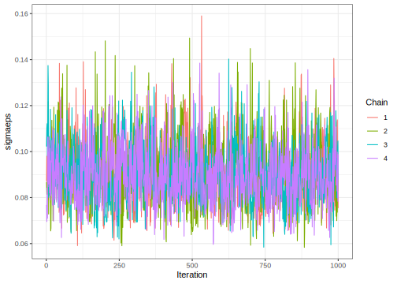

# Nested Design
[Julian Faraway](https://julianfaraway.github.io/)
2024-09-27

- [Data](#data)
- [Mixed Effect Model](#mixed-effect-model)
- [INLA](#inla)
  - [Informative Gamma priors on the
    precisions](#informative-gamma-priors-on-the-precisions)
  - [Penalized Complexity Prior](#penalized-complexity-prior)
- [STAN](#stan)
  - [Diagnostics](#diagnostics)
  - [Output summaries](#output-summaries)
  - [Posterior Distributions](#posterior-distributions)
- [BRMS](#brms)
- [MGCV](#mgcv)
- [GINLA](#ginla)
- [Discussion](#discussion)
- [Package version info](#package-version-info)

See the [introduction](index.md) for an overview.

This example is discussed in more detail in my book [Extending the
Linear Model with R](https://julianfaraway.github.io/faraway/ELM/)

Required libraries:

``` r
library(faraway)
library(ggplot2)
library(lme4)
library(pbkrtest)
library(RLRsim)
library(INLA)
library(knitr)
library(cmdstanr)
register_knitr_engine(override = FALSE)
library(brms)
library(mgcv)
```

# Data

When the levels of one factor vary only within the levels of another
factor, that factor is said to be *nested*. Here is an example to
illustrate nesting. Consistency between laboratory tests is important
and yet the results may depend on who did the test and where the test
was performed. In an experiment to test levels of consistency, a large
jar of dried egg powder was divided up into a number of samples. Because
the powder was homogenized, the fat content of the samples is the same,
but this fact is withheld from the laboratories. Four samples were sent
to each of six laboratories. Two of the samples were labeled as G and
two as H, although in fact they were identical. The laboratories were
instructed to give two samples to two different technicians. The
technicians were then instructed to divide their samples into two parts
and measure the fat content of each. So each laboratory reported eight
measures, each technician four measures, that is, two replicated
measures on each of two samples.

Load in and plot the data:

``` r
data(eggs, package="faraway")
summary(eggs)
```

          Fat         Lab    Technician Sample
     Min.   :0.060   I  :8   one:24     G:24  
     1st Qu.:0.307   II :8   two:24     H:24  
     Median :0.370   III:8                    
     Mean   :0.388   IV :8                    
     3rd Qu.:0.430   V  :8                    
     Max.   :0.800   VI :8                    

``` r
ggplot(eggs, aes(y=Fat, x=Lab, color=Technician, shape=Sample)) + geom_point(position = position_jitter(width=0.1, height=0.0))
```


# Mixed Effect Model

The model is
$$y_{ijkl} = \mu + L_i + T_{ij} + S_{ijk} + \epsilon_{ijkl}$$ where
laboratories (L), technicians (T) and samples (S) are all random
effects:

``` r
cmod = lmer(Fat ~ 1 + (1|Lab) + (1|Lab:Technician) +  (1|Lab:Technician:Sample), data=eggs)
faraway::sumary(cmod)
```

    Fixed Effects:
    coef.est  coef.se 
        0.39     0.04 

    Random Effects:
     Groups                Name        Std.Dev.
     Lab:Technician:Sample (Intercept) 0.06    
     Lab:Technician        (Intercept) 0.08    
     Lab                   (Intercept) 0.08    
     Residual                          0.08    
    ---
    number of obs: 48, groups: Lab:Technician:Sample, 24; Lab:Technician, 12; Lab, 6
    AIC = -54.2, DIC = -73.3
    deviance = -68.8 

Is there a difference between samples? The `exactRLRT` function requires
not only the specification of a null model without the random effect of
interest but also one where only that random effect is present. Note
that because of the way the samples are coded, we need to specify this a
three-way interaction. Otherwise `G` from one lab would be linked to `G`
from another lab (which is not the case).

``` r
cmodr <- lmer(Fat ~ 1 + (1|Lab) + (1|Lab:Technician), data=eggs)
cmods <- lmer(Fat ~ 1 + (1|Lab:Technician:Sample), data=eggs)
exactRLRT(cmods, cmod, cmodr)
```


        simulated finite sample distribution of RLRT.
        
        (p-value based on 10000 simulated values)

    data:  
    RLRT = 1.6, p-value = 0.097

We can remove the sample random effect from the model. But consider the
confidence intervals:

``` r
confint(cmod, method="boot")
```

                   2.5 %   97.5 %
    .sig01      0.000000 0.096217
    .sig02      0.000000 0.143103
    .sig03      0.000000 0.144970
    .sigma      0.060646 0.106692
    (Intercept) 0.302549 0.464360

We see that all three random effects include zero at the lower end,
indicating that we might equally have disposed of the lab or technician
random effects first. There is considerable uncertainty in the
apportioning of variation due the three effects.

# INLA

Integrated nested Laplace approximation is a method of Bayesian
computation which uses approximation rather than simulation. More can be
found on this topic in [Bayesian Regression Modeling with
INLA](http://julianfaraway.github.io/brinla/) and the [chapter on
GLMMs](https://julianfaraway.github.io/brinlabook/chaglmm.html)

Use the most recent computational methodology:

``` r
inla.setOption(inla.mode="experimental")
inla.setOption("short.summary",TRUE)
```

Need to construct unique labels for nested factor levels. Don’t really
care which technician and sample is which otherwise would take more care
with the labeling.

``` r
eggs$labtech <- factor(paste0(eggs$Lab,eggs$Technician))
eggs$labtechsamp <- factor(paste0(eggs$Lab,eggs$Technician,eggs$Sample))
```

``` r
formula <- Fat ~ 1 + f(Lab, model="iid") + f(labtech, model="iid") + f(labtechsamp, model="iid")
result <- inla(formula, family="gaussian", data=eggs)
summary(result)
```

    Fixed effects:
                 mean    sd 0.025quant 0.5quant 0.975quant  mode kld
    (Intercept) 0.387 0.035      0.318    0.387      0.457 0.387   0

    Model hyperparameters:
                                                mean       sd 0.025quant 0.5quant 0.975quant    mode
    Precision for the Gaussian observations   114.91    27.08      69.96   112.11     175.94  107.03
    Precision for Lab                       21661.07 24857.64    1321.12 13806.58   87537.37 3535.49
    Precision for labtech                     105.32    53.85      36.06    93.85     241.93   74.40
    Precision for labtechsamp               20653.33 23720.38    1146.64 13068.78   83544.25 3002.66

     is computed 

The lab and sample precisions look far too high. Need to change the
default prior

## Informative Gamma priors on the precisions

Now try more informative gamma priors for the precisions. Define it so
the mean value of gamma prior is set to the inverse of the variance of
the residuals of the fixed-effects only model. We expect the error
variances to be lower than this variance so this is an overestimate. The
variance of the gamma prior (for the precision) is controlled by the
`apar` shape parameter in the code.

``` r
apar <- 0.5
bpar <- apar*var(eggs$Fat)
lgprior <- list(prec = list(prior="loggamma", param = c(apar,bpar)))
formula = Fat ~ 1+f(Lab, model="iid", hyper = lgprior)+f(labtech, model="iid", hyper = lgprior)+f(labtechsamp, model="iid", hyper = lgprior)
result <- inla(formula, family="gaussian", data=eggs)
summary(result)
```

    Fixed effects:
                 mean    sd 0.025quant 0.5quant 0.975quant  mode kld
    (Intercept) 0.387 0.062      0.263    0.387      0.512 0.387   0

    Model hyperparameters:
                                              mean    sd 0.025quant 0.5quant 0.975quant   mode
    Precision for the Gaussian observations 160.43 42.30      91.58   155.62     256.86 146.92
    Precision for Lab                       115.87 95.02      19.91    89.75     366.90  51.49
    Precision for labtech                   131.41 88.50      32.01   109.12     362.85  74.69
    Precision for labtechsamp               184.73 93.54      63.44   165.05     421.31 131.38

     is computed 

Looks more credible.

Compute the transforms to an SD scale for the field and error. Make a
table of summary statistics for the posteriors:

``` r
sigmaLab <- inla.tmarginal(function(x) 1/sqrt(exp(x)),result$internal.marginals.hyperpar[[2]])
sigmaTech <- inla.tmarginal(function(x) 1/sqrt(exp(x)),result$internal.marginals.hyperpar[[3]])
sigmaSample <- inla.tmarginal(function(x) 1/sqrt(exp(x)),result$internal.marginals.hyperpar[[4]])
sigmaepsilon <- inla.tmarginal(function(x) 1/sqrt(exp(x)),result$internal.marginals.hyperpar[[1]])
restab=sapply(result$marginals.fixed, function(x) inla.zmarginal(x,silent=TRUE))
restab=cbind(restab, inla.zmarginal(sigmaLab,silent=TRUE))
restab=cbind(restab, inla.zmarginal(sigmaTech,silent=TRUE))
restab=cbind(restab, inla.zmarginal(sigmaSample,silent=TRUE))
restab=cbind(restab, inla.zmarginal(sigmaepsilon,silent=TRUE))
colnames(restab) = c("mu","Lab","Technician","Sample","epsilon")
data.frame(restab)
```

                     mu      Lab Technician   Sample  epsilon
    mean         0.3875   0.1137     0.1005 0.080191  0.08099
    sd         0.061825 0.043845   0.031582 0.019471 0.010637
    quant0.025  0.26346 0.052415   0.052704 0.048877 0.062504
    quant0.25   0.34864 0.082422    0.07778 0.066205 0.073439
    quant0.5    0.38735  0.10531   0.095638 0.077782 0.080106
    quant0.75   0.42606  0.13578    0.11787 0.091546 0.087619
    quant0.975  0.51124  0.22237    0.17573  0.12498  0.10421

Also construct a plot the SD posteriors:

``` r
ddf <- data.frame(rbind(sigmaLab,sigmaTech,sigmaSample,sigmaepsilon),errterm=gl(4,nrow(sigmaLab),labels = c("Lab","Tech","Samp","epsilon")))
ggplot(ddf, aes(x,y, linetype=errterm))+geom_line()+xlab("Fat")+ylab("density")+xlim(0,0.25)
```


Posteriors look OK. Notice that they are all well bounded away from
zero.

## Penalized Complexity Prior

In [Simpson et al (2015)](http://arxiv.org/abs/1403.4630v3), penalized
complexity priors are proposed. This requires that we specify a scaling
for the SDs of the random effects. We use the SD of the residuals of the
fixed effects only model (what might be called the base model in the
paper) to provide this scaling.

``` r
sdres <- sd(eggs$Fat)
pcprior <- list(prec = list(prior="pc.prec", param = c(3*sdres,0.01)))
formula = Fat ~ 1+f(Lab, model="iid", hyper = pcprior)+f(labtech, model="iid", hyper = pcprior)+f(labtechsamp,model="iid", hyper = pcprior)
result <- inla(formula, family="gaussian", data=eggs, control.family=list(hyper=pcprior))
summary(result)
```

    Fixed effects:
                 mean    sd 0.025quant 0.5quant 0.975quant  mode kld
    (Intercept) 0.388 0.051      0.285    0.388       0.49 0.388   0

    Model hyperparameters:
                                              mean     sd 0.025quant 0.5quant 0.975quant   mode
    Precision for the Gaussian observations 142.99  40.31      78.46   138.07     235.81 129.07
    Precision for Lab                       405.85 738.03      30.64   202.37    2082.45  73.24
    Precision for labtech                   180.86 161.78      26.49   134.85     609.39  70.39
    Precision for labtechsamp               432.50 435.22      66.15   304.97    1582.95 161.34

     is computed 

Compute the summaries as before:

``` r
sigmaLab <- inla.tmarginal(function(x) 1/sqrt(exp(x)),result$internal.marginals.hyperpar[[2]])
sigmaTech <- inla.tmarginal(function(x) 1/sqrt(exp(x)),result$internal.marginals.hyperpar[[3]])
sigmaSample <- inla.tmarginal(function(x) 1/sqrt(exp(x)),result$internal.marginals.hyperpar[[4]])
sigmaepsilon <- inla.tmarginal(function(x) 1/sqrt(exp(x)),result$internal.marginals.hyperpar[[1]])
restab=sapply(result$marginals.fixed, function(x) inla.zmarginal(x,silent=TRUE))
restab=cbind(restab, inla.zmarginal(sigmaLab,silent=TRUE))
restab=cbind(restab, inla.zmarginal(sigmaTech,silent=TRUE))
restab=cbind(restab, inla.zmarginal(sigmaSample,silent=TRUE))
restab=cbind(restab, inla.zmarginal(sigmaepsilon,silent=TRUE))
colnames(restab) = c("mu","Lab","Technician","Sample","epsilon")
data.frame(restab)
```

                     mu      Lab Technician   Sample  epsilon
    mean         0.3875 0.078441     0.0939 0.061533 0.086089
    sd         0.050964 0.041072   0.039304 0.025018 0.012071
    quant0.025  0.28497 0.022096   0.040679 0.025294 0.065241
    quant0.25   0.35578 0.048222   0.066004 0.043431 0.077508
    quant0.5    0.38738 0.070869   0.085863 0.057329 0.085044
    quant0.75   0.41897 0.099893    0.11295 0.074829 0.093574
    quant0.975  0.48978  0.17918    0.19263  0.12216  0.11257

Make the plots:

``` r
ddf <- data.frame(rbind(sigmaLab,sigmaTech,sigmaSample,sigmaepsilon),errterm=gl(4,nrow(sigmaLab),labels = c("Lab","Tech","Samp","epsilon")))
ggplot(ddf, aes(x,y, linetype=errterm))+geom_line()+xlab("Fat")+ylab("density")+xlim(0,0.25)
```


Posteriors have generally smaller values for the three random effects
and the possibility of values closer to zero is given greater weight.

# STAN

[STAN](https://mc-stan.org/) performs Bayesian inference using MCMC. I
use `cmdstanr` to access Stan from R.

You see below the Stan code to fit our model. Rmarkdown allows the use
of Stan chunks (elsewhere I have R chunks). The chunk header looks like
this.

STAN chunk will be compiled to ‘mod’. Chunk header is:

    cmdstan, output.var="mod", override = FALSE

``` stan
data {
     int<lower=0> Nobs;
     int<lower=0> Nlev1;
     int<lower=0> Nlev2;
     int<lower=0> Nlev3;
     array[Nobs] real y;
     array[Nobs] int<lower=1,upper=Nlev1> levind1;
     array[Nobs] int<lower=1,upper=Nlev2> levind2;
     array[Nobs] int<lower=1,upper=Nlev3> levind3;
     real<lower=0> sdscal;
}
parameters {
           real mu;
           real<lower=0> sigmalev1;
           real<lower=0> sigmalev2;
           real<lower=0> sigmalev3;
           real<lower=0> sigmaeps;

           vector[Nlev1] eta1;
           vector[Nlev2] eta2;
           vector[Nlev3] eta3;
}
transformed parameters {
  vector[Nlev1] ran1;
  vector[Nlev2] ran2;
  vector[Nlev3] ran3;
  vector[Nobs] yhat;

  ran1  = sigmalev1 * eta1;
  ran2  = sigmalev2 * eta2;
  ran3  = sigmalev3 * eta3;

  for (i in 1:Nobs)
    yhat[i] = mu+ran1[levind1[i]]+ran2[levind2[i]]+ran3[levind3[i]];

}
model {
  eta1 ~ normal(0, 1);
  eta2 ~ normal(0, 1);
  eta3 ~ normal(0, 1);
  sigmalev1 ~ cauchy(0, 2.5*sdscal);
  sigmalev2 ~ cauchy(0, 2.5*sdscal);
  sigmalev3 ~ cauchy(0, 2.5*sdscal);
  sigmaeps ~ cauchy(0, 2.5*sdscal);
  y ~ normal(yhat, sigmaeps);
}
```

``` r
levind1 <- as.numeric(eggs$Lab)
levind2 <- as.numeric(eggs$labtech)
levind3 <- as.numeric(eggs$labtechsamp)
sdscal <- sd(eggs$Fat)
eggdat <- list(Nobs=nrow(eggs),
               Nlev1=max(levind1),
               Nlev2=max(levind2),
               Nlev3=max(levind3),
               y=eggs$Fat,
               levind1=levind1,
               levind2=levind2,
               levind3=levind3,
               sdscal=sdscal)
```

Do the MCMC sampling:

``` r
fit <- mod$sample(
  data = eggdat, 
  seed = 123, 
  chains = 4, 
  parallel_chains = 4,
  refresh = 500 # print update every 500 iters
)
```

    Running MCMC with 4 parallel chains...

    Chain 1 Iteration:    1 / 2000 [  0%]  (Warmup) 
    Chain 2 Iteration:    1 / 2000 [  0%]  (Warmup) 
    Chain 3 Iteration:    1 / 2000 [  0%]  (Warmup) 
    Chain 4 Iteration:    1 / 2000 [  0%]  (Warmup) 
    Chain 1 Iteration:  500 / 2000 [ 25%]  (Warmup) 
    Chain 2 Iteration:  500 / 2000 [ 25%]  (Warmup) 
    Chain 3 Iteration:  500 / 2000 [ 25%]  (Warmup) 
    Chain 4 Iteration:  500 / 2000 [ 25%]  (Warmup) 
    Chain 1 Iteration: 1000 / 2000 [ 50%]  (Warmup) 
    Chain 1 Iteration: 1001 / 2000 [ 50%]  (Sampling) 
    Chain 2 Iteration: 1000 / 2000 [ 50%]  (Warmup) 
    Chain 2 Iteration: 1001 / 2000 [ 50%]  (Sampling) 
    Chain 3 Iteration: 1000 / 2000 [ 50%]  (Warmup) 
    Chain 3 Iteration: 1001 / 2000 [ 50%]  (Sampling) 
    Chain 4 Iteration: 1000 / 2000 [ 50%]  (Warmup) 
    Chain 4 Iteration: 1001 / 2000 [ 50%]  (Sampling) 
    Chain 1 Iteration: 1500 / 2000 [ 75%]  (Sampling) 
    Chain 2 Iteration: 1500 / 2000 [ 75%]  (Sampling) 
    Chain 3 Iteration: 1500 / 2000 [ 75%]  (Sampling) 
    Chain 1 Iteration: 2000 / 2000 [100%]  (Sampling) 
    Chain 4 Iteration: 1500 / 2000 [ 75%]  (Sampling) 
    Chain 1 finished in 0.7 seconds.
    Chain 2 Iteration: 2000 / 2000 [100%]  (Sampling) 
    Chain 3 Iteration: 2000 / 2000 [100%]  (Sampling) 
    Chain 4 Iteration: 2000 / 2000 [100%]  (Sampling) 
    Chain 2 finished in 0.7 seconds.
    Chain 3 finished in 0.6 seconds.
    Chain 4 finished in 0.7 seconds.

    All 4 chains finished successfully.
    Mean chain execution time: 0.7 seconds.
    Total execution time: 0.9 seconds.

## Diagnostics

Extract the draws into a convenient dataframe format:

``` r
draws_df <- fit$draws(format = "df")
```

For the error SD:

``` r
ggplot(draws_df,
       aes(x=.iteration,y=sigmaeps,color=factor(.chain))) + geom_line() +
  labs(color = 'Chain', x="Iteration")
```



Looks OK

For the Lab SD

``` r
ggplot(draws_df,
       aes(x=.iteration,y=sigmalev1,color=factor(.chain))) + geom_line() +
  labs(color = 'Chain', x="Iteration")
```


Looks OK

For the technician SD

``` r
ggplot(draws_df,
       aes(x=.iteration,y=sigmalev2,color=factor(.chain))) + geom_line() +
  labs(color = 'Chain', x="Iteration")
```


For the sample SD

``` r
ggplot(draws_df,
       aes(x=.iteration,y=sigmalev3,color=factor(.chain))) + geom_line() +
  labs(color = 'Chain', x="Iteration")
```


All these are satisfactory.

## Output summaries

Display the parameters of interest:

``` r
fit$summary(c("mu","sigmalev1","sigmalev2","sigmalev3","sigmaeps"))
```

    # A tibble: 5 × 10
      variable    mean median     sd    mad      q5   q95  rhat ess_bulk ess_tail
      <chr>      <dbl>  <dbl>  <dbl>  <dbl>   <dbl> <dbl> <dbl>    <dbl>    <dbl>
    1 mu        0.389  0.389  0.0563 0.0509 0.297   0.482  1.00    2206.    1689.
    2 sigmalev1 0.0931 0.0837 0.0617 0.0538 0.0115  0.202  1.00    1199.    1782.
    3 sigmalev2 0.0941 0.0895 0.0441 0.0395 0.0274  0.172  1.00    1158.    1244.
    4 sigmalev3 0.0571 0.0555 0.0302 0.0308 0.00908 0.109  1.01     744.    1616.
    5 sigmaeps  0.0908 0.0894 0.0136 0.0133 0.0707  0.115  1.00    1396.    2542.

About what we expect:

## Posterior Distributions

We can use extract to get at various components of the STAN fit.

``` r
sdf = stack(draws_df[,c("sigmalev1","sigmalev2","sigmalev3","sigmaeps")])
colnames(sdf) = c("Fat","SD")
levels(sdf$SD) = c("Lab","Technician","Sample","Error")
ggplot(sdf, aes(x=Fat,color=SD)) + geom_density() +xlim(0,0.3)
```


We see that the error SD can be localized much more than the other SDs.
The technician SD looks to be the largest of the three. We see non-zero
density at zero in contrast with the INLA posteriors.

# BRMS

[BRMS](https://paul-buerkner.github.io/brms/) stands for Bayesian
Regression Models with STAN. It provides a convenient wrapper to STAN
functionality.

The form of the model specification is important in this example. If we
use
`Fat ~ 1 + (1|Lab) + (1|Lab:Technician) +  (1|Lab:Technician:Sample)` as
in the `lmer` fit earlier, we get poor convergence whereas the
supposedly equivalent specification below does far better. In the form
below, the nesting is signalled by the form of the model specification
which may be essential to achieve the best results.

``` r
bmod <- brm(Fat ~ 1 + (1|Lab/Technician/Sample), data=eggs,iter=10000, cores=4,silent=2,backend = "cmdstanr")
```

We get some warnings. We can obtain some posterior densities and
diagnostics with:

``` r
plot(bmod, variable = "^s", regex=TRUE)
```


We have chosen only the random effect hyperparameters since this is
where problems will appear first. Looks OK. We can see some weight is
given to values of the random effect SDs close to zero.

We can look at the STAN code that `brms` used with:

``` r
stancode(bmod)
```

    // generated with brms 2.21.0
    functions {
    }
    data {
      int<lower=1> N;  // total number of observations
      vector[N] Y;  // response variable
      // data for group-level effects of ID 1
      int<lower=1> N_1;  // number of grouping levels
      int<lower=1> M_1;  // number of coefficients per level
      array[N] int<lower=1> J_1;  // grouping indicator per observation
      // group-level predictor values
      vector[N] Z_1_1;
      // data for group-level effects of ID 2
      int<lower=1> N_2;  // number of grouping levels
      int<lower=1> M_2;  // number of coefficients per level
      array[N] int<lower=1> J_2;  // grouping indicator per observation
      // group-level predictor values
      vector[N] Z_2_1;
      // data for group-level effects of ID 3
      int<lower=1> N_3;  // number of grouping levels
      int<lower=1> M_3;  // number of coefficients per level
      array[N] int<lower=1> J_3;  // grouping indicator per observation
      // group-level predictor values
      vector[N] Z_3_1;
      int prior_only;  // should the likelihood be ignored?
    }
    transformed data {
    }
    parameters {
      real Intercept;  // temporary intercept for centered predictors
      real<lower=0> sigma;  // dispersion parameter
      vector<lower=0>[M_1] sd_1;  // group-level standard deviations
      array[M_1] vector[N_1] z_1;  // standardized group-level effects
      vector<lower=0>[M_2] sd_2;  // group-level standard deviations
      array[M_2] vector[N_2] z_2;  // standardized group-level effects
      vector<lower=0>[M_3] sd_3;  // group-level standard deviations
      array[M_3] vector[N_3] z_3;  // standardized group-level effects
    }
    transformed parameters {
      vector[N_1] r_1_1;  // actual group-level effects
      vector[N_2] r_2_1;  // actual group-level effects
      vector[N_3] r_3_1;  // actual group-level effects
      real lprior = 0;  // prior contributions to the log posterior
      r_1_1 = (sd_1[1] * (z_1[1]));
      r_2_1 = (sd_2[1] * (z_2[1]));
      r_3_1 = (sd_3[1] * (z_3[1]));
      lprior += student_t_lpdf(Intercept | 3, 0.4, 2.5);
      lprior += student_t_lpdf(sigma | 3, 0, 2.5)
        - 1 * student_t_lccdf(0 | 3, 0, 2.5);
      lprior += student_t_lpdf(sd_1 | 3, 0, 2.5)
        - 1 * student_t_lccdf(0 | 3, 0, 2.5);
      lprior += student_t_lpdf(sd_2 | 3, 0, 2.5)
        - 1 * student_t_lccdf(0 | 3, 0, 2.5);
      lprior += student_t_lpdf(sd_3 | 3, 0, 2.5)
        - 1 * student_t_lccdf(0 | 3, 0, 2.5);
    }
    model {
      // likelihood including constants
      if (!prior_only) {
        // initialize linear predictor term
        vector[N] mu = rep_vector(0.0, N);
        mu += Intercept;
        for (n in 1:N) {
          // add more terms to the linear predictor
          mu[n] += r_1_1[J_1[n]] * Z_1_1[n] + r_2_1[J_2[n]] * Z_2_1[n] + r_3_1[J_3[n]] * Z_3_1[n];
        }
        target += normal_lpdf(Y | mu, sigma);
      }
      // priors including constants
      target += lprior;
      target += std_normal_lpdf(z_1[1]);
      target += std_normal_lpdf(z_2[1]);
      target += std_normal_lpdf(z_3[1]);
    }
    generated quantities {
      // actual population-level intercept
      real b_Intercept = Intercept;
    }

We see that `brms` is using student t distributions with 3 degrees of
freedom for the priors. For the two error SDs, this will be truncated at
zero to form half-t distributions. You can get a more explicit
description of the priors with `prior_summary(bmod)`. These are
qualitatively similar to the the PC prior used in the INLA fit.

We examine the fit:

``` r
summary(bmod)
```

     Family: gaussian 
      Links: mu = identity; sigma = identity 
    Formula: Fat ~ 1 + (1 | Lab/Technician/Sample) 
       Data: eggs (Number of observations: 48) 
      Draws: 4 chains, each with iter = 10000; warmup = 5000; thin = 1;
             total post-warmup draws = 20000

    Multilevel Hyperparameters:
    ~Lab (Number of levels: 6) 
                  Estimate Est.Error l-95% CI u-95% CI Rhat Bulk_ESS Tail_ESS
    sd(Intercept)     0.10      0.08     0.01     0.30 1.00     4726     2876

    ~Lab:Technician (Number of levels: 12) 
                  Estimate Est.Error l-95% CI u-95% CI Rhat Bulk_ESS Tail_ESS
    sd(Intercept)     0.10      0.05     0.01     0.20 1.00     4504     5422

    ~Lab:Technician:Sample (Number of levels: 24) 
                  Estimate Est.Error l-95% CI u-95% CI Rhat Bulk_ESS Tail_ESS
    sd(Intercept)     0.06      0.03     0.00     0.12 1.00     3985     7295

    Regression Coefficients:
              Estimate Est.Error l-95% CI u-95% CI Rhat Bulk_ESS Tail_ESS
    Intercept     0.39      0.06     0.26     0.51 1.00     5564     3512

    Further Distributional Parameters:
          Estimate Est.Error l-95% CI u-95% CI Rhat Bulk_ESS Tail_ESS
    sigma     0.09      0.01     0.07     0.12 1.00     6777    11378

    Draws were sampled using sample(hmc). For each parameter, Bulk_ESS
    and Tail_ESS are effective sample size measures, and Rhat is the potential
    scale reduction factor on split chains (at convergence, Rhat = 1).

The results are consistent with those seen previously.

# MGCV

It is possible to fit some GLMMs within the GAM framework of the `mgcv`
package. An explanation of this can be found in this
[blog](https://fromthebottomoftheheap.net/2021/02/02/random-effects-in-gams/)

``` r
gmod = gam(Fat ~ 1 + s(Lab,bs="re") + s(Lab,Technician,bs="re") + 
             s(Lab,Technician,Sample,bs="re"),
           data=eggs, method="REML")
```

and look at the summary output:

``` r
summary(gmod)
```


    Family: gaussian 
    Link function: identity 

    Formula:
    Fat ~ 1 + s(Lab, bs = "re") + s(Lab, Technician, bs = "re") + 
        s(Lab, Technician, Sample, bs = "re")

    Parametric coefficients:
                Estimate Std. Error t value Pr(>|t|)
    (Intercept)    0.388      0.043    9.02  2.7e-10

    Approximate significance of smooth terms:
                              edf Ref.df     F p-value
    s(Lab)                   2.67      5 20.70   0.085
    s(Lab,Technician)        5.64     11  7.85   0.107
    s(Lab,Technician,Sample) 6.76     23  0.81   0.170

    R-sq.(adj) =  0.669   Deviance explained = 77.5%
    -REML = -32.118  Scale est. = 0.0071958  n = 48

We get the fixed effect estimate. We also get tests on the random
effects (as described in this
[article](https://doi.org/10.1093/biomet/ast038). The hypothesis of no
variation is not rejected for any of the three sources of variation.
This is consistent with earlier findings.

We can get an estimate of the operator and error SD:

``` r
gam.vcomp(gmod)
```


    Standard deviations and 0.95 confidence intervals:

                              std.dev    lower   upper
    s(Lab)                   0.076942 0.021827 0.27123
    s(Lab,Technician)        0.083547 0.035448 0.19691
    s(Lab,Technician,Sample) 0.055359 0.021819 0.14045
    scale                    0.084828 0.063926 0.11256

    Rank: 4/4

The point estimates are the same as the REML estimates from `lmer`
earlier. The confidence intervals are different. A bootstrep method was
used for the `lmer` fit whereas `gam` is using an asymptotic
approximation resulting in substantially different results. Given the
problems of parameters on the boundary present in this example, the
bootstrap results appear more trustworthy.

The random effect estimates for the fields can be found with:

``` r
coef(gmod)
```

                    (Intercept)                    s(Lab).1                    s(Lab).2                    s(Lab).3 
                      0.3875000                   0.1028924                  -0.0253890                   0.0106901 
                       s(Lab).4                    s(Lab).5                    s(Lab).6         s(Lab,Technician).1 
                     -0.0060132                  -0.0180396                  -0.0641407                  -0.0358047 
            s(Lab,Technician).2         s(Lab,Technician).3         s(Lab,Technician).4         s(Lab,Technician).5 
                      0.0019557                  -0.0190829                  -0.0043911                  -0.0064041 
            s(Lab,Technician).6         s(Lab,Technician).7         s(Lab,Technician).8         s(Lab,Technician).9 
                      0.0248034                   0.1571217                  -0.0318910                   0.0316872 
           s(Lab,Technician).10        s(Lab,Technician).11        s(Lab,Technician).12  s(Lab,Technician,Sample).1 
                     -0.0026988                  -0.0148658                  -0.1004295                   0.0599864 
     s(Lab,Technician,Sample).2  s(Lab,Technician,Sample).3  s(Lab,Technician,Sample).4  s(Lab,Technician,Sample).5 
                     -0.0064703                   0.0188096                  -0.0239627                   0.0031939 
     s(Lab,Technician,Sample).6  s(Lab,Technician,Sample).7  s(Lab,Technician,Sample).8  s(Lab,Technician,Sample).9 
                      0.0238439                   0.0425412                   0.0297972                  -0.0160427 
    s(Lab,Technician,Sample).10 s(Lab,Technician,Sample).11 s(Lab,Technician,Sample).12 s(Lab,Technician,Sample).13 
                      0.0028574                   0.0162856                  -0.0151469                  -0.0757062 
    s(Lab,Technician,Sample).14 s(Lab,Technician,Sample).15 s(Lab,Technician,Sample).16 s(Lab,Technician,Sample).17 
                      0.0073289                  -0.0271879                   0.0220348                  -0.0060056 
    s(Lab,Technician,Sample).18 s(Lab,Technician,Sample).19 s(Lab,Technician,Sample).20 s(Lab,Technician,Sample).21 
                     -0.0129541                   0.0264421                  -0.0437988                   0.0299548 
    s(Lab,Technician,Sample).22 s(Lab,Technician,Sample).23 s(Lab,Technician,Sample).24 
                     -0.0040423                  -0.0228123                  -0.0289461 

although these have not been centered in contrast with that found from
the `lmer` fit.

# GINLA

In [Wood (2019)](https://doi.org/10.1093/biomet/asz044), a simplified
version of INLA is proposed. The first construct the GAM model without
fitting and then use the `ginla()` function to perform the computation.

``` r
gmod = gam(Fat ~ 1 + s(Lab,bs="re") + s(Lab,Technician,bs="re") + 
             s(Lab,Technician,Sample,bs="re"),
           data=eggs, fit = FALSE)
gimod = ginla(gmod)
```

We get the posterior density for the intercept as:

``` r
plot(gimod$beta[1,],gimod$density[1,],type="l",xlab="yield",ylab="fat")
```


and for the laboratory effects as:

``` r
xmat = t(gimod$beta[2:7,])
ymat = t(gimod$density[2:7,])
matplot(xmat, ymat,type="l",xlab="fat",ylab="density")
legend("right",paste0("Lab",1:6),col=1:6,lty=1:6)
```


We can see the first lab tends to be higher but still substantial
overlap with the other labs.

The random effects for the technicians are:

``` r
sel = 8:19
xmat = t(gimod$beta[sel,])
ymat = t(gimod$density[sel,])
matplot(xmat, ymat,type="l",xlab="fat",ylab="density")
legend("right",row.names(coef(cmod)[[2]]),col=1:length(sel),lty=1:length(sel))
```


There are a couple of technicians which stick out from the others. Not
overwhelming evidence that they are different but certainly worth
further investigation.

There are too many of the sample random effects to make plotting
helpful.

It is not straightforward to obtain the posterior densities of the
hyperparameters.

# Discussion

See the [Discussion of the single random effect
model](pulp.md#Discussion) for general comments.

- As with some of the other analyses, we see that the INLA-produced
  posterior densities for the random effect SDs are well-bounded away
  from zero. We see that the choice of prior does make an important
  difference and that the default choice is a clear failure.

- The default STAN priors produce a credible result and posteriors do
  give some weight to values close to zero. There is no ground truth
  here but given the experience in the `lmer` analysis, there does
  appear to be some suggestion that any of the three sources of
  variation could be very small. INLA is the odd-one-out in this
  instance.

- The `mgcv` based analysis is mostly the same as the `lme4` fit
  excepting the confidence intervals where a different method has been
  used.

- The `ginla` does not readily produce posterior densities for the
  hyperparameters so we cannot compare on that basis. The other
  posteriors were produced very rapidly.

# Package version info

``` r
sessionInfo()
```

    R version 4.4.1 (2024-06-14)
    Platform: x86_64-apple-darwin20
    Running under: macOS Sonoma 14.7

    Matrix products: default
    BLAS:   /Library/Frameworks/R.framework/Versions/4.4-x86_64/Resources/lib/libRblas.0.dylib 
    LAPACK: /Library/Frameworks/R.framework/Versions/4.4-x86_64/Resources/lib/libRlapack.dylib;  LAPACK version 3.12.0

    locale:
    [1] en_US.UTF-8/en_US.UTF-8/en_US.UTF-8/C/en_US.UTF-8/en_US.UTF-8

    time zone: Europe/London
    tzcode source: internal

    attached base packages:
    [1] stats     graphics  grDevices utils     datasets  methods   base     

    other attached packages:
     [1] mgcv_1.9-1     nlme_3.1-166   brms_2.21.0    Rcpp_1.0.13    cmdstanr_0.8.1 knitr_1.48     INLA_24.06.27 
     [8] sp_2.1-4       RLRsim_3.1-8   pbkrtest_0.5.3 lme4_1.1-35.5  Matrix_1.7-0   ggplot2_3.5.1  faraway_1.0.8 

    loaded via a namespace (and not attached):
     [1] tidyselect_1.2.1     farver_2.1.2         dplyr_1.1.4          loo_2.8.0            fastmap_1.2.0       
     [6] tensorA_0.36.2.1     digest_0.6.37        estimability_1.5.1   lifecycle_1.0.4      Deriv_4.1.3         
    [11] sf_1.0-16            StanHeaders_2.32.10  processx_3.8.4       magrittr_2.0.3       posterior_1.6.0     
    [16] compiler_4.4.1       rlang_1.1.4          tools_4.4.1          utf8_1.2.4           yaml_2.3.10         
    [21] data.table_1.16.0    labeling_0.4.3       bridgesampling_1.1-2 pkgbuild_1.4.4       classInt_0.4-10     
    [26] plyr_1.8.9           abind_1.4-5          KernSmooth_2.23-24   withr_3.0.1          purrr_1.0.2         
    [31] grid_4.4.1           stats4_4.4.1         fansi_1.0.6          xtable_1.8-4         e1071_1.7-14        
    [36] colorspace_2.1-1     inline_0.3.19        emmeans_1.10.4       scales_1.3.0         MASS_7.3-61         
    [41] cli_3.6.3            mvtnorm_1.2-6        rmarkdown_2.28       generics_0.1.3       RcppParallel_5.1.9  
    [46] rstudioapi_0.16.0    reshape2_1.4.4       minqa_1.2.8          DBI_1.2.3            proxy_0.4-27        
    [51] rstan_2.32.6         stringr_1.5.1        splines_4.4.1        bayesplot_1.11.1     parallel_4.4.1      
    [56] matrixStats_1.3.0    vctrs_0.6.5          boot_1.3-31          jsonlite_1.8.8       systemfonts_1.1.0   
    [61] tidyr_1.3.1          units_0.8-5          glue_1.7.0           nloptr_2.1.1         codetools_0.2-20    
    [66] ps_1.7.7             distributional_0.4.0 stringi_1.8.4        gtable_0.3.5         QuickJSR_1.3.1      
    [71] munsell_0.5.1        tibble_3.2.1         pillar_1.9.0         htmltools_0.5.8.1    Brobdingnag_1.2-9   
    [76] R6_2.5.1             fmesher_0.1.7        evaluate_0.24.0      lattice_0.22-6       backports_1.5.0     
    [81] broom_1.0.6          rstantools_2.4.0     class_7.3-22         gridExtra_2.3        svglite_2.1.3       
    [86] coda_0.19-4.1        checkmate_2.3.2      xfun_0.47            pkgconfig_2.0.3     
