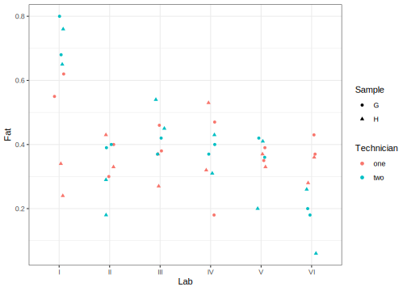

# Nested Design using Frequentist methods
[Julian Faraway](https://julianfaraway.github.io/)
2024-08-23

- [Data](#data)
- [Mixed Effect Model](#mixed-effect-model)
- [LME4](#lme4)
- [NLME](#nlme)
- [MMRM](#mmrm)
- [GLMMTMB](#glmmtmb)
- [Discussion](#discussion)
- [Package version info](#package-version-info)

See the [introduction](index.md) for an overview.

See a [mostly Bayesian analysis](eggs.md) analysis of the same data.

This example is discussed in more detail in my book [Extending the
Linear Model with R](https://julianfaraway.github.io/faraway/ELM/)

Required libraries:

``` r
library(faraway)
library(ggplot2)
library(knitr)
```

# Data

When the levels of one factor vary only within the levels of another
factor, that factor is said to be *nested*. Here is an example to
illustrate nesting. Consistency between laboratory tests is important
and yet the results may depend on who did the test and where the test
was performed. In an experiment to test levels of consistency, a large
jar of dried egg powder was divided up into a number of samples. Because
the powder was homogenized, the fat content of the samples is the same,
but this fact is withheld from the laboratories. Four samples were sent
to each of six laboratories. Two of the samples were labeled as G and
two as H, although in fact they were identical. The laboratories were
instructed to give two samples to two different technicians. The
technicians were then instructed to divide their samples into two parts
and measure the fat content of each. So each laboratory reported eight
measures, each technician four measures, that is, two replicated
measures on each of two samples.

Load in and plot the data:

``` r
data(eggs, package="faraway")
summary(eggs)
```

          Fat         Lab    Technician Sample
     Min.   :0.060   I  :8   one:24     G:24  
     1st Qu.:0.307   II :8   two:24     H:24  
     Median :0.370   III:8                    
     Mean   :0.388   IV :8                    
     3rd Qu.:0.430   V  :8                    
     Max.   :0.800   VI :8                    

``` r
ggplot(eggs, aes(y=Fat, x=Lab, color=Technician, shape=Sample)) + geom_point(position = position_jitter(width=0.1, height=0.0))
```



# Mixed Effect Model

The model is

$$y_{ijkl} = \mu + L_i + T_{ij} + S_{ijk} + \epsilon_{ijkl}$$

where laboratories (L), technicians (T) and samples (S) are all random
effects.

# LME4

See the discussion for the [single random effect
example](pulpfreq.md#LME4) for some introduction.

We fit this model with:

``` r
library(lme4)
lmod4 = lmer(Fat ~ 1 + (1|Lab) + (1|Lab:Technician) +  (1|Lab:Technician:Sample), data=eggs)
summary(lmod4)
```

    Linear mixed model fit by REML ['lmerMod']
    Formula: Fat ~ 1 + (1 | Lab) + (1 | Lab:Technician) + (1 | Lab:Technician:Sample)
       Data: eggs

    REML criterion at convergence: -64.2

    Scaled residuals: 
        Min      1Q  Median      3Q     Max 
    -2.0410 -0.4658  0.0093  0.5971  1.5428 

    Random effects:
     Groups                Name        Variance Std.Dev.
     Lab:Technician:Sample (Intercept) 0.00306  0.0554  
     Lab:Technician        (Intercept) 0.00698  0.0835  
     Lab                   (Intercept) 0.00592  0.0769  
     Residual                          0.00720  0.0848  
    Number of obs: 48, groups:  Lab:Technician:Sample, 24; Lab:Technician, 12; Lab, 6

    Fixed effects:
                Estimate Std. Error t value
    (Intercept)    0.388      0.043    9.02

Is there a difference between samples? The `exactRLRT` function requires
not only the specification of a null model without the random effect of
interest but also one where only that random effect is present. Note
that because of the way the samples are coded, we need to specify this a
three-way interaction. Otherwise `G` from one lab would be linked to `G`
from another lab (which is not the case).

``` r
library(RLRsim)
cmodr <- lmer(Fat ~ 1 + (1|Lab) + (1|Lab:Technician), data=eggs)
cmods <- lmer(Fat ~ 1 + (1|Lab:Technician:Sample), data=eggs)
exactRLRT(cmods, lmod4, cmodr)
```


        simulated finite sample distribution of RLRT.
        
        (p-value based on 10000 simulated values)

    data:  
    RLRT = 1.6, p-value = 0.11

We can remove the sample random effect from the model. But consider the
confidence intervals:

``` r
confint(lmod4, method="boot")
```

                   2.5 %  97.5 %
    .sig01      0.000000 0.10029
    .sig02      0.000000 0.13739
    .sig03      0.000000 0.15222
    .sigma      0.060967 0.10697
    (Intercept) 0.304756 0.46469

We see that all three random effects include zero at the lower end,
indicating that we might equally have disposed of the lab or technician
random effects first. There is considerable uncertainty in the
apportioning of variation due the three effects.

# NLME

See the discussion for the [single random effect
example](pulpfreq.md#NLME) for some introduction.

``` r
library(nlme)
```

The syntax for specifying the nested model is different:

``` r
nlmod = lme(Fat ~ 1, eggs, ~ 1 | Lab/Technician/Sample)
summary(nlmod)
```

    Linear mixed-effects model fit by REML
      Data: eggs 
          AIC     BIC logLik
      -54.235 -44.984 32.118

    Random effects:
     Formula: ~1 | Lab
            (Intercept)
    StdDev:    0.076941

     Formula: ~1 | Technician %in% Lab
            (Intercept)
    StdDev:    0.083548

     Formula: ~1 | Sample %in% Technician %in% Lab
            (Intercept) Residual
    StdDev:    0.055359 0.084828

    Fixed effects:  Fat ~ 1 
                 Value Std.Error DF t-value p-value
    (Intercept) 0.3875  0.042964 24  9.0191       0

    Standardized Within-Group Residuals:
           Min         Q1        Med         Q3        Max 
    -2.0409822 -0.4657618  0.0092663  0.5971286  1.5427587 

    Number of Observations: 48
    Number of Groups: 
                                Lab             Technician %in% Lab Sample %in% Technician %in% Lab 
                                  6                              12                              24 

The estimated SDs for the random terms are the same as in `lme4` fit. We
can also use `RLRsim`. Confidence intervals are provided by:

``` r
intervals(nlmod)
```

    Approximate 95% confidence intervals

     Fixed effects:
                  lower   est.   upper
    (Intercept) 0.29883 0.3875 0.47617

     Random Effects:
      Level: Lab 
                       lower     est.   upper
    sd((Intercept)) 0.021826 0.076941 0.27123
      Level: Technician 
                       lower     est.   upper
    sd((Intercept)) 0.035448 0.083548 0.19691
      Level: Sample 
                      lower     est.   upper
    sd((Intercept)) 0.02182 0.055359 0.14045

     Within-group standard error:
       lower     est.    upper 
    0.063927 0.084828 0.112564 

But these are the Wald-based intervals and won’t be good for this
example.

# MMRM

This package is not designed to fit models with a nested structure. In
principle, it should be possible to specify a parameterised covariance
structure corresponding to a nested design.

# GLMMTMB

See the discussion for the [single random effect
example](pulpfreq.md#GLMMTMB) for some introduction.

``` r
library(glmmTMB)
```

The default fit uses ML (not REML)

``` r
gtmod <- glmmTMB(Fat ~ 1 + (1|Lab) + (1|Lab:Technician) +  (1|Lab:Technician:Sample), data=eggs)
summary(gtmod)
```

     Family: gaussian  ( identity )
    Formula:          Fat ~ 1 + (1 | Lab) + (1 | Lab:Technician) + (1 | Lab:Technician:Sample)
    Data: eggs

         AIC      BIC   logLik deviance df.resid 
       -58.8    -49.4     34.4    -68.8       43 

    Random effects:

    Conditional model:
     Groups                Name        Variance Std.Dev.
     Lab                   (Intercept) 0.00407  0.0638  
     Lab:Technician        (Intercept) 0.00698  0.0835  
     Lab:Technician:Sample (Intercept) 0.00306  0.0554  
     Residual                          0.00720  0.0848  
    Number of obs: 48, groups:  Lab, 6; Lab:Technician, 12; Lab:Technician:Sample, 24

    Dispersion estimate for gaussian family (sigma^2): 0.0072 

    Conditional model:
                Estimate Std. Error z value Pr(>|z|)
    (Intercept)   0.3875     0.0392    9.88   <2e-16

This is identical with the `lme4` fit using ML.

Wald-based confidence intervals can be obtained with:

``` r
confint(gtmod)
```

                                                 2.5 %  97.5 % Estimate
    (Intercept)                               0.310628 0.46437 0.387500
    Std.Dev.(Intercept)|Lab                   0.014701 0.27712 0.063828
    Std.Dev.(Intercept)|Lab:Technician        0.035448 0.19691 0.083548
    Std.Dev.(Intercept)|Lab:Technician:Sample 0.021819 0.14045 0.055359

but these are suspect. A better option is:

``` r
(mc = confint(gtmod, method="uniroot"))
```

                                      2.5 %   97.5 % Estimate
    (Intercept)                     0.29654  0.47846   0.3875
    theta_1|Lab.1                        NA -1.71796  -2.7516
    theta_1|Lab:Technician.1             NA -1.74556  -2.4823
    theta_1|Lab:Technician:Sample.1      NA -2.16106  -2.8939

The random effect SDs are computed on a transformed scale. We can invert
this with:

``` r
exp(mc[2:4,])
```

                                    2.5 %  97.5 % Estimate
    theta_1|Lab.1                      NA 0.17943 0.063828
    theta_1|Lab:Technician.1           NA 0.17455 0.083548
    theta_1|Lab:Technician:Sample.1    NA 0.11520 0.055359

We might interpret the missing lower bounds as zero. Given the boundary
problems here, the bootstrap approach used in the `lme4` section is
preferable.

# Discussion

There are only random effect terms of interest in this example. There
are no fixed effects worth doing inference on. The frequentist
approaches have less functionality for random effects compared to the
Bayesian approaches so there’s not much to comment on.

# Package version info

``` r
sessionInfo()
```

    R version 4.4.1 (2024-06-14)
    Platform: x86_64-apple-darwin20
    Running under: macOS Sonoma 14.6.1

    Matrix products: default
    BLAS:   /Library/Frameworks/R.framework/Versions/4.4-x86_64/Resources/lib/libRblas.0.dylib 
    LAPACK: /Library/Frameworks/R.framework/Versions/4.4-x86_64/Resources/lib/libRlapack.dylib;  LAPACK version 3.12.0

    locale:
    [1] en_US.UTF-8/en_US.UTF-8/en_US.UTF-8/C/en_US.UTF-8/en_US.UTF-8

    time zone: Europe/London
    tzcode source: internal

    attached base packages:
    [1] stats     graphics  grDevices utils     datasets  methods   base     

    other attached packages:
    [1] glmmTMB_1.1.9 nlme_3.1-165  RLRsim_3.1-8  lme4_1.1-35.5 Matrix_1.7-0  knitr_1.48    ggplot2_3.5.1 faraway_1.0.8

    loaded via a namespace (and not attached):
     [1] utf8_1.2.4          generics_0.1.3      lattice_0.22-6      digest_0.6.36       magrittr_2.0.3     
     [6] evaluate_0.24.0     grid_4.4.1          estimability_1.5.1  mvtnorm_1.2-5       fastmap_1.2.0      
    [11] jsonlite_1.8.8      mgcv_1.9-1          fansi_1.0.6         scales_1.3.0        numDeriv_2016.8-1.1
    [16] cli_3.6.3           rlang_1.1.4         munsell_0.5.1       splines_4.4.1       withr_3.0.1        
    [21] yaml_2.3.10         tools_4.4.1         nloptr_2.1.1        coda_0.19-4.1       minqa_1.2.7        
    [26] dplyr_1.1.4         colorspace_2.1-1    boot_1.3-30         vctrs_0.6.5         R6_2.5.1           
    [31] lifecycle_1.0.4     emmeans_1.10.3      MASS_7.3-61         pkgconfig_2.0.3     pillar_1.9.0       
    [36] gtable_0.3.5        glue_1.7.0          Rcpp_1.0.13         systemfonts_1.1.0   xfun_0.46          
    [41] tibble_3.2.1        tidyselect_1.2.1    rstudioapi_0.16.0   xtable_1.8-4        farver_2.1.2       
    [46] htmltools_0.5.8.1   rmarkdown_2.27      svglite_2.1.3       labeling_0.4.3      TMB_1.9.14         
    [51] compiler_4.4.1     
