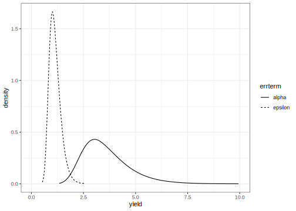
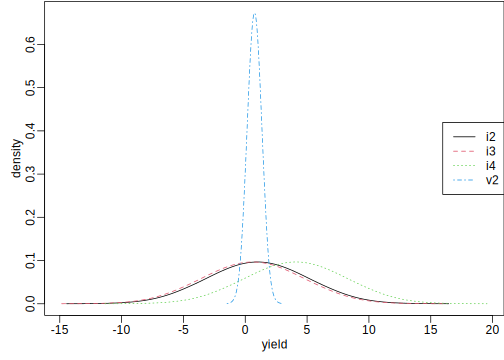
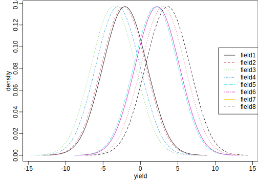

Split Plot Design
================
[Julian Faraway](https://julianfaraway.github.io/)
08 July 2022

-   <a href="#data" id="toc-data">Data</a>
-   <a href="#mixed-effect-model" id="toc-mixed-effect-model">Mixed Effect
    Model</a>
-   <a href="#inla" id="toc-inla">INLA</a>
    -   <a href="#informative-gamma-priors-on-the-precisions"
        id="toc-informative-gamma-priors-on-the-precisions">Informative Gamma
        priors on the precisions</a>
    -   <a href="#penalized-complexity-prior"
        id="toc-penalized-complexity-prior">Penalized Complexity Prior</a>
-   <a href="#stan" id="toc-stan">STAN</a>
    -   <a href="#diagnostics" id="toc-diagnostics">Diagnostics</a>
    -   <a href="#output-summaries" id="toc-output-summaries">Output
        summaries</a>
    -   <a href="#posterior-distributions"
        id="toc-posterior-distributions">Posterior Distributions</a>
-   <a href="#brms" id="toc-brms">BRMS</a>
-   <a href="#mgcv" id="toc-mgcv">MGCV</a>
-   <a href="#ginla" id="toc-ginla">GINLA</a>
-   <a href="#discussion" id="toc-discussion">Discussion</a>
-   <a href="#package-version-info" id="toc-package-version-info">Package
    version info</a>

See the [introduction](index.md) for an overview.

This example is discussed in more detail in my book [Extending the
Linear Model with R](https://julianfaraway.github.io/faraway/ELM/)

Required libraries:

``` r
library(faraway)
library(ggplot2)
library(lme4)
library(pbkrtest)
library(RLRsim)
library(INLA)
library(knitr)
library(rstan, quietly=TRUE)
library(brms)
library(mgcv)
```

# Data

In an agricultural field trial, the objective was to determine the
effects of two crop varieties and four different irrigation methods.
Eight fields were available, but only one type of irrigation may be
applied to each field. The fields may be divided into two parts with a
different variety planted in each half. The whole plot factor is the
method of irrigation, which should be randomly assigned to the fields.
Within each field, the variety is randomly assigned.

Load in and plot the data:

``` r
data(irrigation, package="faraway")
summary(irrigation)
```

         field   irrigation variety     yield     
     f1     :2   i1:4       v1:8    Min.   :34.8  
     f2     :2   i2:4       v2:8    1st Qu.:37.6  
     f3     :2   i3:4               Median :40.1  
     f4     :2   i4:4               Mean   :40.2  
     f5     :2                      3rd Qu.:42.7  
     f6     :2                      Max.   :47.6  
     (Other):4                                    

``` r
ggplot(irrigation, aes(y=yield, x=field, shape=variety, color=irrigation)) + geom_point()
```

<!-- -->

# Mixed Effect Model

The irrigation and variety are fixed effects, but the field is a random
effect. We must also consider the interaction between field and variety,
which is necessarily also a random effect because one of the two
components is random. The fullest model that we might consider is:

_{ij} + f_k + (vf)_{jk} + \epsilon_{ijk}")

where
_{ij}")
are fixed effects; the rest are random having variances
,

and
.
Note that we have no
_{ik}")
term in this model. It would not be possible to estimate such an effect
since only one type of irrigation is used on a given field; the factors
are not crossed. Unfortunately, it is not possible to distinguish the
variety within the field variation. We would need more than one
observation per variety within each field for us to separate the two
variabilities. We resort to a simpler model that omits the variety by
field interaction random effect:

_{ij} + f_k +  \epsilon_{ijk}")

We fit this model with:

``` r
lmod <- lme4::lmer(yield ~ irrigation * variety + (1|field), irrigation)
faraway::sumary(lmod)
```

    Fixed Effects:
                           coef.est coef.se
    (Intercept)            38.50     3.03  
    irrigationi2            1.20     4.28  
    irrigationi3            0.70     4.28  
    irrigationi4            3.50     4.28  
    varietyv2               0.60     1.45  
    irrigationi2:varietyv2 -0.40     2.05  
    irrigationi3:varietyv2 -0.20     2.05  
    irrigationi4:varietyv2  1.20     2.05  

    Random Effects:
     Groups   Name        Std.Dev.
     field    (Intercept) 4.02    
     Residual             1.45    
    ---
    number of obs: 16, groups: field, 8
    AIC = 65.4, DIC = 91.8
    deviance = 68.6 

The fixed effects don’t look very significant. We could use a parametric
bootstrap to test this but it’s less work to use the `pbkrtest` package
which implements the Kenward-Roger approximation. First test the
interaction:

``` r
lmoda <- lmer(yield ~ irrigation + variety + (1|field),data=irrigation)
faraway::sumary(lmoda)
```

    Fixed Effects:
                 coef.est coef.se
    (Intercept)  38.43     2.95  
    irrigationi2  1.00     4.15  
    irrigationi3  0.60     4.15  
    irrigationi4  4.10     4.15  
    varietyv2     0.75     0.60  

    Random Effects:
     Groups   Name        Std.Dev.
     field    (Intercept) 4.07    
     Residual             1.19    
    ---
    number of obs: 16, groups: field, 8
    AIC = 68.8, DIC = 85.1
    deviance = 70.0 

``` r
pbkrtest::KRmodcomp(lmod, lmoda)
```

    large : yield ~ irrigation * variety + (1 | field)
    small : yield ~ irrigation + variety + (1 | field)
          stat  ndf  ddf F.scaling p.value
    Ftest 0.25 3.00 4.00         1    0.86

We can drop the interaction. Now test for a variety effect:

``` r
lmodi <- lmer(yield ~ irrigation + (1|field), irrigation)
KRmodcomp(lmoda, lmodi)
```

    large : yield ~ irrigation + variety + (1 | field)
    small : yield ~ irrigation + (1 | field)
          stat  ndf  ddf F.scaling p.value
    Ftest 1.58 1.00 7.00         1    0.25

The variety can go also. Now check the irrigation method.

``` r
lmodv <- lmer(yield ~  variety + (1|field), irrigation)
KRmodcomp(lmoda, lmodv)
```

    large : yield ~ irrigation + variety + (1 | field)
    small : yield ~ variety + (1 | field)
          stat  ndf  ddf F.scaling p.value
    Ftest 0.39 3.00 4.00         1    0.77

This can go also. As a final check, lets compare the null model with no
fixed effects to the full model.

``` r
lmodn <- lmer(yield ~  1 + (1|field), irrigation)
KRmodcomp(lmod, lmodn)
```

    large : yield ~ irrigation * variety + (1 | field)
    small : yield ~ 1 + (1 | field)
          stat  ndf  ddf F.scaling p.value
    Ftest 0.38 7.00 4.48     0.903    0.88

This confirms the lack of statistical significance for the variety and
irrigation factors.

We can check the significance of the random effect (field) term with:

``` r
RLRsim::exactRLRT(lmod)
```


        simulated finite sample distribution of RLRT.
        
        (p-value based on 10000 simulated values)

    data:  
    RLRT = 6.11, p-value = 0.0098

We can see that there is a significant variation among the fields.

# INLA

Integrated nested Laplace approximation is a method of Bayesian
computation which uses approximation rather than simulation. More can be
found on this topic in [Bayesian Regression Modeling with
INLA](http://julianfaraway.github.io/brinla/) and the [chapter on
GLMMs](https://julianfaraway.github.io/brinlabook/chaglmm.html)

Use the most recent computational methodology:

``` r
inla.setOption(inla.mode="experimental")
inla.setOption("short.summary",TRUE)
```

Try the default INLA fit

``` r
formula <- yield ~ irrigation + variety +f(field, model="iid")
result <- inla(formula, family="gaussian", data=irrigation)
summary(result)
```

    Fixed effects:
                   mean    sd 0.025quant 0.5quant 0.975quant   mode kld
    (Intercept)  38.464 2.650     33.180   38.459     43.786 38.451   0
    irrigationi2  0.954 3.723     -6.523    0.961      8.388  0.970   0
    irrigationi3  0.557 3.723     -6.919    0.563      7.992  0.572   0
    irrigationi4  4.032 3.723     -3.457    4.042     11.455  4.056   0
    varietyv2     0.750 0.590     -0.427    0.750      1.926  0.750   0

    Model hyperparameters:
                                             mean    sd 0.025quant 0.5quant 0.975quant  mode
    Precision for the Gaussian observations 0.891 0.425      0.295    0.816      1.929 0.664
    Precision for field                     0.098 0.062      0.023    0.084      0.259 0.057

     is computed 

Default looks more plausible than [one way](pulp.md) and
[RBD](penicillin.md) examples.

Compute the transforms to an SD scale for the field and error. Make a
table of summary statistics for the posteriors:

``` r
sigmaalpha <- inla.tmarginal(function(x) 1/sqrt(exp(x)),result$internal.marginals.hyperpar[[2]])
sigmaepsilon <- inla.tmarginal(function(x) 1/sqrt(exp(x)),result$internal.marginals.hyperpar[[1]])
restab=sapply(result$marginals.fixed, function(x) inla.zmarginal(x,silent=TRUE))
restab=cbind(restab, inla.zmarginal(sigmaalpha,silent=TRUE))
restab=cbind(restab, inla.zmarginal(sigmaepsilon,silent=TRUE))
colnames(restab) = c("mu","ir2","ir3","ir4","v2","alpha","epsilon")
data.frame(restab)
```

                   mu     ir2     ir3     ir4       v2  alpha epsilon
    mean       38.465 0.95444 0.55728  4.0324  0.74976 3.6701  1.1513
    sd         2.6497  3.7224  3.7224  3.7225  0.58948 1.1824 0.28443
    quant0.025 33.179 -6.5247 -6.9204 -3.4581 -0.42704 1.9744 0.72238
    quant0.25  36.839 -1.3134 -1.7108  1.7667  0.38261 2.8251 0.94707
    quant0.5   38.452 0.95189 0.55428  4.0333  0.74832 3.4523  1.1049
    quant0.75  40.069  3.2121  2.8147  6.2923    1.114 4.2838  1.3076
    quant0.975 43.776  8.3728   7.977   11.44   1.9235 6.5695  1.8309

Also construct a plot the SD posteriors:

``` r
ddf <- data.frame(rbind(sigmaalpha,sigmaepsilon),errterm=gl(2,nrow(sigmaalpha),labels = c("alpha","epsilon")))
ggplot(ddf, aes(x,y, linetype=errterm))+geom_line()+xlab("yield")+ylab("density")+xlim(0,10)
```

<!-- -->

Posteriors look OK.

## Informative Gamma priors on the precisions

Now try more informative gamma priors for the precisions. Define it so
the mean value of gamma prior is set to the inverse of the variance of
the residuals of the fixed-effects only model. We expect the two error
variances to be lower than this variance so this is an overestimate. The
variance of the gamma prior (for the precision) is controlled by the
`apar` shape parameter.

``` r
apar <- 0.5
lmod <- lm(yield ~ irrigation+variety, data=irrigation)
bpar <- apar*var(residuals(lmod))
lgprior <- list(prec = list(prior="loggamma", param = c(apar,bpar)))
formula = yield ~ irrigation+variety+f(field, model="iid", hyper = lgprior)
result <- inla(formula, family="gaussian", data=irrigation)
summary(result)
```

    Fixed effects:
                   mean    sd 0.025quant 0.5quant 0.975quant   mode kld
    (Intercept)  38.481 3.172     32.148   38.472     44.879 38.460   0
    irrigationi2  0.935 4.465     -8.068    0.946      9.862  0.960   0
    irrigationi3  0.539 4.465     -8.461    0.549      9.469  0.562   0
    irrigationi4  4.002 4.465     -5.021    4.020     12.911  4.041   0
    varietyv2     0.750 0.578     -0.401    0.750      1.901  0.750   0

    Model hyperparameters:
                                             mean    sd 0.025quant 0.5quant 0.975quant  mode
    Precision for the Gaussian observations 0.893 0.422      0.298    0.819      1.923 0.669
    Precision for field                     0.068 0.045      0.014    0.057      0.183 0.037

     is computed 

Compute the summaries as before:

``` r
sigmaalpha <- inla.tmarginal(function(x) 1/sqrt(exp(x)),result$internal.marginals.hyperpar[[2]])
sigmaepsilon <- inla.tmarginal(function(x) 1/sqrt(exp(x)),result$internal.marginals.hyperpar[[1]])
restab=sapply(result$marginals.fixed, function(x) inla.zmarginal(x,silent=TRUE))
restab=cbind(restab, inla.zmarginal(sigmaalpha,silent=TRUE))
restab=cbind(restab, inla.zmarginal(sigmaepsilon,silent=TRUE))
colnames(restab) = c("mu","ir2","ir3","ir4","v2","alpha","epsilon")
data.frame(restab)
```

                   mu     ir2     ir3     ir4      v2  alpha epsilon
    mean       38.482 0.93522 0.53938   4.003 0.74976 4.4883  1.1486
    sd         3.1733  4.4666  4.4666  4.4669 0.57753 1.5666 0.28161
    quant0.025 32.147 -8.0683 -8.4615 -5.0212 -0.4017  2.347  0.7235
    quant0.25  36.571 -1.7328 -2.1292  1.3388  0.3874  3.375 0.94638
    quant0.5   38.464 0.93491  0.5383  4.0087 0.74836 4.1651  1.1028
    quant0.75  40.363  3.5948  3.1984  6.6666  1.1093 5.2595  1.3036
    quant0.975 44.867  9.8444  9.4511  12.893  1.8982 8.4125  1.8211

Make the plots:

``` r
ddf <- data.frame(rbind(sigmaalpha,sigmaepsilon),errterm=gl(2,nrow(sigmaalpha),labels = c("alpha","epsilon")))
ggplot(ddf, aes(x,y, linetype=errterm))+geom_line()+xlab("yield")+ylab("density")+xlim(0,10)
```

<!-- -->

Posteriors look OK.

## Penalized Complexity Prior

In [Simpson et al (2015)](http://arxiv.org/abs/1403.4630v3), penalized
complexity priors are proposed. This requires that we specify a scaling
for the SDs of the random effects. We use the SD of the residuals of the
fixed effects only model (what might be called the base model in the
paper) to provide this scaling.

``` r
lmod <- lm(yield ~ irrigation+variety, irrigation)
sdres <- sd(residuals(lmod))
pcprior <- list(prec = list(prior="pc.prec", param = c(3*sdres,0.01)))
formula <- yield ~ irrigation+variety+f(field, model="iid", hyper = pcprior)
result <- inla(formula, family="gaussian", data=irrigation)
summary(result)
```

    Fixed effects:
                   mean    sd 0.025quant 0.5quant 0.975quant   mode kld
    (Intercept)  38.472 2.897     32.691   38.466     44.291 38.457   0
    irrigationi2  0.945 4.075     -7.241    0.953      9.086  0.963   0
    irrigationi3  0.549 4.075     -7.636    0.555      8.691  0.566   0
    irrigationi4  4.019 4.076     -4.179    4.030     12.148  4.046   0
    varietyv2     0.750 0.580     -0.407    0.750      1.906  0.750   0

    Model hyperparameters:
                                             mean    sd 0.025quant 0.5quant 0.975quant  mode
    Precision for the Gaussian observations 0.891 0.422      0.297    0.817      1.920 0.667
    Precision for field                     0.079 0.050      0.019    0.067      0.206 0.047

     is computed 

Compute the summaries as before:

``` r
sigmaalpha <- inla.tmarginal(function(x) 1/sqrt(exp(x)),result$internal.marginals.hyperpar[[2]])
sigmaepsilon <- inla.tmarginal(function(x) 1/sqrt(exp(x)),result$internal.marginals.hyperpar[[1]])
restab=sapply(result$marginals.fixed, function(x) inla.zmarginal(x,silent=TRUE))
restab=cbind(restab, inla.zmarginal(sigmaalpha,silent=TRUE))
restab=cbind(restab, inla.zmarginal(sigmaepsilon,silent=TRUE))
colnames(restab) = c("mu","ir2","ir3","ir4","v2","alpha","epsilon")
data.frame(restab)
```

                   mu     ir2     ir3     ir4       v2  alpha epsilon
    mean       38.472 0.94532 0.54873  4.0189  0.74976 4.0766  1.1504
    sd          2.896  4.0737  4.0737  4.0739  0.57994 1.2872 0.28263
    quant0.025  32.69 -7.2422 -7.6372 -4.1804 -0.40675 2.2112 0.72412
    quant0.25  36.677 -1.5653 -1.9622  1.5105  0.38638 3.1557 0.94746
    quant0.5   38.459 0.94261 0.54554  4.0199  0.74835  3.846  1.1043
    quant0.75  40.245  3.4447  3.0478  6.5206   1.1103 4.7522  1.3058
    quant0.975 44.279   9.068  8.6729   12.13   1.9033  7.217  1.8257

Make the plots:

``` r
ddf <- data.frame(rbind(sigmaalpha,sigmaepsilon),errterm=gl(2,nrow(sigmaalpha),labels = c("alpha","epsilon")))
ggplot(ddf, aes(x,y, linetype=errterm))+geom_line()+xlab("yield")+ylab("density")+xlim(0,10)
```

<!-- -->

Posteriors look OK. Not much difference between the three priors tried
here.

# STAN

[STAN](https://mc-stan.org/) performs Bayesian inference using MCMC. Set
up STAN to use multiple cores. Set the random number seed for
reproducibility.

``` r
rstan_options(auto_write = TRUE)
options(mc.cores = parallel::detectCores())
set.seed(123)
```

Fit the model. Requires use of STAN command file
[irrigation.stan](../stancode/irrigation.stan). We have used
uninformative priors for the fixed effects and the two variances.
Prepare data in a format consistent with the command file. Needs to be a
list.

``` r
irridat <- with(irrigation,list(N=length(yield), y=yield, field=as.numeric(field), irrigation=as.numeric(irrigation), variety=as.numeric(variety)))
```

Fit the model in three steps:

``` r
rt <- stanc(file="../stancode/irrigation.stan")
sm <- stan_model(stanc_ret = rt, verbose=FALSE)
system.time(fit <- sampling(sm, data=irridat))
```

       user  system elapsed 
      4.773   0.258   1.742 

We get several kinds of warning. The easiest way to solve this is simply
running more iterations.

``` r
system.time(fit <- sampling(sm, data=irridat, iter=10000))
```

       user  system elapsed 
     19.744   0.435   6.769 

## Diagnostics

First for the error SD

``` r
pname <- "sigmay"
muc <- rstan::extract(fit, pars=pname,  permuted=FALSE, inc_warmup=FALSE)
mdf <- reshape2::melt(muc)
ggplot(mdf,aes(x=iterations,y=value,color=chains)) + geom_line() + ylab(mdf$parameters[1])
```

<!-- -->

which is satisfactory. The same for the field SD:

``` r
pname <- "sigmaf"
muc <- rstan::extract(fit, pars=pname,  permuted=FALSE, inc_warmup=FALSE)
mdf <- reshape2::melt(muc)
ggplot(mdf,aes(x=iterations,y=value,color=chains)) + geom_line() + ylab(mdf$parameters[1])
```

<!-- -->

which also looks reasonable.

## Output summaries

Examine the output for the parameters we are mostly interested in:

``` r
print(fit, pars=c("mu","ir2","ir3","ir4","va2","sigmaf","sigmay","fld"))
```

    Inference for Stan model: irrigation.
    4 chains, each with iter=10000; warmup=5000; thin=1; 
    post-warmup draws per chain=5000, total post-warmup draws=20000.

            mean se_mean   sd   2.5%   25%   50%   75% 97.5% n_eff Rhat
    mu     38.38    0.07 4.93  28.10 35.91 38.44 40.89 48.57  4643    1
    ir2     1.20    0.10 7.19 -12.78 -2.50  1.10  4.71 16.20  4743    1
    ir3     0.69    0.10 6.92 -13.08 -2.94  0.63  4.17 15.40  4583    1
    ir4     4.23    0.11 7.09 -10.18  0.72  4.14  7.66 19.07  4313    1
    va2     0.73    0.01 0.80  -0.89  0.26  0.74  1.20  2.34 14633    1
    sigmaf  6.26    0.09 3.84   2.36  3.86  5.23  7.37 16.78  1864    1
    sigmay  1.50    0.01 0.56   0.83  1.13  1.37  1.72  2.96  3318    1
    fld[1] -1.96    0.07 4.92 -12.22 -4.46 -1.99  0.49  8.31  4743    1
    fld[2] -2.35    0.07 5.24 -13.61 -4.84 -2.20  0.32  7.69  5475    1
    fld[3] -3.61    0.08 4.93 -14.04 -6.08 -3.52 -0.98  6.19  4178    1
    fld[4] -3.05    0.08 5.15 -13.63 -5.55 -2.93 -0.47  7.26  4135    1
    fld[5]  2.08    0.07 4.91  -8.02 -0.43  1.95  4.55 12.41  4720    1
    fld[6]  2.07    0.07 5.24  -8.84 -0.40  2.17  4.71 12.34  5671    1
    fld[7]  3.53    0.07 4.92  -6.66  1.00  3.51  6.09 13.55  4407    1
    fld[8]  2.89    0.08 5.16  -7.42  0.33  2.88  5.40 13.42  4531    1

    Samples were drawn using NUTS(diag_e) at Fri Jul  8 14:22:35 2022.
    For each parameter, n_eff is a crude measure of effective sample size,
    and Rhat is the potential scale reduction factor on split chains (at 
    convergence, Rhat=1).

We see the posterior mean, SE and SD of the samples. We see some
quantiles from which we could construct a 95% credible interval (for
example). The `n_eff` is a rough measure of the sample size taking into
account the correlation in the samples. The effective sample sizes for
the primary parameters is good enough for most purposes. The

statistics are good.

Notice that the posterior mean for field SD is substantially larger than
seen in the mixed effect model or the previous INLA models.

## Posterior Distributions

Plot the posteriors for the variance components

``` r
postsig <- rstan::extract(fit, pars=c("sigmay","sigmaf"))
ref <- reshape2::melt(postsig,value.name="yield")
ggplot(data=ref,aes(x=yield, color=L1))+geom_density()+guides(color=guide_legend(title="SD"))+xlim(0,20)
```

<!-- -->

We see that the error SD can be localized much more than the field SD.
We can also look at the field effects:

``` r
opre <- rstan::extract(fit, pars="fld")
ref <- reshape2::melt(opre, value.name="yield")
ggplot(data=ref,aes(x=yield, color=factor(Var2)))+geom_density()+guides(color=guide_legend(title="field"))
```

<!-- -->

We are looking at the differences from the overall mean. We see that all
eight field distributions clearly overlap zero. There is a distinction
between the first four and the second four fields. We can also look at
the “fixed” effects:

``` r
opre <- rstan::extract(fit, pars=c("ir2","ir3","ir4","va2"))
ref <- reshape2::melt(opre)
colnames(ref)[2:3] <- c("yield","fixed")
ggplot(data=ref,aes(x=yield, color=fixed))+geom_density()
```

<!-- -->

We are looking at the differences from the reference level. We see that
all four distributions clearly overlap zero although we are able to
locate the difference between the varieties more precisely than the
difference between the fields.

# BRMS

[BRMS](https://paul-buerkner.github.io/brms/) stands for Bayesian
Regression Models with STAN. It provides a convenient wrapper to STAN
functionality.

Fitting the model is very similar to `lmer` as seen above:

``` r
suppressMessages(bmod <- brm(yield ~ irrigation + variety + (1|field), 
                             irrigation, iter=10000, cores=4))
```

We get some warnings but not as severe as seen with our STAN fit above.
We can obtain some posterior densities and diagnostics with:

``` r
plot(bmod, variable = "^s", regex=TRUE)
```

<!-- -->

We have chosen only the random effect hyperparameters since this is
where problems will appear first. Looks OK.

We can look at the STAN code that `brms` used with:

``` r
stancode(bmod)
```

    // generated with brms 2.17.0
    functions {
    }
    data {
      int<lower=1> N;  // total number of observations
      vector[N] Y;  // response variable
      int<lower=1> K;  // number of population-level effects
      matrix[N, K] X;  // population-level design matrix
      // data for group-level effects of ID 1
      int<lower=1> N_1;  // number of grouping levels
      int<lower=1> M_1;  // number of coefficients per level
      int<lower=1> J_1[N];  // grouping indicator per observation
      // group-level predictor values
      vector[N] Z_1_1;
      int prior_only;  // should the likelihood be ignored?
    }
    transformed data {
      int Kc = K - 1;
      matrix[N, Kc] Xc;  // centered version of X without an intercept
      vector[Kc] means_X;  // column means of X before centering
      for (i in 2:K) {
        means_X[i - 1] = mean(X[, i]);
        Xc[, i - 1] = X[, i] - means_X[i - 1];
      }
    }
    parameters {
      vector[Kc] b;  // population-level effects
      real Intercept;  // temporary intercept for centered predictors
      real<lower=0> sigma;  // dispersion parameter
      vector<lower=0>[M_1] sd_1;  // group-level standard deviations
      vector[N_1] z_1[M_1];  // standardized group-level effects
    }
    transformed parameters {
      vector[N_1] r_1_1;  // actual group-level effects
      real lprior = 0;  // prior contributions to the log posterior
      r_1_1 = (sd_1[1] * (z_1[1]));
      lprior += student_t_lpdf(Intercept | 3, 40.1, 3.9);
      lprior += student_t_lpdf(sigma | 3, 0, 3.9)
        - 1 * student_t_lccdf(0 | 3, 0, 3.9);
      lprior += student_t_lpdf(sd_1 | 3, 0, 3.9)
        - 1 * student_t_lccdf(0 | 3, 0, 3.9);
    }
    model {
      // likelihood including constants
      if (!prior_only) {
        // initialize linear predictor term
        vector[N] mu = Intercept + rep_vector(0.0, N);
        for (n in 1:N) {
          // add more terms to the linear predictor
          mu[n] += r_1_1[J_1[n]] * Z_1_1[n];
        }
        target += normal_id_glm_lpdf(Y | Xc, mu, b, sigma);
      }
      // priors including constants
      target += lprior;
      target += std_normal_lpdf(z_1[1]);
    }
    generated quantities {
      // actual population-level intercept
      real b_Intercept = Intercept - dot_product(means_X, b);
    }

We see that `brms` is using student t distributions with 3 degrees of
freedom for the priors. For the two error SDs, this will be truncated at
zero to form half-t distributions. You can get a more explicit
description of the priors with `prior_summary(bmod)`. These are
qualitatively similar to the half-normal and the PC prior used in the
INLA fit.

We examine the fit:

``` r
summary(bmod)
```

     Family: gaussian 
      Links: mu = identity; sigma = identity 
    Formula: yield ~ irrigation + variety + (1 | field) 
       Data: irrigation (Number of observations: 16) 
      Draws: 4 chains, each with iter = 10000; warmup = 5000; thin = 1;
             total post-warmup draws = 20000

    Group-Level Effects: 
    ~field (Number of levels: 8) 
                  Estimate Est.Error l-95% CI u-95% CI Rhat Bulk_ESS Tail_ESS
    sd(Intercept)     4.37      1.69     2.03     8.53 1.00     4661     4923

    Population-Level Effects: 
                 Estimate Est.Error l-95% CI u-95% CI Rhat Bulk_ESS Tail_ESS
    Intercept       38.46      3.29    31.98    45.09 1.00     8318     9317
    irrigationi2     0.95      4.77    -8.60    10.38 1.00     8552     9576
    irrigationi3     0.48      4.84    -9.14     9.96 1.00     8175     8593
    irrigationi4     4.01      4.81    -5.56    13.54 1.00     8595     8481
    varietyv2        0.75      0.80    -0.83     2.33 1.00    15520     9463

    Family Specific Parameters: 
          Estimate Est.Error l-95% CI u-95% CI Rhat Bulk_ESS Tail_ESS
    sigma     1.50      0.56     0.82     2.95 1.00     3940     3629

    Draws were sampled using sampling(NUTS). For each parameter, Bulk_ESS
    and Tail_ESS are effective sample size measures, and Rhat is the potential
    scale reduction factor on split chains (at convergence, Rhat = 1).

The posterior mean for the field SD is more comparable to the mixed
model and INLA values seen earlier and smaller than the STAN fit. This
can be ascribed to the more informative prior used for the BRMS fit.

# MGCV

It is possible to fit some GLMMs within the GAM framework of the `mgcv`
package. An explanation of this can be found in this
[blog](https://fromthebottomoftheheap.net/2021/02/02/random-effects-in-gams/)

The `field` term must be a factor for this to work:

``` r
gmod = gam(yield ~ irrigation + variety + s(field,bs="re"), 
           data=irrigation, method="REML")
```

and look at the summary output:

``` r
summary(gmod)
```


    Family: gaussian 
    Link function: identity 

    Formula:
    yield ~ irrigation + variety + s(field, bs = "re")

    Parametric coefficients:
                 Estimate Std. Error t value Pr(>|t|)
    (Intercept)    38.425      2.952   13.02    3e-06
    irrigationi2    1.000      4.154    0.24     0.82
    irrigationi3    0.600      4.154    0.14     0.89
    irrigationi4    4.100      4.154    0.99     0.36
    varietyv2       0.750      0.597    1.26     0.25

    Approximate significance of smooth terms:
              edf Ref.df    F p-value
    s(field) 3.83      4 23.2 0.00034

    R-sq.(adj) =  0.888   Deviance explained = 94.6%
    -REML = 27.398  Scale est. = 1.4257    n = 16

We get the fixed effect estimates. We also get a test on the random
effect (as described in this
[article](https://doi.org/10.1093/biomet/ast038). The hypothesis of no
variation between the fields is rejected.

We can get an estimate of the operator and error SD:

``` r
gam.vcomp(gmod)
```


    Standard deviations and 0.95 confidence intervals:

             std.dev   lower  upper
    s(field)   4.067 1.97338 8.3820
    scale      1.194 0.70717 2.0161

    Rank: 2/2

which is the same as the REML estimate from `lmer` earlier.

The random effect estimates for the fields can be found with:

``` r
coef(gmod)
```

     (Intercept) irrigationi2 irrigationi3 irrigationi4    varietyv2   s(field).1   s(field).2   s(field).3   s(field).4 
         38.4250       1.0000       0.6000       4.1000       0.7500      -2.0612      -2.2529      -3.6430      -3.0199 
      s(field).5   s(field).6   s(field).7   s(field).8 
          2.0612       2.2529       3.6430       3.0199 

# GINLA

In [Wood (2019)](https://doi.org/10.1093/biomet/asz044), a simplified
version of INLA is proposed. The first construct the GAM model without
fitting and then use the `ginla()` function to perform the computation.

``` r
gmod = gam(yield ~ irrigation + variety + s(field,bs="re"), 
           data=irrigation, fit = FALSE)
gimod = ginla(gmod)
```

We get the posterior density for the intercept as:

``` r
plot(gimod$beta[1,],gimod$density[1,],type="l",xlab="yield",ylab="density")
```

<!-- -->

and for the treatment effects as:

``` r
xmat = t(gimod$beta[2:5,])
ymat = t(gimod$density[2:5,])
matplot(xmat, ymat,type="l",xlab="yield",ylab="density")
legend("right",c("i2","i3","i4","v2"),col=1:4,lty=1:4)
```

<!-- -->

``` r
xmat = t(gimod$beta[6:13,])
ymat = t(gimod$density[6:13,])
matplot(xmat, ymat,type="l",xlab="yield",ylab="density")
legend("right",paste0("field",1:8),col=1:8,lty=1:8)
```

<!-- -->

It is not straightforward to obtain the posterior densities of the
hyperparameters.

# Discussion

See the [Discussion of the single random effect
model](pulp.md#Discussion) for general comments. Given that the fixed
effects are not significant here, this example is not so different from
the single random effect example. This provides an illustration of why
we need to pay attention to the priors. In the `pulp` example, the
default priors resulted in unbelievable results from INLA and we were
prompted to consider alternatives. In this example, the default INLA
priors produce output that looked passable and, if we were feeling lazy,
we might have skipped a look at the alternatives. In this case, they do
not make much difference. Contrast this with the default STAN priors
used - the output looks reasonable but the answers are somewhat
different. Had we not been trying these other analyses, we would not be
aware of this. The minimal analyst might have stopped there. But BRMS
uses more informative priors and produces results closer to the other
methods.

STAN/BRMS put more weight on low values of the random effects SDs
whereas the INLA posteriors are clearly bounded away from zero. We saw a
similar effect in the `pulp` example. Although we have not matched up
the priors exactly, there does appear to be some structural difference.

Much of the worry above centers on the random effect SDs. The fixed
effects seem quite robust to these concerns. If we only care about
these, GINLA is giving us what we need with the minimum amount of effort
(we would not even need to install any packages beyond the default
distribution of R, though this is an historic advantage for `mgcv`).

# Package version info

``` r
sessionInfo()
```

    R version 4.2.1 (2022-06-23)
    Platform: x86_64-apple-darwin17.0 (64-bit)
    Running under: macOS Big Sur ... 10.16

    Matrix products: default
    BLAS:   /Library/Frameworks/R.framework/Versions/4.2/Resources/lib/libRblas.0.dylib
    LAPACK: /Library/Frameworks/R.framework/Versions/4.2/Resources/lib/libRlapack.dylib

    locale:
    [1] en_GB.UTF-8/en_GB.UTF-8/en_GB.UTF-8/C/en_GB.UTF-8/en_GB.UTF-8

    attached base packages:
    [1] parallel  stats     graphics  grDevices utils     datasets  methods   base     

    other attached packages:
     [1] mgcv_1.8-40         nlme_3.1-157        brms_2.17.0         Rcpp_1.0.8.3        rstan_2.26.13      
     [6] StanHeaders_2.26.13 knitr_1.39          INLA_22.06.20-2     sp_1.4-7            foreach_1.5.2      
    [11] RLRsim_3.1-8        pbkrtest_0.5.1      lme4_1.1-29         Matrix_1.4-1        ggplot2_3.3.6      
    [16] faraway_1.0.8      

    loaded via a namespace (and not attached):
      [1] minqa_1.2.4          colorspace_2.0-3     ellipsis_0.3.2       ggridges_0.5.3       markdown_1.1        
      [6] base64enc_0.1-3      rstudioapi_0.13      Deriv_4.1.3          farver_2.1.0         MatrixModels_0.5-0  
     [11] DT_0.23              fansi_1.0.3          mvtnorm_1.1-3        bridgesampling_1.1-2 codetools_0.2-18    
     [16] splines_4.2.1        shinythemes_1.2.0    bayesplot_1.9.0      jsonlite_1.8.0       nloptr_2.0.3        
     [21] broom_0.8.0          shiny_1.7.1          compiler_4.2.1       backports_1.4.1      assertthat_0.2.1    
     [26] fastmap_1.1.0        cli_3.3.0            later_1.3.0          htmltools_0.5.2      prettyunits_1.1.1   
     [31] tools_4.2.1          igraph_1.3.1         coda_0.19-4          gtable_0.3.0         glue_1.6.2          
     [36] reshape2_1.4.4       dplyr_1.0.9          posterior_1.2.2      V8_4.2.0             vctrs_0.4.1         
     [41] svglite_2.1.0        iterators_1.0.14     crosstalk_1.2.0      tensorA_0.36.2       xfun_0.31           
     [46] stringr_1.4.0        ps_1.7.0             mime_0.12            miniUI_0.1.1.1       lifecycle_1.0.1     
     [51] gtools_3.9.2.1       MASS_7.3-57          zoo_1.8-10           scales_1.2.0         colourpicker_1.1.1  
     [56] promises_1.2.0.1     Brobdingnag_1.2-7    inline_0.3.19        shinystan_2.6.0      yaml_2.3.5          
     [61] curl_4.3.2           gridExtra_2.3        loo_2.5.1            stringi_1.7.6        highr_0.9           
     [66] dygraphs_1.1.1.6     checkmate_2.1.0      boot_1.3-28          pkgbuild_1.3.1       systemfonts_1.0.4   
     [71] rlang_1.0.2          pkgconfig_2.0.3      matrixStats_0.62.0   distributional_0.3.0 evaluate_0.15       
     [76] lattice_0.20-45      purrr_0.3.4          labeling_0.4.2       rstantools_2.2.0     htmlwidgets_1.5.4   
     [81] processx_3.5.3       tidyselect_1.1.2     plyr_1.8.7           magrittr_2.0.3       R6_2.5.1            
     [86] generics_0.1.2       DBI_1.1.2            pillar_1.7.0         withr_2.5.0          xts_0.12.1          
     [91] abind_1.4-5          tibble_3.1.7         crayon_1.5.1         utf8_1.2.2           rmarkdown_2.14      
     [96] grid_4.2.1           callr_3.7.0          threejs_0.3.3        digest_0.6.29        xtable_1.8-4        
    [101] tidyr_1.2.0          httpuv_1.6.5         RcppParallel_5.1.5   stats4_4.2.1         munsell_0.5.0       
    [106] shinyjs_2.1.0       
