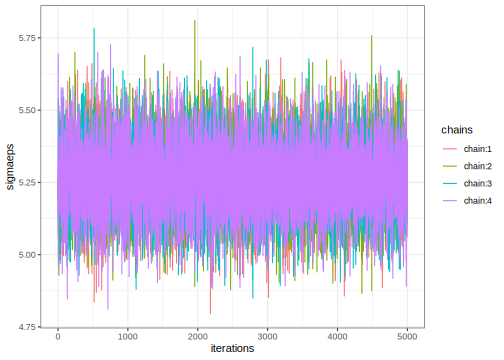

Multilevel Design
================
[Julian Faraway](https://julianfaraway.github.io/)
27 September 2022

-   <a href="#data" id="toc-data">Data</a>
-   <a href="#mixed-effect-model" id="toc-mixed-effect-model">Mixed Effect
    Model</a>
-   <a href="#inla" id="toc-inla">INLA</a>
    -   <a href="#informative-gamma-priors-on-the-precisions"
        id="toc-informative-gamma-priors-on-the-precisions">Informative Gamma
        priors on the precisions</a>
    -   <a href="#penalized-complexity-prior"
        id="toc-penalized-complexity-prior">Penalized Complexity Prior</a>
-   <a href="#stan" id="toc-stan">STAN</a>
    -   <a href="#diagnostics" id="toc-diagnostics">Diagnostics</a>
    -   <a href="#output-summary" id="toc-output-summary">Output Summary</a>
    -   <a href="#posterior-distributions"
        id="toc-posterior-distributions">Posterior Distributions</a>
-   <a href="#brms" id="toc-brms">BRMS</a>
-   <a href="#mgcv" id="toc-mgcv">MGCV</a>
-   <a href="#ginla" id="toc-ginla">GINLA</a>
-   <a href="#discussion" id="toc-discussion">Discussion</a>
-   <a href="#package-version-info" id="toc-package-version-info">Package
    version info</a>

See the [introduction](index.md) for an overview.

This example is discussed in more detail in my book [Extending the
Linear Model with R](https://julianfaraway.github.io/faraway/ELM/)

Required libraries:

``` r
library(faraway)
library(ggplot2)
library(lme4)
library(pbkrtest)
library(RLRsim)
library(INLA)
library(knitr)
library(rstan, quietly=TRUE)
library(brms)
library(mgcv)
```

# Data

*Multilevel* models is a term used for models for data with hierarchical
structure. The term is most commonly used in the social sciences. We can
use the methodology we have already developed to fit some of these
models.

We take as our example some data from the Junior School Project
collected from primary (U.S. term is elementary) schools in inner
London. We math test score result from year two as the response and try
to model this as a function of gender, social class and the Raven’s test
score from the first year which might be taken as a measure of ability
when entering the school. We subset the data to ignore the math scores
from the first two years, we centre the Raven score and create a
combined class-by-school label:

``` r
data(jsp, package="faraway")
jspr <- jsp[jsp$year==2,]
jspr$craven <- jspr$raven-mean(jspr$raven)
jspr$classch <- paste(jspr$school,jspr$class,sep=".")
```

We can plot the data

``` r
ggplot(jspr, aes(x=raven, y=math))+xlab("Raven Score")+ylab("Math Score")+geom_point(position = position_jitter())
```

<!-- -->

``` r
ggplot(jspr, aes(x=social, y=math))+xlab("Social Class")+ylab("Math Score")+geom_boxplot()
```

<!-- -->

# Mixed Effect Model

Although the data supports a more complex model, we simplify to having
the centred Raven score and the social class as fixed effects and the
school and class nested within school as random effects. See [Extending
the Linear Model with R](https://julianfaraway.github.io/faraway/ELM/),

``` r
mmod <- lmer(math ~ craven + social+(1|school)+(1|school:class),jspr)
faraway::sumary(mmod)
```

    Fixed Effects:
                coef.est coef.se
    (Intercept) 32.01     1.03  
    craven       0.58     0.03  
    social2     -0.36     1.09  
    social3     -0.78     1.16  
    social4     -2.12     1.04  
    social5     -1.36     1.16  
    social6     -2.37     1.23  
    social7     -3.05     1.27  
    social8     -3.55     1.70  
    social9     -0.89     1.10  

    Random Effects:
     Groups       Name        Std.Dev.
     school:class (Intercept) 1.02    
     school       (Intercept) 1.80    
     Residual                 5.25    
    ---
    number of obs: 953, groups: school:class, 90; school, 48
    AIC = 5949.7, DIC = 5933
    deviance = 5928.3 

We can see the math score is strongly related to the entering Raven
score. We see that the math score tends to be lower as social class goes
down. We also see the most substantial variation at the individual level
with smaller amounts of variation at the school and class level.

We test the random effects:

``` r
mmodc <- lmer(math ~ craven + social+(1|school:class),jspr)
mmods <- lmer(math ~ craven + social+(1|school),jspr)
exactRLRT(mmodc, mmod, mmods)
```


        simulated finite sample distribution of RLRT.
        
        (p-value based on 10000 simulated values)

    data:  
    RLRT = 1.85, p-value = 0.083

``` r
exactRLRT(mmods, mmod, mmodc)
```


        simulated finite sample distribution of RLRT.
        
        (p-value based on 10000 simulated values)

    data:  
    RLRT = 7.64, p-value = 0.0023

The first test is for the class effect which just fails to meet the 5%
significance level. The second test is for the school effect and shows
strong evidence of differences between schools.

We can test the social fixed effect:

``` r
mmodm <- lmer(math ~ craven + (1|school)+(1|school:class),jspr)
KRmodcomp(mmod, mmodm)
```

    large : math ~ craven + social + (1 | school) + (1 | school:class)
    small : math ~ craven + (1 | school) + (1 | school:class)
            stat    ndf    ddf F.scaling p.value
    Ftest   2.76   8.00 930.34         1  0.0052

We see the social effect is significant.

We can compute confidence intervals for the parameters:

``` r
confint(mmod, method="boot")
```

                   2.5 %    97.5 %
    .sig01       0.00000  1.757208
    .sig02       1.04277  2.405022
    .sigma       4.98087  5.506082
    (Intercept) 30.02716 33.966436
    craven       0.52053  0.643322
    social2     -2.42796  1.877769
    social3     -3.12613  1.495473
    social4     -4.00300 -0.149969
    social5     -3.72293  0.857557
    social6     -4.92549 -0.040958
    social7     -5.42334 -0.480610
    social8     -7.14257 -0.217118
    social9     -3.18592  1.358621

The lower end of the class confidence interval is zero while the school
random effect is clearly larger. This is consistent with the earlier
tests.

# INLA

Integrated nested Laplace approximation is a method of Bayesian
computation which uses approximation rather than simulation. More can be
found on this topic in [Bayesian Regression Modeling with
INLA](http://julianfaraway.github.io/brinla/) and the [chapter on
GLMMs](https://julianfaraway.github.io/brinlabook/chaglmm.html)

Use the most recent computational methodology:

``` r
inla.setOption(inla.mode="experimental")
inla.setOption("short.summary",TRUE)
```

``` r
formula <- math ~ social+craven + f(school, model="iid") + f(classch, model="iid")
result <- inla(formula, family="gaussian", data=jspr)
summary(result)
```

    Fixed effects:
                  mean    sd 0.025quant 0.5quant 0.975quant   mode kld
    (Intercept) 31.791 1.016     29.798   31.791     33.784 31.791   0
    social2     -0.187 1.096     -2.337   -0.187      1.963 -0.187   0
    social3     -0.527 1.166     -2.814   -0.527      1.761 -0.527   0
    social4     -1.841 1.038     -3.876   -1.841      0.195 -1.841   0
    social5     -1.170 1.158     -3.441   -1.171      1.101 -1.171   0
    social6     -2.217 1.231     -4.632   -2.217      0.198 -2.217   0
    social7     -2.933 1.268     -5.420   -2.933     -0.445 -2.933   0
    social8     -3.359 1.710     -6.712   -3.359     -0.005 -3.359   0
    social9     -0.652 1.100     -2.809   -0.652      1.504 -0.652   0
    craven       0.585 0.032      0.522    0.585      0.649  0.585   0

    Model hyperparameters:
                                              mean      sd 0.025quant 0.5quant 0.975quant  mode
    Precision for the Gaussian observations  0.036   0.002      0.033    0.036      0.040 0.036
    Precision for school                    53.626 223.836      0.415   12.401    361.184 0.634
    Precision for classch                    0.275   0.079      0.159    0.262      0.467 0.236

     is computed 

As usual, the default priors result in precisions for the random effects
which are unbelievably large and we need to change the default prior.

## Informative Gamma priors on the precisions

Now try more informative gamma priors for the random effect precisions.
Define it so the mean value of gamma prior is set to the inverse of the
variance of the residuals of the fixed-effects only model. We expect the
error variances to be lower than this variance so this is an
overestimate. The variance of the gamma prior (for the precision) is
controlled by the `apar` shape parameter.

``` r
apar <- 0.5
lmod <- lm(math ~ social+craven, jspr)
bpar <- apar*var(residuals(lmod))
lgprior <- list(prec = list(prior="loggamma", param = c(apar,bpar)))
formula = math ~ social+craven+f(school, model="iid", hyper = lgprior)+f(classch, model="iid", hyper = lgprior)
result <- inla(formula, family="gaussian", data=jspr)
summary(result)
```

    Fixed effects:
                  mean    sd 0.025quant 0.5quant 0.975quant   mode kld
    (Intercept) 32.001 1.061     29.921   32.001     34.083 32.000   0
    social2     -0.395 1.099     -2.550   -0.395      1.760 -0.396   0
    social3     -0.760 1.171     -3.056   -0.760      1.537 -0.760   0
    social4     -2.098 1.045     -4.147   -2.098     -0.048 -2.098   0
    social5     -1.422 1.164     -3.704   -1.422      0.861 -1.423   0
    social6     -2.349 1.238     -4.778   -2.349      0.080 -2.349   0
    social7     -3.056 1.277     -5.560   -3.056     -0.551 -3.056   0
    social8     -3.553 1.708     -6.903   -3.553     -0.202 -3.553   0
    social9     -0.887 1.107     -3.059   -0.887      1.286 -0.887   0
    craven       0.586 0.032      0.522    0.586      0.650  0.586   0

    Model hyperparameters:
                                             mean    sd 0.025quant 0.5quant 0.975quant  mode
    Precision for the Gaussian observations 0.037 0.002      0.033    0.037      0.040 0.037
    Precision for school                    0.266 0.086      0.137    0.253      0.472 0.229
    Precision for classch                   0.340 0.101      0.183    0.327      0.576 0.301

     is computed 

Results are more credible.

Compute the transforms to an SD scale for the random effect terms. Make
a table of summary statistics for the posteriors:

``` r
sigmasch <- inla.tmarginal(function(x) 1/sqrt(exp(x)),result$internal.marginals.hyperpar[[2]])
sigmacla <- inla.tmarginal(function(x) 1/sqrt(exp(x)),result$internal.marginals.hyperpar[[3]])
sigmaepsilon <- inla.tmarginal(function(x) 1/sqrt(exp(x)),result$internal.marginals.hyperpar[[1]])
restab=sapply(result$marginals.fixed, function(x) inla.zmarginal(x,silent=TRUE))
restab=cbind(restab, inla.zmarginal(sigmasch,silent=TRUE))
restab=cbind(restab, inla.zmarginal(sigmacla,silent=TRUE))
restab=cbind(restab, inla.zmarginal(sigmaepsilon,silent=TRUE))
colnames(restab) = c("mu",result$names.fixed[2:10],"school SD","class SD","epsilon")
data.frame(restab) |> kable()
```

|            | mu     | social2  | social3  | social4   | social5  | social6  | social7  | social8  | social9  | craven   | school.SD | class.SD | epsilon |
|:-----------|:-------|:---------|:---------|:----------|:---------|:---------|:---------|:---------|:---------|:---------|:----------|:---------|:--------|
| mean       | 32.001 | -0.39521 | -0.7598  | -2.0979   | -1.4222  | -2.3491  | -3.0556  | -3.5527  | -0.88672 | 0.58598  | 2.0098    | 1.769    | 5.2228  |
| sd         | 1.0602 | 1.0981   | 1.1701   | 1.0443    | 1.163    | 1.2374   | 1.2761   | 1.7072   | 1.1067   | 0.032392 | 0.31439   | 0.25701  | 0.12387 |
| quant0.025 | 29.921 | -2.5504  | -3.0564  | -4.1476   | -3.7048  | -4.778   | -5.5604  | -6.9036  | -3.0589  | 0.52239  | 1.4593    | 1.3207   | 4.9849  |
| quant0.25  | 31.284 | -1.138   | -1.5513  | -2.8042   | -2.2089  | -3.1861  | -3.9188  | -4.7075  | -1.6353  | 0.56407  | 1.7865    | 1.5865   | 5.1377  |
| quant0.5   | 31.999 | -0.39762 | -0.76233 | -2.1001   | -1.4248  | -2.3517  | -3.0583  | -3.5564  | -0.88912 | 0.58591  | 1.9865    | 1.7487   | 5.2206  |
| quant0.75  | 32.714 | 0.34286  | 0.026693 | -1.3959   | -0.64049 | -1.5173  | -2.1978  | -2.4052  | -0.14282 | 0.60775  | 2.2069    | 1.9295   | 5.3055  |
| quant0.975 | 34.079 | 1.756    | 1.5324   | -0.052084 | 0.85624  | 0.074889 | -0.55583 | -0.20826 | 1.2813   | 0.64943  | 2.6916    | 2.3283   | 5.4713  |

Also construct a plot the SD posteriors:

``` r
ddf <- data.frame(rbind(sigmasch,sigmacla,sigmaepsilon),errterm=gl(3,nrow(sigmasch),labels = c("school","class","epsilon")))
ggplot(ddf, aes(x,y, linetype=errterm))+geom_line()+xlab("wear")+ylab("density")
```

<!-- -->

Posteriors look OK although no weight given to smaller values.

## Penalized Complexity Prior

In [Simpson et al (2015)](http://arxiv.org/abs/1403.4630v3), penalized
complexity priors are proposed. This requires that we specify a scaling
for the SDs of the random effects. We use the SD of the residuals of the
fixed effects only model (what might be called the base model in the
paper) to provide this scaling.

``` r
lmod <- lm(math ~ craven + social, jspr)
sdres <- sd(residuals(lmod))
pcprior <- list(prec = list(prior="pc.prec", param = c(3*sdres,0.01)))
formula = math ~ social+craven+f(school, model="iid", hyper = pcprior)+f(classch, model="iid", hyper = pcprior)
result <- inla(formula, family="gaussian", data=jspr)
summary(result)
```

    Fixed effects:
                  mean    sd 0.025quant 0.5quant 0.975quant   mode kld
    (Intercept) 31.987 1.034     29.959   31.987     34.017 31.986   0
    social2     -0.345 1.091     -2.485   -0.345      1.796 -0.345   0
    social3     -0.750 1.162     -3.029   -0.750      1.529 -0.751   0
    social4     -2.091 1.037     -4.124   -2.091     -0.058 -2.091   0
    social5     -1.349 1.155     -3.615   -1.349      0.917 -1.349   0
    social6     -2.348 1.229     -4.757   -2.348      0.062 -2.348   0
    social7     -3.030 1.266     -5.513   -3.030     -0.547 -3.030   0
    social8     -3.521 1.698     -6.851   -3.521     -0.191 -3.521   0
    social9     -0.863 1.100     -3.020   -0.863      1.293 -0.864   0
    craven       0.584 0.032      0.522    0.584      0.647  0.584   0

    Model hyperparameters:
                                             mean    sd 0.025quant 0.5quant 0.975quant  mode
    Precision for the Gaussian observations 0.036 0.002      0.033    0.036      0.040 0.037
    Precision for school                    0.290 0.098      0.130    0.279      0.512 0.258
    Precision for classch                   1.813 1.977      0.377    1.235      6.973 0.692

     is computed 

Compute the summaries as before:

``` r
sigmasch <- inla.tmarginal(function(x) 1/sqrt(exp(x)),result$internal.marginals.hyperpar[[2]])
sigmacla <- inla.tmarginal(function(x) 1/sqrt(exp(x)),result$internal.marginals.hyperpar[[3]])
sigmaepsilon <- inla.tmarginal(function(x) 1/sqrt(exp(x)),result$internal.marginals.hyperpar[[1]])
restab=sapply(result$marginals.fixed, function(x) inla.zmarginal(x,silent=TRUE))
restab=cbind(restab, inla.zmarginal(sigmasch,silent=TRUE))
restab=cbind(restab, inla.zmarginal(sigmacla,silent=TRUE))
restab=cbind(restab, inla.zmarginal(sigmaepsilon,silent=TRUE))
colnames(restab) = c("mu",result$names.fixed[2:10],"school SD","class SD","epsilon")
data.frame(restab) |> kable()
```

|            | mu     | social2  | social3  | social4   | social5  | social6  | social7  | social8  | social9  | craven   | school.SD | class.SD | epsilon |
|:-----------|:-------|:---------|:---------|:----------|:---------|:---------|:---------|:---------|:---------|:---------|:----------|:---------|:--------|
| mean       | 31.987 | -0.3449  | -0.75032 | -2.0912   | -1.3491  | -2.3476  | -3.0301  | -3.5209  | -0.86343 | 0.58446  | 1.941     | 0.93025  | 5.2451  |
| sd         | 1.0338 | 1.0905   | 1.1612   | 1.0361    | 1.1547   | 1.2279   | 1.2651   | 1.6967   | 1.0989   | 0.032069 | 0.34817   | 0.32219  | 0.12568 |
| quant0.025 | 29.959 | -2.4851  | -3.0294  | -4.1248   | -3.6153  | -4.7578  | -5.5133  | -6.8511  | -3.0204  | 0.52151  | 1.4027    | 0.38336  | 5.0152  |
| quant0.25  | 31.288 | -1.0825  | -1.5358  | -2.792    | -2.1302  | -3.1782  | -3.8858  | -4.6686  | -1.6067  | 0.56277  | 1.6898    | 0.6881   | 5.157   |
| quant0.5   | 31.984 | -0.34729 | -0.75285 | -2.0934   | -1.3517  | -2.3502  | -3.0328  | -3.5246  | -0.86577 | 0.58439  | 1.8877    | 0.90882  | 5.2382  |
| quant0.75  | 32.682 | 0.38805  | 0.030183 | -1.3947   | -0.57304 | -1.5222  | -2.1797  | -2.3804  | -0.12475 | 0.60602  | 2.1393    | 1.1452   | 5.3271  |
| quant0.975 | 34.013 | 1.7913   | 1.5244   | -0.061553 | 0.91284  | 0.057574 | -0.55204 | -0.19711 | 1.2892   | 0.64727  | 2.7594    | 1.6114   | 5.5078  |

Make the plots:

``` r
ddf <- data.frame(rbind(sigmasch,sigmacla,sigmaepsilon),errterm=gl(3,nrow(sigmasch),labels = c("school","class","epsilon")))
ggplot(ddf, aes(x,y, linetype=errterm))+geom_line()+xlab("wear")+ylab("density")
```

<!-- -->

Posteriors put more weight on lower values compared to gamma prior.

# STAN

[STAN](https://mc-stan.org/) performs Bayesian inference using MCMC. Set
up STAN to use multiple cores. Set the random number seed for
reproducibility.

``` r
rstan_options(auto_write = TRUE)
options(mc.cores = parallel::detectCores())
set.seed(123)
```

Fit the model. Requires use of STAN command file
[multilevel.stan](../stancode/multilevel.stan). We view the code here:

``` r
writeLines(readLines("../stancode/multilevel.stan"))
```

    data {
         int<lower=0> Nobs;
         int<lower=0> Npreds;
         int<lower=0> Nlev1;
         int<lower=0> Nlev2;
         vector[Nobs] y;
         matrix[Nobs,Npreds] x;
         int<lower=1,upper=Nlev1> levind1[Nobs];
         int<lower=1,upper=Nlev2> levind2[Nobs];
         real<lower=0> sdscal;
    }
    parameters {
               vector[Npreds] beta;
               real<lower=0> sigmalev1;
               real<lower=0> sigmalev2;
               real<lower=0> sigmaeps;

               vector[Nlev1] eta1;
               vector[Nlev2] eta2;
    }
    transformed parameters {
      vector[Nlev1] ran1;
      vector[Nlev2] ran2;
      vector[Nobs] yhat;

      ran1  = sigmalev1 * eta1;
      ran2  = sigmalev2 * eta2;

      for (i in 1:Nobs)
        yhat[i] = x[i]*beta+ran1[levind1[i]]+ran2[levind2[i]];

    }
    model {
      eta1 ~ normal(0, 1);
      eta2 ~ normal(0, 1);
      sigmalev1 ~ cauchy(0, 2.5*sdscal);
      sigmalev2 ~ cauchy(0, 2.5*sdscal);
      sigmaeps ~ cauchy(0, 2.5*sdscal);
      y ~ normal(yhat, sigmaeps);
    }

We have used uninformative priors for the treatment effects but slightly
informative half-cauchy priors for the three variances. All the fixed
effects have been collected into a single design matrix. The school and
class variables need to be renumbered into consecutive positive
integers. Somewhat inconvenient since the schools are numbered up to 50
but have no data for two schools so only 48 schools are actually used.

``` r
lmod <- lm(math ~ craven + social, jspr)
sdscal <- sd(residuals(lmod))
Xmatrix <- model.matrix( ~ craven + social, jspr)
jspr$school <- factor(jspr$school)
jspr$classch <- factor(paste(jspr$school,jspr$class,sep="."))
jspdat <- list(Nobs=nrow(jspr),
               Npreds=ncol(Xmatrix),
               Nlev1=length(unique(jspr$school)),
               Nlev2=length(unique(jspr$classch)),
               y=jspr$math,
               x=Xmatrix,
               levind1=as.numeric(jspr$school),
               levind2=as.numeric(jspr$classch),
               sdscal=sdscal)
```

Break the fitting of the model into three steps. We use 5x the default
number of iterations to ensure sufficient sample size for the later
estimations.

``` r
rt <- stanc("../stancode/multilevel.stan")
sm <- stan_model(stanc_ret = rt, verbose=FALSE)
set.seed(123)
system.time(fit <- sampling(sm, data=jspdat, iter=10000))
```

       user  system elapsed 
    135.507   7.363  58.611 

## Diagnostics

For the error SD:

``` r
pname <- "sigmaeps"
muc <- rstan::extract(fit, pars=pname,  permuted=FALSE, inc_warmup=FALSE)
mdf <- reshape2::melt(muc)
ggplot(mdf,aes(x=iterations,y=value,color=chains)) + geom_line() + ylab(mdf$parameters[1])
```

<!-- -->

For the School SD

``` r
pname <- "sigmalev1"
muc <- rstan::extract(fit, pars=pname,  permuted=FALSE, inc_warmup=FALSE)
mdf <- reshape2::melt(muc)
ggplot(mdf,aes(x=iterations,y=value,color=chains)) + geom_line() + ylab(mdf$parameters[1])
```

<!-- -->

For the class SD

``` r
pname <- "sigmalev2"
muc <- rstan::extract(fit, pars=pname,  permuted=FALSE, inc_warmup=FALSE)
mdf <- reshape2::melt(muc)
ggplot(mdf,aes(x=iterations,y=value,color=chains)) + geom_line() + ylab(mdf$parameters[1])
```

<!-- -->

All these are satisfactory.

## Output Summary

Examine the main parameters of interest:

``` r
print(fit,pars=c("beta","sigmalev1","sigmalev2","sigmaeps"))
```

    Inference for Stan model: multilevel.
    4 chains, each with iter=10000; warmup=5000; thin=1; 
    post-warmup draws per chain=5000, total post-warmup draws=20000.

               mean se_mean   sd  2.5%   25%   50%   75% 97.5% n_eff Rhat
    beta[1]   32.02    0.02 1.03 30.01 31.33 32.02 32.72 34.05  4588    1
    beta[2]    0.58    0.00 0.03  0.52  0.56  0.58  0.61  0.65 33806    1
    beta[3]   -0.38    0.02 1.09 -2.54 -1.10 -0.37  0.35  1.76  4955    1
    beta[4]   -0.80    0.02 1.17 -3.12 -1.57 -0.80 -0.01  1.48  5272    1
    beta[5]   -2.13    0.02 1.04 -4.19 -2.82 -2.13 -1.44 -0.11  4567    1
    beta[6]   -1.38    0.02 1.16 -3.68 -2.16 -1.38 -0.61  0.91  5307    1
    beta[7]   -2.39    0.02 1.23 -4.81 -3.21 -2.39 -1.56 -0.02  5626    1
    beta[8]   -3.06    0.02 1.26 -5.54 -3.92 -3.06 -2.21 -0.61  5995    1
    beta[9]   -3.56    0.02 1.71 -6.93 -4.70 -3.57 -2.40 -0.16  9865    1
    beta[10]  -0.90    0.02 1.10 -3.12 -1.63 -0.89 -0.17  1.24  4839    1
    sigmalev1  1.80    0.01 0.41  0.92  1.56  1.81  2.06  2.57  2814    1
    sigmalev2  1.00    0.01 0.49  0.08  0.65  1.01  1.35  1.98  1901    1
    sigmaeps   5.26    0.00 0.13  5.02  5.17  5.26  5.35  5.51 26651    1

    Samples were drawn using NUTS(diag_e) at Wed Aug 10 11:38:04 2022.
    For each parameter, n_eff is a crude measure of effective sample size,
    and Rhat is the potential scale reduction factor on split chains (at 
    convergence, Rhat=1).

Remember that the beta correspond to the following parameters:

``` r
colnames(Xmatrix)
```

     [1] "(Intercept)" "craven"      "social2"     "social3"     "social4"     "social5"     "social6"     "social7"    
     [9] "social8"     "social9"    

The results are comparable to the REML fit. The effective sample sizes
are sufficient.

## Posterior Distributions

We can use extract to get at various components of the STAN fit. First
consider the SDs for random components:

``` r
postsig <- rstan::extract(fit, pars=c("sigmaeps","sigmalev1","sigmalev2"))
ref <- reshape2::melt(postsig)
colnames(ref)[2:3] <- c("math","SD")
ggplot(data=ref,aes(x=math, color=SD))+geom_density()
```

<!-- -->

As usual the error SD distribution is a more concentrated. The school SD
is more diffuse and smaller whereas the class SD is smaller still. Now
the treatement effects, considering the social class parameters first:

``` r
postsig <- rstan::extract(fit, pars="beta")
ref <- reshape2::melt(postsig)
colnames(ref)[2:3] <- c("beta","math")
ref$beta <- colnames(Xmatrix)[ref$beta]
ref %>% dplyr::filter(grepl("social",beta)) %>% ggplot(aes(x=math, color=beta))+geom_density()
```

<!-- -->

Now just the raven score parameter:

``` r
ref %>% dplyr::filter(grepl("craven", beta)) %>% ggplot(aes(x=math))+geom_density()
```

<!-- -->

Now for the schools:

``` r
postsig <- rstan::extract(fit, pars="ran1")
ref <- reshape2::melt(postsig,value.name="math",variable.name="school")
colnames(ref)[2:3] <- c("school","math")
ref$school <- factor(unique(jspr$school)[ref$school])
ggplot(ref,aes(x=math,group=school))+geom_density()
```

<!-- -->

We can see the variation between schools. A league table might be used
to rank the schools but the high overlap in these distributions show
that such a ranking should not be interpreted too seriously.

# BRMS

[BRMS](https://paul-buerkner.github.io/brms/) stands for Bayesian
Regression Models with STAN. It provides a convenient wrapper to STAN
functionality. We specify the model as in `lmer()` above. I have used
more than the standard number of iterations because this reduces some
problems and does not cost much computationally.

``` r
suppressMessages(bmod <- brm(math ~ craven + social+(1|school)+(1|school:class),data=jspr,iter=10000, cores=4))
```

We get some minor warnings. We can obtain some posterior densities and
diagnostics with:

``` r
plot(bmod, variable = "^s", regex=TRUE)
```

<!-- -->

We have chosen only the random effect hyperparameters since this is
where problems will appear first. Looks OK. We can see some weight is
given to values of the class effect SD close to zero.

We can look at the STAN code that `brms` used with:

``` r
stancode(bmod)
```

    // generated with brms 2.17.0
    functions {
    }
    data {
      int<lower=1> N;  // total number of observations
      vector[N] Y;  // response variable
      int<lower=1> K;  // number of population-level effects
      matrix[N, K] X;  // population-level design matrix
      // data for group-level effects of ID 1
      int<lower=1> N_1;  // number of grouping levels
      int<lower=1> M_1;  // number of coefficients per level
      int<lower=1> J_1[N];  // grouping indicator per observation
      // group-level predictor values
      vector[N] Z_1_1;
      // data for group-level effects of ID 2
      int<lower=1> N_2;  // number of grouping levels
      int<lower=1> M_2;  // number of coefficients per level
      int<lower=1> J_2[N];  // grouping indicator per observation
      // group-level predictor values
      vector[N] Z_2_1;
      int prior_only;  // should the likelihood be ignored?
    }
    transformed data {
      int Kc = K - 1;
      matrix[N, Kc] Xc;  // centered version of X without an intercept
      vector[Kc] means_X;  // column means of X before centering
      for (i in 2:K) {
        means_X[i - 1] = mean(X[, i]);
        Xc[, i - 1] = X[, i] - means_X[i - 1];
      }
    }
    parameters {
      vector[Kc] b;  // population-level effects
      real Intercept;  // temporary intercept for centered predictors
      real<lower=0> sigma;  // dispersion parameter
      vector<lower=0>[M_1] sd_1;  // group-level standard deviations
      vector[N_1] z_1[M_1];  // standardized group-level effects
      vector<lower=0>[M_2] sd_2;  // group-level standard deviations
      vector[N_2] z_2[M_2];  // standardized group-level effects
    }
    transformed parameters {
      vector[N_1] r_1_1;  // actual group-level effects
      vector[N_2] r_2_1;  // actual group-level effects
      real lprior = 0;  // prior contributions to the log posterior
      r_1_1 = (sd_1[1] * (z_1[1]));
      r_2_1 = (sd_2[1] * (z_2[1]));
      lprior += student_t_lpdf(Intercept | 3, 32, 5.9);
      lprior += student_t_lpdf(sigma | 3, 0, 5.9)
        - 1 * student_t_lccdf(0 | 3, 0, 5.9);
      lprior += student_t_lpdf(sd_1 | 3, 0, 5.9)
        - 1 * student_t_lccdf(0 | 3, 0, 5.9);
      lprior += student_t_lpdf(sd_2 | 3, 0, 5.9)
        - 1 * student_t_lccdf(0 | 3, 0, 5.9);
    }
    model {
      // likelihood including constants
      if (!prior_only) {
        // initialize linear predictor term
        vector[N] mu = Intercept + rep_vector(0.0, N);
        for (n in 1:N) {
          // add more terms to the linear predictor
          mu[n] += r_1_1[J_1[n]] * Z_1_1[n] + r_2_1[J_2[n]] * Z_2_1[n];
        }
        target += normal_id_glm_lpdf(Y | Xc, mu, b, sigma);
      }
      // priors including constants
      target += lprior;
      target += std_normal_lpdf(z_1[1]);
      target += std_normal_lpdf(z_2[1]);
    }
    generated quantities {
      // actual population-level intercept
      real b_Intercept = Intercept - dot_product(means_X, b);
    }

We see that `brms` is using student t distributions with 3 degrees of
freedom for the priors. For the three error SDs, this will be truncated
at zero to form half-t distributions. You can get a more explicit
description of the priors with `prior_summary(bmod)`. These are
qualitatively similar to the the PC prior used in the INLA fit.

We examine the fit:

``` r
summary(bmod)
```

     Family: gaussian 
      Links: mu = identity; sigma = identity 
    Formula: math ~ craven + social + (1 | school) + (1 | school:class) 
       Data: jspr (Number of observations: 953) 
      Draws: 4 chains, each with iter = 10000; warmup = 5000; thin = 1;
             total post-warmup draws = 20000

    Group-Level Effects: 
    ~school (Number of levels: 48) 
                  Estimate Est.Error l-95% CI u-95% CI Rhat Bulk_ESS Tail_ESS
    sd(Intercept)     1.80      0.40     0.96     2.55 1.00     3662     4037

    ~school:class (Number of levels: 90) 
                  Estimate Est.Error l-95% CI u-95% CI Rhat Bulk_ESS Tail_ESS
    sd(Intercept)     0.98      0.48     0.09     1.92 1.00     2135     4728

    Population-Level Effects: 
              Estimate Est.Error l-95% CI u-95% CI Rhat Bulk_ESS Tail_ESS
    Intercept    31.99      1.05    29.93    34.01 1.00     5554     8792
    craven        0.58      0.03     0.52     0.65 1.00    36045    14317
    social2      -0.34      1.10    -2.50     1.83 1.00     6068    10062
    social3      -0.76      1.18    -3.04     1.57 1.00     6300    10106
    social4      -2.10      1.05    -4.15    -0.01 1.00     5575     8717
    social5      -1.34      1.17    -3.59     0.95 1.00     6578    10505
    social6      -2.35      1.24    -4.77     0.07 1.00     6707    11434
    social7      -3.02      1.28    -5.53    -0.50 1.00     7236    11602
    social8      -3.52      1.71    -6.83    -0.17 1.00    10681    14276
    social9      -0.87      1.11    -3.04     1.31 1.00     5892     9966

    Family Specific Parameters: 
          Estimate Est.Error l-95% CI u-95% CI Rhat Bulk_ESS Tail_ESS
    sigma     5.26      0.13     5.02     5.51 1.00    22531    14195

    Draws were sampled using sampling(NUTS). For each parameter, Bulk_ESS
    and Tail_ESS are effective sample size measures, and Rhat is the potential
    scale reduction factor on split chains (at convergence, Rhat = 1).

The results are consistent with those seen previously.

# MGCV

It is possible to fit some GLMMs within the GAM framework of the `mgcv`
package. An explanation of this can be found in this
[blog](https://fromthebottomoftheheap.net/2021/02/02/random-effects-in-gams/)

``` r
gmod = gam(math ~ craven + social+s(school,bs="re")+s(classch,bs="re"),data=jspr, method="REML")
```

and look at the summary output:

``` r
summary(gmod)
```


    Family: gaussian 
    Link function: identity 

    Formula:
    math ~ craven + social + s(school, bs = "re") + s(classch, bs = "re")

    Parametric coefficients:
                Estimate Std. Error t value Pr(>|t|)
    (Intercept)  32.0107     1.0350   30.93   <2e-16
    craven        0.5841     0.0321   18.21   <2e-16
    social2      -0.3611     1.0948   -0.33    0.742
    social3      -0.7767     1.1649   -0.67    0.505
    social4      -2.1196     1.0396   -2.04    0.042
    social5      -1.3632     1.1585   -1.18    0.240
    social6      -2.3703     1.2330   -1.92    0.055
    social7      -3.0482     1.2703   -2.40    0.017
    social8      -3.5473     1.7027   -2.08    0.038
    social9      -0.8863     1.1031   -0.80    0.422

    Approximate significance of smooth terms:
                edf Ref.df    F p-value
    s(school)  27.4     47 2.67  <2e-16
    s(classch) 15.6     89 0.33   0.052

    R-sq.(adj) =  0.378   Deviance explained = 41.2%
    -REML = 2961.8  Scale est. = 27.572    n = 953

We get the fixed effect estimates. We also get tests on the random
effects (as described in this
[article](https://doi.org/10.1093/biomet/ast038). The hypothesis of no
variation is rejected for the school but not for the class. This is
consistent with earlier findings.

We can get an estimate of the operator and error SD:

``` r
gam.vcomp(gmod)
```


    Standard deviations and 0.95 confidence intervals:

               std.dev   lower  upper
    s(school)   1.7967 1.21058 2.6667
    s(classch)  1.0162 0.41519 2.4875
    scale       5.2509 5.00863 5.5049

    Rank: 3/3

The point estimates are the same as the REML estimates from `lmer`
earlier. The confidence intervals are different. A bootstrap method was
used for the `lmer` fit whereas `gam` is using an asymptotic
approximation resulting in substantially different results. Given the
problems of parameters on the boundary present in this example, the
bootstrap results appear more trustworthy.

The fixed and random effect estimates can be found with:

``` r
coef(gmod)
```

      (Intercept)        craven       social2       social3       social4       social5       social6       social7 
        32.010740      0.584117     -0.361080     -0.776732     -2.119649     -1.363206     -2.370314     -3.048249 
          social8       social9   s(school).1   s(school).2   s(school).3   s(school).4   s(school).5   s(school).6 
        -3.547252     -0.886345     -2.256262     -0.422953      0.836164     -1.256567     -0.677051      0.186343 
      s(school).7   s(school).8   s(school).9  s(school).10  s(school).11  s(school).12  s(school).13  s(school).14 
         1.323942      0.364974     -2.022321      0.558287     -0.505067      0.016585     -0.615911      0.421654 
     s(school).15  s(school).16  s(school).17  s(school).18  s(school).19  s(school).20  s(school).21  s(school).22 
        -0.219725      0.441527     -0.204674      0.621186     -0.304768     -2.509540     -1.069436     -0.182572 
     s(school).23  s(school).24  s(school).25  s(school).26  s(school).27  s(school).28  s(school).29  s(school).30 
         2.242250      1.135253      1.155773      0.375632     -2.487656     -2.501408      1.101826      2.361060 
     s(school).31  s(school).32  s(school).33  s(school).34  s(school).35  s(school).36  s(school).37  s(school).38 
         0.056199     -1.044550      2.557490     -0.981792      2.559601      0.588989      2.437473     -1.000318 
     s(school).39  s(school).40  s(school).41  s(school).42  s(school).43  s(school).44  s(school).45  s(school).46 
        -2.022936      1.655924     -0.279566     -0.092512     -2.221997      0.216297      1.662840     -0.657181 
     s(school).47  s(school).48  s(classch).1  s(classch).2  s(classch).3  s(classch).4  s(classch).5  s(classch).6 
         0.066572      0.592921      0.573442     -1.295266     -0.101570      0.280178      0.328046      0.171502 
     s(classch).7  s(classch).8  s(classch).9 s(classch).10 s(classch).11 s(classch).12 s(classch).13 s(classch).14 
        -0.222321     -0.438808     -0.666694      0.672000     -0.197043     -0.085737      0.220633     -0.432686 
    s(classch).15 s(classch).16 s(classch).17 s(classch).18 s(classch).19 s(classch).20 s(classch).21 s(classch).22 
         0.362391      0.280296     -0.139043     -0.065479      0.452835     -0.254105     -0.135311     -0.539712 
    s(classch).23 s(classch).24 s(classch).25 s(classch).26 s(classch).27 s(classch).28 s(classch).29 s(classch).30 
         0.442210     -0.204360     -0.598493     -0.164090     -0.178044      0.181223     -0.239631      0.717342 
    s(classch).31 s(classch).32 s(classch).33 s(classch).34 s(classch).35 s(classch).36 s(classch).37 s(classch).38 
         0.363191      0.266493      0.103262     -0.045999      0.166171     -0.692729     -0.103123     -0.800251 
    s(classch).39 s(classch).40 s(classch).41 s(classch).42 s(classch).43 s(classch).44 s(classch).45 s(classch).46 
         0.583420     -0.315914     -0.057735      0.410232      0.374896      0.436353     -0.055897      0.017979 
    s(classch).47 s(classch).48 s(classch).49 s(classch).50 s(classch).51 s(classch).52 s(classch).53 s(classch).54 
        -0.397021      0.062848      0.224533      0.880602     -0.286941     -0.047087     -0.267009      0.603827 
    s(classch).55 s(classch).56 s(classch).57 s(classch).58 s(classch).59 s(classch).60 s(classch).61 s(classch).62 
        -0.232530      0.447571      0.188430      0.779797     -0.243148     -0.076874     -0.402001     -0.647178 
    s(classch).63 s(classch).64 s(classch).65 s(classch).66 s(classch).67 s(classch).68 s(classch).69 s(classch).70 
         0.529764     -1.156667      0.131640      0.935589     -0.029596     -0.710862      0.069198      0.487627 
    s(classch).71 s(classch).72 s(classch).73 s(classch).74 s(classch).75 s(classch).76 s(classch).77 s(classch).78 
         0.044350      0.037317      0.073938     -0.053456     -0.268045      0.122984     -0.101686     -0.252028 
    s(classch).79 s(classch).80 s(classch).81 s(classch).82 s(classch).83 s(classch).84 s(classch).85 s(classch).86 
         0.035425      0.189688      0.258015     -0.198400      0.373615      0.049941      0.311116      0.069280 
    s(classch).87 s(classch).88 s(classch).89 s(classch).90 
        -0.263633      0.582019     -0.587131     -0.641870 

# GINLA

In [Wood (2019)](https://doi.org/10.1093/biomet/asz044), a simplified
version of INLA is proposed. The first construct the GAM model without
fitting and then use the `ginla()` function to perform the computation.

``` r
gmod = gam(math ~ craven + social+s(school,bs="re")+s(classch,bs="re"),
           data=jspr, fit = FALSE)
gimod = ginla(gmod)
```

We get the posterior density for the intercept as:

``` r
plot(gimod$beta[1,],gimod$density[1,],type="l",xlab="math",ylab="density")
```

<!-- -->

We get the posterior density for the raven effect as:

``` r
plot(gimod$beta[2,],gimod$density[2,],type="l",xlab="math per raven",ylab="density")
```

<!-- -->

and for the social effects as:

``` r
xmat = t(gimod$beta[3:10,])
ymat = t(gimod$density[3:10,])
matplot(xmat, ymat,type="l",xlab="math",ylab="density")
legend("left",paste0("social",2:9),col=1:8,lty=1:8)
```

<!-- -->

We can see some overlap between the effects, but strong evidence of a
negative outcome relative to social class 1 for some classes.

It is not straightforward to obtain the posterior densities of the
hyperparameters.

# Discussion

See the [Discussion of the single random effect
model](pulp.md#Discussion) for general comments.

-   As with the previous analyses, sometimes the INLA posteriors for the
    hyperparameters have densities which do not give weight to
    close-to-zero values where other analyses suggest this might be
    reasonable.

-   There is relatively little disagreement between the methods and much
    similarity.

-   There were no major computational issue with the analyses (in
    contrast with some of the other examples)

-   The `mgcv` analyses took a little longer than previous analyses
    because the sample size is larger (but still were quite fast).

# Package version info

``` r
sessionInfo()
```

    R version 4.2.1 (2022-06-23)
    Platform: x86_64-apple-darwin17.0 (64-bit)
    Running under: macOS Big Sur ... 10.16

    Matrix products: default
    BLAS:   /Library/Frameworks/R.framework/Versions/4.2/Resources/lib/libRblas.0.dylib
    LAPACK: /Library/Frameworks/R.framework/Versions/4.2/Resources/lib/libRlapack.dylib

    locale:
    [1] en_GB.UTF-8/en_GB.UTF-8/en_GB.UTF-8/C/en_GB.UTF-8/en_GB.UTF-8

    attached base packages:
    [1] parallel  stats     graphics  grDevices utils     datasets  methods   base     

    other attached packages:
     [1] mgcv_1.8-40         nlme_3.1-159        brms_2.18.0         Rcpp_1.0.9          rstan_2.26.13      
     [6] StanHeaders_2.26.13 knitr_1.40          INLA_22.09.26       sp_1.5-0            foreach_1.5.2      
    [11] RLRsim_3.1-8        pbkrtest_0.5.1      lme4_1.1-30         Matrix_1.5-1        ggplot2_3.3.6      
    [16] faraway_1.0.9      

    loaded via a namespace (and not attached):
      [1] minqa_1.2.4          colorspace_2.0-3     ellipsis_0.3.2       ggridges_0.5.4       markdown_1.1        
      [6] base64enc_0.1-3      rstudioapi_0.14      Deriv_4.1.3          farver_2.1.1         DT_0.25             
     [11] fansi_1.0.3          mvtnorm_1.1-3        bridgesampling_1.1-2 codetools_0.2-18     splines_4.2.1       
     [16] shinythemes_1.2.0    bayesplot_1.9.0      jsonlite_1.8.0       nloptr_2.0.3         broom_1.0.1         
     [21] shiny_1.7.2          compiler_4.2.1       backports_1.4.1      assertthat_0.2.1     fastmap_1.1.0       
     [26] cli_3.4.1            later_1.3.0          htmltools_0.5.3      prettyunits_1.1.1    tools_4.2.1         
     [31] igraph_1.3.5         coda_0.19-4          gtable_0.3.1         glue_1.6.2           reshape2_1.4.4      
     [36] dplyr_1.0.10         posterior_1.3.1      V8_4.2.1             vctrs_0.4.1          svglite_2.1.0       
     [41] iterators_1.0.14     crosstalk_1.2.0      tensorA_0.36.2       xfun_0.33            stringr_1.4.1       
     [46] ps_1.7.1             mime_0.12            miniUI_0.1.1.1       lifecycle_1.0.2      gtools_3.9.3        
     [51] MASS_7.3-58.1        zoo_1.8-11           scales_1.2.1         colourpicker_1.1.1   promises_1.2.0.1    
     [56] Brobdingnag_1.2-7    inline_0.3.19        shinystan_2.6.0      yaml_2.3.5           curl_4.3.2          
     [61] gridExtra_2.3        loo_2.5.1            stringi_1.7.8        highr_0.9            dygraphs_1.1.1.6    
     [66] checkmate_2.1.0      boot_1.3-28          pkgbuild_1.3.1       systemfonts_1.0.4    rlang_1.0.6         
     [71] pkgconfig_2.0.3      matrixStats_0.62.0   distributional_0.3.1 evaluate_0.16        lattice_0.20-45     
     [76] purrr_0.3.4          labeling_0.4.2       rstantools_2.2.0     htmlwidgets_1.5.4    processx_3.7.0      
     [81] tidyselect_1.1.2     plyr_1.8.7           magrittr_2.0.3       R6_2.5.1             generics_0.1.3      
     [86] DBI_1.1.3            pillar_1.8.1         withr_2.5.0          xts_0.12.1           abind_1.4-5         
     [91] tibble_3.1.8         crayon_1.5.1         utf8_1.2.2           rmarkdown_2.16       grid_4.2.1          
     [96] callr_3.7.2          threejs_0.3.3        digest_0.6.29        xtable_1.8-4         tidyr_1.2.1         
    [101] httpuv_1.6.6         RcppParallel_5.1.5   stats4_4.2.1         munsell_0.5.0        shinyjs_2.1.0       
