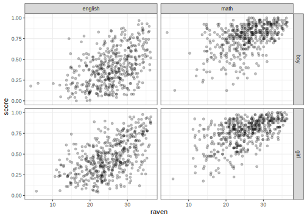
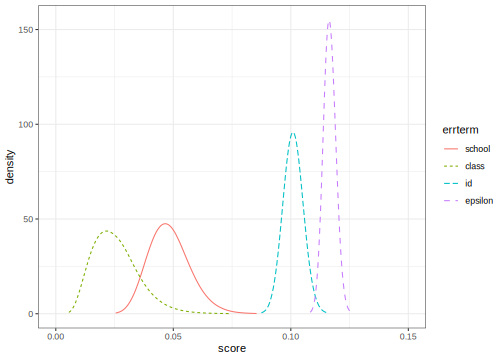
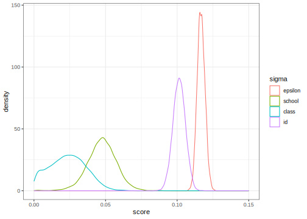
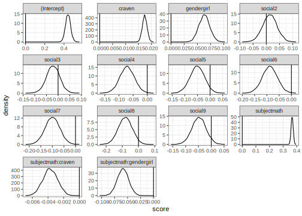
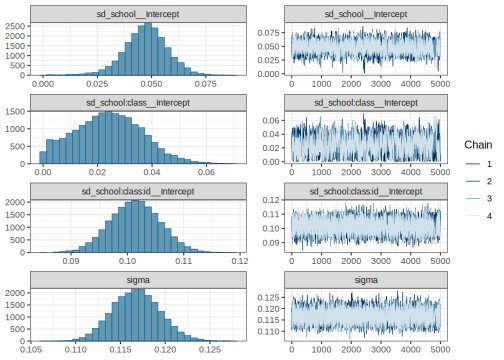

Multilevel Design
================
[Julian Faraway](https://julianfaraway.github.io/)
06 January 2023

- <a href="#data" id="toc-data">Data</a>
- <a href="#mixed-effect-model" id="toc-mixed-effect-model">Mixed Effect
  Model</a>
- <a href="#inla" id="toc-inla">INLA</a>
  - <a href="#informative-gamma-priors-on-the-precisions"
    id="toc-informative-gamma-priors-on-the-precisions">Informative Gamma
    priors on the precisions</a>
  - <a href="#penalized-complexity-prior"
    id="toc-penalized-complexity-prior">Penalized Complexity Prior</a>
- <a href="#stan" id="toc-stan">STAN</a>
  - <a href="#diagnostics" id="toc-diagnostics">Diagnostics</a>
  - <a href="#output-summary" id="toc-output-summary">Output Summary</a>
  - <a href="#posterior-distributions"
    id="toc-posterior-distributions">Posterior Distributions</a>
- <a href="#brms" id="toc-brms">BRMS</a>
- <a href="#mgcv" id="toc-mgcv">MGCV</a>
- <a href="#ginla" id="toc-ginla">GINLA</a>
- <a href="#discussion" id="toc-discussion">Discussion</a>
- <a href="#package-version-info" id="toc-package-version-info">Package
  version info</a>

See the [introduction](index.md) for an overview.

This example is discussed in more detail in my book [Extending the
Linear Model with R](https://julianfaraway.github.io/faraway/ELM/)

Required libraries:

``` r
library(faraway)
library(ggplot2)
library(lme4)
library(pbkrtest)
library(RLRsim)
library(INLA)
library(knitr)
library(rstan, quietly=TRUE)
library(brms)
library(mgcv)
```

# Data

[Read](jspmultilevel.md) about our analysis of some data from the Junior
Schools Project. In addition to a math test, students also took a test
in English. Although it would be possible to analyze the English test
results in the same way that we analyzed the math scores, additional
information may be obtained from analyzing them simultaneously. Hence we
view the data as having a bivariate response with English and math
scores for each student. The student is a nested factor within the class
which is in turn nested within the school. We express the multivariate
response for each individual by introducing an additional level of
nesting at the individual level. So we might view this as just another
nested model except that there is a fixed subject effect associated with
this lowest level of nesting.

We set up the data in a format with one test score per line with an
indicator `subject` identifying which type of test was taken. We scale
the English and math test scores by their maximum possible values, 40
and 100, respectively, to aid comparison:

``` r
data(jsp, package="faraway")
jspr <- jsp[jsp$year==2,]
mjspr <- data.frame(rbind(jspr[,1:6],jspr[,1:6]),
                    subject=factor(rep(c("english","math"),c(953,953))),  
                    score=c(jspr$english/100,jspr$math/40))
```

We can plot the data

``` r
ggplot(mjspr, aes(x=raven, y=score))+geom_jitter(alpha=0.25)+facet_grid(gender ~ subject)
```

<!-- -->

# Mixed Effect Model

We now fit a model for the data that includes all the variables of
interest that incorporates some of the interactions that we suspect
might be present. See [Extending the Linear Model with
R](https://julianfaraway.github.io/faraway/ELM/),

``` r
mjspr$craven <- mjspr$raven-mean(mjspr$raven)
mmod <- lmer(score ~ subject*gender + craven*subject + social + (1|school) + (1|school:class) + (1|school:class:id),mjspr)
faraway::sumary(mmod)
```

    Fixed Effects:
                           coef.est coef.se
    (Intercept)             0.44     0.03  
    subjectmath             0.37     0.01  
    gendergirl              0.06     0.01  
    craven                  0.02     0.00  
    social2                 0.01     0.03  
    social3                -0.02     0.03  
    social4                -0.07     0.03  
    social5                -0.05     0.03  
    social6                -0.09     0.03  
    social7                -0.10     0.03  
    social8                -0.08     0.04  
    social9                -0.05     0.03  
    subjectmath:gendergirl -0.06     0.01  
    subjectmath:craven      0.00     0.00  

    Random Effects:
     Groups          Name        Std.Dev.
     school:class:id (Intercept) 0.10    
     school:class    (Intercept) 0.02    
     school          (Intercept) 0.05    
     Residual                    0.12    
    ---
    number of obs: 1906, groups: school:class:id, 953; school:class, 90; school, 48
    AIC = -1705.6, DIC = -1951.1
    deviance = -1846.4 

The model being fit for school $i$, class $j$, student $k$ in subject
$l$ is: $$
\begin{aligned}
  score_{ijkl} =& subject_l + gender_k + raven_k + social_k +
  (subject \times gender)_{lk} +  \\ & (raven \times subject)_{lk} +
  school_i + class_j + student_k + \epsilon_{ijkl}
\end{aligned}
$$ where the Raven score has been mean centered and school, class and
student are random effects with the other terms, apart from $\epsilon$,
being fixed effects.

We can test some fixed effects:

``` r
mmod <- lmer(score ~ subject*gender+craven*subject+social+  (1|school)+(1|school:class)+(1|school:class:id),mjspr, REML=FALSE)
mmodr <- lmer(score ~ subject*gender+craven+subject+social+(1|school)+(1|school:class)+(1|school:class:id),mjspr, REML=FALSE)
KRmodcomp(mmod, mmodr)
```

    large : score ~ subject + gender + craven + social + (1 | school) + (1 | 
        school:class) + (1 | school:class:id) + subject:gender + 
        subject:craven
    small : score ~ subject * gender + craven + subject + social + (1 | school) + 
        (1 | school:class) + (1 | school:class:id)
          stat ndf ddf F.scaling p.value
    Ftest   16   1 950         1 6.9e-05

We are testing for a subject by gender interaction. We can see that this
effect is strongly statistically significant.

We can compute confidence intervals for the parameters:

``` r
set.seed(123)
confint(mmod, method="boot", oldNames=FALSE)
```

                                        2.5 %     97.5 %
    sd_(Intercept)|school:class:id  0.0903727  0.1085795
    sd_(Intercept)|school:class     0.0000000  0.0416423
    sd_(Intercept)|school           0.0235886  0.0599511
    sigma                           0.1110622  0.1206808
    (Intercept)                     0.3952423  0.4937078
    subjectmath                     0.3496975  0.3816522
    gendergirl                      0.0441439  0.0830535
    craven                          0.0156687  0.0192079
    social2                        -0.0384890  0.0660042
    social3                        -0.0810421  0.0348846
    social4                        -0.1211400 -0.0210216
    social5                        -0.1080110  0.0020657
    social6                        -0.1482613 -0.0270518
    social7                        -0.1574203 -0.0324216
    social8                        -0.1747016 -0.0057936
    social9                        -0.1033001  0.0065696
    subjectmath:gendergirl         -0.0797471 -0.0365518
    subjectmath:craven             -0.0057538 -0.0021502

The lower end of the class confidence interval is zero while the school
random effect is clearly larger. There is some variation associated with
individuals.

# INLA

Integrated nested Laplace approximation is a method of Bayesian
computation which uses approximation rather than simulation. More can be
found on this topic in [Bayesian Regression Modeling with
INLA](http://julianfaraway.github.io/brinla/) and the [chapter on
GLMMs](https://julianfaraway.github.io/brinlabook/chaglmm.html)

Use the most recent computational methodology:

``` r
inla.setOption(inla.mode="experimental")
inla.setOption("short.summary",TRUE)
```

Need to construct unique labels for nested factor levels of class and
student:

``` r
mjspr$school <- factor(mjspr$school)
mjspr$classch <- factor(paste(mjspr$school,mjspr$class,sep="."))
mjspr$classchid <- factor(paste(mjspr$school,mjspr$class,mjspr$id,sep="."))
```

``` r
formula <- score ~ subject*gender+craven*subject+social + f(school, model="iid") + f(classch, model="iid") + f(classchid, model="iid")
result <- inla(formula, family="gaussian", data=mjspr)
summary(result)
```

    Fixed effects:
                             mean    sd 0.025quant 0.5quant 0.975quant   mode kld
    (Intercept)             0.442 0.026      0.390    0.442      0.493  0.442   0
    subjectmath             0.367 0.008      0.351    0.367      0.382  0.367   0
    gendergirl              0.064 0.010      0.044    0.064      0.084  0.064   0
    craven                  0.017 0.001      0.016    0.017      0.019  0.017   0
    social2                 0.014 0.027     -0.039    0.014      0.067  0.014   0
    social3                -0.021 0.029     -0.078   -0.021      0.036 -0.021   0
    social4                -0.071 0.026     -0.122   -0.071     -0.021 -0.071   0
    social5                -0.050 0.029     -0.107   -0.050      0.006 -0.050   0
    social6                -0.089 0.031     -0.149   -0.089     -0.029 -0.089   0
    social7                -0.100 0.032     -0.162   -0.100     -0.038 -0.100   0
    social8                -0.082 0.042     -0.165   -0.082      0.001 -0.082   0
    social9                -0.048 0.027     -0.102   -0.048      0.006 -0.048   0
    subjectmath:gendergirl -0.059 0.011     -0.080   -0.059     -0.038 -0.059   0
    subjectmath:craven     -0.004 0.001     -0.006   -0.004     -0.002 -0.004   0

    Model hyperparameters:
                                                mean       sd 0.025quant 0.5quant 0.975quant    mode
    Precision for the Gaussian observations    73.61     3.38      67.11    73.56      80.44   73.49
    Precision for school                      418.85   129.75     181.64   411.67     671.79  405.43
    Precision for classch                   14210.33 43224.49    1097.46  5304.42   87203.49 1793.65
    Precision for classchid                    96.52     7.30      82.24    96.50     111.00   96.94

     is computed 

Maybe OK but let’s try some more informative priors.

## Informative Gamma priors on the precisions

Now try more informative gamma priors for the precisions. Define it so
the mean value of gamma prior is set to the inverse of the variance of
the residuals of the fixed-effects only model. We expect the error
variances to be lower than this variance so this is an overestimate. The
variance of the gamma prior (for the precision) is controlled by the
`apar` parameter.

``` r
apar <- 0.5
lmod <- lm(score ~ subject*gender+craven*subject+social,mjspr)
bpar <- apar*var(residuals(lmod))
lgprior <- list(prec = list(prior="loggamma", param = c(apar,bpar)))
formula = score ~ subject*gender+craven*subject+social+f(school, model="iid", hyper = lgprior)+f(classch, model="iid", hyper = lgprior)+f(classchid, model="iid", hyper = lgprior)
result <- inla(formula, family="gaussian", data=mjspr)
summary(result)
```

    Fixed effects:
                             mean    sd 0.025quant 0.5quant 0.975quant   mode kld
    (Intercept)             0.441 0.027      0.387    0.441      0.495  0.441   0
    subjectmath             0.367 0.008      0.351    0.367      0.382  0.367   0
    gendergirl              0.062 0.010      0.042    0.062      0.082  0.062   0
    craven                  0.017 0.001      0.016    0.017      0.019  0.017   0
    social2                 0.013 0.028     -0.041    0.013      0.067  0.013   0
    social3                -0.020 0.029     -0.077   -0.020      0.038 -0.020   0
    social4                -0.069 0.026     -0.120   -0.069     -0.018 -0.069   0
    social5                -0.050 0.029     -0.108   -0.050      0.007 -0.050   0
    social6                -0.085 0.031     -0.146   -0.085     -0.024 -0.085   0
    social7                -0.098 0.032     -0.161   -0.098     -0.036 -0.098   0
    social8                -0.080 0.043     -0.164   -0.080      0.004 -0.080   0
    social9                -0.046 0.028     -0.101   -0.046      0.008 -0.046   0
    subjectmath:gendergirl -0.059 0.011     -0.080   -0.059     -0.038 -0.059   0
    subjectmath:craven     -0.004 0.001     -0.006   -0.004     -0.002 -0.004   0

    Model hyperparameters:
                                              mean     sd 0.025quant 0.5quant 0.975quant   mode
    Precision for the Gaussian observations  73.78   3.38      67.31    73.72      80.61  73.62
    Precision for school                    367.26 112.60     193.27   351.60     632.55 322.34
    Precision for classch                   473.37 133.13     263.72   456.02     783.90 423.35
    Precision for classchid                  99.80   8.55      84.21    99.36     117.87  98.37

     is computed 

Compute the transforms to an SD scale for the field and error. Make a
table of summary statistics for the posteriors:

``` r
sigmaschool <- inla.tmarginal(function(x) 1/sqrt(exp(x)),result$internal.marginals.hyperpar[[2]])
sigmaclass <- inla.tmarginal(function(x) 1/sqrt(exp(x)),result$internal.marginals.hyperpar[[3]])
sigmaid <- inla.tmarginal(function(x) 1/sqrt(exp(x)),result$internal.marginals.hyperpar[[4]])
sigmaepsilon <- inla.tmarginal(function(x) 1/sqrt(exp(x)),result$internal.marginals.hyperpar[[1]])
restab=sapply(result$marginals.fixed, function(x) inla.zmarginal(x,silent=TRUE))
restab=cbind(restab, inla.zmarginal(sigmaschool,silent=TRUE))
restab=cbind(restab, inla.zmarginal(sigmaclass,silent=TRUE))
restab=cbind(restab, inla.zmarginal(sigmaid,silent=TRUE))
restab=cbind(restab, inla.zmarginal(sigmaepsilon,silent=TRUE))
colnames(restab) = c(names(lmod$coef),"school","class","id","epsilon")
data.frame(restab)
```

               X.Intercept. subjectmath gendergirl     craven    social2     social3   social4   social5   social6
    mean            0.44092     0.36656   0.062025    0.01735   0.013317   -0.019764 -0.068989 -0.050492 -0.085273
    sd             0.027403   0.0077025   0.010284 0.00093429   0.027504    0.029309  0.026179  0.029123  0.031004
    quant0.025      0.38713     0.35145   0.041843   0.015517  -0.040668   -0.077295  -0.12038  -0.10766  -0.14614
    quant0.25       0.42239     0.36135   0.055067   0.016718 -0.0052859   -0.039588 -0.086696  -0.07019  -0.10624
    quant0.5        0.44087     0.36655   0.062003   0.017348   0.013259   -0.019826 -0.069044 -0.050554 -0.085336
    quant0.75       0.45934     0.37174   0.068939   0.017978   0.031804 -6.3476e-05 -0.051392 -0.030917 -0.064432
    quant0.975       0.4946     0.38165    0.08217    0.01918   0.067192    0.037645 -0.017711 0.0065533 -0.024549
                 social7   social8   social9 subjectmath.gendergirl subjectmath.craven    school     class        id
    mean       -0.098472  -0.08022 -0.046173              -0.059194         -0.0037203  0.053973  0.047292   0.10037
    sd          0.031979  0.042735  0.027725               0.010696         0.00092951 0.0081267 0.0065314 0.0042548
    quant0.025  -0.16125  -0.16411   -0.1006              -0.080189         -0.0055448  0.039858  0.035797  0.092174
    quant0.25    -0.1201  -0.10912 -0.064925              -0.066428          -0.004349  0.048197  0.042663   0.09745
    quant0.5   -0.098538 -0.080309 -0.046231              -0.059217         -0.0037222  0.053312  0.046815   0.10032
    quant0.75  -0.076976 -0.051494 -0.027536              -0.052005         -0.0030955  0.059031  0.051399   0.10322
    quant0.975 -0.035836  0.003486 0.0081337              -0.038244         -0.0018996  0.071718   0.06141   0.10888
                 epsilon
    mean         0.11651
    sd         0.0026509
    quant0.025   0.11142
    quant0.25    0.11469
    quant0.5     0.11646
    quant0.75    0.11828
    quant0.975   0.12183

Also construct a plot of the SD posteriors:

``` r
ddf <- data.frame(rbind(sigmaschool,sigmaclass,sigmaid,sigmaepsilon),
                  errterm=gl(4,nrow(sigmaepsilon),
                             labels = c("school","class","id","epsilon")))
ggplot(ddf, aes(x,y, linetype=errterm, color=errterm))+geom_line()+xlab("score")+ylab("density")+xlim(0,0.15)
```

<!-- -->

Posteriors for the school and class assign no weight to values close to
zero.

## Penalized Complexity Prior

In [Simpson et al (2015)](http://arxiv.org/abs/1403.4630v3), penalized
complexity priors are proposed. This requires that we specify a scaling
for the SDs of the random effects. We use the SD of the residuals of the
fixed effects only model (what might be called the base model in the
paper) to provide this scaling.

``` r
lmod <- lm(score ~ subject*gender+craven*subject+social,mjspr)
sdres <- sd(residuals(lmod))
pcprior <- list(prec = list(prior="pc.prec", param = c(3*sdres,0.01)))
formula = score ~ subject*gender+craven*subject+social+f(school, model="iid", hyper = pcprior)+f(classch, model="iid", hyper = pcprior)+f(classchid, model="iid", hyper = pcprior)
result <- inla(formula, family="gaussian", data=mjspr)
summary(result)
```

    Fixed effects:
                             mean    sd 0.025quant 0.5quant 0.975quant   mode kld
    (Intercept)             0.441 0.027      0.389    0.441      0.494  0.441   0
    subjectmath             0.367 0.008      0.351    0.367      0.382  0.367   0
    gendergirl              0.063 0.010      0.043    0.063      0.083  0.063   0
    craven                  0.017 0.001      0.016    0.017      0.019  0.017   0
    social2                 0.014 0.027     -0.040    0.014      0.067  0.014   0
    social3                -0.021 0.029     -0.078   -0.021      0.036 -0.021   0
    social4                -0.070 0.026     -0.121   -0.070     -0.020 -0.070   0
    social5                -0.050 0.029     -0.107   -0.050      0.006 -0.050   0
    social6                -0.088 0.031     -0.148   -0.088     -0.027 -0.088   0
    social7                -0.099 0.032     -0.161   -0.099     -0.037 -0.099   0
    social8                -0.081 0.042     -0.165   -0.081      0.002 -0.081   0
    social9                -0.047 0.028     -0.101   -0.047      0.007 -0.047   0
    subjectmath:gendergirl -0.059 0.011     -0.080   -0.059     -0.038 -0.059   0
    subjectmath:craven     -0.004 0.001     -0.006   -0.004     -0.002 -0.004   0

    Model hyperparameters:
                                               mean      sd 0.025quant 0.5quant 0.975quant    mode
    Precision for the Gaussian observations   73.67    3.38      67.25    73.58      80.57   73.39
    Precision for school                     412.31  131.39     204.31   395.84     716.83  364.90
    Precision for classch                   5411.85 8091.11     739.90  3116.42   24907.73 1484.85
    Precision for classchid                   97.71    8.25      82.58    97.32     115.06   96.48

     is computed 

Compute the summaries as before:

``` r
sigmaschool <- inla.tmarginal(function(x) 1/sqrt(exp(x)),result$internal.marginals.hyperpar[[2]])
sigmaclass <- inla.tmarginal(function(x) 1/sqrt(exp(x)),result$internal.marginals.hyperpar[[3]])
sigmaid <- inla.tmarginal(function(x) 1/sqrt(exp(x)),result$internal.marginals.hyperpar[[4]])
sigmaepsilon <- inla.tmarginal(function(x) 1/sqrt(exp(x)),result$internal.marginals.hyperpar[[1]])
restab=sapply(result$marginals.fixed, function(x) inla.zmarginal(x,silent=TRUE))
restab=cbind(restab, inla.zmarginal(sigmaschool,silent=TRUE))
restab=cbind(restab, inla.zmarginal(sigmaclass,silent=TRUE))
restab=cbind(restab, inla.zmarginal(sigmaid,silent=TRUE))
restab=cbind(restab, inla.zmarginal(sigmaepsilon,silent=TRUE))
colnames(restab) = c(names(lmod$coef),"school","class","id","epsilon")
data.frame(restab)
```

               X.Intercept. subjectmath gendergirl     craven  social2    social3   social4   social5   social6   social7
    mean            0.44146     0.36656   0.063242   0.017388 0.013804  -0.020589 -0.070472 -0.050412 -0.087583 -0.099294
    sd               0.0266   0.0077092   0.010278 0.00092627 0.027283   0.029036  0.025932  0.028876  0.030755  0.031691
    quant0.025      0.38924     0.35143   0.043073    0.01557 -0.03975  -0.077584  -0.12137  -0.10709  -0.14796   -0.1615
    quant0.25       0.42347     0.36135   0.056287   0.016761 -0.00465   -0.04023 -0.088012 -0.069944  -0.10838  -0.12073
    quant0.5        0.44141     0.36655   0.063219   0.017386 0.013747   -0.02065 -0.070526 -0.050472 -0.087645 -0.099359
    quant0.75       0.45934     0.37175   0.070151   0.018011 0.032144 -0.0010709  -0.05304 -0.031001 -0.066908  -0.07799
    quant0.975      0.49356     0.38166   0.083375   0.019202 0.067246   0.036286 -0.019679   0.00615 -0.027347 -0.037223
                 social8   social9 subjectmath.gendergirl subjectmath.craven    school    class        id   epsilon
    mean       -0.081413 -0.047174              -0.059194         -0.0037203  0.051128 0.018925   0.10143    0.1166
    sd          0.042437  0.027502               0.010705         0.00093031 0.0082355 0.007883 0.0042421 0.0026571
    quant0.025  -0.16472  -0.10116              -0.080207         -0.0055464  0.037452 0.006418  0.093292   0.11145
    quant0.25   -0.11012 -0.065776              -0.066435         -0.0043496  0.045239 0.012943  0.098514   0.11478
    quant0.5   -0.081501 -0.047231              -0.059217         -0.0037222   0.05021 0.018086   0.10136   0.11657
    quant0.75  -0.052886 -0.028687              -0.051998         -0.0030949   0.05608 0.023924   0.10426   0.11838
    quant0.975 0.0017069 0.0066922              -0.038227         -0.0018981  0.069695 0.036409   0.10995   0.12188

Make the plots:

``` r
ddf <- data.frame(rbind(sigmaschool,sigmaclass,sigmaid,sigmaepsilon),
                  errterm=gl(4,nrow(sigmaepsilon),
                             labels = c("school","class","id","epsilon")))
ggplot(ddf, aes(x,y, linetype=errterm, color=errterm))+geom_line()+xlab("score")+ylab("density")+xlim(0,0.15)
```

<!-- -->

Class variation is quite small compared to the other sources.

# STAN

[STAN](https://mc-stan.org/) performs Bayesian inference using MCMC. Set
up STAN to use multiple cores. Set the random number seed for
reproducibility.

``` r
rstan_options(auto_write = TRUE)
options(mc.cores = parallel::detectCores())
```

Fit the model. Requires use of STAN command file
[multiple.stan](../stancode/multiple.stan). We view the code here:

``` r
writeLines(readLines("../stancode/multiple.stan"))
```

    data {
         int<lower=0> Nobs;
         int<lower=0> Npreds;
         int<lower=0> Nlev1;
         int<lower=0> Nlev2;
         int<lower=0> Nlev3;
         vector[Nobs] y;
         matrix[Nobs,Npreds] x;
         int<lower=1,upper=Nlev1> levind1[Nobs];
         int<lower=1,upper=Nlev2> levind2[Nobs];
         int<lower=1,upper=Nlev3> levind3[Nobs];
         real<lower=0> sdscal;
    }
    parameters {
               vector[Npreds] beta;
               real<lower=0> sigmalev1;
               real<lower=0> sigmalev2;
               real<lower=0> sigmalev3;
               real<lower=0> sigmaeps;

               vector[Nlev1] eta1;
               vector[Nlev2] eta2;
               vector[Nlev3] eta3;
    }
    transformed parameters {
      vector[Nlev1] ran1;
      vector[Nlev2] ran2;
      vector[Nlev3] ran3;
      vector[Nobs] yhat;

      ran1  = sigmalev1 * eta1;
      ran2  = sigmalev2 * eta2;
      ran3  = sigmalev3 * eta3;

      for (i in 1:Nobs)
        yhat[i] = x[i]*beta+ran1[levind1[i]]+ran2[levind2[i]]+ran3[levind3[i]];

    }
    model {
      eta1 ~ normal(0, 1);
      eta2 ~ normal(0, 1);
      eta3 ~ normal(0, 1);
      sigmalev1 ~ cauchy(0, 2.5*sdscal);
      sigmalev2 ~ cauchy(0, 2.5*sdscal);
      sigmalev3 ~ cauchy(0, 2.5*sdscal);
      sigmaeps ~ cauchy(0, 2.5*sdscal);
      y ~ normal(yhat, sigmaeps);
    }

We have used uninformative priors for the treatment effects but slightly
informative half-cauchy priors for the variances. All the fixed effects
have been collected into a single design matrix. The school and class
variables need to be renumbered into consecutive positive integers.
Somewhat inconvenient since the schools are numbered up to 50 but have
no data for two schools so only 48 schools are actually used.

``` r
mjspr$craven <- mjspr$raven-mean(mjspr$raven)
lmod <- lm(score ~ subject*gender+craven*subject+social,mjspr)
sdscal <- sd(residuals(lmod))
Xmatrix <- model.matrix(lmod)
mjspr$school <- factor(mjspr$school)
mjspr$classch <- factor(paste(mjspr$school,mjspr$class,sep="."))
mjspr$classchid <- factor(paste(mjspr$school,mjspr$class,mjspr$id,sep="."))
jspdat <- list(Nobs=nrow(mjspr),
               Npreds=ncol(Xmatrix),
               Nlev1=length(unique(mjspr$school)),
               Nlev2=length(unique(mjspr$classch)),
               Nlev3=length(unique(mjspr$classchid)),
               y=mjspr$score,
               x=Xmatrix,
               levind1=as.numeric(mjspr$school),
               levind2=as.numeric(mjspr$classch),
               levind3=as.numeric(mjspr$classchid),
               sdscal=sdscal)
```

Break the fitting of the model into three steps. We use 5x the default
number of iterations to ensure sufficient sample size for the later
estimations.

``` r
rt <- stanc("../stancode/multiple.stan")
sm <- stan_model(stanc_ret = rt, verbose=FALSE)
set.seed(123)
system.time(fit <- sampling(sm, data=jspdat, iter=10000))
```

       user  system elapsed 
    670.801  24.611 248.132 

## Diagnostics

For the error SD:

``` r
pname <- "sigmaeps"
muc <- rstan::extract(fit, pars=pname,  permuted=FALSE, inc_warmup=FALSE)
mdf <- reshape2::melt(muc)
ggplot(mdf,aes(x=iterations,y=value,color=chains)) + geom_line() + ylab(mdf$parameters[1])
```

<!-- -->

For the school SD

``` r
pname <- "sigmalev1"
muc <- rstan::extract(fit, pars=pname,  permuted=FALSE, inc_warmup=FALSE)
mdf <- reshape2::melt(muc)
ggplot(mdf,aes(x=iterations,y=value,color=chains)) + geom_line() + ylab(mdf$parameters[1])
```

<!-- -->

For the class SD

``` r
pname <- "sigmalev2"
muc <- rstan::extract(fit, pars=pname,  permuted=FALSE, inc_warmup=FALSE)
mdf <- reshape2::melt(muc)
ggplot(mdf,aes(x=iterations,y=value,color=chains)) + geom_line() + ylab(mdf$parameters[1])
```

<!-- -->

For the id SD

``` r
pname <- "sigmalev3"
muc <- rstan::extract(fit, pars=pname,  permuted=FALSE, inc_warmup=FALSE)
mdf <- reshape2::melt(muc)
ggplot(mdf,aes(x=iterations,y=value,color=chains)) + geom_line() + ylab(mdf$parameters[1])
```

<!-- -->

All these are satisfactory.

## Output Summary

Examine the main parameters of interest:

``` r
print(fit,pars=c("beta","sigmalev1","sigmalev2","sigmalev2","sigmaeps"))
```

    Inference for Stan model: multiple.
    4 chains, each with iter=10000; warmup=5000; thin=1; 
    post-warmup draws per chain=5000, total post-warmup draws=20000.

               mean se_mean   sd  2.5%   25%   50%   75% 97.5% n_eff Rhat
    beta[1]    0.44       0 0.03  0.39  0.42  0.44  0.46  0.49  4703    1
    beta[2]    0.37       0 0.01  0.35  0.36  0.37  0.37  0.38 22269    1
    beta[3]    0.06       0 0.01  0.04  0.06  0.06  0.07  0.08 15107    1
    beta[4]    0.02       0 0.00  0.02  0.02  0.02  0.02  0.02 21172    1
    beta[5]    0.01       0 0.03 -0.04  0.00  0.01  0.03  0.07  4939    1
    beta[6]   -0.02       0 0.03 -0.08 -0.04 -0.02  0.00  0.04  5047    1
    beta[7]   -0.07       0 0.03 -0.12 -0.09 -0.07 -0.05 -0.02  4464    1
    beta[8]   -0.05       0 0.03 -0.11 -0.07 -0.05 -0.03  0.01  5148    1
    beta[9]   -0.09       0 0.03 -0.15 -0.11 -0.09 -0.07 -0.03  5220    1
    beta[10]  -0.10       0 0.03 -0.16 -0.12 -0.10 -0.08 -0.04  5677    1
    beta[11]  -0.08       0 0.04 -0.16 -0.11 -0.08 -0.05  0.00  7628    1
    beta[12]  -0.05       0 0.03 -0.10 -0.07 -0.05 -0.03  0.01  4721    1
    beta[13]  -0.06       0 0.01 -0.08 -0.07 -0.06 -0.05 -0.04 22953    1
    beta[14]   0.00       0 0.00 -0.01  0.00  0.00  0.00  0.00 33522    1
    sigmalev1  0.05       0 0.01  0.03  0.04  0.05  0.05  0.07  2681    1
    sigmalev2  0.02       0 0.01  0.00  0.01  0.02  0.03  0.05  1374    1
    sigmaeps   0.12       0 0.00  0.11  0.11  0.12  0.12  0.12  8110    1

    Samples were drawn using NUTS(diag_e) at Fri Jan  6 10:46:26 2023.
    For each parameter, n_eff is a crude measure of effective sample size,
    and Rhat is the potential scale reduction factor on split chains (at 
    convergence, Rhat=1).

Remember that the beta correspond to the following parameters:

``` r
colnames(Xmatrix)
```

     [1] "(Intercept)"            "subjectmath"            "gendergirl"             "craven"                
     [5] "social2"                "social3"                "social4"                "social5"               
     [9] "social6"                "social7"                "social8"                "social9"               
    [13] "subjectmath:gendergirl" "subjectmath:craven"    

The results are comparable to the REML fit. The effective sample sizes
are sufficient.

## Posterior Distributions

We can use extract to get at various components of the STAN fit. First
consider the SDs for random components:

``` r
postsig <- rstan::extract(fit, pars=c("sigmaeps","sigmalev1","sigmalev2","sigmalev3"))
ref <- reshape2::melt(postsig,value.name="score")
ref$L1 = factor(ref$L1)
levels(ref$L1) = c("epsilon","school","class","id")
ggplot(data=ref,aes(x=score, color=L1))+geom_density()+guides(color=guide_legend(title="SD"))
```

<!-- -->

As usual the error SD distribution is more concentrated. The class SD is
more diffuse, smaller and gives some weight to values close to zero. Now
the treatment effects:

``` r
ref <- reshape2::melt(rstan::extract(fit, pars="beta"))
colnames(ref)[2:3] <- c("parameter","score")
ref$parameter <- factor(colnames(Xmatrix)[ref$parameter])
ggplot(ref, aes(x=score))+geom_density()+geom_vline(xintercept = 0) + facet_wrap(~parameter,scales="free")
```

<!-- -->

# BRMS

[BRMS](https://paul-buerkner.github.io/brms/) stands for Bayesian
Regression Models with STAN. It provides a convenient wrapper to STAN
functionality. We specify the model as in `lmer()` above. I have used
more than the standard number of iterations because this reduces some
problems and does not cost much computationally.

``` r
suppressMessages(bmod <- brm(score ~ subject*gender + craven*subject + social + (1|school) + (1|school:class) + (1|school:class:id),data=mjspr,iter=10000, cores=4))
```

We get some minor warnings. We can obtain some posterior densities and
diagnostics with:

``` r
plot(bmod, variable = "^s", regex=TRUE)
```

<!-- -->

We have chosen only the random effect hyperparameters since this is
where problems will appear first. Looks OK. We can see some weight is
given to values of the class effect SD close to zero.

We can look at the STAN code that `brms` used with:

``` r
stancode(bmod)
```

    // generated with brms 2.18.0
    functions {
    }
    data {
      int<lower=1> N;  // total number of observations
      vector[N] Y;  // response variable
      int<lower=1> K;  // number of population-level effects
      matrix[N, K] X;  // population-level design matrix
      // data for group-level effects of ID 1
      int<lower=1> N_1;  // number of grouping levels
      int<lower=1> M_1;  // number of coefficients per level
      int<lower=1> J_1[N];  // grouping indicator per observation
      // group-level predictor values
      vector[N] Z_1_1;
      // data for group-level effects of ID 2
      int<lower=1> N_2;  // number of grouping levels
      int<lower=1> M_2;  // number of coefficients per level
      int<lower=1> J_2[N];  // grouping indicator per observation
      // group-level predictor values
      vector[N] Z_2_1;
      // data for group-level effects of ID 3
      int<lower=1> N_3;  // number of grouping levels
      int<lower=1> M_3;  // number of coefficients per level
      int<lower=1> J_3[N];  // grouping indicator per observation
      // group-level predictor values
      vector[N] Z_3_1;
      int prior_only;  // should the likelihood be ignored?
    }
    transformed data {
      int Kc = K - 1;
      matrix[N, Kc] Xc;  // centered version of X without an intercept
      vector[Kc] means_X;  // column means of X before centering
      for (i in 2:K) {
        means_X[i - 1] = mean(X[, i]);
        Xc[, i - 1] = X[, i] - means_X[i - 1];
      }
    }
    parameters {
      vector[Kc] b;  // population-level effects
      real Intercept;  // temporary intercept for centered predictors
      real<lower=0> sigma;  // dispersion parameter
      vector<lower=0>[M_1] sd_1;  // group-level standard deviations
      vector[N_1] z_1[M_1];  // standardized group-level effects
      vector<lower=0>[M_2] sd_2;  // group-level standard deviations
      vector[N_2] z_2[M_2];  // standardized group-level effects
      vector<lower=0>[M_3] sd_3;  // group-level standard deviations
      vector[N_3] z_3[M_3];  // standardized group-level effects
    }
    transformed parameters {
      vector[N_1] r_1_1;  // actual group-level effects
      vector[N_2] r_2_1;  // actual group-level effects
      vector[N_3] r_3_1;  // actual group-level effects
      real lprior = 0;  // prior contributions to the log posterior
      r_1_1 = (sd_1[1] * (z_1[1]));
      r_2_1 = (sd_2[1] * (z_2[1]));
      r_3_1 = (sd_3[1] * (z_3[1]));
      lprior += student_t_lpdf(Intercept | 3, 0.6, 2.5);
      lprior += student_t_lpdf(sigma | 3, 0, 2.5)
        - 1 * student_t_lccdf(0 | 3, 0, 2.5);
      lprior += student_t_lpdf(sd_1 | 3, 0, 2.5)
        - 1 * student_t_lccdf(0 | 3, 0, 2.5);
      lprior += student_t_lpdf(sd_2 | 3, 0, 2.5)
        - 1 * student_t_lccdf(0 | 3, 0, 2.5);
      lprior += student_t_lpdf(sd_3 | 3, 0, 2.5)
        - 1 * student_t_lccdf(0 | 3, 0, 2.5);
    }
    model {
      // likelihood including constants
      if (!prior_only) {
        // initialize linear predictor term
        vector[N] mu = rep_vector(0.0, N);
        mu += Intercept;
        for (n in 1:N) {
          // add more terms to the linear predictor
          mu[n] += r_1_1[J_1[n]] * Z_1_1[n] + r_2_1[J_2[n]] * Z_2_1[n] + r_3_1[J_3[n]] * Z_3_1[n];
        }
        target += normal_id_glm_lpdf(Y | Xc, mu, b, sigma);
      }
      // priors including constants
      target += lprior;
      target += std_normal_lpdf(z_1[1]);
      target += std_normal_lpdf(z_2[1]);
      target += std_normal_lpdf(z_3[1]);
    }
    generated quantities {
      // actual population-level intercept
      real b_Intercept = Intercept - dot_product(means_X, b);
    }

We see that `brms` is using student t distributions with 3 degrees of
freedom for the priors. For the three error SDs, this will be truncated
at zero to form half-t distributions. You can get a more explicit
description of the priors with `prior_summary(bmod)`. These are
qualitatively similar to the the PC prior used in the INLA fit.

We examine the fit:

``` r
summary(bmod)
```

     Family: gaussian 
      Links: mu = identity; sigma = identity 
    Formula: score ~ subject * gender + craven * subject + social + (1 | school) + (1 | school:class) + (1 | school:class:id) 
       Data: mjspr (Number of observations: 1906) 
      Draws: 4 chains, each with iter = 10000; warmup = 5000; thin = 1;
             total post-warmup draws = 20000

    Group-Level Effects: 
    ~school (Number of levels: 48) 
                  Estimate Est.Error l-95% CI u-95% CI Rhat Bulk_ESS Tail_ESS
    sd(Intercept)     0.05      0.01     0.02     0.07 1.01     1076      524

    ~school:class (Number of levels: 90) 
                  Estimate Est.Error l-95% CI u-95% CI Rhat Bulk_ESS Tail_ESS
    sd(Intercept)     0.02      0.01     0.00     0.05 1.01      853      612

    ~school:class:id (Number of levels: 953) 
                  Estimate Est.Error l-95% CI u-95% CI Rhat Bulk_ESS Tail_ESS
    sd(Intercept)     0.10      0.00     0.09     0.11 1.00     3700     7429

    Population-Level Effects: 
                           Estimate Est.Error l-95% CI u-95% CI Rhat Bulk_ESS Tail_ESS
    Intercept                  0.44      0.03     0.39     0.49 1.00     3577     5953
    subjectmath                0.37      0.01     0.35     0.38 1.00    12670    14306
    gendergirl                 0.06      0.01     0.04     0.08 1.00     8311    10174
    craven                     0.02      0.00     0.02     0.02 1.00    12032    13873
    social2                    0.01      0.03    -0.04     0.07 1.00     3634     6670
    social3                   -0.02      0.03    -0.08     0.04 1.00     3897     7206
    social4                   -0.07      0.03    -0.12    -0.02 1.00     3381     6115
    social5                   -0.05      0.03    -0.11     0.01 1.00     3805     7224
    social6                   -0.09      0.03    -0.15    -0.03 1.00     4037     7403
    social7                   -0.10      0.03    -0.16    -0.04 1.00     3881     7358
    social8                   -0.08      0.04    -0.16    -0.00 1.00     5633     9493
    social9                   -0.05      0.03    -0.10     0.01 1.00     3601     6673
    subjectmath:gendergirl    -0.06      0.01    -0.08    -0.04 1.00     9947    10819
    subjectmath:craven        -0.00      0.00    -0.01    -0.00 1.00    33301    14201

    Family Specific Parameters: 
          Estimate Est.Error l-95% CI u-95% CI Rhat Bulk_ESS Tail_ESS
    sigma     0.12      0.00     0.11     0.12 1.00     6693    10845

    Draws were sampled using sampling(NUTS). For each parameter, Bulk_ESS
    and Tail_ESS are effective sample size measures, and Rhat is the potential
    scale reduction factor on split chains (at convergence, Rhat = 1).

The results are consistent with those seen previously.

# MGCV

It is possible to fit some GLMMs within the GAM framework of the `mgcv`
package. An explanation of this can be found in this
[blog](https://fromthebottomoftheheap.net/2021/02/02/random-effects-in-gams/)

``` r
gmod = gam(score ~ subject*gender + craven*subject + social +
            s(school,bs="re") + 
            s(classch,bs="re") + 
            s(classchid,bs="re"),
            data=mjspr, method="REML")
```

and look at the summary output:

``` r
summary(gmod)
```


    Family: gaussian 
    Link function: identity 

    Formula:
    score ~ subject * gender + craven * subject + social + s(school, 
        bs = "re") + s(classch, bs = "re") + s(classchid, bs = "re")

    Parametric coefficients:
                            Estimate Std. Error t value Pr(>|t|)
    (Intercept)             0.441578   0.026459   16.69  < 2e-16
    subjectmath             0.366565   0.007710   47.54  < 2e-16
    gendergirl              0.063351   0.010254    6.18  8.6e-10
    craven                  0.017390   0.000925   18.81  < 2e-16
    social2                 0.013754   0.027230    0.51   0.6136
    social3                -0.020768   0.028972   -0.72   0.4736
    social4                -0.070708   0.025868   -2.73   0.0064
    social5                -0.050474   0.028818   -1.75   0.0801
    social6                -0.087852   0.030672   -2.86   0.0042
    social7                -0.099408   0.031607   -3.15   0.0017
    social8                -0.081623   0.042352   -1.93   0.0542
    social9                -0.047337   0.027445   -1.72   0.0848
    subjectmath:gendergirl -0.059194   0.010706   -5.53  3.9e-08
    subjectmath:craven     -0.003720   0.000930   -4.00  6.7e-05

    Approximate significance of smooth terms:
                   edf Ref.df     F p-value
    s(school)     28.8     47 14.86  <2e-16
    s(classch)    14.2     89  0.89    0.22
    s(classchid) 540.6    942  1.54  <2e-16

    R-sq.(adj) =  0.794   Deviance explained = 85.8%
    -REML = -870.79  Scale est. = 0.013592  n = 1906

We get the fixed effect estimates. We also get tests on the random
effects (as described in this
[article](https://doi.org/10.1093/biomet/ast038). The hypothesis of no
variation is rejected for the school and id but not for the class. This
is consistent with earlier findings.

We can get an estimate of the operator and error SD:

``` r
gam.vcomp(gmod)
```


    Standard deviations and 0.95 confidence intervals:

                  std.dev     lower    upper
    s(school)    0.047230 0.0324228 0.068801
    s(classch)   0.024123 0.0089072 0.065330
    s(classchid) 0.101253 0.0930705 0.110154
    scale        0.116583 0.1114571 0.121945

    Rank: 4/4

The point estimates are the same as the REML estimates from `lmer`
earlier. The confidence intervals are different. A bootstrap method was
used for the `lmer` fit whereas `gam` is using an asymptotic
approximation resulting in substantially different results. Given the
problems of parameters on the boundary present in this example, the
bootstrap results appear more trustworthy.

The fixed effect estimates can be found with:

``` r
coef(gmod)[1:14]
```

               (Intercept)            subjectmath             gendergirl                 craven                social2 
                 0.4415780              0.3665647              0.0633509              0.0173905              0.0137536 
                   social3                social4                social5                social6                social7 
                -0.0207677             -0.0707076             -0.0504741             -0.0878520             -0.0994077 
                   social8                social9 subjectmath:gendergirl     subjectmath:craven 
                -0.0816234             -0.0473366             -0.0591943             -0.0037203 

The remaining random effects are too numerous to print.

# GINLA

In [Wood (2019)](https://doi.org/10.1093/biomet/asz044), a simplified
version of INLA is proposed. The first construct the GAM model without
fitting and then use the `ginla()` function to perform the computation.

``` r
gmod = gam(score ~ subject*gender + craven*subject + social +
            s(school,bs="re") + 
            s(classch,bs="re") + 
            s(classchid,bs="re"),
            data=mjspr, fit = FALSE)
gimod = ginla(gmod)
```

We get the posterior density for the intercept as:

``` r
plot(gimod$beta[1,],gimod$density[1,],type="l",xlab="score",ylab="density")
```

<!-- -->

We get the posterior density for the math effect as:

``` r
plot(gimod$beta[2,],gimod$density[2,],type="l",xlab="score",ylab="density")
```

<!-- -->

and for the social effects as:

``` r
xmat = t(gimod$beta[5:12,])
ymat = t(gimod$density[5:12,])
matplot(xmat, ymat,type="l",xlab="score",ylab="density")
legend("left",paste0("social",2:9),col=1:8,lty=1:8)
```

<!-- -->

We can see some overlap between the effects, but strong evidence of a
negative outcome relative to social class 1 for some classes.

It is not straightforward to obtain the posterior densities of the
hyperparameters.

# Discussion

See the [Discussion of the single random effect
model](pulp.md#Discussion) for general comments.

- As with the previous analyses, sometimes the INLA posteriors for the
  hyperparameters have densities which do not give weight to
  close-to-zero values where other analyses suggest this might be
  reasonable.

- There is relatively little disagreement between the methods and much
  similarity.

- There were no major computational issue with the analyses (in contrast
  with some of the other examples)

- The `mgcv` analyses (both standard and ginla) took much longer than
  previous analyses because the sample size is larger and there are a
  large number of random effects — slower than any of the other
  analyses.

# Package version info

``` r
sessionInfo()
```

    R version 4.2.1 (2022-06-23)
    Platform: x86_64-apple-darwin17.0 (64-bit)
    Running under: macOS Big Sur ... 10.16

    Matrix products: default
    BLAS:   /Library/Frameworks/R.framework/Versions/4.2/Resources/lib/libRblas.0.dylib
    LAPACK: /Library/Frameworks/R.framework/Versions/4.2/Resources/lib/libRlapack.dylib

    locale:
    [1] en_US.UTF-8/en_US.UTF-8/en_US.UTF-8/C/en_US.UTF-8/en_US.UTF-8

    attached base packages:
    [1] parallel  stats     graphics  grDevices utils     datasets  methods   base     

    other attached packages:
     [1] mgcv_1.8-41         nlme_3.1-161        brms_2.18.0         Rcpp_1.0.9          rstan_2.26.13      
     [6] StanHeaders_2.26.13 knitr_1.41          INLA_22.12.16       sp_1.5-1            foreach_1.5.2      
    [11] RLRsim_3.1-8        pbkrtest_0.5.1      lme4_1.1-31         Matrix_1.5-3        ggplot2_3.4.0      
    [16] faraway_1.0.9      

    loaded via a namespace (and not attached):
      [1] minqa_1.2.5          colorspace_2.0-3     ellipsis_0.3.2       markdown_1.4         base64enc_0.1-3     
      [6] rstudioapi_0.14      Deriv_4.1.3          farver_2.1.1         MatrixModels_0.5-1   DT_0.26             
     [11] fansi_1.0.3          mvtnorm_1.1-3        bridgesampling_1.1-2 codetools_0.2-18     splines_4.2.1       
     [16] shinythemes_1.2.0    bayesplot_1.10.0     jsonlite_1.8.4       nloptr_2.0.3         broom_1.0.2         
     [21] shiny_1.7.4          compiler_4.2.1       backports_1.4.1      assertthat_0.2.1     fastmap_1.1.0       
     [26] cli_3.5.0            later_1.3.0          htmltools_0.5.4      prettyunits_1.1.1    tools_4.2.1         
     [31] igraph_1.3.5         coda_0.19-4          gtable_0.3.1         glue_1.6.2           reshape2_1.4.4      
     [36] dplyr_1.0.10         posterior_1.3.1      V8_4.2.2             vctrs_0.5.1          svglite_2.1.0       
     [41] iterators_1.0.14     crosstalk_1.2.0      tensorA_0.36.2       xfun_0.36            stringr_1.5.0       
     [46] ps_1.7.2             mime_0.12            miniUI_0.1.1.1       lifecycle_1.0.3      gtools_3.9.4        
     [51] MASS_7.3-58.1        zoo_1.8-11           scales_1.2.1         colourpicker_1.2.0   promises_1.2.0.1    
     [56] Brobdingnag_1.2-9    inline_0.3.19        shinystan_2.6.0      yaml_2.3.6           curl_4.3.3          
     [61] gridExtra_2.3        loo_2.5.1            stringi_1.7.8        highr_0.10           dygraphs_1.1.1.6    
     [66] checkmate_2.1.0      boot_1.3-28.1        pkgbuild_1.4.0       systemfonts_1.0.4    rlang_1.0.6         
     [71] pkgconfig_2.0.3      matrixStats_0.63.0   distributional_0.3.1 evaluate_0.19        lattice_0.20-45     
     [76] purrr_1.0.0          labeling_0.4.2       rstantools_2.2.0     htmlwidgets_1.6.0    processx_3.8.0      
     [81] tidyselect_1.2.0     plyr_1.8.8           magrittr_2.0.3       R6_2.5.1             generics_0.1.3      
     [86] DBI_1.1.3            pillar_1.8.1         withr_2.5.0          xts_0.12.2           abind_1.4-5         
     [91] tibble_3.1.8         crayon_1.5.2         utf8_1.2.2           rmarkdown_2.19       grid_4.2.1          
     [96] callr_3.7.3          threejs_0.3.3        digest_0.6.31        xtable_1.8-4         tidyr_1.2.1         
    [101] httpuv_1.6.7         RcppParallel_5.1.5   stats4_4.2.1         munsell_0.5.0        shinyjs_2.1.0       
