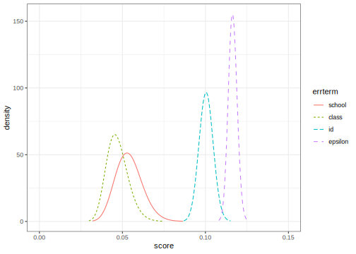
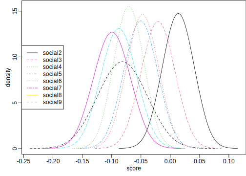

# Multilevel Design
[Julian Faraway](https://julianfaraway.github.io/)
2024-09-30

- [Data](#data)
- [Mixed Effect Model](#mixed-effect-model)
- [INLA](#inla)
  - [Informative Gamma priors on the
    precisions](#informative-gamma-priors-on-the-precisions)
  - [Penalized Complexity Prior](#penalized-complexity-prior)
- [STAN](#stan)
  - [Diagnostics](#diagnostics)
  - [Output Summary](#output-summary)
  - [Posterior Distributions](#posterior-distributions)
- [BRMS](#brms)
- [MGCV](#mgcv)
- [GINLA](#ginla)
- [Discussion](#discussion)
- [Package version info](#package-version-info)

See the [introduction](index.md) for an overview.

This example is discussed in more detail in my book [Extending the
Linear Model with R](https://julianfaraway.github.io/faraway/ELM/)

Required libraries:

``` r
library(faraway)
library(ggplot2)
library(lme4)
library(pbkrtest)
library(RLRsim)
library(INLA)
library(knitr)
library(cmdstanr)
register_knitr_engine(override = FALSE)
library(brms)
library(mgcv)
```

# Data

[Read](jspmultilevel.md) about our analysis of some data from the Junior
Schools Project. In addition to a math test, students also took a test
in English. Although it would be possible to analyze the English test
results in the same way that we analyzed the math scores, additional
information may be obtained from analyzing them simultaneously. Hence we
view the data as having a bivariate response with English and math
scores for each student. The student is a nested factor within the class
which is in turn nested within the school. We express the multivariate
response for each individual by introducing an additional level of
nesting at the individual level. So we might view this as just another
nested model except that there is a fixed subject effect associated with
this lowest level of nesting.

We set up the data in a format with one test score per line with an
indicator `subject` identifying which type of test was taken. We scale
the English and math test scores by their maximum possible values, 40
and 100, respectively, to aid comparison:

``` r
data(jsp, package="faraway")
jspr <- jsp[jsp$year==2,]
mjspr <- data.frame(rbind(jspr[,1:6],jspr[,1:6]),
                    subject=factor(rep(c("english","math"),c(953,953))),  
                    score=c(jspr$english/100,jspr$math/40))
```

We can plot the data

``` r
ggplot(mjspr, aes(x=raven, y=score))+geom_jitter(alpha=0.25)+facet_grid(gender ~ subject)
```


# Mixed Effect Model

We now fit a model for the data that includes all the variables of
interest that incorporates some of the interactions that we suspect
might be present. See [Extending the Linear Model with
R](https://julianfaraway.github.io/faraway/ELM/),

``` r
mjspr$craven <- mjspr$raven-mean(mjspr$raven)
mmod <- lmer(score ~ subject*gender + craven*subject + social + (1|school) + (1|school:class) + (1|school:class:id),mjspr)
faraway::sumary(mmod)
```

    Fixed Effects:
                           coef.est coef.se
    (Intercept)             0.44     0.03  
    subjectmath             0.37     0.01  
    gendergirl              0.06     0.01  
    craven                  0.02     0.00  
    social2                 0.01     0.03  
    social3                -0.02     0.03  
    social4                -0.07     0.03  
    social5                -0.05     0.03  
    social6                -0.09     0.03  
    social7                -0.10     0.03  
    social8                -0.08     0.04  
    social9                -0.05     0.03  
    subjectmath:gendergirl -0.06     0.01  
    subjectmath:craven      0.00     0.00  

    Random Effects:
     Groups          Name        Std.Dev.
     school:class:id (Intercept) 0.10    
     school:class    (Intercept) 0.02    
     school          (Intercept) 0.05    
     Residual                    0.12    
    ---
    number of obs: 1906, groups: school:class:id, 953; school:class, 90; school, 48
    AIC = -1705.6, DIC = -1951.1
    deviance = -1846.4 

The model being fit for school $i$, class $j$, student $k$ in subject
$l$ is: $$
\begin{aligned}
  score_{ijkl} =& subject_l + gender_k + raven_k + social_k +
  (subject \times gender)_{lk} +  \\ & (raven \times subject)_{lk} +
  school_i + class_j + student_k + \epsilon_{ijkl}
\end{aligned}
$$ where the Raven score has been mean centered and school, class and
student are random effects with the other terms, apart from $\epsilon$,
being fixed effects.

We can test some fixed effects:

``` r
mmod <- lmer(score ~ subject*gender+craven*subject+social+  (1|school)+(1|school:class)+(1|school:class:id),mjspr, REML=FALSE)
mmodr <- lmer(score ~ subject*gender+craven+subject+social+(1|school)+(1|school:class)+(1|school:class:id),mjspr, REML=FALSE)
KRmodcomp(mmod, mmodr)
```

    large : score ~ subject + gender + craven + social + (1 | school) + (1 | 
        school:class) + (1 | school:class:id) + subject:gender + 
        subject:craven
    small : score ~ subject * gender + craven + subject + social + (1 | school) + 
        (1 | school:class) + (1 | school:class:id)
          stat ndf ddf F.scaling p.value
    Ftest   16   1 950         1 6.9e-05

We are testing for a subject by gender interaction. We can see that this
effect is strongly statistically significant.

We can compute confidence intervals for the parameters:

``` r
set.seed(123)
confint(mmod, method="boot", oldNames=FALSE)
```

                                        2.5 %     97.5 %
    sd_(Intercept)|school:class:id  0.0903727  0.1085795
    sd_(Intercept)|school:class     0.0000000  0.0416423
    sd_(Intercept)|school           0.0235886  0.0599511
    sigma                           0.1110622  0.1206808
    (Intercept)                     0.3952423  0.4937078
    subjectmath                     0.3496975  0.3816522
    gendergirl                      0.0441439  0.0830535
    craven                          0.0156687  0.0192079
    social2                        -0.0384890  0.0660042
    social3                        -0.0810421  0.0348846
    social4                        -0.1211400 -0.0210216
    social5                        -0.1080110  0.0020657
    social6                        -0.1482613 -0.0270518
    social7                        -0.1574203 -0.0324216
    social8                        -0.1747016 -0.0057935
    social9                        -0.1033001  0.0065694
    subjectmath:gendergirl         -0.0797471 -0.0365518
    subjectmath:craven             -0.0057538 -0.0021502

The lower end of the class confidence interval is zero while the school
random effect is clearly larger. There is some variation associated with
individuals.

# INLA

Integrated nested Laplace approximation is a method of Bayesian
computation which uses approximation rather than simulation. More can be
found on this topic in [Bayesian Regression Modeling with
INLA](http://julianfaraway.github.io/brinla/) and the [chapter on
GLMMs](https://julianfaraway.github.io/brinlabook/chaglmm.html)

Use the most recent computational methodology:

``` r
inla.setOption(inla.mode="experimental")
inla.setOption("short.summary",TRUE)
```

Need to construct unique labels for nested factor levels of class and
student:

``` r
mjspr$school <- factor(mjspr$school)
mjspr$classch <- factor(paste(mjspr$school,mjspr$class,sep="."))
mjspr$classchid <- factor(paste(mjspr$school,mjspr$class,mjspr$id,sep="."))
```

``` r
formula <- score ~ subject*gender+craven*subject+social + f(school, model="iid") + f(classch, model="iid") + f(classchid, model="iid")
result <- inla(formula, family="gaussian", data=mjspr)
summary(result)
```

    Fixed effects:
                             mean    sd 0.025quant 0.5quant 0.975quant   mode kld
    (Intercept)             0.442 0.026      0.390    0.442      0.494  0.442   0
    subjectmath             0.367 0.008      0.351    0.367      0.382  0.367   0
    gendergirl              0.064 0.010      0.044    0.064      0.084  0.064   0
    craven                  0.017 0.001      0.016    0.017      0.019  0.017   0
    social2                 0.014 0.027     -0.040    0.014      0.067  0.014   0
    social3                -0.022 0.029     -0.078   -0.022      0.035 -0.022   0
    social4                -0.072 0.026     -0.122   -0.072     -0.021 -0.072   0
    social5                -0.051 0.029     -0.107   -0.051      0.006 -0.051   0
    social6                -0.089 0.031     -0.149   -0.089     -0.029 -0.089   0
    social7                -0.099 0.032     -0.161   -0.099     -0.038 -0.099   0
    social8                -0.082 0.042     -0.165   -0.082      0.001 -0.082   0
    social9                -0.048 0.027     -0.102   -0.048      0.006 -0.048   0
    subjectmath:gendergirl -0.059 0.011     -0.080   -0.059     -0.038 -0.059   0
    subjectmath:craven     -0.004 0.001     -0.006   -0.004     -0.002 -0.004   0

    Model hyperparameters:
                                                mean       sd 0.025quant 0.5quant 0.975quant   mode
    Precision for the Gaussian observations    73.67     3.38      67.16    73.63      80.45  73.60
    Precision for school                      439.07   133.46     234.16   420.04     754.43 384.40
    Precision for classch                   15713.74 17908.92     422.80  9462.59   63775.76 738.32
    Precision for classchid                    96.85     8.17      82.14    96.38     114.29  95.19

     is computed 

Maybe OK but let’s try some more informative priors.

## Informative Gamma priors on the precisions

Now try more informative gamma priors for the precisions. Define it so
the mean value of gamma prior is set to the inverse of the variance of
the residuals of the fixed-effects only model. We expect the error
variances to be lower than this variance so this is an overestimate. The
variance of the gamma prior (for the precision) is controlled by the
`apar` parameter.

``` r
apar <- 0.5
lmod <- lm(score ~ subject*gender+craven*subject+social,mjspr)
bpar <- apar*var(residuals(lmod))
lgprior <- list(prec = list(prior="loggamma", param = c(apar,bpar)))
formula = score ~ subject*gender+craven*subject+social+f(school, model="iid", hyper = lgprior)+f(classch, model="iid", hyper = lgprior)+f(classchid, model="iid", hyper = lgprior)
result <- inla(formula, family="gaussian", data=mjspr)
summary(result)
```

    Fixed effects:
                             mean    sd 0.025quant 0.5quant 0.975quant   mode kld
    (Intercept)             0.441 0.027      0.387    0.441      0.495  0.441   0
    subjectmath             0.367 0.008      0.351    0.367      0.382  0.367   0
    gendergirl              0.062 0.010      0.042    0.062      0.082  0.062   0
    craven                  0.017 0.001      0.016    0.017      0.019  0.017   0
    social2                 0.013 0.028     -0.041    0.013      0.067  0.013   0
    social3                -0.020 0.029     -0.077   -0.020      0.038 -0.020   0
    social4                -0.069 0.026     -0.120   -0.069     -0.018 -0.069   0
    social5                -0.051 0.029     -0.108   -0.051      0.007 -0.051   0
    social6                -0.085 0.031     -0.146   -0.085     -0.024 -0.085   0
    social7                -0.098 0.032     -0.161   -0.098     -0.036 -0.098   0
    social8                -0.080 0.043     -0.164   -0.080      0.004 -0.080   0
    social9                -0.046 0.028     -0.101   -0.046      0.008 -0.046   0
    subjectmath:gendergirl -0.059 0.011     -0.080   -0.059     -0.038 -0.059   0
    subjectmath:craven     -0.004 0.001     -0.006   -0.004     -0.002 -0.004   0

    Model hyperparameters:
                                              mean     sd 0.025quant 0.5quant 0.975quant   mode
    Precision for the Gaussian observations  73.84   3.38      67.36    73.78      80.65  73.70
    Precision for school                    366.84 114.69     196.09   348.84     642.89 314.65
    Precision for classch                   478.69 134.06     264.95   462.05     788.31 431.32
    Precision for classchid                  99.61   8.51      84.17    99.17     117.65  98.09

     is computed 

Compute the transforms to an SD scale for the field and error. Make a
table of summary statistics for the posteriors:

``` r
sigmaschool <- inla.tmarginal(function(x) 1/sqrt(exp(x)),result$internal.marginals.hyperpar[[2]])
sigmaclass <- inla.tmarginal(function(x) 1/sqrt(exp(x)),result$internal.marginals.hyperpar[[3]])
sigmaid <- inla.tmarginal(function(x) 1/sqrt(exp(x)),result$internal.marginals.hyperpar[[4]])
sigmaepsilon <- inla.tmarginal(function(x) 1/sqrt(exp(x)),result$internal.marginals.hyperpar[[1]])
restab=sapply(result$marginals.fixed, function(x) inla.zmarginal(x,silent=TRUE))
restab=cbind(restab, inla.zmarginal(sigmaschool,silent=TRUE))
restab=cbind(restab, inla.zmarginal(sigmaclass,silent=TRUE))
restab=cbind(restab, inla.zmarginal(sigmaid,silent=TRUE))
restab=cbind(restab, inla.zmarginal(sigmaepsilon,silent=TRUE))
colnames(restab) = c(names(lmod$coef),"school","class","id","epsilon")
data.frame(restab)
```

               X.Intercept. subjectmath gendergirl     craven    social2     social3   social4   social5   social6
    mean            0.44092     0.36656   0.062022    0.01735   0.013314   -0.019778    -0.069 -0.050501 -0.085262
    sd              0.02742   0.0077016   0.010285 0.00093434   0.027506    0.029312  0.026182  0.029126  0.031007
    quant0.025       0.3871     0.35145   0.041839   0.015516  -0.040676   -0.077314  -0.12039  -0.10767  -0.14613
    quant0.25       0.42238     0.36136   0.055064   0.016718 -0.0052909   -0.039603 -0.086708 -0.070201  -0.10623
    quant0.5        0.44087     0.36655      0.062   0.017348   0.013255   -0.019839 -0.069054 -0.050562 -0.085325
    quant0.75       0.45935     0.37174   0.068937   0.017978   0.031802 -7.4945e-05   -0.0514 -0.030923 -0.064418
    quant0.975      0.49463     0.38165   0.082169    0.01918   0.067193    0.037637 -0.017716 0.0065512 -0.024531
                 social7   social8   social9 subjectmath.gendergirl subjectmath.craven    school     class        id
    mean       -0.098444 -0.080222 -0.046179              -0.059194         -0.0037203  0.054026  0.047029   0.10047
    sd          0.031983  0.042738  0.027729               0.010694         0.00092941 0.0080874 0.0065236 0.0042432
    quant0.025  -0.16123  -0.16412  -0.10061              -0.080187         -0.0055446  0.039545  0.035684  0.092261
    quant0.25   -0.12008  -0.10913 -0.064934              -0.066428         -0.0043489  0.048302  0.042397  0.097555
    quant0.5    -0.09851  -0.08031 -0.046237              -0.059217         -0.0037222  0.053558  0.046495   0.10042
    quant0.75  -0.076945 -0.051493  -0.02754              -0.052006         -0.0030955  0.059189  0.051094   0.10331
    quant0.975   -0.0358 0.0034909 0.0081347              -0.038247         -0.0018998  0.071234  0.061263   0.10892
                 epsilon
    mean         0.11647
    sd         0.0026468
    quant0.025   0.11139
    quant0.25    0.11465
    quant0.5     0.11642
    quant0.75    0.11823
    quant0.975   0.12179

Also construct a plot of the SD posteriors:

``` r
ddf <- data.frame(rbind(sigmaschool,sigmaclass,sigmaid,sigmaepsilon),
                  errterm=gl(4,nrow(sigmaepsilon),
                             labels = c("school","class","id","epsilon")))
ggplot(ddf, aes(x,y, linetype=errterm, color=errterm))+geom_line()+xlab("score")+ylab("density")+xlim(0,0.15)
```



Posteriors for the school and class assign no weight to values close to
zero.

## Penalized Complexity Prior

In [Simpson et al (2015)](http://arxiv.org/abs/1403.4630v3), penalized
complexity priors are proposed. This requires that we specify a scaling
for the SDs of the random effects. We use the SD of the residuals of the
fixed effects only model (what might be called the base model in the
paper) to provide this scaling.

``` r
lmod <- lm(score ~ subject*gender+craven*subject+social,mjspr)
sdres <- sd(residuals(lmod))
pcprior <- list(prec = list(prior="pc.prec", param = c(3*sdres,0.01)))
formula = score ~ subject*gender+craven*subject+social+f(school, model="iid", hyper = pcprior)+f(classch, model="iid", hyper = pcprior)+f(classchid, model="iid", hyper = pcprior)
result <- inla(formula, family="gaussian", data=mjspr)
summary(result)
```

    Fixed effects:
                             mean    sd 0.025quant 0.5quant 0.975quant   mode kld
    (Intercept)             0.441 0.027      0.389    0.441      0.494  0.441   0
    subjectmath             0.367 0.008      0.351    0.367      0.382  0.367   0
    gendergirl              0.063 0.010      0.043    0.063      0.083  0.063   0
    craven                  0.017 0.001      0.016    0.017      0.019  0.017   0
    social2                 0.014 0.027     -0.040    0.014      0.067  0.014   0
    social3                -0.020 0.029     -0.077   -0.020      0.036 -0.020   0
    social4                -0.070 0.026     -0.121   -0.070     -0.019 -0.070   0
    social5                -0.050 0.029     -0.107   -0.050      0.006 -0.050   0
    social6                -0.087 0.031     -0.148   -0.087     -0.027 -0.087   0
    social7                -0.099 0.032     -0.161   -0.099     -0.037 -0.099   0
    social8                -0.081 0.042     -0.165   -0.081      0.002 -0.081   0
    social9                -0.047 0.028     -0.101   -0.047      0.007 -0.047   0
    subjectmath:gendergirl -0.059 0.011     -0.080   -0.059     -0.038 -0.059   0
    subjectmath:craven     -0.004 0.001     -0.006   -0.004     -0.002 -0.004   0

    Model hyperparameters:
                                               mean      sd 0.025quant 0.5quant 0.975quant   mode
    Precision for the Gaussian observations   73.75    3.38      67.20    73.72      80.49  73.74
    Precision for school                     473.20  182.75     217.97   439.65     925.71 379.49
    Precision for classch                   2497.31 2688.60     427.84  1707.64    9523.99 932.78
    Precision for classchid                   98.54    8.45      83.16    98.11     116.39  97.12

     is computed 

Compute the summaries as before:

``` r
sigmaschool <- inla.tmarginal(function(x) 1/sqrt(exp(x)),result$internal.marginals.hyperpar[[2]])
sigmaclass <- inla.tmarginal(function(x) 1/sqrt(exp(x)),result$internal.marginals.hyperpar[[3]])
sigmaid <- inla.tmarginal(function(x) 1/sqrt(exp(x)),result$internal.marginals.hyperpar[[4]])
sigmaepsilon <- inla.tmarginal(function(x) 1/sqrt(exp(x)),result$internal.marginals.hyperpar[[1]])
restab=sapply(result$marginals.fixed, function(x) inla.zmarginal(x,silent=TRUE))
restab=cbind(restab, inla.zmarginal(sigmaschool,silent=TRUE))
restab=cbind(restab, inla.zmarginal(sigmaclass,silent=TRUE))
restab=cbind(restab, inla.zmarginal(sigmaid,silent=TRUE))
restab=cbind(restab, inla.zmarginal(sigmaepsilon,silent=TRUE))
colnames(restab) = c(names(lmod$coef),"school","class","id","epsilon")
data.frame(restab)
```

               X.Intercept. subjectmath gendergirl     craven    social2     social3   social4   social5   social6
    mean            0.44141     0.36656   0.063196   0.017388   0.013835    -0.02047 -0.070334 -0.050358 -0.087498
    sd             0.026588   0.0077029   0.010271 0.00092595   0.027273    0.029028  0.025923  0.028864   0.03074
    quant0.025      0.38921     0.35144   0.043042   0.015571  -0.039699   -0.077449  -0.12122  -0.10701  -0.14785
    quant0.25       0.42343     0.36135   0.056247   0.016761 -0.0046112   -0.040103 -0.087868  -0.06988  -0.10829
    quant0.5        0.44136     0.36655   0.063173   0.017386   0.013778   -0.020531 -0.070388 -0.050419  -0.08756
    quant0.75       0.45928     0.37174   0.070101    0.01801   0.032167 -0.00095781 -0.052909 -0.030957 -0.066834
    quant0.975      0.49349     0.38165   0.083316   0.019202   0.067258    0.036392 -0.019558 0.0061803 -0.027291
                 social7   social8   social9 subjectmath.gendergirl subjectmath.craven    school     class        id
    mean       -0.099325 -0.081324 -0.047086              -0.059194         -0.0037203  0.048362  0.025563   0.10101
    sd          0.031677  0.042421  0.027488               0.010696         0.00092956 0.0088248 0.0097808 0.0042835
    quant0.025  -0.16151   -0.1646  -0.10104               -0.08019         -0.0055449  0.032974   0.01032  0.092758
    quant0.25   -0.12075  -0.11001 -0.065677              -0.066429          -0.004349  0.042072  0.018339  0.098071
    quant0.5    -0.09939 -0.081411 -0.047142              -0.059217         -0.0037222  0.047712   0.02435   0.10096
    quant0.75  -0.078031 -0.052809 -0.028609              -0.052004         -0.0030955  0.053889  0.031334   0.10388
    quant0.975  -0.03728 0.0017664 0.0067545              -0.038243         -0.0018995  0.067522  0.048059   0.10958
                 epsilon
    mean         0.11654
    sd         0.0026566
    quant0.025    0.1115
    quant0.25     0.1147
    quant0.5     0.11646
    quant0.75     0.1183
    quant0.975   0.12193

Make the plots:

``` r
ddf <- data.frame(rbind(sigmaschool,sigmaclass,sigmaid,sigmaepsilon),
                  errterm=gl(4,nrow(sigmaepsilon),
                             labels = c("school","class","id","epsilon")))
ggplot(ddf, aes(x,y, linetype=errterm, color=errterm))+geom_line()+xlab("score")+ylab("density")+xlim(0,0.15)
```


Class variation is quite small compared to the other sources.

# STAN

[STAN](https://mc-stan.org/) performs Bayesian inference using MCMC.
Here we use `cmdstanr` to access Stan from R.

We need to set the data up into a suitable form. All the fixed effects
have been collected into a single design matrix. It’s easiest to do this
by fitting the linear model with just the fixed effects. This also
provides us with a standard error that is helpful in setting up the
priors for the random effects.

The school and class variables need to be renumbered into consecutive
positive integers. This is somewhat inconvenient since the schools are
numbered up to 50 but have no data for two schools so only 48 schools
are actually used.

``` r
mjspr$craven <- mjspr$raven-mean(mjspr$raven)
lmod <- lm(score ~ subject*gender+craven*subject+social,mjspr)
sdscal <- sd(residuals(lmod))
Xmatrix <- model.matrix(lmod)
mjspr$school <- factor(mjspr$school)
mjspr$classch <- factor(paste(mjspr$school,mjspr$class,sep="."))
mjspr$classchid <- factor(paste(mjspr$school,mjspr$class,mjspr$id,sep="."))
jspdat <- list(Nobs=nrow(mjspr),
               Npreds=ncol(Xmatrix),
               Nlev1=length(unique(mjspr$school)),
               Nlev2=length(unique(mjspr$classch)),
               Nlev3=length(unique(mjspr$classchid)),
               y=mjspr$score,
               x=Xmatrix,
               levind1=as.numeric(mjspr$school),
               levind2=as.numeric(mjspr$classch),
               levind3=as.numeric(mjspr$classchid),
               sdscal=sdscal)
```

You see below the Stan code to fit our model. Rmarkdown allows the use
of Stan chunks (elsewhere I have R chunks). The chunk header looks like
this.

STAN chunk will be compiled to ‘mod’. Chunk header is:

    cmdstan, output.var="mod", override = FALSE

We have used uninformative priors for the treatment effects but slightly
informative half-cauchy priors for the variances. Strictly speaking we
should have scaled these without fitting the linear model above but this
is unlikely to have much impact on the outcome.

``` stan
data {
     int<lower=0> Nobs;
     int<lower=0> Npreds;
     int<lower=0> Nlev1;
     int<lower=0> Nlev2;
     int<lower=0> Nlev3;
     vector[Nobs] y;
     matrix[Nobs,Npreds] x;
     array[Nobs] int<lower=1,upper=Nlev1> levind1;
     array[Nobs] int<lower=1,upper=Nlev2> levind2;
     array[Nobs] int<lower=1,upper=Nlev3> levind3;
     real<lower=0> sdscal;
}
parameters {
           vector[Npreds] beta;
           real<lower=0> sigmalev1;
           real<lower=0> sigmalev2;
           real<lower=0> sigmalev3;
           real<lower=0> sigmaeps;

           vector[Nlev1] eta1;
           vector[Nlev2] eta2;
           vector[Nlev3] eta3;
}
transformed parameters {
  vector[Nlev1] ran1;
  vector[Nlev2] ran2;
  vector[Nlev3] ran3;
  vector[Nobs] yhat;

  ran1  = sigmalev1 * eta1;
  ran2  = sigmalev2 * eta2;
  ran3  = sigmalev3 * eta3;

  for (i in 1:Nobs)
    yhat[i] = x[i]*beta+ran1[levind1[i]]+ran2[levind2[i]]+ran3[levind3[i]];

}
model {
  eta1 ~ normal(0, 1);
  eta2 ~ normal(0, 1);
  eta3 ~ normal(0, 1);
  sigmalev1 ~ cauchy(0, 2.5*sdscal);
  sigmalev2 ~ cauchy(0, 2.5*sdscal);
  sigmalev3 ~ cauchy(0, 2.5*sdscal);
  sigmaeps ~ cauchy(0, 2.5*sdscal);
  y ~ normal(yhat, sigmaeps);
}
```

Do the MCMC sampling:

``` r
fit <- mod$sample(
  data = jspdat, 
  seed = 123, 
  chains = 4, 
  parallel_chains = 4,
  refresh = 1000,
  iter_sampling = 2000,
)
```

    Running MCMC with 4 parallel chains...

    Chain 1 Iteration:    1 / 3000 [  0%]  (Warmup) 
    Chain 2 Iteration:    1 / 3000 [  0%]  (Warmup) 
    Chain 3 Iteration:    1 / 3000 [  0%]  (Warmup) 
    Chain 4 Iteration:    1 / 3000 [  0%]  (Warmup) 
    Chain 1 Iteration: 1000 / 3000 [ 33%]  (Warmup) 
    Chain 1 Iteration: 1001 / 3000 [ 33%]  (Sampling) 
    Chain 2 Iteration: 1000 / 3000 [ 33%]  (Warmup) 
    Chain 2 Iteration: 1001 / 3000 [ 33%]  (Sampling) 
    Chain 4 Iteration: 1000 / 3000 [ 33%]  (Warmup) 
    Chain 4 Iteration: 1001 / 3000 [ 33%]  (Sampling) 
    Chain 3 Iteration: 1000 / 3000 [ 33%]  (Warmup) 
    Chain 3 Iteration: 1001 / 3000 [ 33%]  (Sampling) 
    Chain 1 Iteration: 2000 / 3000 [ 66%]  (Sampling) 
    Chain 2 Iteration: 2000 / 3000 [ 66%]  (Sampling) 
    Chain 4 Iteration: 2000 / 3000 [ 66%]  (Sampling) 
    Chain 3 Iteration: 2000 / 3000 [ 66%]  (Sampling) 
    Chain 1 Iteration: 3000 / 3000 [100%]  (Sampling) 
    Chain 2 Iteration: 3000 / 3000 [100%]  (Sampling) 
    Chain 1 finished in 57.2 seconds.
    Chain 2 finished in 57.1 seconds.
    Chain 4 Iteration: 3000 / 3000 [100%]  (Sampling) 
    Chain 4 finished in 58.8 seconds.
    Chain 3 Iteration: 3000 / 3000 [100%]  (Sampling) 
    Chain 3 finished in 59.6 seconds.

    All 4 chains finished successfully.
    Mean chain execution time: 58.2 seconds.
    Total execution time: 59.8 seconds.

## Diagnostics

Diagnostics to check the convergence are worthwhile.

Extract the draws into a convenient dataframe format:

``` r
draws_df <- fit$draws(format = "df")
```

Check the diagnostics on the error term:

``` r
ggplot(draws_df,aes(x=.iteration,y=sigmaeps,color=factor(.chain))) + 
  geom_line() + labs(color = 'Chain', x="Iteration")
```


We see the traces of the four chains overlaid in different colors. The
chains appear roughly stationary although there are some occasional
larger excursions.

The similar plots can be produced for other parameters:

For the school SD

``` r
ggplot(draws_df,aes(x=.iteration,y=sigmalev1,color=factor(.chain))) + 
  geom_line() + labs(color = 'Chain', x="Iteration")
```


For the class SD

``` r
ggplot(draws_df,aes(x=.iteration,y=sigmalev2,color=factor(.chain))) + 
  geom_line() + labs(color = 'Chain', x="Iteration")
```


For the id SD

``` r
ggplot(draws_df,aes(x=.iteration,y=sigmalev3,color=factor(.chain))) + 
  geom_line() + labs(color = 'Chain', x="Iteration")
```


Good enough for the example but might use more draws here.

## Output Summary

Examine the main parameters of interest:

``` r
fit$summary(c("beta","sigmalev1","sigmalev2","sigmalev3","sigmaeps"))
```

    # A tibble: 18 × 10
       variable      mean   median       sd      mad       q5      q95  rhat ess_bulk ess_tail
       <chr>        <dbl>    <dbl>    <dbl>    <dbl>    <dbl>    <dbl> <dbl>    <dbl>    <dbl>
     1 beta[1]    0.442    0.442   0.0270   0.0263    0.398    0.487    1.00    1852.    2896.
     2 beta[2]    0.366    0.366   0.00784  0.00787   0.354    0.379    1.00   10052.    6640.
     3 beta[3]    0.0631   0.0631  0.0103   0.0102    0.0462   0.0801   1.00    6001.    5718.
     4 beta[4]    0.0174   0.0174  0.000929 0.000920  0.0159   0.0189   1.00    7699.    6955.
     5 beta[5]    0.0132   0.0134  0.0272   0.0270   -0.0318   0.0586   1.00    2049.    3256.
     6 beta[6]   -0.0214  -0.0213  0.0288   0.0283   -0.0684   0.0251   1.00    1954.    3323.
     7 beta[7]   -0.0713  -0.0714  0.0260   0.0259   -0.114   -0.0285   1.00    1770.    2976.
     8 beta[8]   -0.0508  -0.0508  0.0290   0.0287   -0.0991  -0.00414  1.00    2024.    3245.
     9 beta[9]   -0.0881  -0.0882  0.0307   0.0306   -0.139   -0.0380   1.00    2192.    4015.
    10 beta[10]  -0.0997  -0.0997  0.0318   0.0316   -0.153   -0.0475   1.00    2197.    3470.
    11 beta[11]  -0.0817  -0.0815  0.0428   0.0426   -0.152   -0.0113   1.00    3063.    5023.
    12 beta[12]  -0.0479  -0.0480  0.0276   0.0272   -0.0933  -0.00221  1.00    1962.    3056.
    13 beta[13]  -0.0590  -0.0590  0.0110   0.0110   -0.0772  -0.0408   1.00    9010.    6207.
    14 beta[14]  -0.00372 -0.00373 0.000925 0.000942 -0.00524 -0.00217  1.00    7970.    5480.
    15 sigmalev1  0.0475   0.0477  0.0101   0.00941   0.0310   0.0635   1.00    1040.    1123.
    16 sigmalev2  0.0236   0.0236  0.0126   0.0137    0.00321  0.0443   1.01     489.    1220.
    17 sigmalev3  0.101    0.101   0.00431  0.00432   0.0943   0.108    1.00    2534.    4619.
    18 sigmaeps   0.117    0.117   0.00270  0.00271   0.112    0.121    1.00    3728.    5553.

Remember that the beta correspond to the following parameters:

``` r
colnames(Xmatrix)
```

     [1] "(Intercept)"            "subjectmath"            "gendergirl"             "craven"                
     [5] "social2"                "social3"                "social4"                "social5"               
     [9] "social6"                "social7"                "social8"                "social9"               
    [13] "subjectmath:gendergirl" "subjectmath:craven"    

The results are comparable to the REML fit. The effective sample sizes
are sufficient.

## Posterior Distributions

We can use extract to get at various components of the STAN fit. First
consider the SDs for random components:

``` r
sdf = stack(draws_df[,c("sigmaeps","sigmalev1","sigmalev2","sigmalev3")])
colnames(sdf) = c("score","sigma")
levels(sdf$sigma) = c("epsilon","school","class","id")
ggplot(sdf, aes(x=score,color=sigma)) + geom_density() + xlim(0,0.15)
```


As usual the error SD distribution is more concentrated. The class SD is
more diffuse, smaller and gives some weight to values close to zero. Now
the treatment effects:

``` r
bdf = stack(draws_df[,grep("^beta",colnames(draws_df))])
colnames(bdf) <- c("score","parameter")
bdf$parameter <- factor(colnames(Xmatrix)[bdf$parameter])
ggplot(bdf, aes(x=score))+geom_density()+geom_vline(xintercept = 0) + facet_wrap(~parameter,scales="free")
```


# BRMS

[BRMS](https://paul-buerkner.github.io/brms/) stands for Bayesian
Regression Models with STAN. It provides a convenient wrapper to STAN
functionality. We specify the model as in `lmer()` above. I have used
more than the standard number of iterations because this reduces some
problems and does not cost much computationally.

``` r
suppressMessages(bmod <- brm(score ~ subject*gender + craven*subject + social + (1|school) + (1|school:class) + (1|school:class:id),data=mjspr,iter=10000, silent=2,cores=4))
```

We get some minor warnings. We can obtain some posterior densities and
diagnostics with:

``` r
plot(bmod, variable = "^s", regex=TRUE)
```


We have chosen only the random effect hyperparameters since this is
where problems will appear first. Looks OK. We can see some weight is
given to values of the class effect SD close to zero.

We can look at the STAN code that `brms` used with:

``` r
stancode(bmod)
```

    // generated with brms 2.21.0
    functions {
    }
    data {
      int<lower=1> N;  // total number of observations
      vector[N] Y;  // response variable
      int<lower=1> K;  // number of population-level effects
      matrix[N, K] X;  // population-level design matrix
      int<lower=1> Kc;  // number of population-level effects after centering
      // data for group-level effects of ID 1
      int<lower=1> N_1;  // number of grouping levels
      int<lower=1> M_1;  // number of coefficients per level
      array[N] int<lower=1> J_1;  // grouping indicator per observation
      // group-level predictor values
      vector[N] Z_1_1;
      // data for group-level effects of ID 2
      int<lower=1> N_2;  // number of grouping levels
      int<lower=1> M_2;  // number of coefficients per level
      array[N] int<lower=1> J_2;  // grouping indicator per observation
      // group-level predictor values
      vector[N] Z_2_1;
      // data for group-level effects of ID 3
      int<lower=1> N_3;  // number of grouping levels
      int<lower=1> M_3;  // number of coefficients per level
      array[N] int<lower=1> J_3;  // grouping indicator per observation
      // group-level predictor values
      vector[N] Z_3_1;
      int prior_only;  // should the likelihood be ignored?
    }
    transformed data {
      matrix[N, Kc] Xc;  // centered version of X without an intercept
      vector[Kc] means_X;  // column means of X before centering
      for (i in 2:K) {
        means_X[i - 1] = mean(X[, i]);
        Xc[, i - 1] = X[, i] - means_X[i - 1];
      }
    }
    parameters {
      vector[Kc] b;  // regression coefficients
      real Intercept;  // temporary intercept for centered predictors
      real<lower=0> sigma;  // dispersion parameter
      vector<lower=0>[M_1] sd_1;  // group-level standard deviations
      array[M_1] vector[N_1] z_1;  // standardized group-level effects
      vector<lower=0>[M_2] sd_2;  // group-level standard deviations
      array[M_2] vector[N_2] z_2;  // standardized group-level effects
      vector<lower=0>[M_3] sd_3;  // group-level standard deviations
      array[M_3] vector[N_3] z_3;  // standardized group-level effects
    }
    transformed parameters {
      vector[N_1] r_1_1;  // actual group-level effects
      vector[N_2] r_2_1;  // actual group-level effects
      vector[N_3] r_3_1;  // actual group-level effects
      real lprior = 0;  // prior contributions to the log posterior
      r_1_1 = (sd_1[1] * (z_1[1]));
      r_2_1 = (sd_2[1] * (z_2[1]));
      r_3_1 = (sd_3[1] * (z_3[1]));
      lprior += student_t_lpdf(Intercept | 3, 0.6, 2.5);
      lprior += student_t_lpdf(sigma | 3, 0, 2.5)
        - 1 * student_t_lccdf(0 | 3, 0, 2.5);
      lprior += student_t_lpdf(sd_1 | 3, 0, 2.5)
        - 1 * student_t_lccdf(0 | 3, 0, 2.5);
      lprior += student_t_lpdf(sd_2 | 3, 0, 2.5)
        - 1 * student_t_lccdf(0 | 3, 0, 2.5);
      lprior += student_t_lpdf(sd_3 | 3, 0, 2.5)
        - 1 * student_t_lccdf(0 | 3, 0, 2.5);
    }
    model {
      // likelihood including constants
      if (!prior_only) {
        // initialize linear predictor term
        vector[N] mu = rep_vector(0.0, N);
        mu += Intercept;
        for (n in 1:N) {
          // add more terms to the linear predictor
          mu[n] += r_1_1[J_1[n]] * Z_1_1[n] + r_2_1[J_2[n]] * Z_2_1[n] + r_3_1[J_3[n]] * Z_3_1[n];
        }
        target += normal_id_glm_lpdf(Y | Xc, mu, b, sigma);
      }
      // priors including constants
      target += lprior;
      target += std_normal_lpdf(z_1[1]);
      target += std_normal_lpdf(z_2[1]);
      target += std_normal_lpdf(z_3[1]);
    }
    generated quantities {
      // actual population-level intercept
      real b_Intercept = Intercept - dot_product(means_X, b);
    }

We see that `brms` is using student t distributions with 3 degrees of
freedom for the priors. For the three error SDs, this will be truncated
at zero to form half-t distributions. You can get a more explicit
description of the priors with `prior_summary(bmod)`. These are
qualitatively similar to the the PC prior used in the INLA fit.

We examine the fit:

``` r
summary(bmod)
```

     Family: gaussian 
      Links: mu = identity; sigma = identity 
    Formula: score ~ subject * gender + craven * subject + social + (1 | school) + (1 | school:class) + (1 | school:class:id) 
       Data: mjspr (Number of observations: 1906) 
      Draws: 4 chains, each with iter = 10000; warmup = 5000; thin = 1;
             total post-warmup draws = 20000

    Multilevel Hyperparameters:
    ~school (Number of levels: 48) 
                  Estimate Est.Error l-95% CI u-95% CI Rhat Bulk_ESS Tail_ESS
    sd(Intercept)     0.05      0.01     0.03     0.07 1.00     1610     1160

    ~school:class (Number of levels: 90) 
                  Estimate Est.Error l-95% CI u-95% CI Rhat Bulk_ESS Tail_ESS
    sd(Intercept)     0.02      0.01     0.00     0.05 1.00      828      981

    ~school:class:id (Number of levels: 953) 
                  Estimate Est.Error l-95% CI u-95% CI Rhat Bulk_ESS Tail_ESS
    sd(Intercept)     0.10      0.00     0.09     0.11 1.00     4548     8721

    Regression Coefficients:
                           Estimate Est.Error l-95% CI u-95% CI Rhat Bulk_ESS Tail_ESS
    Intercept                  0.44      0.03     0.39     0.49 1.00     3318     5727
    subjectmath                0.37      0.01     0.35     0.38 1.00    15150    14475
    gendergirl                 0.06      0.01     0.04     0.08 1.00     9737    12425
    craven                     0.02      0.00     0.02     0.02 1.00    14415    15237
    social2                    0.01      0.03    -0.04     0.07 1.00     3388     6733
    social3                   -0.02      0.03    -0.08     0.04 1.00     3543     6470
    social4                   -0.07      0.03    -0.12    -0.02 1.00     3085     5173
    social5                   -0.05      0.03    -0.11     0.01 1.00     3031     5233
    social6                   -0.09      0.03    -0.15    -0.03 1.00     3717     7281
    social7                   -0.10      0.03    -0.16    -0.04 1.00     3561     7742
    social8                   -0.08      0.04    -0.16     0.00 1.00     5277     9548
    social9                   -0.05      0.03    -0.10     0.01 1.00     3482     6219
    subjectmath:gendergirl    -0.06      0.01    -0.08    -0.04 1.00    13927    10747
    subjectmath:craven        -0.00      0.00    -0.01    -0.00 1.00    28971    13348

    Further Distributional Parameters:
          Estimate Est.Error l-95% CI u-95% CI Rhat Bulk_ESS Tail_ESS
    sigma     0.12      0.00     0.11     0.12 1.00     7232    12899

    Draws were sampled using sampling(NUTS). For each parameter, Bulk_ESS
    and Tail_ESS are effective sample size measures, and Rhat is the potential
    scale reduction factor on split chains (at convergence, Rhat = 1).

The results are consistent with those seen previously.

# MGCV

It is possible to fit some GLMMs within the GAM framework of the `mgcv`
package. An explanation of this can be found in this
[blog](https://fromthebottomoftheheap.net/2021/02/02/random-effects-in-gams/)

``` r
gmod = gam(score ~ subject*gender + craven*subject + social +
            s(school,bs="re") + 
            s(classch,bs="re") + 
            s(classchid,bs="re"),
            data=mjspr, method="REML")
```

and look at the summary output:

``` r
summary(gmod)
```


    Family: gaussian 
    Link function: identity 

    Formula:
    score ~ subject * gender + craven * subject + social + s(school, 
        bs = "re") + s(classch, bs = "re") + s(classchid, bs = "re")

    Parametric coefficients:
                            Estimate Std. Error t value Pr(>|t|)
    (Intercept)             0.441578   0.026459   16.69  < 2e-16
    subjectmath             0.366565   0.007710   47.54  < 2e-16
    gendergirl              0.063351   0.010254    6.18  8.6e-10
    craven                  0.017390   0.000925   18.81  < 2e-16
    social2                 0.013754   0.027230    0.51   0.6136
    social3                -0.020768   0.028972   -0.72   0.4736
    social4                -0.070708   0.025868   -2.73   0.0064
    social5                -0.050474   0.028818   -1.75   0.0801
    social6                -0.087852   0.030672   -2.86   0.0042
    social7                -0.099408   0.031607   -3.15   0.0017
    social8                -0.081623   0.042352   -1.93   0.0542
    social9                -0.047337   0.027445   -1.72   0.0848
    subjectmath:gendergirl -0.059194   0.010706   -5.53  3.9e-08
    subjectmath:craven     -0.003720   0.000930   -4.00  6.7e-05

    Approximate significance of smooth terms:
                   edf Ref.df     F p-value
    s(school)     28.8     47 14.86  <2e-16
    s(classch)    14.2     89  0.89    0.22
    s(classchid) 540.6    942  1.54  <2e-16

    R-sq.(adj) =  0.794   Deviance explained = 85.8%
    -REML = -870.79  Scale est. = 0.013592  n = 1906

We get the fixed effect estimates. We also get tests on the random
effects (as described in this
[article](https://doi.org/10.1093/biomet/ast038). The hypothesis of no
variation is rejected for the school and id but not for the class. This
is consistent with earlier findings.

We can get an estimate of the operator and error SD:

``` r
gam.vcomp(gmod)
```


    Standard deviations and 0.95 confidence intervals:

                  std.dev     lower    upper
    s(school)    0.047230 0.0324228 0.068801
    s(classch)   0.024123 0.0089072 0.065330
    s(classchid) 0.101253 0.0930705 0.110154
    scale        0.116583 0.1114571 0.121945

    Rank: 4/4

The point estimates are the same as the REML estimates from `lmer`
earlier. The confidence intervals are different. A bootstrap method was
used for the `lmer` fit whereas `gam` is using an asymptotic
approximation resulting in substantially different results. Given the
problems of parameters on the boundary present in this example, the
bootstrap results appear more trustworthy.

The fixed effect estimates can be found with:

``` r
coef(gmod)[1:14]
```

               (Intercept)            subjectmath             gendergirl                 craven                social2 
                 0.4415780              0.3665647              0.0633509              0.0173905              0.0137536 
                   social3                social4                social5                social6                social7 
                -0.0207677             -0.0707076             -0.0504741             -0.0878520             -0.0994077 
                   social8                social9 subjectmath:gendergirl     subjectmath:craven 
                -0.0816234             -0.0473366             -0.0591943             -0.0037203 

The remaining random effects are too numerous to print.

# GINLA

In [Wood (2019)](https://doi.org/10.1093/biomet/asz044), a simplified
version of INLA is proposed. The first construct the GAM model without
fitting and then use the `ginla()` function to perform the computation.

``` r
gmod = gam(score ~ subject*gender + craven*subject + social +
            s(school,bs="re") + 
            s(classch,bs="re") + 
            s(classchid,bs="re"),
            data=mjspr, fit = FALSE)
gimod = ginla(gmod)
```

We get the posterior density for the intercept as:

``` r
plot(gimod$beta[1,],gimod$density[1,],type="l",xlab="score",ylab="density")
```


We get the posterior density for the math effect as:

``` r
plot(gimod$beta[2,],gimod$density[2,],type="l",xlab="score",ylab="density")
```


and for the social effects as:

``` r
xmat = t(gimod$beta[5:12,])
ymat = t(gimod$density[5:12,])
matplot(xmat, ymat,type="l",xlab="score",ylab="density")
legend("left",paste0("social",2:9),col=1:8,lty=1:8)
```



We can see some overlap between the effects, but strong evidence of a
negative outcome relative to social class 1 for some classes.

It is not straightforward to obtain the posterior densities of the
hyperparameters.

# Discussion

See the [Discussion of the single random effect
model](pulp.md#Discussion) for general comments.

- As with the previous analyses, sometimes the INLA posteriors for the
  hyperparameters have densities which do not give weight to
  close-to-zero values where other analyses suggest this might be
  reasonable.

- There is relatively little disagreement between the methods and much
  similarity.

- There were no major computational issue with the analyses (in contrast
  with some of the other examples)

- The `mgcv` analyses (both standard and ginla) took much longer than
  previous analyses because the sample size is larger and there are a
  large number of random effects — slower than any of the other
  analyses.

# Package version info

``` r
sessionInfo()
```

    R version 4.4.1 (2024-06-14)
    Platform: x86_64-apple-darwin20
    Running under: macOS Sonoma 14.7

    Matrix products: default
    BLAS:   /Library/Frameworks/R.framework/Versions/4.4-x86_64/Resources/lib/libRblas.0.dylib 
    LAPACK: /Library/Frameworks/R.framework/Versions/4.4-x86_64/Resources/lib/libRlapack.dylib;  LAPACK version 3.12.0

    locale:
    [1] en_US.UTF-8/en_US.UTF-8/en_US.UTF-8/C/en_US.UTF-8/en_US.UTF-8

    time zone: Europe/London
    tzcode source: internal

    attached base packages:
    [1] stats     graphics  grDevices utils     datasets  methods   base     

    other attached packages:
     [1] mgcv_1.9-1     nlme_3.1-166   brms_2.21.0    Rcpp_1.0.13    cmdstanr_0.8.1 knitr_1.48     INLA_24.06.27 
     [8] sp_2.1-4       RLRsim_3.1-8   pbkrtest_0.5.3 lme4_1.1-35.5  Matrix_1.7-0   ggplot2_3.5.1  faraway_1.0.8 

    loaded via a namespace (and not attached):
     [1] tidyselect_1.2.1     farver_2.1.2         dplyr_1.1.4          loo_2.8.0            fastmap_1.2.0       
     [6] tensorA_0.36.2.1     digest_0.6.37        estimability_1.5.1   lifecycle_1.0.4      Deriv_4.1.3         
    [11] sf_1.0-16            StanHeaders_2.32.10  processx_3.8.4       magrittr_2.0.3       posterior_1.6.0     
    [16] compiler_4.4.1       rlang_1.1.4          tools_4.4.1          utf8_1.2.4           yaml_2.3.10         
    [21] data.table_1.16.0    labeling_0.4.3       bridgesampling_1.1-2 pkgbuild_1.4.4       classInt_0.4-10     
    [26] plyr_1.8.9           abind_1.4-5          KernSmooth_2.23-24   withr_3.0.1          purrr_1.0.2         
    [31] grid_4.4.1           stats4_4.4.1         fansi_1.0.6          xtable_1.8-4         e1071_1.7-14        
    [36] colorspace_2.1-1     inline_0.3.19        emmeans_1.10.4       scales_1.3.0         MASS_7.3-61         
    [41] cli_3.6.3            mvtnorm_1.2-6        rmarkdown_2.28       generics_0.1.3       RcppParallel_5.1.9  
    [46] rstudioapi_0.16.0    reshape2_1.4.4       minqa_1.2.8          DBI_1.2.3            proxy_0.4-27        
    [51] rstan_2.32.6         stringr_1.5.1        splines_4.4.1        bayesplot_1.11.1     parallel_4.4.1      
    [56] matrixStats_1.3.0    vctrs_0.6.5          boot_1.3-31          jsonlite_1.8.8       callr_3.7.6         
    [61] systemfonts_1.1.0    tidyr_1.3.1          units_0.8-5          glue_1.7.0           nloptr_2.1.1        
    [66] codetools_0.2-20     ps_1.7.7             distributional_0.4.0 stringi_1.8.4        gtable_0.3.5        
    [71] QuickJSR_1.3.1       munsell_0.5.1        tibble_3.2.1         pillar_1.9.0         htmltools_0.5.8.1   
    [76] Brobdingnag_1.2-9    R6_2.5.1             fmesher_0.1.7        evaluate_0.24.0      lattice_0.22-6      
    [81] backports_1.5.0      broom_1.0.6          rstantools_2.4.0     class_7.3-22         gridExtra_2.3       
    [86] svglite_2.1.3        coda_0.19-4.1        checkmate_2.3.2      xfun_0.47            pkgconfig_2.0.3     
