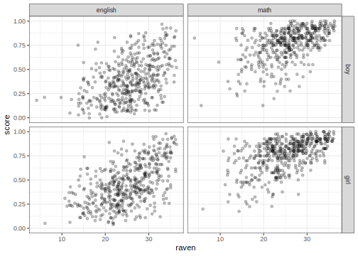

# Multilevel Design
[Julian Faraway](https://julianfaraway.github.io/)
2024-10-11

- [Data](#data)
- [Mixed Effect Model](#mixed-effect-model)
- [LME4](#lme4)
- [NLME](#nlme)
- [MMRM](#mmrm)
- [GLMMTMB](#glmmtmb)
- [Discussion](#discussion)
- [Package version info](#package-version-info)

See the [introduction](index.md) for an overview.

See a [mostly Bayesian analysis](jspmultiple.md) analysis of the same
data.

This example is discussed in more detail in my book [Extending the
Linear Model with R](https://julianfaraway.github.io/faraway/ELM/)

Required libraries:

``` r
library(faraway)
library(ggplot2)
```

# Data

[Read](jspmultilevel.md) about our analysis of some data from the Junior
Schools Project. In addition to a math test, students also took a test
in English. Although it would be possible to analyze the English test
results in the same way that we analyzed the math scores, additional
information may be obtained from analyzing them simultaneously. Hence we
view the data as having a bivariate response with English and math
scores for each student. The student is a nested factor within the class
which is in turn nested within the school. We express the multivariate
response for each individual by introducing an additional level of
nesting at the individual level. So we might view this as just another
nested model except that there is a fixed subject effect associated with
this lowest level of nesting.

We set up the data in a format with one test score per line with an
indicator `subject` identifying which type of test was taken. We scale
the English and math test scores by their maximum possible values, 40
and 100, respectively, to aid comparison:

``` r
data(jsp, package="faraway")
jspr <- jsp[jsp$year==2,]
mjspr <- data.frame(rbind(jspr[,1:6],jspr[,1:6]),
                    subject=factor(rep(c("english","math"),c(953,953))),  
                    score=c(jspr$english/100,jspr$math/40))
```

We can plot the data

``` r
ggplot(mjspr, aes(x=raven, y=score))+geom_jitter(alpha=0.25)+facet_grid(gender ~ subject)
```



# Mixed Effect Model

We now propose a model for the data that includes all the variables of
interest that incorporates some of the interactions that we suspect
might be present. See [Extending the Linear Model with
R](https://julianfaraway.github.io/faraway/ELM/),

The model has school $i$, class $j$, student $k$ in subject $l$ and
takes the form:

``` math
\begin{aligned}
  score_{ijkl} =& subject_l + gender_k + raven_k + social_k +
  (subject \times gender)_{lk} +  \\ & (raven \times subject)_{lk} +
  school_i + class_j + student_k + \epsilon_{ijkl}
\end{aligned}
```

where the Raven score has been mean centered and school, class and
student are random effects with the other terms, apart from $\epsilon$,
being fixed effects.

# LME4

We center the raven score for ease of later interpretation then fit the
model. We use the `lmerTest` package to generate the inference (which
uses the `lme4` fit):

``` r
library(lmerTest)
mjspr$craven <- mjspr$raven-mean(mjspr$raven)
mmod <- lmer(score ~ subject*gender + craven*subject + social + (1|school) + (1|school:class) + (1|school:class:id),mjspr)
summary(mmod, cor=FALSE)
```

    Linear mixed model fit by REML. t-tests use Satterthwaite's method ['lmerModLmerTest']
    Formula: score ~ subject * gender + craven * subject + social + (1 | school) +  
        (1 | school:class) + (1 | school:class:id)
       Data: mjspr

    REML criterion at convergence: -1741.6

    Scaled residuals: 
        Min      1Q  Median      3Q     Max 
    -2.6654 -0.5692  0.0072  0.5641  2.5870 

    Random effects:
     Groups          Name        Variance Std.Dev.
     school:class:id (Intercept) 0.010252 0.1013  
     school:class    (Intercept) 0.000582 0.0241  
     school          (Intercept) 0.002231 0.0472  
     Residual                    0.013592 0.1166  
    Number of obs: 1906, groups:  school:class:id, 953; school:class, 90; school, 48

    Fixed effects:
                            Estimate Std. Error        df t value Pr(>|t|)
    (Intercept)             4.42e-01   2.65e-02  8.36e+02   16.69  < 2e-16
    subjectmath             3.67e-01   7.71e-03  9.50e+02   47.54  < 2e-16
    gendergirl              6.34e-02   1.03e-02  1.52e+03    6.18  8.3e-10
    craven                  1.74e-02   9.25e-04  1.49e+03   18.81  < 2e-16
    social2                 1.38e-02   2.72e-02  9.27e+02    0.51   0.6136
    social3                -2.08e-02   2.90e-02  9.29e+02   -0.72   0.4737
    social4                -7.07e-02   2.59e-02  9.36e+02   -2.73   0.0064
    social5                -5.05e-02   2.88e-02  9.34e+02   -1.75   0.0802
    social6                -8.79e-02   3.07e-02  9.35e+02   -2.86   0.0043
    social7                -9.94e-02   3.16e-02  9.39e+02   -3.15   0.0017
    social8                -8.16e-02   4.24e-02  9.22e+02   -1.93   0.0543
    social9                -4.73e-02   2.74e-02  9.37e+02   -1.72   0.0849
    subjectmath:gendergirl -5.92e-02   1.07e-02  9.50e+02   -5.53  4.2e-08
    subjectmath:craven     -3.72e-03   9.30e-04  9.50e+02   -4.00  6.9e-05

See the textbook for more about the interpretation of the effects.

We can test all the fixed effects with:

``` r
anova(mmod)
```

    Type III Analysis of Variance Table with Satterthwaite's method
                   Sum Sq Mean Sq NumDF DenDF F value  Pr(>F)
    subject          54.0    54.0     1   950 3974.76 < 2e-16
    gender            0.2     0.2     1   915   14.90 0.00012
    craven            5.1     5.1     1   923  377.71 < 2e-16
    social            0.7     0.1     8   927    6.47 3.2e-08
    subject:gender    0.4     0.4     1   950   30.57 4.2e-08
    subject:craven    0.2     0.2     1   950   15.99 6.9e-05

- Both interactions are statistically significant
- Social has no interaction so its statistical significance is
  straightforward
- Subject, gender and craven have interaction terms so the tests on
  their main effects are more difficult to parse. One might view these
  as tests of these effects where the interacting effects are set to
  their mean values. In any case, there is no doubt that these terms
  have some significance.

A different method for approximating the degrees can be used:

``` r
anova(mmod, ddf="Kenward-Roger")
```

    Type III Analysis of Variance Table with Kenward-Roger's method
                   Sum Sq Mean Sq NumDF DenDF F value  Pr(>F)
    subject          54.0    54.0     1   950 3974.76 < 2e-16
    gender            0.2     0.2     1   916   14.84 0.00013
    craven            5.1     5.1     1   928  373.93 < 2e-16
    social            0.7     0.1     8   928    6.43 3.7e-08
    subject:gender    0.4     0.4     1   950   30.57 4.2e-08
    subject:craven    0.2     0.2     1   950   15.99 6.9e-05

which takes slightly longer to compute and gives slightly different
results in this instance - not that it makes any difference.

We can compute confidence intervals for the parameters:

``` r
set.seed(123)
confint(mmod, method="boot", oldNames=FALSE)
```

                                       2.5 %     97.5 %
    sd_(Intercept)|school:class:id  0.091956  0.1101947
    sd_(Intercept)|school:class     0.000000  0.0417860
    sd_(Intercept)|school           0.025595  0.0619625
    sigma                           0.111413  0.1210620
    (Intercept)                     0.394845  0.4940129
    subjectmath                     0.349671  0.3816760
    gendergirl                      0.044030  0.0831173
    craven                          0.015658  0.0192228
    social2                        -0.038801  0.0663593
    social3                        -0.081540  0.0352201
    social4                        -0.121425 -0.0207078
    social5                        -0.108315  0.0023663
    social6                        -0.148547 -0.0266659
    social7                        -0.157419 -0.0318963
    social8                        -0.175278 -0.0051600
    social9                        -0.103694  0.0068992
    subjectmath:gendergirl         -0.079780 -0.0365161
    subjectmath:craven             -0.005757 -0.0021477

The lower end of the class confidence interval is zero while the school
random effect is clearly larger. There is some variation associated with
individuals.

# NLME

See the discussion for the [single random effect
example](pulpfreq.md#NLME) for some introduction.

The syntax for specifying the nested/heirarchical model is different
from `lme4`:

``` r
library(nlme)
nlmod = lme(score ~ subject*gender + craven*subject + social, 
            mjspr, 
            ~ 1 | school/class/id)
summary(nlmod,cor=FALSE)
```

    Linear mixed-effects model fit by REML
      Data: mjspr 
          AIC     BIC logLik
      -1705.6 -1605.8 870.79

    Random effects:
     Formula: ~1 | school
            (Intercept)
    StdDev:     0.04723

     Formula: ~1 | class %in% school
            (Intercept)
    StdDev:    0.024123

     Formula: ~1 | id %in% class %in% school
            (Intercept) Residual
    StdDev:     0.10125  0.11658

    Fixed effects:  score ~ subject * gender + craven * subject + social 
                              Value Std.Error  DF t-value p-value
    (Intercept)             0.44158  0.026459 950  16.689  0.0000
    subjectmath             0.36656  0.007710 950  47.542  0.0000
    gendergirl              0.06335  0.010254 853   6.178  0.0000
    craven                  0.01739  0.000925 853  18.807  0.0000
    social2                 0.01375  0.027230 853   0.505  0.6136
    social3                -0.02077  0.028972 853  -0.717  0.4737
    social4                -0.07071  0.025868 853  -2.733  0.0064
    social5                -0.05047  0.028818 853  -1.751  0.0802
    social6                -0.08785  0.030672 853  -2.864  0.0043
    social7                -0.09941  0.031607 853  -3.145  0.0017
    social8                -0.08162  0.042352 853  -1.927  0.0543
    social9                -0.04734  0.027445 853  -1.725  0.0849
    subjectmath:gendergirl -0.05919  0.010706 950  -5.529  0.0000
    subjectmath:craven     -0.00372  0.000930 950  -3.998  0.0001
     Correlation: 
                           (Intr) sbjctm gndrgr craven socil2 socil3 socil4 socil5 socil6 socil7 socil8 socil9 sbjctmth:g
    subjectmath            -0.146                                                                                        
    gendergirl             -0.192  0.377                                                                                 
    craven                 -0.075  0.020  0.052                                                                          
    social2                -0.829  0.000 -0.015 -0.002                                                                   
    social3                -0.796  0.000  0.003  0.049  0.762                                                            
    social4                -0.894  0.000 -0.018  0.072  0.856  0.820                                                     
    social5                -0.802  0.000 -0.001  0.076  0.764  0.726  0.824                                              
    social6                -0.763  0.000  0.002  0.076  0.719  0.695  0.787  0.697                                       
    social7                -0.743  0.000 -0.011  0.077  0.699  0.678  0.765  0.685  0.652                                
    social8                -0.540  0.000 -0.020  0.045  0.521  0.501  0.560  0.498  0.471  0.465                         
    social9                -0.849  0.000  0.005  0.076  0.803  0.772  0.871  0.775  0.742  0.723  0.524                  
    subjectmath:gendergirl  0.105 -0.721 -0.522 -0.028  0.000  0.000  0.000  0.000  0.000  0.000  0.000  0.000           
    subjectmath:craven      0.006 -0.040 -0.029 -0.503  0.000  0.000  0.000  0.000  0.000  0.000  0.000  0.000  0.056    

    Standardized Within-Group Residuals:
           Min         Q1        Med         Q3        Max 
    -2.6653819 -0.5691847  0.0071914  0.5640943  2.5869898 

    Number of Observations: 1906
    Number of Groups: 
                       school         class %in% school id %in% class %in% school 
                           48                        90                       953 

The results are presented somewhat differently but match those presented
by `lme4` earlier. We do get p-values for the fixed effects but these
are not so useful.

We can get tests on the fixed effects with:

``` r
anova(nlmod)
```

                   numDF denDF F-value p-value
    (Intercept)        1   950  4664.1  <.0001
    subject            1   950  3953.7  <.0001
    gender             1   853     7.5  0.0064
    craven             1   853   444.6  <.0001
    social             8   853     6.5  <.0001
    subject:gender     1   950    28.2  <.0001
    subject:craven     1   950    16.0  0.0001

This is a (Type I) sequential ANOVA so there are some difference to the
`lme4` ANOVA output above. It makes no difference to the overall
conclusion.

# MMRM

MMRM is not designed to fit this class of models.

# GLMMTMB

See the discussion for the [single random effect
example](pulpfreq.md#GLMMTMB) for some introduction.

``` r
library(glmmTMB)
```

The default fit uses ML so we set REML for comparison purposes:

``` r
gtmod <- glmmTMB(score ~ subject*gender + craven*subject + social + (1|school) + (1|school:class) + (1|school:class:id),mjspr, REML=TRUE)
summary(gtmod)
```

     Family: gaussian  ( identity )
    Formula:          score ~ subject * gender + craven * subject + social + (1 | school) +  
        (1 | school:class) + (1 | school:class:id)
    Data: mjspr

         AIC      BIC   logLik deviance df.resid 
     -1705.6  -1605.6    870.8  -1741.6     1902 

    Random effects:

    Conditional model:
     Groups          Name        Variance Std.Dev.
     school          (Intercept) 0.002231 0.0472  
     school:class    (Intercept) 0.000582 0.0241  
     school:class:id (Intercept) 0.010252 0.1013  
     Residual                    0.013592 0.1166  
    Number of obs: 1906, groups:  school, 48; school:class, 90; school:class:id, 953

    Dispersion estimate for gaussian family (sigma^2): 0.0136 

    Conditional model:
                            Estimate Std. Error z value Pr(>|z|)
    (Intercept)             0.441578   0.026463    16.7  < 2e-16
    subjectmath             0.366565   0.007710    47.5  < 2e-16
    gendergirl              0.063351   0.010274     6.2  7.0e-10
    craven                  0.017390   0.000925    18.8  < 2e-16
    social2                 0.013754   0.027231     0.5   0.6135
    social3                -0.020768   0.028987    -0.7   0.4737
    social4                -0.070708   0.025893    -2.7   0.0063
    social5                -0.050474   0.028822    -1.8   0.0799
    social6                -0.087852   0.030702    -2.9   0.0042
    social7                -0.099408   0.031631    -3.1   0.0017
    social8                -0.081623   0.042359    -1.9   0.0540
    social9                -0.047337   0.027455    -1.7   0.0847
    subjectmath:gendergirl -0.059194   0.010706    -5.5  3.2e-08
    subjectmath:craven     -0.003720   0.000930    -4.0  6.4e-05

Another option is to use REML with:

``` r
gtmodr = glmmTMB(acuity~power+(1|subject)+(1|subject:eye),data=vision,
                REML=TRUE)
summary(gtmodr)
```

     Family: gaussian  ( identity )
    Formula:          acuity ~ power + (1 | subject) + (1 | subject:eye)
    Data: vision

         AIC      BIC   logLik deviance df.resid 
       342.7    356.9   -164.4    328.7       53 

    Random effects:

    Conditional model:
     Groups      Name        Variance Std.Dev.
     subject     (Intercept) 21.5     4.64    
     subject:eye (Intercept) 10.3     3.21    
     Residual                16.6     4.07    
    Number of obs: 56, groups:  subject, 7; subject:eye, 14

    Dispersion estimate for gaussian family (sigma^2): 16.6 

    Conditional model:
                Estimate Std. Error z value Pr(>|z|)
    (Intercept)  112.643      2.235    50.4   <2e-16
    power6/18      0.786      1.540     0.5    0.610
    power6/36     -1.000      1.540    -0.6    0.516
    power6/60      3.286      1.540     2.1    0.033

The result is appears identical with the previous REML fits.

The `lmerTest` package is not connected to the `glmmTMB` package so we
cannot easily do an ANOVA on the model. Of course, more manual methods
could be used.

# Discussion

See the [Discussion of the single random effect
model](pulp.md#Discussion) for general comments.

`lme4`, `nlme` and `glmmTMB` were all able to fit this model with no
important differences between them. `mmrm` was not designed for this
type of model.

# Package version info

``` r
sessionInfo()
```

    R version 4.4.1 (2024-06-14)
    Platform: x86_64-apple-darwin20
    Running under: macOS Sonoma 14.7

    Matrix products: default
    BLAS:   /Library/Frameworks/R.framework/Versions/4.4-x86_64/Resources/lib/libRblas.0.dylib 
    LAPACK: /Library/Frameworks/R.framework/Versions/4.4-x86_64/Resources/lib/libRlapack.dylib;  LAPACK version 3.12.0

    locale:
    [1] en_US.UTF-8/en_US.UTF-8/en_US.UTF-8/C/en_US.UTF-8/en_US.UTF-8

    time zone: Europe/London
    tzcode source: internal

    attached base packages:
    [1] stats     graphics  grDevices utils     datasets  methods   base     

    other attached packages:
    [1] glmmTMB_1.1.9  nlme_3.1-166   lmerTest_3.1-3 lme4_1.1-35.5  Matrix_1.7-0   ggplot2_3.5.1  faraway_1.0.8 

    loaded via a namespace (and not attached):
     [1] utf8_1.2.4          generics_0.1.3      tidyr_1.3.1         lattice_0.22-6      digest_0.6.37      
     [6] magrittr_2.0.3      estimability_1.5.1  evaluate_0.24.0     grid_4.4.1          mvtnorm_1.2-6      
    [11] fastmap_1.2.0       jsonlite_1.8.8      backports_1.5.0     mgcv_1.9-1          purrr_1.0.2        
    [16] fansi_1.0.6         scales_1.3.0        codetools_0.2-20    numDeriv_2016.8-1.1 cli_3.6.3          
    [21] rlang_1.1.4         munsell_0.5.1       splines_4.4.1       withr_3.0.1         yaml_2.3.10        
    [26] tools_4.4.1         pbkrtest_0.5.3      parallel_4.4.1      coda_0.19-4.1       nloptr_2.1.1       
    [31] minqa_1.2.8         dplyr_1.1.4         colorspace_2.1-1    boot_1.3-31         broom_1.0.6        
    [36] vctrs_0.6.5         R6_2.5.1            emmeans_1.10.4      lifecycle_1.0.4     MASS_7.3-61        
    [41] pkgconfig_2.0.3     pillar_1.9.0        gtable_0.3.5        glue_1.7.0          Rcpp_1.0.13        
    [46] systemfonts_1.1.0   xfun_0.47           tibble_3.2.1        tidyselect_1.2.1    rstudioapi_0.16.0  
    [51] knitr_1.48          xtable_1.8-4        farver_2.1.2        htmltools_0.5.8.1   rmarkdown_2.28     
    [56] svglite_2.1.3       labeling_0.4.3      TMB_1.9.14          compiler_4.4.1     
