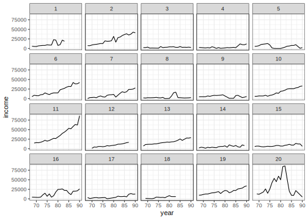
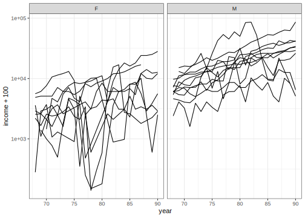

# Longitudinal analysis using Frequentist methods
[Julian Faraway](https://julianfaraway.github.io/)
2024-10-17

- [Data](#data)
- [Mixed Effect Model](#mixed-effect-model)
- [LME4](#lme4)
- [NLME](#nlme)
- [MMRM](#mmrm)
- [GLMMTMB](#glmmtmb)
- [Discussion](#discussion)
- [Package version info](#package-version-info)

See the [introduction](index.md) for an overview.

See a [mostly Bayesian analysis](longitudinal.md) analysis of the same
data.

This example is discussed in more detail in my book [Extending the
Linear Model with R](https://julianfaraway.github.io/faraway/ELM/)

Required libraries:

``` r
library(faraway)
library(ggplot2)
```

# Data

The Panel Study of Income Dynamics (PSID), begun in 1968, is a
longitudinal study of a representative sample of U.S. individuals. The
study is conducted at the Survey Research Center, Institute for Social
Research, University of Michigan, and is still continuing. There are
currently 8700 households in the study and many variables are measured.
We chose to analyze a random subset of this data, consisting of 85 heads
of household who were aged 25–39 in 1968 and had complete data for at
least 11 of the years between 1968 and 1990. The variables included were
annual income, gender, years of education and age in 1968:

Load in the data:

``` r
data(psid, package="faraway")
head(psid)
```

      age educ sex income year person
    1  31   12   M   6000   68      1
    2  31   12   M   5300   69      1
    3  31   12   M   5200   70      1
    4  31   12   M   6900   71      1
    5  31   12   M   7500   72      1
    6  31   12   M   8000   73      1

``` r
summary(psid)
```

          age            educ      sex         income            year          person    
     Min.   :25.0   Min.   : 3.0   F:732   Min.   :     3   Min.   :68.0   Min.   : 1.0  
     1st Qu.:28.0   1st Qu.:10.0   M:929   1st Qu.:  4300   1st Qu.:73.0   1st Qu.:20.0  
     Median :34.0   Median :12.0           Median :  9000   Median :78.0   Median :42.0  
     Mean   :32.2   Mean   :11.8           Mean   : 13575   Mean   :78.6   Mean   :42.4  
     3rd Qu.:36.0   3rd Qu.:13.0           3rd Qu.: 18050   3rd Qu.:84.0   3rd Qu.:63.0  
     Max.   :39.0   Max.   :16.0           Max.   :180000   Max.   :90.0   Max.   :85.0  

``` r
psid$cyear <- psid$year-78
```

We have centered the time variable year. Some plots of just 20 of the
subjects:

``` r
psid20 = subset(psid, person <= 20)
ggplot(psid20, aes(x=year, y=income))+geom_line()+facet_wrap(~ person)
```



``` r
ggplot(psid20, aes(x=year, y=income+100, group=person)) +geom_line()+facet_wrap(~ sex)+scale_y_log10()
```



# Mixed Effect Model

Suppose that the income change over time can be partly predicted by the
subject’s age, sex and educational level. The variation may be
partitioned into two components. Clearly there are other factors that
will affect a subject’s income. These factors may cause the income to be
generally higher or lower or they may cause the income to grow at a
faster or slower rate. We can model this variation with a random
intercept and slope, respectively, for each subject. We also expect that
there will be some year-to-year variation within each subject. For
simplicity, let us initially assume that this error is homogeneous and
uncorrelated. We also center the year to aid interpretation.

# LME4

See the discussion for the [single random effect
example](pulpfreq.md#LME4) for some introduction.

``` r
library(lme4)
```

    Loading required package: Matrix

``` r
mmod = lmer(log(income) ~ cyear*sex +age+educ+(1 | person) + (0 + cyear | person), psid)
summary(mmod, cor=FALSE)
```

    Linear mixed model fit by REML ['lmerMod']
    Formula: log(income) ~ cyear * sex + age + educ + (1 | person) + (0 +      cyear | person)
       Data: psid

    REML criterion at convergence: 3821.7

    Scaled residuals: 
        Min      1Q  Median      3Q     Max 
    -10.251  -0.212   0.078   0.419   2.805 

    Random effects:
     Groups   Name        Variance Std.Dev.
     person   (Intercept) 0.28247  0.5315  
     person.1 cyear       0.00243  0.0493  
     Residual             0.46693  0.6833  
    Number of obs: 1661, groups:  person, 85

    Fixed effects:
                Estimate Std. Error t value
    (Intercept)  6.62758    0.55174   12.01
    cyear        0.08565    0.00904    9.47
    sexM         1.15349    0.12144    9.50
    age          0.01067    0.01372    0.78
    educ         0.10874    0.02183    4.98
    cyear:sexM  -0.02644    0.01229   -2.15

This model can be written as:

``` math
\begin{aligned}
\mathrm{\log(income)}_{ij} &= \mu + \beta_{y} \mathrm{year}_i + \beta_s \mathrm{sex}_j + \beta_{ys} \mathrm{sex}_j \times \mathrm{year}_i + \beta_e \mathrm{educ}_j + \beta_a \mathrm{age}_j \\ &+ \gamma^0_j + \gamma^1_j \mathrm{year}_i + \epsilon_{ij}
\end{aligned}
```

where $i$ indexes the year and $j$ indexes the individual. We have:

``` math
\left(
  \begin{array}{c}
    \gamma^0_k \\
    \gamma^1_k
  \end{array}
  \right) \sim
  N(0,\sigma^2 D)
```

We have chosen not to have an interaction between the intercept and the
slope random effects and so $D$ is a diagonal matrix. It is possible to
have such an interaction in `lmer()` models (but not in all the Bayesian
models). As it happens, if you do fit a model with such an interaction,
you find that it is not significant. Hence dropping it does not make
much difference in this instance.

We can test the interaction term in the fixed effect part of the model:

``` r
library(pbkrtest)
mmod = lmer(log(income) ~ cyear*sex + age + educ +
                (1 | person) + (0 + cyear | person),
                psid, REML=FALSE)
mmodr <- lmer(log(income) ~ cyear + sex + age + educ +
                  (1 | person) + (0 + cyear | person),
                  psid, REML=FALSE)
KRmodcomp(mmod,mmodr)
```

    large : log(income) ~ cyear + sex + age + educ + (1 | person) + (0 + 
        cyear | person) + cyear:sex
    small : log(income) ~ cyear + sex + age + educ + (1 | person) + (0 + 
        cyear | person)
           stat   ndf   ddf F.scaling p.value
    Ftest  4.63  1.00 81.47         1   0.034

We find that the interaction is statistically significant. We can also
compute bootstrap confidence intervals:

``` r
confint(mmod, method="boot", oldNames=FALSE)
```

    Computing bootstrap confidence intervals ...


    2 warning(s): Model failed to converge with max|grad| = 0.00236935 (tol = 0.002, component 1) (and others)

                              2.5 %     97.5 %
    sd_(Intercept)|person  0.417705  0.5970925
    sd_cyear|person        0.038827  0.0582576
    sigma                  0.660668  0.7103655
    (Intercept)            5.658063  7.7724858
    cyear                  0.067614  0.1027662
    sexM                   0.910294  1.3849034
    age                   -0.018039  0.0363323
    educ                   0.067136  0.1536928
    cyear:sexM            -0.052075 -0.0025198

We see that all the standard deviations are clearly well above zero. The
age effect does not look significant.

# NLME

See the discussion for the [single random effect
example](pulpfreq.md#NLME) for some introduction.

The syntax for specifying the random effects part of the model is
different from `lme4`:

``` r
library(nlme)
```


    Attaching package: 'nlme'

    The following object is masked from 'package:lme4':

        lmList

``` r
nlmod = lme(log(income) ~ cyear*sex + age + educ,
            psid, 
            ~ cyear | person)
summary(nlmod)
```

    Linear mixed-effects model fit by REML
      Data: psid 
         AIC    BIC  logLik
      3839.8 3893.9 -1909.9

    Random effects:
     Formula: ~cyear | person
     Structure: General positive-definite, Log-Cholesky parametrization
                StdDev  Corr  
    (Intercept) 0.53071 (Intr)
    cyear       0.04899 0.187 
    Residual    0.68357       

    Fixed effects:  log(income) ~ cyear * sex + age + educ 
                  Value Std.Error   DF t-value p-value
    (Intercept)  6.6742   0.54333 1574 12.2840  0.0000
    cyear        0.0853   0.00900 1574  9.4795  0.0000
    sexM         1.1503   0.12129   81  9.4838  0.0000
    age          0.0109   0.01352   81  0.8083  0.4213
    educ         0.1042   0.02144   81  4.8613  0.0000
    cyear:sexM  -0.0263   0.01224 1574 -2.1496  0.0317
     Correlation: 
               (Intr) cyear  sexM   age    educ  
    cyear       0.020                            
    sexM       -0.104 -0.098                     
    age        -0.874  0.002 -0.026              
    educ       -0.597  0.000  0.008  0.167       
    cyear:sexM -0.003 -0.735  0.156 -0.010 -0.011

    Standardized Within-Group Residuals:
          Min        Q1       Med        Q3       Max 
    -10.23103  -0.21344   0.07945   0.41472   2.82544 

    Number of Observations: 1661
    Number of Groups: 85 

The results are very similar although not identical with `lme4`. This is
probably due to small differences in the convergence criteria used by
the fitting algorithms.

`nlme` does provide t-tests on the fixed effects which are useful in
this instance. We see that age is not a significant effect.

We can also do the sequential ANOVA:

``` r
anova(nlmod)
```

                numDF denDF F-value p-value
    (Intercept)     1  1574 21626.1  <.0001
    cyear           1  1574   131.8  <.0001
    sex             1    81    97.9  <.0001
    age             1    81     0.0  0.9843
    educ            1    81    23.4  <.0001
    cyear:sex       1  1574     4.6  0.0317

Only the last test is the same as the previous test because of the
sequential nature of the testing (i.e. different models are being
compared.)

More useful are the marginal tests provided by:

``` r
library(car)
```

    Loading required package: carData


    Attaching package: 'car'

    The following objects are masked from 'package:faraway':

        logit, vif

``` r
Anova(nlmod)
```

    Analysis of Deviance Table (Type II tests)

    Response: log(income)
               Chisq Df Pr(>Chisq)
    cyear     135.87  1    < 2e-16
    sex        98.81  1    < 2e-16
    age         0.65  1      0.419
    educ       23.63  1    1.2e-06
    cyear:sex   4.62  1      0.032

# MMRM

See the discussion for the [single random effect
example](pulpfreq.md#MMRM) for some introduction.

``` r
library(mmrm)
```

    mmrm() registered as car::Anova extension

It is not currently possible to fit the random effect slope and
intercept model in `mmrm`. We can fit some other models.

We need a factor form of the time variable. Also `mmrm` insists that the
subject variable also be a factor.

``` r
psid$visit = factor(psid$cyear)
psid$person = factor(psid$person)
```

The most general model uses an unstructured covariance matrix for the
random component of the model. Since we have 23 timepoints, that means
23\*24/2 = 276 parameters in total for each pair of timepoints plus the
diagonal variance.

``` r
mmmodu = mmrm(log(income) ~ cyear*sex + age+educ+ us(visit | person), psid)
summary(mmmodu)
```

    mmrm fit

    Formula:     log(income) ~ cyear * sex + age + educ + us(visit | person)
    Data:        psid (used 1661 observations from 85 subjects with maximum 23 timepoints)
    Covariance:  unstructured (276 variance parameters)
    Method:      Satterthwaite
    Vcov Method: Asymptotic
    Inference:   REML

    Model selection criteria:
         AIC      BIC   logLik deviance 
      3316.7   3990.8  -1382.3   2764.7 

    Coefficients: 
                Estimate Std. Error       df t value Pr(>|t|)
    (Intercept)  6.40707    0.42173 60.50000   15.19   <2e-16
    cyear        0.09322    0.00713 57.10000   13.07   <2e-16
    sexM         1.20274    0.09682 58.30000   12.42   <2e-16
    age          0.02237    0.01031 56.40000    2.17   0.0343
    educ         0.09126    0.01674 62.50000    5.45    9e-07
    cyear:sexM  -0.02673    0.00966 53.40000   -2.77   0.0078

    Covariance estimate:
           -10     -9     -8     -7     -6    -5    -4    -3    -2     -1      0     1      2     3      4      5      6
    -10  0.767  0.492  0.458  0.411  0.490 0.345 0.252 0.057 0.100 -0.066 -0.062 0.018 -0.011 0.000 -0.038 -0.077 -0.076
    -9   0.492  1.230  0.563  0.327  0.373 0.346 0.356 0.249 0.205  0.061  0.057 0.139  0.167 0.143  0.106  0.111  0.086
    -8   0.458  0.563  0.602  0.422  0.427 0.346 0.385 0.244 0.163  0.171  0.009 0.192  0.128 0.100  0.272  0.292  0.086
    -7   0.411  0.327  0.422  0.620  0.491 0.370 0.372 0.211 0.165  0.076  0.024 0.086  0.066 0.091  0.133  0.152  0.087
    -6   0.490  0.373  0.427  0.491  0.694 0.460 0.429 0.195 0.269  0.142  0.140 0.119  0.097 0.130  0.114  0.105  0.123
    -5   0.345  0.346  0.346  0.370  0.460 0.546 0.495 0.263 0.365  0.170  0.207 0.212  0.195 0.203  0.144  0.120  0.183
    -4   0.252  0.356  0.385  0.372  0.429 0.495 0.656 0.410 0.450  0.339  0.158 0.259  0.214 0.212  0.313  0.328  0.213
    -3   0.057  0.249  0.244  0.211  0.195 0.263 0.410 0.723 0.440  0.407  0.132 0.368  0.199 0.186  0.425  0.443  0.217
    -2   0.100  0.205  0.163  0.165  0.269 0.365 0.450 0.440 0.912  0.585  0.438 0.442  0.385 0.425  0.452  0.399  0.201
    -1  -0.066  0.061  0.171  0.076  0.142 0.170 0.339 0.407 0.585  1.102  0.694 0.536  0.498 0.351  0.515  0.581  0.270
    0   -0.062  0.057  0.009  0.024  0.140 0.207 0.158 0.132 0.438  0.694  1.164 0.660  0.704 0.356  0.014  0.009  0.340
    1    0.018  0.139  0.192  0.086  0.119 0.212 0.259 0.368 0.442  0.536  0.660 0.713  0.586 0.304  0.377  0.359  0.287
    2   -0.011  0.167  0.128  0.066  0.097 0.195 0.214 0.199 0.385  0.498  0.704 0.586  0.771 0.501  0.401  0.352  0.364
    3    0.000  0.143  0.100  0.091  0.130 0.203 0.212 0.186 0.425  0.351  0.356 0.304  0.501 0.772  0.616  0.620  0.447
    4   -0.038  0.106  0.272  0.133  0.114 0.144 0.313 0.425 0.452  0.515  0.014 0.377  0.401 0.616  1.273  1.302  0.494
    5   -0.077  0.111  0.292  0.152  0.105 0.120 0.328 0.443 0.399  0.581  0.009 0.359  0.352 0.620  1.302  1.623  0.684
    6   -0.076  0.086  0.086  0.087  0.123 0.183 0.213 0.217 0.201  0.270  0.340 0.287  0.364 0.447  0.494  0.684  0.842
    7    0.081  0.167  0.213  0.159  0.211 0.267 0.244 0.215 0.237  0.290  0.373 0.329  0.367 0.313  0.298  0.356  0.493
    8    0.245  0.325  0.263  0.377  0.271 0.358 0.392 0.240 0.233  0.317  0.444 0.307  0.408 0.360  0.282  0.396  0.563
    9    0.032  0.213  0.116  0.154  0.173 0.182 0.258 0.215 0.230  0.376  0.445 0.266  0.299 0.464  0.219  0.530  0.794
    10  -0.156  0.082 -0.026 -0.023 -0.001 0.071 0.141 0.111 0.219  0.373  0.557 0.350  0.586 0.535  0.294  0.425  0.574
    11  -0.180  0.063 -0.038 -0.056  0.034 0.044 0.146 0.061 0.231  0.447  0.590 0.270  0.497 0.558  0.193  0.434  0.622
    12  -0.123 -0.019  0.033 -0.062  0.132 0.123 0.170 0.014 0.041  0.175  0.387 0.162  0.349 0.372  0.131  0.224  0.274
            7     8     9     10     11     12
    -10 0.081 0.245 0.032 -0.156 -0.180 -0.123
    -9  0.167 0.325 0.213  0.082  0.063 -0.019
    -8  0.213 0.263 0.116 -0.026 -0.038  0.033
    -7  0.159 0.377 0.154 -0.023 -0.056 -0.062
    -6  0.211 0.271 0.173 -0.001  0.034  0.132
    -5  0.267 0.358 0.182  0.071  0.044  0.123
    -4  0.244 0.392 0.258  0.141  0.146  0.170
    -3  0.215 0.240 0.215  0.111  0.061  0.014
    -2  0.237 0.233 0.230  0.219  0.231  0.041
    -1  0.290 0.317 0.376  0.373  0.447  0.175
    0   0.373 0.444 0.445  0.557  0.590  0.387
    1   0.329 0.307 0.266  0.350  0.270  0.162
    2   0.367 0.408 0.299  0.586  0.497  0.349
    3   0.313 0.360 0.464  0.535  0.558  0.372
    4   0.298 0.282 0.219  0.294  0.193  0.131
    5   0.356 0.396 0.530  0.425  0.434  0.224
    6   0.493 0.563 0.794  0.574  0.622  0.274
    7   0.584 0.559 0.497  0.407  0.374  0.285
    8   0.559 1.026 0.826  0.620  0.683  0.441
    9   0.497 0.826 1.479  0.934  1.226  0.554
    10  0.407 0.620 0.934  1.103  1.229  0.866
    11  0.374 0.683 1.226  1.229  1.720  1.326
    12  0.285 0.441 0.554  0.866  1.326  1.678

Given the number of parameters, this takes a while to fit (although was
faster than I expected).

We might assume that the correlation between timepoints depends only on
their distance apart with Toeplitz structure on the correlation matrix
for random subject component:

``` r
mmmodt = mmrm(log(income) ~ cyear*sex + age+educ+ toep(visit | person), psid)
```

    Warning in mmrm(log(income) ~ cyear * sex + age + educ + toep(visit | person), : Divergence with optimizer L-BFGS-B due
    to problems: L-BFGS-B needs finite values of 'fn'

``` r
summary(mmmodt)
```

    mmrm fit

    Formula:     log(income) ~ cyear * sex + age + educ + toep(visit | person)
    Data:        psid (used 1661 observations from 85 subjects with maximum 23 timepoints)
    Covariance:  Toeplitz (23 variance parameters)
    Method:      Satterthwaite
    Vcov Method: Asymptotic
    Inference:   REML

    Model selection criteria:
         AIC      BIC   logLik deviance 
      3467.1   3523.3  -1710.6   3421.1 

    Coefficients: 
                 Estimate Std. Error        df t value Pr(>|t|)
    (Intercept)   6.79221    0.54583  83.00000   12.44  < 2e-16
    cyear         0.08583    0.00975 111.10000    8.81  2.0e-14
    sexM          1.20036    0.11982  82.30000   10.02  6.6e-16
    age           0.00505    0.01347  80.20000    0.37    0.709
    educ          0.10271    0.02171  84.90000    4.73  8.8e-06
    cyear:sexM   -0.02684    0.01325 110.00000   -2.03    0.045

    Covariance estimate:
           -10     -9     -8    -7    -6    -5    -4    -3    -2    -1     0     1     2     3     4     5     6     7
    -10  0.908  0.649  0.487 0.396 0.341 0.316 0.302 0.246 0.229 0.212 0.180 0.177 0.186 0.144 0.075 0.073 0.045 0.081
    -9   0.649  0.908  0.649 0.487 0.396 0.341 0.316 0.302 0.246 0.229 0.212 0.180 0.177 0.186 0.144 0.075 0.073 0.045
    -8   0.487  0.649  0.908 0.649 0.487 0.396 0.341 0.316 0.302 0.246 0.229 0.212 0.180 0.177 0.186 0.144 0.075 0.073
    -7   0.396  0.487  0.649 0.908 0.649 0.487 0.396 0.341 0.316 0.302 0.246 0.229 0.212 0.180 0.177 0.186 0.144 0.075
    -6   0.341  0.396  0.487 0.649 0.908 0.649 0.487 0.396 0.341 0.316 0.302 0.246 0.229 0.212 0.180 0.177 0.186 0.144
    -5   0.316  0.341  0.396 0.487 0.649 0.908 0.649 0.487 0.396 0.341 0.316 0.302 0.246 0.229 0.212 0.180 0.177 0.186
    -4   0.302  0.316  0.341 0.396 0.487 0.649 0.908 0.649 0.487 0.396 0.341 0.316 0.302 0.246 0.229 0.212 0.180 0.177
    -3   0.246  0.302  0.316 0.341 0.396 0.487 0.649 0.908 0.649 0.487 0.396 0.341 0.316 0.302 0.246 0.229 0.212 0.180
    -2   0.229  0.246  0.302 0.316 0.341 0.396 0.487 0.649 0.908 0.649 0.487 0.396 0.341 0.316 0.302 0.246 0.229 0.212
    -1   0.212  0.229  0.246 0.302 0.316 0.341 0.396 0.487 0.649 0.908 0.649 0.487 0.396 0.341 0.316 0.302 0.246 0.229
    0    0.180  0.212  0.229 0.246 0.302 0.316 0.341 0.396 0.487 0.649 0.908 0.649 0.487 0.396 0.341 0.316 0.302 0.246
    1    0.177  0.180  0.212 0.229 0.246 0.302 0.316 0.341 0.396 0.487 0.649 0.908 0.649 0.487 0.396 0.341 0.316 0.302
    2    0.186  0.177  0.180 0.212 0.229 0.246 0.302 0.316 0.341 0.396 0.487 0.649 0.908 0.649 0.487 0.396 0.341 0.316
    3    0.144  0.186  0.177 0.180 0.212 0.229 0.246 0.302 0.316 0.341 0.396 0.487 0.649 0.908 0.649 0.487 0.396 0.341
    4    0.075  0.144  0.186 0.177 0.180 0.212 0.229 0.246 0.302 0.316 0.341 0.396 0.487 0.649 0.908 0.649 0.487 0.396
    5    0.073  0.075  0.144 0.186 0.177 0.180 0.212 0.229 0.246 0.302 0.316 0.341 0.396 0.487 0.649 0.908 0.649 0.487
    6    0.045  0.073  0.075 0.144 0.186 0.177 0.180 0.212 0.229 0.246 0.302 0.316 0.341 0.396 0.487 0.649 0.908 0.649
    7    0.081  0.045  0.073 0.075 0.144 0.186 0.177 0.180 0.212 0.229 0.246 0.302 0.316 0.341 0.396 0.487 0.649 0.908
    8    0.093  0.081  0.045 0.073 0.075 0.144 0.186 0.177 0.180 0.212 0.229 0.246 0.302 0.316 0.341 0.396 0.487 0.649
    9    0.032  0.093  0.081 0.045 0.073 0.075 0.144 0.186 0.177 0.180 0.212 0.229 0.246 0.302 0.316 0.341 0.396 0.487
    10  -0.035  0.032  0.093 0.081 0.045 0.073 0.075 0.144 0.186 0.177 0.180 0.212 0.229 0.246 0.302 0.316 0.341 0.396
    11  -0.065 -0.035  0.032 0.093 0.081 0.045 0.073 0.075 0.144 0.186 0.177 0.180 0.212 0.229 0.246 0.302 0.316 0.341
    12  -0.087 -0.065 -0.035 0.032 0.093 0.081 0.045 0.073 0.075 0.144 0.186 0.177 0.180 0.212 0.229 0.246 0.302 0.316
            8     9     10     11     12
    -10 0.093 0.032 -0.035 -0.065 -0.087
    -9  0.081 0.093  0.032 -0.035 -0.065
    -8  0.045 0.081  0.093  0.032 -0.035
    -7  0.073 0.045  0.081  0.093  0.032
    -6  0.075 0.073  0.045  0.081  0.093
    -5  0.144 0.075  0.073  0.045  0.081
    -4  0.186 0.144  0.075  0.073  0.045
    -3  0.177 0.186  0.144  0.075  0.073
    -2  0.180 0.177  0.186  0.144  0.075
    -1  0.212 0.180  0.177  0.186  0.144
    0   0.229 0.212  0.180  0.177  0.186
    1   0.246 0.229  0.212  0.180  0.177
    2   0.302 0.246  0.229  0.212  0.180
    3   0.316 0.302  0.246  0.229  0.212
    4   0.341 0.316  0.302  0.246  0.229
    5   0.396 0.341  0.316  0.302  0.246
    6   0.487 0.396  0.341  0.316  0.302
    7   0.649 0.487  0.396  0.341  0.316
    8   0.908 0.649  0.487  0.396  0.341
    9   0.649 0.908  0.649  0.487  0.396
    10  0.487 0.649  0.908  0.649  0.487
    11  0.396 0.487  0.649  0.908  0.649
    12  0.341 0.396  0.487  0.649  0.908

This brings us down to 23 parameters for the variance matrix. This
generates a warning on the fit convergence but the output looks
reasonable.

We can reasonably assume the much stronger (autoregressive) AR1
structure on successive timepoints:

``` r
mmmoda = mmrm(log(income) ~ cyear*sex + age+educ+ ar1(visit | person), psid)
summary(mmmoda)
```

    mmrm fit

    Formula:     log(income) ~ cyear * sex + age + educ + ar1(visit | person)
    Data:        psid (used 1661 observations from 85 subjects with maximum 23 timepoints)
    Covariance:  auto-regressive order one (2 variance parameters)
    Method:      Satterthwaite
    Vcov Method: Asymptotic
    Inference:   REML

    Model selection criteria:
         AIC      BIC   logLik deviance 
      3481.2   3486.1  -1738.6   3477.2 

    Coefficients: 
                 Estimate Std. Error        df t value Pr(>|t|)
    (Intercept)   6.68605    0.47186 173.10000   14.17  < 2e-16
    cyear         0.08491    0.00977 312.70000    8.69  < 2e-16
    sexM          1.21627    0.10363 174.10000   11.74  < 2e-16
    age           0.00777    0.01163 171.80000    0.67    0.505
    educ          0.10478    0.01878 173.40000    5.58  9.2e-08
    cyear:sexM   -0.02493    0.01328 308.90000   -1.88    0.061

    Covariance estimate:
          -10    -9    -8    -7    -6    -5    -4    -3    -2    -1     0     1     2     3     4     5     6     7     8
    -10 0.926 0.669 0.483 0.349 0.252 0.182 0.132 0.095 0.069 0.050 0.036 0.026 0.019 0.013 0.010 0.007 0.005 0.004 0.003
    -9  0.669 0.926 0.669 0.483 0.349 0.252 0.182 0.132 0.095 0.069 0.050 0.036 0.026 0.019 0.013 0.010 0.007 0.005 0.004
    -8  0.483 0.669 0.926 0.669 0.483 0.349 0.252 0.182 0.132 0.095 0.069 0.050 0.036 0.026 0.019 0.013 0.010 0.007 0.005
    -7  0.349 0.483 0.669 0.926 0.669 0.483 0.349 0.252 0.182 0.132 0.095 0.069 0.050 0.036 0.026 0.019 0.013 0.010 0.007
    -6  0.252 0.349 0.483 0.669 0.926 0.669 0.483 0.349 0.252 0.182 0.132 0.095 0.069 0.050 0.036 0.026 0.019 0.013 0.010
    -5  0.182 0.252 0.349 0.483 0.669 0.926 0.669 0.483 0.349 0.252 0.182 0.132 0.095 0.069 0.050 0.036 0.026 0.019 0.013
    -4  0.132 0.182 0.252 0.349 0.483 0.669 0.926 0.669 0.483 0.349 0.252 0.182 0.132 0.095 0.069 0.050 0.036 0.026 0.019
    -3  0.095 0.132 0.182 0.252 0.349 0.483 0.669 0.926 0.669 0.483 0.349 0.252 0.182 0.132 0.095 0.069 0.050 0.036 0.026
    -2  0.069 0.095 0.132 0.182 0.252 0.349 0.483 0.669 0.926 0.669 0.483 0.349 0.252 0.182 0.132 0.095 0.069 0.050 0.036
    -1  0.050 0.069 0.095 0.132 0.182 0.252 0.349 0.483 0.669 0.926 0.669 0.483 0.349 0.252 0.182 0.132 0.095 0.069 0.050
    0   0.036 0.050 0.069 0.095 0.132 0.182 0.252 0.349 0.483 0.669 0.926 0.669 0.483 0.349 0.252 0.182 0.132 0.095 0.069
    1   0.026 0.036 0.050 0.069 0.095 0.132 0.182 0.252 0.349 0.483 0.669 0.926 0.669 0.483 0.349 0.252 0.182 0.132 0.095
    2   0.019 0.026 0.036 0.050 0.069 0.095 0.132 0.182 0.252 0.349 0.483 0.669 0.926 0.669 0.483 0.349 0.252 0.182 0.132
    3   0.013 0.019 0.026 0.036 0.050 0.069 0.095 0.132 0.182 0.252 0.349 0.483 0.669 0.926 0.669 0.483 0.349 0.252 0.182
    4   0.010 0.013 0.019 0.026 0.036 0.050 0.069 0.095 0.132 0.182 0.252 0.349 0.483 0.669 0.926 0.669 0.483 0.349 0.252
    5   0.007 0.010 0.013 0.019 0.026 0.036 0.050 0.069 0.095 0.132 0.182 0.252 0.349 0.483 0.669 0.926 0.669 0.483 0.349
    6   0.005 0.007 0.010 0.013 0.019 0.026 0.036 0.050 0.069 0.095 0.132 0.182 0.252 0.349 0.483 0.669 0.926 0.669 0.483
    7   0.004 0.005 0.007 0.010 0.013 0.019 0.026 0.036 0.050 0.069 0.095 0.132 0.182 0.252 0.349 0.483 0.669 0.926 0.669
    8   0.003 0.004 0.005 0.007 0.010 0.013 0.019 0.026 0.036 0.050 0.069 0.095 0.132 0.182 0.252 0.349 0.483 0.669 0.926
    9   0.002 0.003 0.004 0.005 0.007 0.010 0.013 0.019 0.026 0.036 0.050 0.069 0.095 0.132 0.182 0.252 0.349 0.483 0.669
    10  0.001 0.002 0.003 0.004 0.005 0.007 0.010 0.013 0.019 0.026 0.036 0.050 0.069 0.095 0.132 0.182 0.252 0.349 0.483
    11  0.001 0.001 0.002 0.003 0.004 0.005 0.007 0.010 0.013 0.019 0.026 0.036 0.050 0.069 0.095 0.132 0.182 0.252 0.349
    12  0.001 0.001 0.001 0.002 0.003 0.004 0.005 0.007 0.010 0.013 0.019 0.026 0.036 0.050 0.069 0.095 0.132 0.182 0.252
            9    10    11    12
    -10 0.002 0.001 0.001 0.001
    -9  0.003 0.002 0.001 0.001
    -8  0.004 0.003 0.002 0.001
    -7  0.005 0.004 0.003 0.002
    -6  0.007 0.005 0.004 0.003
    -5  0.010 0.007 0.005 0.004
    -4  0.013 0.010 0.007 0.005
    -3  0.019 0.013 0.010 0.007
    -2  0.026 0.019 0.013 0.010
    -1  0.036 0.026 0.019 0.013
    0   0.050 0.036 0.026 0.019
    1   0.069 0.050 0.036 0.026
    2   0.095 0.069 0.050 0.036
    3   0.132 0.095 0.069 0.050
    4   0.182 0.132 0.095 0.069
    5   0.252 0.182 0.132 0.095
    6   0.349 0.252 0.182 0.132
    7   0.483 0.349 0.252 0.182
    8   0.669 0.483 0.349 0.252
    9   0.926 0.669 0.483 0.349
    10  0.669 0.926 0.669 0.483
    11  0.483 0.669 0.926 0.669
    12  0.349 0.483 0.669 0.926

Now we have only 2 parameters for the variance matrix.

There is a plausible myth that in mixed effect models where you are
mainly interested in the fixed effects, the random structure does not
matter so much provided some flexibility is given to account for the
correlation between observations on the same subject.

The unstructured covariance uses far too many parameters so we might
discard that. Let’s compare the Toeplitz fixed effect fit:

``` r
tidy(mmmodt) |> knitr::kable()
```

| term        | estimate | std.error |      df | statistic | p.value |
|:------------|---------:|----------:|--------:|----------:|--------:|
| (Intercept) |  6.79221 |   0.54583 |  83.049 |  12.44382 | 0.00000 |
| cyear       |  0.08583 |   0.00975 | 111.073 |   8.80710 | 0.00000 |
| sexM        |  1.20036 |   0.11982 |  82.277 |  10.01825 | 0.00000 |
| age         |  0.00505 |   0.01347 |  80.241 |   0.37489 | 0.70873 |
| educ        |  0.10271 |   0.02171 |  84.892 |   4.73044 | 0.00001 |
| cyear:sexM  | -0.02684 |   0.01325 | 110.037 |  -2.02510 | 0.04528 |

with the AR1 fixed effect fit:

``` r
tidy(mmmoda) |> knitr::kable()
```

| term        | estimate | std.error |     df | statistic | p.value |
|:------------|---------:|----------:|-------:|----------:|--------:|
| (Intercept) |  6.68605 |   0.47186 | 173.12 |  14.16944 | 0.00000 |
| cyear       |  0.08491 |   0.00977 | 312.68 |   8.68676 | 0.00000 |
| sexM        |  1.21627 |   0.10363 | 174.07 |  11.73621 | 0.00000 |
| age         |  0.00777 |   0.01163 | 171.82 |   0.66817 | 0.50492 |
| educ        |  0.10478 |   0.01878 | 173.35 |   5.57802 | 0.00000 |
| cyear:sexM  | -0.02493 |   0.01328 | 308.87 |  -1.87675 | 0.06150 |

We see that there is not much difference in the fixed effect fits and
their standard errors. It does make a difference to whether the
interaction is statistically significant (but p-values themselves are
sensitive to small changes in the data so there really is not much
difference between p=0.06 and p=0.04). These results are also quite
similar to the `nlme` and `lme4` output.

# GLMMTMB

See the discussion for the [single random effect
example](pulpfreq.md#GLMMTMB) for some introduction.

``` r
library(glmmTMB)
```

    mmrm() registered as emmeans extension

The default fit uses ML - let’s use REML for the purposes of comparison
with `lme4`:

``` r
gtmod <- glmmTMB(log(income) ~ cyear*sex +age+educ+(1 | person) + (0 + cyear | person), psid, REML=TRUE)
summary(gtmod)
```

     Family: gaussian  ( identity )
    Formula:          log(income) ~ cyear * sex + age + educ + (1 | person) + (0 +      cyear | person)
    Data: psid

         AIC      BIC   logLik deviance df.resid 
      3839.7   3888.5  -1910.9   3821.7     1652 

    Random effects:

    Conditional model:
     Groups   Name        Variance Std.Dev.
     person   (Intercept) 0.28247  0.5315  
     person.1 cyear       0.00243  0.0493  
     Residual             0.46693  0.6833  
    Number of obs: 1661, groups:  person, 85

    Dispersion estimate for gaussian family (sigma^2): 0.467 

    Conditional model:
                Estimate Std. Error z value Pr(>|z|)
    (Intercept)  6.62759    0.55181   12.01  < 2e-16
    cyear        0.08565    0.00905    9.46  < 2e-16
    sexM         1.15349    0.12145    9.50  < 2e-16
    age          0.01067    0.01372    0.78    0.436
    educ         0.10874    0.02183    4.98  6.3e-07
    cyear:sexM  -0.02644    0.01230   -2.15    0.032

This matches the `lme4` output earlier.

`glmmTMB` has some additional covariance structures for the random part
of the model. In particular, it has the AR1 option as used for `mmrm`
above:

``` r
gtmoda <- glmmTMB(log(income) ~ cyear*sex +age+educ+ ar1(0 + visit | person), 
                  data=psid,
                  REML=TRUE)
summary(gtmoda)
```

     Family: gaussian  ( identity )
    Formula:          log(income) ~ cyear * sex + age + educ + ar1(0 + visit | person)
    Data: psid

         AIC      BIC   logLik deviance df.resid 
      3489.8   3538.5  -1735.9   3471.8     1652 

    Random effects:

    Conditional model:
     Groups   Name     Variance Std.Dev. Corr      
     person   visit-10 0.8587   0.927    0.77 (ar1)
     Residual          0.0627   0.250              
    Number of obs: 1661, groups:  person, 85

    Dispersion estimate for gaussian family (sigma^2): 0.0627 

    Conditional model:
                Estimate Std. Error z value Pr(>|z|)
    (Intercept)  6.71044    0.49810   13.47  < 2e-16
    cyear        0.08526    0.00990    8.61  < 2e-16
    sexM         1.21615    0.10933   11.12  < 2e-16
    age          0.00704    0.01229    0.57    0.567
    educ         0.10438    0.01982    5.27  1.4e-07
    cyear:sexM  -0.02560    0.01346   -1.90    0.057

The results are similar but not the same as the `mmrm` output. The
correlation is estimated as 0.77 whereas `mmrm` gives:

``` r
cm = mmmoda$cov
cm[1,2]/cm[1,1]
```

    [1] 0.72234

- `glmmTMB` can also handle the Toeplitz and unstructured covariance
  forms.

- It would also be possible to fit an AR1-type model using `gls()` from
  `nlme`.

# Discussion

We have contending models from all four packages but only `glmmTMB` can
attempt them all. There is the question of which random structure is
appropriate for this data which is not easily answered. There is a
suggestion that this choice may not be crucial if the fixed effects are
our main interest.

# Package version info

``` r
sessionInfo()
```

    R version 4.4.1 (2024-06-14)
    Platform: x86_64-apple-darwin20
    Running under: macOS Sonoma 14.7

    Matrix products: default
    BLAS:   /Library/Frameworks/R.framework/Versions/4.4-x86_64/Resources/lib/libRblas.0.dylib 
    LAPACK: /Library/Frameworks/R.framework/Versions/4.4-x86_64/Resources/lib/libRlapack.dylib;  LAPACK version 3.12.0

    locale:
    [1] en_US.UTF-8/en_US.UTF-8/en_US.UTF-8/C/en_US.UTF-8/en_US.UTF-8

    time zone: Europe/London
    tzcode source: internal

    attached base packages:
    [1] stats     graphics  grDevices utils     datasets  methods   base     

    other attached packages:
     [1] glmmTMB_1.1.10.9000 mmrm_0.3.12         car_3.1-2           carData_3.0-5       nlme_3.1-166       
     [6] pbkrtest_0.5.3      lme4_1.1-35.5       Matrix_1.7-0        ggplot2_3.5.1       faraway_1.0.8      

    loaded via a namespace (and not attached):
     [1] utf8_1.2.4          generics_0.1.3      tidyr_1.3.1         stringi_1.8.4       lattice_0.22-6     
     [6] digest_0.6.37       magrittr_2.0.3      estimability_1.5.1  evaluate_0.24.0     grid_4.4.1         
    [11] mvtnorm_1.2-6       fastmap_1.2.0       jsonlite_1.8.8      backports_1.5.0     mgcv_1.9-1         
    [16] purrr_1.0.2         fansi_1.0.6         scales_1.3.0        numDeriv_2016.8-1.1 reformulas_0.3.0   
    [21] Rdpack_2.6.1        abind_1.4-5         cli_3.6.3           rlang_1.1.4         rbibutils_2.3      
    [26] munsell_0.5.1       splines_4.4.1       withr_3.0.1         yaml_2.3.10         tools_4.4.1        
    [31] parallel_4.4.1      coda_0.19-4.1       checkmate_2.3.2     nloptr_2.1.1        minqa_1.2.8        
    [36] dplyr_1.1.4         colorspace_2.1-1    boot_1.3-31         broom_1.0.6         vctrs_0.6.5        
    [41] R6_2.5.1            emmeans_1.10.4      lifecycle_1.0.4     stringr_1.5.1       MASS_7.3-61        
    [46] pkgconfig_2.0.3     pillar_1.9.0        gtable_0.3.5        glue_1.8.0          Rcpp_1.0.13        
    [51] systemfonts_1.1.0   xfun_0.47           tibble_3.2.1        tidyselect_1.2.1    rstudioapi_0.16.0  
    [56] knitr_1.48          xtable_1.8-4        farver_2.1.2        htmltools_0.5.8.1   rmarkdown_2.28     
    [61] svglite_2.1.3       labeling_0.4.3      TMB_1.9.15          compiler_4.4.1     
