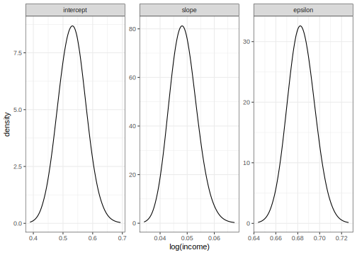
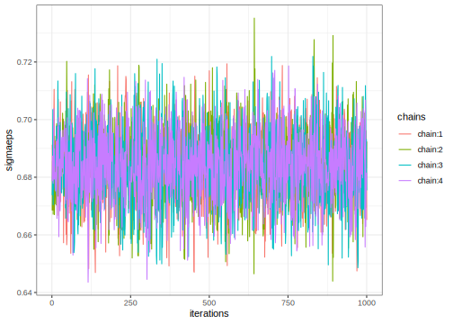
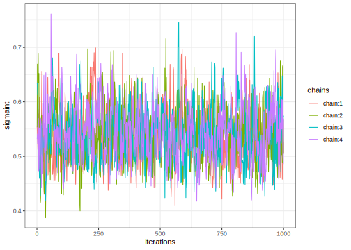
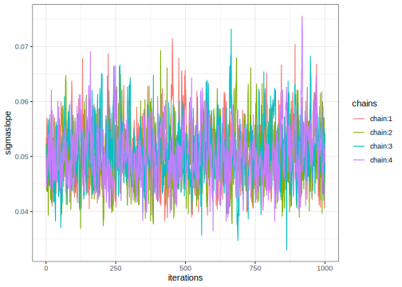
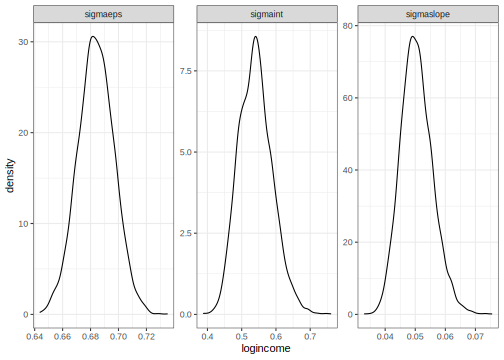
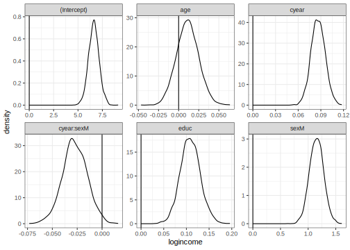
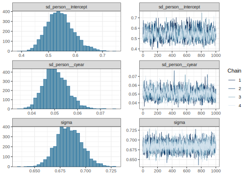
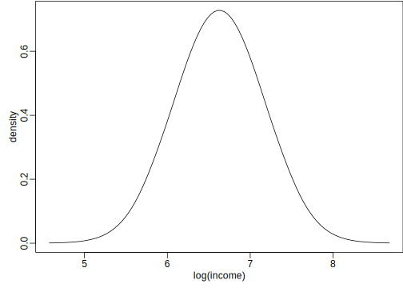
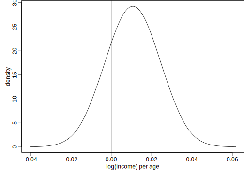

Longitudinal
================
[Julian Faraway](https://julianfaraway.github.io/)
09 August 2022

-   <a href="#data" id="toc-data">Data</a>
-   <a href="#mixed-effect-model" id="toc-mixed-effect-model">Mixed Effect
    Model</a>
-   <a href="#inla" id="toc-inla">INLA</a>
-   <a href="#stan" id="toc-stan">STAN</a>
    -   <a href="#diagnostics" id="toc-diagnostics">Diagnostics</a>
    -   <a href="#output-summary" id="toc-output-summary">Output Summary</a>
    -   <a href="#posterior-distributions"
        id="toc-posterior-distributions">Posterior Distributions</a>
-   <a href="#brms" id="toc-brms">BRMS</a>
-   <a href="#mgcv" id="toc-mgcv">MGCV</a>
-   <a href="#ginla" id="toc-ginla">GINLA</a>
-   <a href="#discussion" id="toc-discussion">Discussion</a>
-   <a href="#package-version-info" id="toc-package-version-info">Package
    version info</a>

See the [introduction](index.md) for an overview.

This example is discussed in more detail in my book [Extending the
Linear Model with R](https://julianfaraway.github.io/faraway/ELM/)

Required libraries:

``` r
library(faraway)
library(ggplot2)
library(lme4)
library(pbkrtest)
library(RLRsim)
library(INLA)
library(knitr)
library(rstan, quietly=TRUE)
library(brms)
library(mgcv)
```

# Data

The Panel Study of Income Dynamics (PSID), begun in 1968, is a
longitudinal study of a representative sample of U.S. individuals. The
study is conducted at the Survey Research Center, Institute for Social
Research, University of Michigan, and is still continuing. There are
currently 8700 households in the study and many variables are measured.
We chose to analyze a random subset of this data, consisting of 85 heads
of household who were aged 25–39 in 1968 and had complete data for at
least 11 of the years between 1968 and 1990. The variables included were
annual income, gender, years of education and age in 1968:

Load in the data:

``` r
data(psid, package="faraway")
head(psid)
```

      age educ sex income year person
    1  31   12   M   6000   68      1
    2  31   12   M   5300   69      1
    3  31   12   M   5200   70      1
    4  31   12   M   6900   71      1
    5  31   12   M   7500   72      1
    6  31   12   M   8000   73      1

``` r
summary(psid)
```

          age            educ      sex         income            year          person    
     Min.   :25.0   Min.   : 3.0   F:732   Min.   :     3   Min.   :68.0   Min.   : 1.0  
     1st Qu.:28.0   1st Qu.:10.0   M:929   1st Qu.:  4300   1st Qu.:73.0   1st Qu.:20.0  
     Median :34.0   Median :12.0           Median :  9000   Median :78.0   Median :42.0  
     Mean   :32.2   Mean   :11.8           Mean   : 13575   Mean   :78.6   Mean   :42.4  
     3rd Qu.:36.0   3rd Qu.:13.0           3rd Qu.: 18050   3rd Qu.:84.0   3rd Qu.:63.0  
     Max.   :39.0   Max.   :16.0           Max.   :180000   Max.   :90.0   Max.   :85.0  

``` r
psid$cyear <- psid$year-78
```

We have centered the time variable year. Some plots of just 20 of the
subjects:

``` r
psid20 <- dplyr::filter(psid, person <= 20)
ggplot(psid20, aes(x=year, y=income))+geom_line()+facet_wrap(~ person)
```

<!-- -->

``` r
ggplot(psid20, aes(x=year, y=income+100, group=person)) +geom_line()+facet_wrap(~ sex)+scale_y_log10()
```

<!-- -->

# Mixed Effect Model

Suppose that the income change over time can be partly predicted by the
subject’s age, sex and educational level. The variation may be
partitioned into two components. Clearly there are other factors that
will affect a subject’s income. These factors may cause the income to be
generally higher or lower or they may cause the income to grow at a
faster or slower rate. We can model this variation with a random
intercept and slope, respectively, for each subject. We also expect that
there will be some year-to-year variation within each subject. For
simplicity, let us initially assume that this error is homogeneous and
uncorrelated. We also center the year to aid interpretation. We may
express these notions in the model:

``` r
mmod <- lmer(log(income) ~ cyear*sex +age+educ+(1 | person) + (0 + cyear | person), psid)
faraway::sumary(mmod, digits=3)
```

    Fixed Effects:
                coef.est coef.se
    (Intercept)  6.628    0.552 
    cyear        0.086    0.009 
    sexM         1.153    0.121 
    age          0.011    0.014 
    educ         0.109    0.022 
    cyear:sexM  -0.026    0.012 

    Random Effects:
     Groups   Name        Std.Dev.
     person   (Intercept) 0.531   
     person.1 cyear       0.049   
     Residual             0.683   
    ---
    number of obs: 1661, groups: person, 85
    AIC = 3839.7, DIC = 3753.4
    deviance = 3787.6 

This model can be written as:

}_{ij} &= \mu + \beta_{y} \mathrm{year}_i + \beta_s \mathrm{sex}_j + \beta_{ys} \mathrm{sex}_j \times \mathrm{year}_i + \beta_e \mathrm{educ}_j + \beta_a \mathrm{age}_j \\ &+ \gamma^0_j + \gamma^1_j \mathrm{year}_i + \epsilon_{ij}
\end{aligned}")

where

indexes the year and

indexes the individual. We have:

 \sim
  N(0,\sigma^2 D)")

We have chosen not to have an interaction between the intercept and the
slope random effects and so

is a diagonal matrix. It is possible to have such an interaction in
`lmer()` models but not in some of the models below. As it happens, if
you do fit a model with such an interaction, you find that it is not
significant. Hence dropping it does not make much difference in this
instance.

We can test the interaction term in the fixed effect part of the model:

``` r
mmod <- lmer(log(income) ~ cyear*sex +age+educ+(1 | person) + (0 + cyear | person),psid, REML=FALSE)
mmodr <- lmer(log(income) ~ cyear + sex +age+educ+(1 | person) + (0 + cyear | person),psid, REML=FALSE)
KRmodcomp(mmod,mmodr)
```

    large : log(income) ~ cyear + sex + age + educ + (1 | person) + (0 + 
        cyear | person) + cyear:sex
    small : log(income) ~ cyear + sex + age + educ + (1 | person) + (0 + 
        cyear | person)
           stat   ndf   ddf F.scaling p.value
    Ftest  4.63  1.00 81.47         1   0.034

We find that the interaction is statistically significant. We can also
compute bootstrap confidence intervals:

``` r
confint(mmod, method="boot", oldNames=FALSE)
```

                              2.5 %     97.5 %
    sd_(Intercept)|person  0.411981  0.5809274
    sd_cyear|person        0.037825  0.0575211
    sigma                  0.661303  0.7086194
    (Intercept)            5.646632  7.5528429
    cyear                  0.067345  0.1045087
    sexM                   0.943652  1.4037432
    age                   -0.013466  0.0360966
    educ                   0.069258  0.1467073
    cyear:sexM            -0.050878 -0.0031062

We see that all the standard deviations are clearly well above zero. The
age effect does not look significant.

# INLA

Integrated nested Laplace approximation is a method of Bayesian
computation which uses approximation rather than simulation. More can be
found on this topic in [Bayesian Regression Modeling with
INLA](http://julianfaraway.github.io/brinla/) and the [chapter on
GLMMs](https://julianfaraway.github.io/brinlabook/chaglmm.html)

Use the most recent computational methodology:

``` r
inla.setOption(inla.mode="experimental")
inla.setOption("short.summary",TRUE)
```

We need to create a duplicate of the person variable because this
variable appears in two random effect terms and INLA requires these be
distinct. We fit the default INLA model:

``` r
psid$slperson <- psid$person
formula <- log(income) ~ cyear*sex+age+educ + f(person, model="iid") + f(slperson, cyear , model="iid")
result <- inla(formula, family="gaussian", data=psid)
summary(result)
```

    Fixed effects:
                  mean    sd 0.025quant 0.5quant 0.975quant   mode kld
    (Intercept)  6.629 0.548      5.551    6.629      7.707  6.629   0
    cyear        0.086 0.009      0.068    0.086      0.103  0.085   0
    sexM         1.153 0.121      0.916    1.153      1.391  1.153   0
    age          0.011 0.014     -0.016    0.011      0.037  0.011   0
    educ         0.109 0.022      0.066    0.109      0.151  0.109   0
    cyear:sexM  -0.026 0.012     -0.051   -0.026     -0.002 -0.026   0

    Model hyperparameters:
                                              mean     sd 0.025quant 0.5quant 0.975quant   mode
    Precision for the Gaussian observations   2.14  0.079       1.99     2.14       2.30   2.14
    Precision for person                      3.66  0.626       2.56     3.62       5.02   3.55
    Precision for slperson                  436.39 92.298     285.76   425.80     647.60 404.33

     is computed 

In this case, the default priors appear to produce believable results
for the precisions.

``` r
sigmaint <- inla.tmarginal(function(x) 1/sqrt(exp(x)),result$internal.marginals.hyperpar[[2]])
sigmaslope <- inla.tmarginal(function(x) 1/sqrt(exp(x)),result$internal.marginals.hyperpar[[3]])
sigmaepsilon <- inla.tmarginal(function(x) 1/sqrt(exp(x)),result$internal.marginals.hyperpar[[1]])
restab=sapply(result$marginals.fixed, function(x) inla.zmarginal(x,silent=TRUE))
restab=cbind(restab, inla.zmarginal(sigmaint,silent=TRUE))
restab=cbind(restab, inla.zmarginal(sigmaslope,silent=TRUE))
restab=cbind(restab, inla.zmarginal(sigmaepsilon,silent=TRUE))
mm <- model.matrix(~ cyear*sex+age+educ,psid)
colnames(restab) = c("Intercept",colnames(mm)[-1],"intSD","slopeSD","epsilon")
data.frame(restab) |> kable()
```

|            | Intercept | cyear     | sexM    | age       | educ     | cyear.sexM | intSD    | slopeSD   | epsilon  |
|:-----------|:----------|:----------|:--------|:----------|:---------|:-----------|:---------|:----------|:---------|
| mean       | 6.629     | 0.085573  | 1.1532  | 0.010667  | 0.10869  | -0.026309  | 0.52808  | 0.048651  | 0.68342  |
| sd         | 0.54811   | 0.0090003 | 0.12063 | 0.013624  | 0.021683 | 0.012231   | 0.045015 | 0.0050142 | 0.012447 |
| quant0.025 | 5.5508    | 0.067953  | 0.91584 | -0.016153 | 0.066039 | -0.050504  | 0.44689  | 0.039366  | 0.65928  |
| quant0.25  | 6.2607    | 0.079512  | 1.0721  | 0.0015177 | 0.094125 | -0.034498  | 0.49642  | 0.045143  | 0.6749   |
| quant0.5   | 6.6277    | 0.085522  | 1.1529  | 0.010642  | 0.10864  | -0.02629   | 0.52535  | 0.048462  | 0.68329  |
| quant0.75  | 6.9948    | 0.091562  | 1.2337  | 0.019762  | 0.12316  | -0.018124  | 0.55694  | 0.051924  | 0.69177  |
| quant0.975 | 7.7052    | 0.10333   | 1.39    | 0.0374    | 0.15127  | -0.0024213 | 0.62354  | 0.059035  | 0.70817  |

Also construct a plot the SD posteriors:

``` r
ddf <- data.frame(rbind(sigmaint,sigmaslope,sigmaepsilon),errterm=gl(3,nrow(sigmaint),labels = c("intercept","slope","epsilon")))
ggplot(ddf, aes(x,y))+geom_line()+xlab("log(income)")+ylab("density") + 
  facet_wrap(~ errterm, scales = "free")
```

<!-- -->

Posteriors look OK.

# STAN

[STAN](https://mc-stan.org/) performs Bayesian inference using MCMC. Set
up STAN to use multiple cores. Set the random number seed for
reproducibility.

``` r
rstan_options(auto_write = TRUE)
options(mc.cores = parallel::detectCores())
set.seed(123)
```

Fit the model. Requires use of STAN command file
[longitudinal.stan](../stancode/longitudinal.stan). We view the code
here:

``` r
writeLines(readLines("../stancode/longitudinal.stan"))
```

    data {
         int<lower=0> Nobs;
         int<lower=0> Npreds;
         int<lower=0> Ngroups;
         vector[Nobs] y;
         matrix[Nobs,Npreds] x;
         vector[Nobs] timevar;
         int<lower=1,upper=Ngroups> group[Nobs];
    }
    parameters {
               vector[Npreds] beta;
               real<lower=0> sigmaint;
               real<lower=0> sigmaslope;
               real<lower=0> sigmaeps;

               vector[Ngroups] etaint;
               vector[Ngroups] etaslope;
    }
    transformed parameters {
      vector[Ngroups] ranint;
      vector[Ngroups] ranslope;
      vector[Nobs] yhat;

      ranint  = sigmaint * etaint;
      ranslope  = sigmaslope * etaslope;

      for (i in 1:Nobs)
        yhat[i] = x[i]*beta+ranint[group[i]]+ranslope[group[i]]*timevar[i];

    }
    model {
      etaint ~ normal(0, 1);
      etaslope ~ normal(0, 1);
      y ~ normal(yhat, sigmaeps);
    }

We have used uninformative priors.

Set up the data as a list:

``` r
lmod <- lm(log(income) ~ cyear*sex +age+educ, psid)
x <- model.matrix(lmod)
psiddat <- list(Nobs = nrow(psid),
                Npreds = ncol(x),
                Ngroups = length(unique(psid$person)),
                y = log(psid$income),
                x = x,
                timevar = psid$cyear,
                group = psid$person)
```

Break the fitting of the model into three steps.

``` r
rt <- stanc("../stancode/longitudinal.stan")
sm <- stan_model(stanc_ret = rt, verbose=FALSE)
```

    Running /Library/Frameworks/R.framework/Resources/bin/R CMD SHLIB foo.c
    clang -mmacosx-version-min=10.13 -I"/Library/Frameworks/R.framework/Resources/include" -DNDEBUG   -I"/Library/Frameworks/R.framework/Versions/4.2/Resources/library/Rcpp/include/"  -I"/Library/Frameworks/R.framework/Versions/4.2/Resources/library/RcppEigen/include/"  -I"/Library/Frameworks/R.framework/Versions/4.2/Resources/library/RcppEigen/include/unsupported"  -I"/Library/Frameworks/R.framework/Versions/4.2/Resources/library/BH/include" -I"/Library/Frameworks/R.framework/Versions/4.2/Resources/library/StanHeaders/include/src/"  -I"/Library/Frameworks/R.framework/Versions/4.2/Resources/library/StanHeaders/include/"  -I"/Library/Frameworks/R.framework/Versions/4.2/Resources/library/RcppParallel/include/"  -I"/Library/Frameworks/R.framework/Versions/4.2/Resources/library/rstan/include" -DEIGEN_NO_DEBUG  -DBOOST_DISABLE_ASSERTS  -DBOOST_PENDING_INTEGER_LOG2_HPP  -DSTAN_THREADS  -DUSE_STANC3 -DSTRICT_R_HEADERS  -DBOOST_PHOENIX_NO_VARIADIC_EXPRESSION  -DBOOST_NO_AUTO_PTR  -include '/Library/Frameworks/R.framework/Versions/4.2/Resources/library/StanHeaders/include/stan/math/prim/fun/Eigen.hpp'  -D_REENTRANT -DRCPP_PARALLEL_USE_TBB=1   -I/usr/local/include   -fPIC  -Wall -g -O2  -c foo.c -o foo.o
    In file included from <built-in>:1:
    In file included from /Library/Frameworks/R.framework/Versions/4.2/Resources/library/StanHeaders/include/stan/math/prim/fun/Eigen.hpp:22:
    In file included from /Library/Frameworks/R.framework/Versions/4.2/Resources/library/RcppEigen/include/Eigen/Dense:1:
    In file included from /Library/Frameworks/R.framework/Versions/4.2/Resources/library/RcppEigen/include/Eigen/Core:88:
    /Library/Frameworks/R.framework/Versions/4.2/Resources/library/RcppEigen/include/Eigen/src/Core/util/Macros.h:628:1: error: unknown type name 'namespace'
    namespace Eigen {
    ^
    /Library/Frameworks/R.framework/Versions/4.2/Resources/library/RcppEigen/include/Eigen/src/Core/util/Macros.h:628:16: error: expected ';' after top level declarator
    namespace Eigen {
                   ^
                   ;
    In file included from <built-in>:1:
    In file included from /Library/Frameworks/R.framework/Versions/4.2/Resources/library/StanHeaders/include/stan/math/prim/fun/Eigen.hpp:22:
    In file included from /Library/Frameworks/R.framework/Versions/4.2/Resources/library/RcppEigen/include/Eigen/Dense:1:
    /Library/Frameworks/R.framework/Versions/4.2/Resources/library/RcppEigen/include/Eigen/Core:96:10: fatal error: 'complex' file not found
    #include <complex>
             ^~~~~~~~~
    3 errors generated.
    make: *** [foo.o] Error 1

``` r
set.seed(123)
system.time(fit <- sampling(sm, data=psiddat))
```

       user  system elapsed 
    289.888   2.022  87.807 

## Diagnostics

For the error SD:

``` r
muc <- rstan::extract(fit, pars="sigmaeps",  permuted=FALSE, inc_warmup=FALSE)
mdf <- reshape2::melt(muc)
ggplot(mdf,aes(x=iterations,y=value,color=chains)) + geom_line() + ylab(mdf$parameters[1])
```

<!-- -->

Looks OK. For the intercept SD

``` r
pname <- "sigmaint"
muc <- rstan::extract(fit, pars=pname,  permuted=FALSE, inc_warmup=FALSE)
mdf <- reshape2::melt(muc)
ggplot(mdf,aes(x=iterations,y=value,color=chains)) + geom_line() + ylab(mdf$parameters[1])
```

<!-- -->

Looks OK. For the slope SD.

``` r
pname <- "sigmaslope"
muc <- rstan::extract(fit, pars=pname,  permuted=FALSE, inc_warmup=FALSE)
mdf <- reshape2::melt(muc)
ggplot(mdf,aes(x=iterations,y=value,color=chains)) + geom_line() + ylab(mdf$parameters[1])
```

<!-- -->

Again satisfactory.

## Output Summary

Examine the main parameters of interest:

``` r
print(fit,par=c("beta","sigmaint","sigmaslope","sigmaeps"))
```

    Inference for Stan model: longitudinal.
    4 chains, each with iter=2000; warmup=1000; thin=1; 
    post-warmup draws per chain=1000, total post-warmup draws=4000.

                mean se_mean   sd  2.5%   25%   50%   75% 97.5% n_eff Rhat
    beta[1]     6.62    0.02 0.54  5.54  6.26  6.62  6.97  7.72   701 1.01
    beta[2]     0.09    0.00 0.01  0.07  0.08  0.09  0.09  0.10  1062 1.01
    beta[3]     1.15    0.01 0.13  0.91  1.07  1.15  1.24  1.41   600 1.01
    beta[4]     0.01    0.00 0.01 -0.02  0.00  0.01  0.02  0.04   747 1.01
    beta[5]     0.11    0.00 0.02  0.07  0.09  0.11  0.12  0.15   740 1.00
    beta[6]    -0.03    0.00 0.01 -0.05 -0.04 -0.03 -0.02  0.00  1006 1.00
    sigmaint    0.54    0.00 0.05  0.45  0.50  0.54  0.57  0.64   811 1.00
    sigmaslope  0.05    0.00 0.01  0.04  0.05  0.05  0.05  0.06  1062 1.00
    sigmaeps    0.68    0.00 0.01  0.66  0.68  0.68  0.69  0.71  4315 1.00

    Samples were drawn using NUTS(diag_e) at Tue Aug  9 14:33:49 2022.
    For each parameter, n_eff is a crude measure of effective sample size,
    and Rhat is the potential scale reduction factor on split chains (at 
    convergence, Rhat=1).

Remember that the beta correspond to the following parameters:

``` r
colnames(x)
```

    [1] "(Intercept)" "cyear"       "sexM"        "age"         "educ"        "cyear:sexM" 

## Posterior Distributions

First the random effect parameters:

``` r
postsig <- rstan::extract(fit, pars=c("sigmaint","sigmaslope","sigmaeps"))
ref <- reshape2::melt(postsig)
colnames(ref)[2:3] <- c("logincome","parameter")
ggplot(data=ref,aes(x=logincome))+geom_density()+facet_wrap(~parameter,scales="free")
```

<!-- -->

The slope parameter is not on the same scale.

``` r
ref <- reshape2::melt(rstan::extract(fit, pars="beta")$beta)
colnames(ref)[2:3] <- c("parameter","logincome")
ref$parameter <- factor(colnames(x)[ref$parameter])
ggplot(ref, aes(x=logincome))+geom_density()+geom_vline(xintercept=0)+facet_wrap(~parameter,scales="free")
```

<!-- -->

We see that age and possibly the year:sex interaction are the only terms
which may not contribute much,

# BRMS

[BRMS](https://paul-buerkner.github.io/brms/) stands for Bayesian
Regression Models with STAN. It provides a convenient wrapper to STAN
functionality. We specify the model as in `lmer()` above.

``` r
suppressMessages(bmod <- brm(log(income) ~ cyear*sex +age+educ+(1 | person) + (0 + cyear | person),data=psid, cores=4))
```

    Running /Library/Frameworks/R.framework/Resources/bin/R CMD SHLIB foo.c
    clang -mmacosx-version-min=10.13 -I"/Library/Frameworks/R.framework/Resources/include" -DNDEBUG   -I"/Library/Frameworks/R.framework/Versions/4.2/Resources/library/Rcpp/include/"  -I"/Library/Frameworks/R.framework/Versions/4.2/Resources/library/RcppEigen/include/"  -I"/Library/Frameworks/R.framework/Versions/4.2/Resources/library/RcppEigen/include/unsupported"  -I"/Library/Frameworks/R.framework/Versions/4.2/Resources/library/BH/include" -I"/Library/Frameworks/R.framework/Versions/4.2/Resources/library/StanHeaders/include/src/"  -I"/Library/Frameworks/R.framework/Versions/4.2/Resources/library/StanHeaders/include/"  -I"/Library/Frameworks/R.framework/Versions/4.2/Resources/library/RcppParallel/include/"  -I"/Library/Frameworks/R.framework/Versions/4.2/Resources/library/rstan/include" -DEIGEN_NO_DEBUG  -DBOOST_DISABLE_ASSERTS  -DBOOST_PENDING_INTEGER_LOG2_HPP  -DSTAN_THREADS  -DUSE_STANC3 -DSTRICT_R_HEADERS  -DBOOST_PHOENIX_NO_VARIADIC_EXPRESSION  -DBOOST_NO_AUTO_PTR  -include '/Library/Frameworks/R.framework/Versions/4.2/Resources/library/StanHeaders/include/stan/math/prim/fun/Eigen.hpp'  -D_REENTRANT -DRCPP_PARALLEL_USE_TBB=1   -I/usr/local/include   -fPIC  -Wall -g -O2  -c foo.c -o foo.o
    In file included from <built-in>:1:
    In file included from /Library/Frameworks/R.framework/Versions/4.2/Resources/library/StanHeaders/include/stan/math/prim/fun/Eigen.hpp:22:
    In file included from /Library/Frameworks/R.framework/Versions/4.2/Resources/library/RcppEigen/include/Eigen/Dense:1:
    In file included from /Library/Frameworks/R.framework/Versions/4.2/Resources/library/RcppEigen/include/Eigen/Core:88:
    /Library/Frameworks/R.framework/Versions/4.2/Resources/library/RcppEigen/include/Eigen/src/Core/util/Macros.h:628:1: error: unknown type name 'namespace'
    namespace Eigen {
    ^
    /Library/Frameworks/R.framework/Versions/4.2/Resources/library/RcppEigen/include/Eigen/src/Core/util/Macros.h:628:16: error: expected ';' after top level declarator
    namespace Eigen {
                   ^
                   ;
    In file included from <built-in>:1:
    In file included from /Library/Frameworks/R.framework/Versions/4.2/Resources/library/StanHeaders/include/stan/math/prim/fun/Eigen.hpp:22:
    In file included from /Library/Frameworks/R.framework/Versions/4.2/Resources/library/RcppEigen/include/Eigen/Dense:1:
    /Library/Frameworks/R.framework/Versions/4.2/Resources/library/RcppEigen/include/Eigen/Core:96:10: fatal error: 'complex' file not found
    #include <complex>
             ^~~~~~~~~
    3 errors generated.
    make: *** [foo.o] Error 1

We can obtain some posterior densities and diagnostics with:

``` r
plot(bmod, variable = "^s", regex=TRUE)
```

<!-- -->

We have chosen only the random effect hyperparameters since this is
where problems will appear first. Looks OK.

We can look at the STAN code that `brms` used with:

``` r
stancode(bmod)
```

    // generated with brms 2.17.0
    functions {
    }
    data {
      int<lower=1> N;  // total number of observations
      vector[N] Y;  // response variable
      int<lower=1> K;  // number of population-level effects
      matrix[N, K] X;  // population-level design matrix
      // data for group-level effects of ID 1
      int<lower=1> N_1;  // number of grouping levels
      int<lower=1> M_1;  // number of coefficients per level
      int<lower=1> J_1[N];  // grouping indicator per observation
      // group-level predictor values
      vector[N] Z_1_1;
      // data for group-level effects of ID 2
      int<lower=1> N_2;  // number of grouping levels
      int<lower=1> M_2;  // number of coefficients per level
      int<lower=1> J_2[N];  // grouping indicator per observation
      // group-level predictor values
      vector[N] Z_2_1;
      int prior_only;  // should the likelihood be ignored?
    }
    transformed data {
      int Kc = K - 1;
      matrix[N, Kc] Xc;  // centered version of X without an intercept
      vector[Kc] means_X;  // column means of X before centering
      for (i in 2:K) {
        means_X[i - 1] = mean(X[, i]);
        Xc[, i - 1] = X[, i] - means_X[i - 1];
      }
    }
    parameters {
      vector[Kc] b;  // population-level effects
      real Intercept;  // temporary intercept for centered predictors
      real<lower=0> sigma;  // dispersion parameter
      vector<lower=0>[M_1] sd_1;  // group-level standard deviations
      vector[N_1] z_1[M_1];  // standardized group-level effects
      vector<lower=0>[M_2] sd_2;  // group-level standard deviations
      vector[N_2] z_2[M_2];  // standardized group-level effects
    }
    transformed parameters {
      vector[N_1] r_1_1;  // actual group-level effects
      vector[N_2] r_2_1;  // actual group-level effects
      real lprior = 0;  // prior contributions to the log posterior
      r_1_1 = (sd_1[1] * (z_1[1]));
      r_2_1 = (sd_2[1] * (z_2[1]));
      lprior += student_t_lpdf(Intercept | 3, 9.1, 2.5);
      lprior += student_t_lpdf(sigma | 3, 0, 2.5)
        - 1 * student_t_lccdf(0 | 3, 0, 2.5);
      lprior += student_t_lpdf(sd_1 | 3, 0, 2.5)
        - 1 * student_t_lccdf(0 | 3, 0, 2.5);
      lprior += student_t_lpdf(sd_2 | 3, 0, 2.5)
        - 1 * student_t_lccdf(0 | 3, 0, 2.5);
    }
    model {
      // likelihood including constants
      if (!prior_only) {
        // initialize linear predictor term
        vector[N] mu = Intercept + rep_vector(0.0, N);
        for (n in 1:N) {
          // add more terms to the linear predictor
          mu[n] += r_1_1[J_1[n]] * Z_1_1[n] + r_2_1[J_2[n]] * Z_2_1[n];
        }
        target += normal_id_glm_lpdf(Y | Xc, mu, b, sigma);
      }
      // priors including constants
      target += lprior;
      target += std_normal_lpdf(z_1[1]);
      target += std_normal_lpdf(z_2[1]);
    }
    generated quantities {
      // actual population-level intercept
      real b_Intercept = Intercept - dot_product(means_X, b);
    }

We see that `brms` is using student t distributions with 3 degrees of
freedom for the priors. For the error SDs, this will be truncated at
zero to form half-t distributions. You can get a more explicit
description of the priors with `prior_summary(bmod)`. We examine the
fit:

``` r
summary(bmod)
```

     Family: gaussian 
      Links: mu = identity; sigma = identity 
    Formula: log(income) ~ cyear * sex + age + educ + (1 | person) + (0 + cyear | person) 
       Data: psid (Number of observations: 1661) 
      Draws: 4 chains, each with iter = 2000; warmup = 1000; thin = 1;
             total post-warmup draws = 4000

    Group-Level Effects: 
    ~person (Number of levels: 85) 
                  Estimate Est.Error l-95% CI u-95% CI Rhat Bulk_ESS Tail_ESS
    sd(Intercept)     0.54      0.05     0.46     0.64 1.01     1092     1442
    sd(cyear)         0.05      0.01     0.04     0.06 1.00     1416     2056

    Population-Level Effects: 
               Estimate Est.Error l-95% CI u-95% CI Rhat Bulk_ESS Tail_ESS
    Intercept      6.65      0.55     5.56     7.73 1.00     1064     1963
    cyear          0.09      0.01     0.07     0.10 1.01     1789     2287
    sexM           1.15      0.12     0.91     1.39 1.00     1052     1717
    age            0.01      0.01    -0.02     0.04 1.00     1050     1545
    educ           0.11      0.02     0.06     0.15 1.00     1053     1538
    cyear:sexM    -0.03      0.01    -0.05    -0.00 1.00     1778     2140

    Family Specific Parameters: 
          Estimate Est.Error l-95% CI u-95% CI Rhat Bulk_ESS Tail_ESS
    sigma     0.68      0.01     0.66     0.71 1.00     4552     3149

    Draws were sampled using sampling(NUTS). For each parameter, Bulk_ESS
    and Tail_ESS are effective sample size measures, and Rhat is the potential
    scale reduction factor on split chains (at convergence, Rhat = 1).

The results are consistent with those seen previously.

# MGCV

It is possible to fit some GLMMs within the GAM framework of the `mgcv`
package. An explanation of this can be found in this
[blog](https://fromthebottomoftheheap.net/2021/02/02/random-effects-in-gams/).
The `s()` function requires `person` to be a factor to achieve the
expected outcome.

``` r
psid$person = factor(psid$person)
gmod = gam(log(income) ~ cyear*sex + age + educ + 
             s(person, bs = 're') + s(person, cyear, bs = 're'), data=psid, method="REML")
```

and look at the summary output:

``` r
summary(gmod)
```


    Family: gaussian 
    Link function: identity 

    Formula:
    log(income) ~ cyear * sex + age + educ + s(person, bs = "re") + 
        s(person, cyear, bs = "re")

    Parametric coefficients:
                Estimate Std. Error t value Pr(>|t|)
    (Intercept)  6.62759    0.55174   12.01   <2e-16
    cyear        0.08565    0.00904    9.47   <2e-16
    sexM         1.15349    0.12144    9.50   <2e-16
    age          0.01067    0.01372    0.78    0.437
    educ         0.10874    0.02183    4.98    7e-07
    cyear:sexM  -0.02644    0.01229   -2.15    0.032

    Approximate significance of smooth terms:
                     edf Ref.df     F p-value
    s(person)       73.6     81 14.73  <2e-16
    s(person,cyear) 63.3     83  7.38  <2e-16

    R-sq.(adj) =  0.673   Deviance explained = 70.1%
    -REML = 1910.9  Scale est. = 0.46693   n = 1661

We get the fixed effect estimates. We also get tests on the random
effects (as described in this
[article](https://doi.org/10.1093/biomet/ast038). The hypothesis of no
variation is rejected in both cases. This is consistent with earlier
findings.

We can get an estimate of the operator and error SD:

``` r
gam.vcomp(gmod)
```


    Standard deviations and 0.95 confidence intervals:

                     std.dev    lower    upper
    s(person)       0.531482 0.449062 0.629030
    s(person,cyear) 0.049289 0.040273 0.060323
    scale           0.683325 0.659216 0.708315

    Rank: 3/3

The point estimates are the same as the REML estimates from `lmer`
earlier. The confidence intervals are slightly different. A bootstrap
method was used for the `lmer` fit whereas `gam` is using an asymptotic
approximation resulting in slightly different results.

The fixed and random effect estimates can be found with:

``` r
head(coef(gmod),20)
```

     (Intercept)        cyear         sexM          age         educ   cyear:sexM  s(person).1  s(person).2  s(person).3 
       6.6275863    0.0856540    1.1534910    0.0106748    0.1087393   -0.0264416   -0.0352094   -0.0070974   -0.1022664 
     s(person).4  s(person).5  s(person).6  s(person).7  s(person).8  s(person).9 s(person).10 s(person).11 s(person).12 
       0.1322106   -0.5742115    0.2137369    0.4336553   -0.6408237    0.3183853    0.1176814    0.3062349    0.3806784 
    s(person).13 s(person).14 
       0.1629332   -0.5551002 

We have not printed them all out because they are too many in number to
appreciate.

# GINLA

In [Wood (2019)](https://doi.org/10.1093/biomet/asz044), a simplified
version of INLA is proposed. The first construct the GAM model without
fitting and then use the `ginla()` function to perform the computation.

``` r
gmod = gam(log(income) ~ cyear*sex + age + educ + 
             s(person, bs = 're') + s(person, cyear, bs = 're'), data=psid, fit = FALSE)
gimod = ginla(gmod)
```

We get the posterior density for the intercept as:

``` r
plot(gimod$beta[1,],gimod$density[1,],type="l",xlab="log(income)",ylab="density")
```

<!-- -->

and for the age fixed effects as:

``` r
plot(gimod$beta[4,],gimod$density[4,],type="l",xlab="log(income) per age",ylab="density")
abline(v=0)
```

<!-- -->

We see that the posterior for the age effect substantially overlaps
zero.

It is not straightforward to obtain the posterior densities of the
hyperparameters.

# Discussion

See the [Discussion of the single random effect
model](pulp.md#Discussion) for general comments.

-   INLA and mgcv were unable to fit a model with an interaction between
    the random effects. STAN, brms and lme4 can do this.

-   There is relatively little disagreement between the methods and much
    similarity.

-   There were no major computational issue with the analyses (in
    contrast with some of the other examples)

-   The `mgcv` analyses took a little longer than previous analyses
    because the sample size is larger (but still were quite fast).

# Package version info

``` r
sessionInfo()
```

    R version 4.2.1 (2022-06-23)
    Platform: x86_64-apple-darwin17.0 (64-bit)
    Running under: macOS Big Sur ... 10.16

    Matrix products: default
    BLAS:   /Library/Frameworks/R.framework/Versions/4.2/Resources/lib/libRblas.0.dylib
    LAPACK: /Library/Frameworks/R.framework/Versions/4.2/Resources/lib/libRlapack.dylib

    locale:
    [1] en_GB.UTF-8/en_GB.UTF-8/en_GB.UTF-8/C/en_GB.UTF-8/en_GB.UTF-8

    attached base packages:
    [1] parallel  stats     graphics  grDevices utils     datasets  methods   base     

    other attached packages:
     [1] mgcv_1.8-40         nlme_3.1-158        brms_2.17.0         Rcpp_1.0.9          rstan_2.26.13      
     [6] StanHeaders_2.26.13 knitr_1.39          INLA_22.07.23       sp_1.5-0            foreach_1.5.2      
    [11] RLRsim_3.1-8        pbkrtest_0.5.1      lme4_1.1-30         Matrix_1.4-1        ggplot2_3.3.6      
    [16] faraway_1.0.8      

    loaded via a namespace (and not attached):
      [1] minqa_1.2.4          colorspace_2.0-3     ellipsis_0.3.2       ggridges_0.5.3       markdown_1.1        
      [6] base64enc_0.1-3      rstudioapi_0.13      Deriv_4.1.3          farver_2.1.1         DT_0.23             
     [11] fansi_1.0.3          mvtnorm_1.1-3        bridgesampling_1.1-2 codetools_0.2-18     splines_4.2.1       
     [16] shinythemes_1.2.0    bayesplot_1.9.0      jsonlite_1.8.0       nloptr_2.0.3         broom_1.0.0         
     [21] shiny_1.7.2          compiler_4.2.1       backports_1.4.1      assertthat_0.2.1     fastmap_1.1.0       
     [26] cli_3.3.0            later_1.3.0          htmltools_0.5.3      prettyunits_1.1.1    tools_4.2.1         
     [31] igraph_1.3.4         coda_0.19-4          gtable_0.3.0         glue_1.6.2           reshape2_1.4.4      
     [36] dplyr_1.0.9          posterior_1.2.2      V8_4.2.0             vctrs_0.4.1          svglite_2.1.0       
     [41] iterators_1.0.14     crosstalk_1.2.0      tensorA_0.36.2       xfun_0.31            stringr_1.4.0       
     [46] ps_1.7.1             mime_0.12            miniUI_0.1.1.1       lifecycle_1.0.1      gtools_3.9.3        
     [51] MASS_7.3-58          zoo_1.8-10           scales_1.2.0         colourpicker_1.1.1   promises_1.2.0.1    
     [56] Brobdingnag_1.2-7    inline_0.3.19        shinystan_2.6.0      yaml_2.3.5           curl_4.3.2          
     [61] gridExtra_2.3        loo_2.5.1            stringi_1.7.8        highr_0.9            dygraphs_1.1.1.6    
     [66] checkmate_2.1.0      boot_1.3-28          pkgbuild_1.3.1       systemfonts_1.0.4    rlang_1.0.4         
     [71] pkgconfig_2.0.3      matrixStats_0.62.0   distributional_0.3.0 evaluate_0.15        lattice_0.20-45     
     [76] purrr_0.3.4          labeling_0.4.2       rstantools_2.2.0     htmlwidgets_1.5.4    processx_3.7.0      
     [81] tidyselect_1.1.2     plyr_1.8.7           magrittr_2.0.3       R6_2.5.1             generics_0.1.3      
     [86] DBI_1.1.3            pillar_1.8.0         withr_2.5.0          xts_0.12.1           abind_1.4-5         
     [91] tibble_3.1.8         crayon_1.5.1         utf8_1.2.2           rmarkdown_2.14       grid_4.2.1          
     [96] callr_3.7.1          threejs_0.3.3        digest_0.6.29        xtable_1.8-4         tidyr_1.2.0         
    [101] httpuv_1.6.5         RcppParallel_5.1.5   stats4_4.2.1         munsell_0.5.0        shinyjs_2.1.0       
