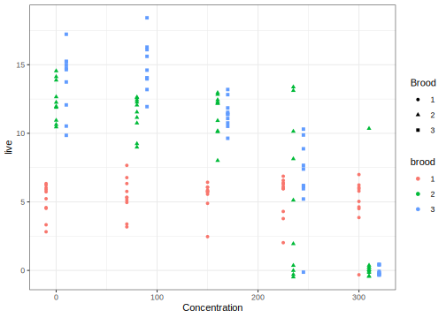
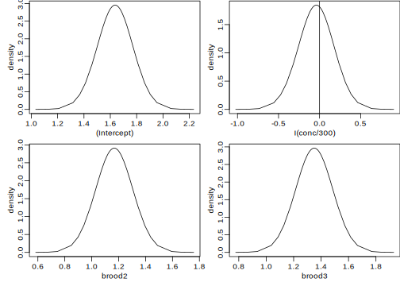
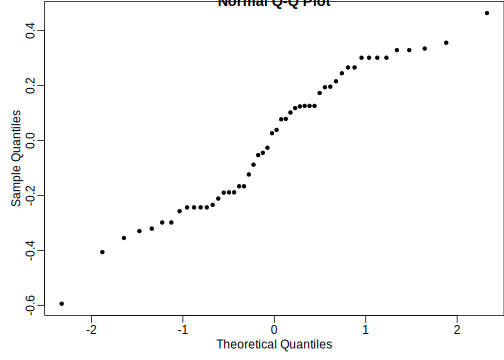

Poisson GLMM
================
[Julian Faraway](https://julianfaraway.github.io/)
22 August 2022

-   <a href="#data-and-model" id="toc-data-and-model">Data and Model</a>
-   <a href="#lme4" id="toc-lme4">LME4</a>
-   <a href="#inla" id="toc-inla">INLA</a>
-   <a href="#brms" id="toc-brms">BRMS</a>
-   <a href="#mgcv" id="toc-mgcv">MGCV</a>
-   <a href="#ginla" id="toc-ginla">GINLA</a>
-   <a href="#discussion" id="toc-discussion">Discussion</a>
-   <a href="#package-version-info" id="toc-package-version-info">Package
    version info</a>

See the [introduction](../index.md) for an overview.

This example is discussed in more detail in the book [Bayesian
Regression Modeling with
INLA](https://julianfaraway.github.io/brinlabook/chaglmm.html#sec:poissonglmm)

Packages used:

``` r
library(ggplot2)
library(lme4)
library(INLA)
library(knitr)
library(brms)
library(mgcv)
```

# Data and Model

In [Davison and Hinkley,
1997](https://doi.org/10.1017/CBO9780511802843), the results of a study
on Nitrofen, a herbicide, are reported. Due to concern regarding the
effect on animal life, 50 female water fleas were divided into five
groups of ten each and treated with different concentrations of the
herbicide. The number of offspring in three subsequent broods for each
flea was recorded. We start by loading the data from the `boot` package:
(the `boot` package comes with base R distribution so there is no need
to download this)

``` r
data(nitrofen, package="boot")
head(nitrofen)
```

      conc brood1 brood2 brood3 total
    1    0      3     14     10    27
    2    0      5     12     15    32
    3    0      6     11     17    34
    4    0      6     12     15    33
    5    0      6     15     15    36
    6    0      5     14     15    34

We need to rearrange the data to have one response value per line:

``` r
lnitrofen = data.frame(conc = rep(nitrofen$conc,each=3),
  live = as.numeric(t(as.matrix(nitrofen[,2:4]))),
  id = rep(1:50,each=3),
  brood = rep(1:3,50))
head(lnitrofen)
```

      conc live id brood
    1    0    3  1     1
    2    0   14  1     2
    3    0   10  1     3
    4    0    5  2     1
    5    0   12  2     2
    6    0   15  2     3

Make a plot of the data:

``` r
lnitrofen$jconc <- lnitrofen$conc + rep(c(-10,0,10),50)
lnitrofen$fbrood = factor(lnitrofen$brood)
ggplot(lnitrofen, aes(x=jconc,y=live, shape=fbrood, color=fbrood)) + 
       geom_point(position = position_jitter(w = 0, h = 0.5)) + 
       xlab("Concentration") + labs(shape = "Brood")
```

<figure>

<figcaption aria-hidden="true">Figure 1: The number of live offspring
varies with the concentration of Nitrofen and the brood
number.</figcaption>
</figure>

Since the response is a small count, a Poisson model is a natural
choice. We expect the rate of the response to vary with the brood and
concentration level. The plot of the data suggests these two predictors
may have an interaction. The three observations for a single flea are
likely to be correlated. We might expect a given flea to tend to produce
more, or less, offspring over a lifetime. We can model this with an
additive random effect. The linear predictor is:

$$
\eta_i = x_i^T \beta + u_{j(i)}, \quad i=1, \dots, 150. \quad j=1, \dots 50,
$$

where $x_i$ is a vector from the design matrix encoding the information
about the $i^{th}$ observation and $u_j$ is the random affect associated
with the $j^{th}$ flea. The response has distribution
$Y_i \sim Poisson(\exp(\eta_i))$.

# LME4

We fit a model using penalized quasi-likelihood (PQL) using the `lme4`
package:

``` r
glmod <- glmer(live ~ I(conc/300)*brood + (1|id), nAGQ=25, 
             family=poisson, data=lnitrofen)
summary(glmod, correlation = FALSE)
```

    Generalized linear mixed model fit by maximum likelihood (Adaptive Gauss-Hermite Quadrature, nAGQ = 25) ['glmerMod']
     Family: poisson  ( log )
    Formula: live ~ I(conc/300) * brood + (1 | id)
       Data: lnitrofen

         AIC      BIC   logLik deviance df.resid 
       334.5    349.5   -162.2    324.5      145 

    Scaled residuals: 
       Min     1Q Median     3Q    Max 
    -2.285 -0.858  0.068  0.706  2.866 

    Random effects:
     Groups Name        Variance Std.Dev.
     id     (Intercept) 0.0835   0.289   
    Number of obs: 150, groups:  id, 50

    Fixed effects:
                      Estimate Std. Error z value Pr(>|z|)
    (Intercept)         1.3451     0.1590    8.46  < 2e-16
    I(conc/300)         0.3581     0.2801    1.28      0.2
    brood               0.5815     0.0592    9.83  < 2e-16
    I(conc/300):brood  -0.7957     0.1158   -6.87  6.3e-12

We scaled the concentration by dividing by 300 (the maximum value is
310) to avoid scaling problems encountered with `glmer()`. This is
helpful in any case since it puts all the parameter estimates on a
similar scale. The first brood is the reference level so the slope for
this group is estimated as $-0.0437$ and is not statistically
significant, confirming the impression from the plot. We can see that
numbers of offspring in the second and third broods start out
significantly higher for zero concentration of the herbicide, with
estimates of $1.1688$ and $1.3512$. But as concentration increases, we
see that the numbers decrease significantly, with slopes of $-1.6730$
and $-1.8312$ relative to the first brood. The individual SD is
estimated at $0.302$ which is noticeably smaller than the estimates
above, indicating that the brood and concentration effects outweigh the
individual variation.

We can make a plot of the mean predicted response as concentration and
brood vary. I have chosen not specify a particular individual in the
random effects with the option `re.form=~0` . We have $u_i = 0$ and so
this represents the the response for a `typical` individual.

``` r
predf = data.frame(conc=rep(c(0,80,160,235,310),each=3),brood=rep(1:3,5))
predf$live = predict(glmod, newdata=predf, re.form=~0, type="response")
predf$brood = factor(predf$brood)
ggplot(predf, aes(x=conc,y=live,group=brood,color=brood)) + 
  geom_line() + xlab("Concentration")
```

<figure>

<figcaption aria-hidden="true">Figure 2: Predicted number of live
offspring</figcaption>
</figure>

We see that if only the first brood were considered, the herbicide does
not have a large effect. In the second and third broods, the (negative)
effect of the herbicide becomes more apparent with fewer live offspring
being produced as the concentration rises.

# INLA

Integrated nested Laplace approximation is a method of Bayesian
computation which uses approximation rather than simulation. More can be
found on this topic in [Bayesian Regression Modeling with
INLA](http://julianfaraway.github.io/brinla/) and the [chapter on
GLMMs](https://julianfaraway.github.io/brinlabook/chaglmm.html)

The same model, with default priors, can be fitted with INLA as:

``` r
formula <- live ~ I(conc/300)*brood + f(id, model="iid")
imod <- inla(formula, family="poisson", data=lnitrofen)
```

The fixed effects summary is:

``` r
imod$summary.fixed |> kable()
```

|                   |     mean |      sd | 0.025quant | 0.5quant | 0.975quant |     mode | kld |
|:------------------|---------:|--------:|-----------:|---------:|-----------:|---------:|----:|
| (Intercept)       |  1.34783 | 0.15816 |    1.03374 |  1.34912 |    1.65465 |  1.35167 |   0 |
| I(conc/300)       |  0.35874 | 0.27837 |   -0.18935 |  0.35935 |    0.90333 |  0.36055 |   0 |
| brood             |  0.57926 | 0.05910 |    0.46421 |  0.57895 |    0.69603 |  0.57835 |   0 |
| I(conc/300):brood | -0.79022 | 0.11554 |   -1.01807 | -0.78979 |   -0.56485 | -0.78891 |   0 |

The posterior means are very similar to the PQL estimates. We can get
plots of the posteriors of the fixed effects:

``` r
fnames = names(imod$marginals.fixed)
par(mfrow=c(2,2))
for(i in 1:4){
  plot(imod$marginals.fixed[[i]],
       type="l",
       ylab="density",
       xlab=fnames[i])
  abline(v=0)
}
par(mfrow=c(1,1))
```

<figure>

<figcaption aria-hidden="true">Figure 3: Posterior densities of the
fixed effects model for the Nitrofen data.</figcaption>
</figure>

We can also see the summary for the random effect SD:

``` r
hpd = inla.tmarginal(function(x) 1/sqrt(x), imod$marginals.hyperpar[[1]])
inla.zmarginal(hpd)
```

    Mean            0.278126 
    Stdev           0.0567699 
    Quantile  0.025 0.17271 
    Quantile  0.25  0.238949 
    Quantile  0.5   0.275491 
    Quantile  0.75  0.314419 
    Quantile  0.975 0.397459 

Again the result is very similar to the PQL output although notice that
INLA provides some assessment of uncertainty in this value in contrast
to the PQL result. We can also see the posterior density:

``` r
plot(hpd,type="l",xlab="linear predictor",ylab="density")
```

<figure>

<figcaption aria-hidden="true">Figure 4: Posterior density of the SD of
id</figcaption>
</figure>

# BRMS

For this example, I did not write my own STAN program. I am not that
experienced in writing STAN programmes so it is better rely on the
superior experience of others.

[BRMS](https://paul-buerkner.github.io/brms/) stands for Bayesian
Regression Models with STAN. It provides a convenient wrapper to STAN
functionality.

Fitting the model is very similar to `lmer` as seen above:

``` r
bmod <- brm(live ~ I(conc/300)*brood + (1|id), 
            family=poisson, data=lnitrofen, refresh=0, silent=2, cores=4)
```

    Running /Library/Frameworks/R.framework/Resources/bin/R CMD SHLIB foo.c
    clang -mmacosx-version-min=10.13 -I"/Library/Frameworks/R.framework/Resources/include" -DNDEBUG   -I"/Library/Frameworks/R.framework/Versions/4.2/Resources/library/Rcpp/include/"  -I"/Library/Frameworks/R.framework/Versions/4.2/Resources/library/RcppEigen/include/"  -I"/Library/Frameworks/R.framework/Versions/4.2/Resources/library/RcppEigen/include/unsupported"  -I"/Library/Frameworks/R.framework/Versions/4.2/Resources/library/BH/include" -I"/Library/Frameworks/R.framework/Versions/4.2/Resources/library/StanHeaders/include/src/"  -I"/Library/Frameworks/R.framework/Versions/4.2/Resources/library/StanHeaders/include/"  -I"/Library/Frameworks/R.framework/Versions/4.2/Resources/library/RcppParallel/include/"  -I"/Library/Frameworks/R.framework/Versions/4.2/Resources/library/rstan/include" -DEIGEN_NO_DEBUG  -DBOOST_DISABLE_ASSERTS  -DBOOST_PENDING_INTEGER_LOG2_HPP  -DSTAN_THREADS  -DUSE_STANC3 -DSTRICT_R_HEADERS  -DBOOST_PHOENIX_NO_VARIADIC_EXPRESSION  -DBOOST_NO_AUTO_PTR  -include '/Library/Frameworks/R.framework/Versions/4.2/Resources/library/StanHeaders/include/stan/math/prim/fun/Eigen.hpp'  -D_REENTRANT -DRCPP_PARALLEL_USE_TBB=1   -I/usr/local/include   -fPIC  -Wall -g -O2  -c foo.c -o foo.o
    In file included from <built-in>:1:
    In file included from /Library/Frameworks/R.framework/Versions/4.2/Resources/library/StanHeaders/include/stan/math/prim/fun/Eigen.hpp:22:
    In file included from /Library/Frameworks/R.framework/Versions/4.2/Resources/library/RcppEigen/include/Eigen/Dense:1:
    In file included from /Library/Frameworks/R.framework/Versions/4.2/Resources/library/RcppEigen/include/Eigen/Core:88:
    /Library/Frameworks/R.framework/Versions/4.2/Resources/library/RcppEigen/include/Eigen/src/Core/util/Macros.h:628:1: error: unknown type name 'namespace'
    namespace Eigen {
    ^
    /Library/Frameworks/R.framework/Versions/4.2/Resources/library/RcppEigen/include/Eigen/src/Core/util/Macros.h:628:16: error: expected ';' after top level declarator
    namespace Eigen {
                   ^
                   ;
    In file included from <built-in>:1:
    In file included from /Library/Frameworks/R.framework/Versions/4.2/Resources/library/StanHeaders/include/stan/math/prim/fun/Eigen.hpp:22:
    In file included from /Library/Frameworks/R.framework/Versions/4.2/Resources/library/RcppEigen/include/Eigen/Dense:1:
    /Library/Frameworks/R.framework/Versions/4.2/Resources/library/RcppEigen/include/Eigen/Core:96:10: fatal error: 'complex' file not found
    #include <complex>
             ^~~~~~~~~
    3 errors generated.
    make: *** [foo.o] Error 1

We can check the MCMC diagnostics and the posterior densities with:

``` r
plot(bmod)
```


Looks quite similar to the INLA results.

We can look at the STAN code that `brms` used with:

``` r
stancode(bmod)
```

    // generated with brms 2.17.0
    functions {
    }
    data {
      int<lower=1> N;  // total number of observations
      int Y[N];  // response variable
      int<lower=1> K;  // number of population-level effects
      matrix[N, K] X;  // population-level design matrix
      // data for group-level effects of ID 1
      int<lower=1> N_1;  // number of grouping levels
      int<lower=1> M_1;  // number of coefficients per level
      int<lower=1> J_1[N];  // grouping indicator per observation
      // group-level predictor values
      vector[N] Z_1_1;
      int prior_only;  // should the likelihood be ignored?
    }
    transformed data {
      int Kc = K - 1;
      matrix[N, Kc] Xc;  // centered version of X without an intercept
      vector[Kc] means_X;  // column means of X before centering
      for (i in 2:K) {
        means_X[i - 1] = mean(X[, i]);
        Xc[, i - 1] = X[, i] - means_X[i - 1];
      }
    }
    parameters {
      vector[Kc] b;  // population-level effects
      real Intercept;  // temporary intercept for centered predictors
      vector<lower=0>[M_1] sd_1;  // group-level standard deviations
      vector[N_1] z_1[M_1];  // standardized group-level effects
    }
    transformed parameters {
      vector[N_1] r_1_1;  // actual group-level effects
      real lprior = 0;  // prior contributions to the log posterior
      r_1_1 = (sd_1[1] * (z_1[1]));
      lprior += student_t_lpdf(Intercept | 3, 1.9, 2.5);
      lprior += student_t_lpdf(sd_1 | 3, 0, 2.5)
        - 1 * student_t_lccdf(0 | 3, 0, 2.5);
    }
    model {
      // likelihood including constants
      if (!prior_only) {
        // initialize linear predictor term
        vector[N] mu = Intercept + rep_vector(0.0, N);
        for (n in 1:N) {
          // add more terms to the linear predictor
          mu[n] += r_1_1[J_1[n]] * Z_1_1[n];
        }
        target += poisson_log_glm_lpmf(Y | Xc, mu, b);
      }
      // priors including constants
      target += lprior;
      target += std_normal_lpdf(z_1[1]);
    }
    generated quantities {
      // actual population-level intercept
      real b_Intercept = Intercept - dot_product(means_X, b);
    }

We can see that some half-t distributions are used as priors for the
hyperparameters.

We examine the fit:

``` r
summary(bmod)
```

     Family: poisson 
      Links: mu = log 
    Formula: live ~ I(conc/300) * brood + (1 | id) 
       Data: lnitrofen (Number of observations: 150) 
      Draws: 4 chains, each with iter = 2000; warmup = 1000; thin = 1;
             total post-warmup draws = 4000

    Group-Level Effects: 
    ~id (Number of levels: 50) 
                  Estimate Est.Error l-95% CI u-95% CI Rhat Bulk_ESS Tail_ESS
    sd(Intercept)     0.31      0.06     0.20     0.44 1.00     1055     1796

    Population-Level Effects: 
                    Estimate Est.Error l-95% CI u-95% CI Rhat Bulk_ESS Tail_ESS
    Intercept           1.34      0.16     1.02     1.66 1.00     1607     2053
    IconcD300           0.36      0.29    -0.22     0.92 1.00     1587     2089
    brood               0.58      0.06     0.47     0.70 1.00     1803     2796
    IconcD300:brood    -0.80      0.12    -1.03    -0.57 1.00     1707     2528

    Draws were sampled using sampling(NUTS). For each parameter, Bulk_ESS
    and Tail_ESS are effective sample size measures, and Rhat is the potential
    scale reduction factor on split chains (at convergence, Rhat = 1).

The results are consistent with previous results.

# MGCV

It is possible to fit some GLMMs within the GAM framework of the `mgcv`
package. An explanation of this can be found in this
[blog](https://fromthebottomoftheheap.net/2021/02/02/random-effects-in-gams/)

We need to make a factor version of id otherwise it gets treated as a
numerical variable.

``` r
lnitrofen$fid = factor(lnitrofen$id)
gmod = gam(live ~ I(conc/300)*brood + s(fid,bs="re"), 
           data=lnitrofen, family="poisson", method="REML")
```

and look at the summary output:

``` r
summary(gmod)
```


    Family: poisson 
    Link function: log 

    Formula:
    live ~ I(conc/300) * brood + s(fid, bs = "re")

    Parametric coefficients:
                      Estimate Std. Error z value Pr(>|z|)
    (Intercept)         1.3531     0.1607    8.42   <2e-16
    I(conc/300)         0.3698     0.2827    1.31     0.19
    brood               0.5834     0.0589    9.91   <2e-16
    I(conc/300):brood  -0.8006     0.1147   -6.98    3e-12

    Approximate significance of smooth terms:
            edf Ref.df Chi.sq p-value
    s(fid) 30.9     48   75.9  <2e-16

    R-sq.(adj) =   0.63   Deviance explained =   62%
    -REML = 416.92  Scale est. = 1         n = 150

We get the fixed effect estimates. We also get a test on the random
effect (as described in this
[article](https://doi.org/10.1093/biomet/ast038)). The hypothesis of no
variation between the ids is rejected.

We can get an estimate of the id SD:

``` r
gam.vcomp(gmod)
```


    Standard deviations and 0.95 confidence intervals:

           std.dev   lower   upper
    s(fid) 0.30248 0.20977 0.43618

    Rank: 1/1

which is the same as the REML estimate from `lmer` earlier.

The random effect estimates for the fields can be found with:

``` r
coef(gmod)
```

          (Intercept)       I(conc/300)             brood I(conc/300):brood          s(fid).1          s(fid).2 
             1.353117          0.369773          0.583423         -0.800556         -0.313616         -0.197844 
             s(fid).3          s(fid).4          s(fid).5          s(fid).6          s(fid).7          s(fid).8 
            -0.154221         -0.175851         -0.112008         -0.154221         -0.175851         -0.242957 
             s(fid).9         s(fid).10         s(fid).11         s(fid).12         s(fid).13         s(fid).14 
            -0.388148         -0.220209          0.120466          0.120466          0.166597          0.120466 
            s(fid).15         s(fid).16         s(fid).17         s(fid).18         s(fid).19         s(fid).20 
             0.189076         -0.054556         -0.028157          0.072696          0.096792          0.023191 
            s(fid).21         s(fid).22         s(fid).23         s(fid).24         s(fid).25         s(fid).26 
             0.284061          0.284061          0.111201          0.228691          0.310960          0.337355 
            s(fid).27         s(fid).28         s(fid).29         s(fid).30         s(fid).31         s(fid).32 
             0.310960          0.200188          0.284061          0.284061          0.317362          0.250294 
            s(fid).33         s(fid).34         s(fid).35         s(fid).36         s(fid).37         s(fid).38 
            -0.311950         -0.090527          0.443368          0.069377         -0.049190          0.030738 
            s(fid).39         s(fid).40         s(fid).41         s(fid).42         s(fid).43         s(fid).44 
             0.250294          0.107166         -0.227473         -0.227473         -0.176545         -0.557945 
            s(fid).45         s(fid).46         s(fid).47         s(fid).48         s(fid).49         s(fid).50 
             0.191696         -0.279561         -0.227473         -0.332826         -0.227473         -0.279561 

We make a Q-Q plot of the ID random effects:

``` r
qqnorm(coef(gmod)[-(1:4)])
```



Nothing unusual here - none of the IDs standout in particular.

# GINLA

In [Wood (2019)](https://doi.org/10.1093/biomet/asz044), a simplified
version of INLA is proposed. The first construct the GAM model without
fitting and then use the `ginla()` function to perform the computation.

``` r
gmod = gam(live ~ I(conc/300)*brood + s(fid,bs="re"), 
           data=lnitrofen, family="poisson", fit = FALSE)
gimod = ginla(gmod)
```

We get the posterior densities for the fixed effects as:

``` r
par(mfrow=c(2,2))
for(i in 1:4){
plot(gimod$beta[i,],gimod$density[i,],type="l",
     xlab=gmod$term.names[i],ylab="density")
}
par(mfrow=c(1,1))
```

<figure>

<figcaption aria-hidden="true">Figure 5: Posteriors of the fixed
effects</figcaption>
</figure>

It is not straightforward to obtain the posterior densities of the
hyperparameters.

# Discussion

-   No strong differences in the results between the different methods.

-   LME4, MGCV and GINLA were very fast. INLA was fast. BRMS was
    slowest. But this is a small dataset and a simple model so we cannot
    draw too general a conclusion from this.

# Package version info

``` r
sessionInfo()
```

    R version 4.2.1 (2022-06-23)
    Platform: x86_64-apple-darwin17.0 (64-bit)
    Running under: macOS Big Sur ... 10.16

    Matrix products: default
    BLAS:   /Library/Frameworks/R.framework/Versions/4.2/Resources/lib/libRblas.0.dylib
    LAPACK: /Library/Frameworks/R.framework/Versions/4.2/Resources/lib/libRlapack.dylib

    locale:
    [1] en_GB.UTF-8/en_GB.UTF-8/en_GB.UTF-8/C/en_GB.UTF-8/en_GB.UTF-8

    attached base packages:
    [1] parallel  stats     graphics  grDevices utils     datasets  methods   base     

    other attached packages:
     [1] mgcv_1.8-40   nlme_3.1-159  brms_2.17.0   Rcpp_1.0.9    knitr_1.39    INLA_22.07.23 sp_1.5-0      foreach_1.5.2
     [9] lme4_1.1-30   Matrix_1.4-1  ggplot2_3.3.6

    loaded via a namespace (and not attached):
      [1] minqa_1.2.4          colorspace_2.0-3     ellipsis_0.3.2       ggridges_0.5.3       markdown_1.1        
      [6] base64enc_0.1-3      rstudioapi_0.13      Deriv_4.1.3          farver_2.1.1         rstan_2.26.13       
     [11] DT_0.24              fansi_1.0.3          mvtnorm_1.1-3        bridgesampling_1.1-2 codetools_0.2-18    
     [16] splines_4.2.1        shinythemes_1.2.0    bayesplot_1.9.0      jsonlite_1.8.0       nloptr_2.0.3        
     [21] shiny_1.7.2          compiler_4.2.1       backports_1.4.1      assertthat_0.2.1     fastmap_1.1.0       
     [26] cli_3.3.0            later_1.3.0          htmltools_0.5.3      prettyunits_1.1.1    tools_4.2.1         
     [31] igraph_1.3.4         coda_0.19-4          gtable_0.3.0         glue_1.6.2           reshape2_1.4.4      
     [36] dplyr_1.0.9          posterior_1.3.0      V8_4.2.1             vctrs_0.4.1          svglite_2.1.0       
     [41] iterators_1.0.14     crosstalk_1.2.0      tensorA_0.36.2       xfun_0.32            stringr_1.4.0       
     [46] ps_1.7.1             mime_0.12            miniUI_0.1.1.1       lifecycle_1.0.1      gtools_3.9.3        
     [51] MASS_7.3-58.1        zoo_1.8-10           scales_1.2.0         colourpicker_1.1.1   promises_1.2.0.1    
     [56] Brobdingnag_1.2-7    inline_0.3.19        shinystan_2.6.0      yaml_2.3.5           curl_4.3.2          
     [61] gridExtra_2.3        loo_2.5.1            StanHeaders_2.26.13  stringi_1.7.8        highr_0.9           
     [66] dygraphs_1.1.1.6     checkmate_2.1.0      boot_1.3-28          pkgbuild_1.3.1       systemfonts_1.0.4   
     [71] rlang_1.0.4          pkgconfig_2.0.3      matrixStats_0.62.0   distributional_0.3.0 evaluate_0.16       
     [76] lattice_0.20-45      purrr_0.3.4          rstantools_2.2.0     htmlwidgets_1.5.4    labeling_0.4.2      
     [81] tidyselect_1.1.2     processx_3.7.0       plyr_1.8.7           magrittr_2.0.3       R6_2.5.1            
     [86] generics_0.1.3       DBI_1.1.3            pillar_1.8.0         withr_2.5.0          xts_0.12.1          
     [91] abind_1.4-5          tibble_3.1.8         crayon_1.5.1         utf8_1.2.2           rmarkdown_2.15      
     [96] grid_4.2.1           callr_3.7.1          threejs_0.3.3        digest_0.6.29        xtable_1.8-4        
    [101] httpuv_1.6.5         RcppParallel_5.1.5   stats4_4.2.1         munsell_0.5.0        shinyjs_2.1.0       
