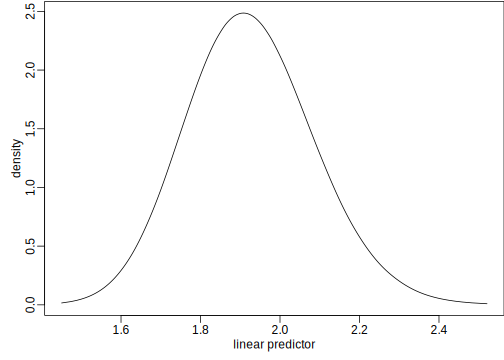
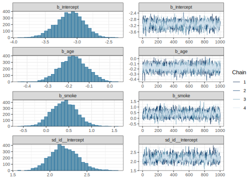

# Binary response GLMM
[Julian Faraway](https://julianfaraway.github.io/)
2024-10-14

- [Data and Model](#data-and-model)
- [LME4](#lme4)
- [INLA](#inla)
- [BRMS](#brms)
- [MGCV](#mgcv)
- [GINLA](#ginla)
- [Discussion](#discussion)
- [Package version info](#package-version-info)

See the [introduction](../index.md) for an overview.

This example is discussed in more detail in the book [Bayesian
Regression Modeling with
INLA](https://julianfaraway.github.io/brinlabook/chaglmm.html)

Packages used:

``` r
library(ggplot2)
library(lme4)
library(INLA)
library(knitr)
library(brms)
library(mgcv)
library(here)
```

# Data and Model

In [Fitzmaurice and Laird,
1993](https://doi.org/10.1093/biomet/80.1.141), data on 537 children
aged 7–10 in six Ohio cities are reported. The response is binary — does
the child suffer from wheezing (indication of a pulmonary problem) where
one indicates yes and zero no. This status is reported for each of four
years at ages 7, 8, 9 and 10. There is also an indicator variable for
whether the mother of the child is a smoker. Because we have four binary
responses for each child, we expect these to be correlated and our model
needs to reflect this.

Read in and examine the first two subjects worth of data:

``` r
ohio = read.csv(here("data","ohio.csv"),header = TRUE)
kable(ohio[1:8,])
```

| resp |  id | age | smoke |
|-----:|----:|----:|------:|
|    0 |   0 |  -2 |     0 |
|    0 |   0 |  -1 |     0 |
|    0 |   0 |   0 |     0 |
|    0 |   0 |   1 |     0 |
|    0 |   1 |  -2 |     0 |
|    0 |   1 |  -1 |     0 |
|    0 |   1 |   0 |     0 |
|    0 |   1 |   1 |     0 |

We sum the number of smoking and non-smoking mothers:

``` r
table(ohio$smoke)/4
```


      0   1 
    350 187 

We use this to produce the proportion of wheezing children classified by
age and maternal smoking status:

``` r
xtabs(resp ~ smoke + age, ohio)/c(350,187)
```

         age
    smoke      -2      -1       0       1
        0 0.16000 0.14857 0.14286 0.10571
        1 0.16578 0.20856 0.18717 0.13904

Age has been adjusted so that nine years old is zero. We see that
wheezing appears to decline with age and that there may be more wheezing
in children with mothers who smoke. But the effects are not clear and we
need modeling to be sure about these conclusions.

A plausible model uses a logit link with a linear predictor of the form:
$$
\eta_{ij} = \beta_0 + \beta_1 age_j + \beta_2 smoke_i + u_i, \quad i=1, \dots ,537, \quad j=1,2,3,4,
$$ with $$
P(Y_{ij} = 1) = {\exp(\eta_{ij}) \over 1+\exp(\eta_{ij})}.
$$ The random effect $u_i$ models the propensity of child $i$ to wheeze.
Children are likely to vary in their health condition and this effect
enables us to include this unknown variation in the model. Because $u_i$
is added to all four observations for a child, we induce a positive
correlation among the four responses as we might naturally expect. The
response is Bernoulli or, in other words, binomial with trial size one.

# LME4

Here is the model fit penalized quasi-likelihood using the `lme4`
package:

``` r
modagh <- glmer(resp ~ age + smoke + (1|id), nAGQ=25, 
              family=binomial, data=ohio)
summary(modagh, correlation = FALSE)
```

    Generalized linear mixed model fit by maximum likelihood (Adaptive Gauss-Hermite Quadrature, nAGQ = 25) ['glmerMod']
     Family: binomial  ( logit )
    Formula: resp ~ age + smoke + (1 | id)
       Data: ohio

         AIC      BIC   logLik deviance df.resid 
      1603.3   1626.0   -797.6   1595.3     2144 

    Scaled residuals: 
       Min     1Q Median     3Q    Max 
    -1.373 -0.201 -0.177 -0.149  2.508 

    Random effects:
     Groups Name        Variance Std.Dev.
     id     (Intercept) 4.69     2.16    
    Number of obs: 2148, groups:  id, 537

    Fixed effects:
                Estimate Std. Error z value Pr(>|z|)
    (Intercept)  -3.1015     0.2190  -14.16   <2e-16
    age          -0.1756     0.0677   -2.60   0.0095
    smoke         0.3986     0.2731    1.46   0.1444

We see that there is no significant effect due to maternal smoking.

Suppose you do not take into account the correlated response within the
individuals and fit a GLM ignoring the ID random effect:

``` r
modglm <- glm(resp ~ age + smoke, family=binomial, data=ohio)
faraway::sumary(modglm)
```

                Estimate Std. Error z value Pr(>|z|)
    (Intercept)  -1.8837     0.0838   -22.5   <2e-16
    age          -0.1134     0.0541    -2.1    0.036
    smoke         0.2721     0.1235     2.2    0.028

    n = 2148 p = 3
    Deviance = 1819.889 Null Deviance = 1829.089 (Difference = 9.199) 

We see that the effect of maternal smoking is significant (but this
would be the incorrect conclusion).

# INLA

Integrated nested Laplace approximation is a method of Bayesian
computation which uses approximation rather than simulation. More can be
found on this topic in [Bayesian Regression Modeling with
INLA](http://julianfaraway.github.io/brinla/) and the [chapter on
GLMMs](https://julianfaraway.github.io/brinlabook/chaglmm.html)

We can fit this model in INLA as:

``` r
formula <- resp ~ age + smoke + f(id, model="iid")
imod <- inla(formula, family="binomial", data=ohio)
```

The `id` variable represents the child and we use an `iid` model
indicating that the $u_i$ variables should be independent and
identically distributed between children. A summary of the posteriors
for the fixed effect components can be obtained as:

``` r
imod$summary.fixed |> kable()
```

|             |     mean |      sd | 0.025quant | 0.5quant | 0.975quant |     mode | kld |
|:------------|---------:|--------:|-----------:|---------:|-----------:|---------:|----:|
| (Intercept) | -2.94704 | 0.20002 |   -3.36027 | -2.93971 |   -2.57571 | -2.93953 |   0 |
| age         | -0.17294 | 0.06297 |   -0.29673 | -0.17283 |   -0.04976 | -0.17283 |   0 |
| smoke       |  0.38511 | 0.23960 |   -0.08280 |  0.38418 |    0.85835 |  0.38419 |   0 |

The posterior means are similar to the PQL estimates. We can get plots
of the posteriors of the fixed effects:

``` r
fnames = names(imod$marginals.fixed)
par(mfrow=c(1,2))
for(i in 2:3){
  plot(imod$marginals.fixed[[i]],
       type="l",
       ylab="density",
       xlab=fnames[i])
  abline(v=0)
}
par(mfrow=c(1,1))
```


We can also see the summary for the random effect SD:

``` r
hpd = inla.tmarginal(function(x) 1/sqrt(x), imod$marginals.hyperpar[[1]])
inla.zmarginal(hpd)
```

    Mean            1.92585 
    Stdev           0.161199 
    Quantile  0.025 1.62603 
    Quantile  0.25  1.81363 
    Quantile  0.5   1.91964 
    Quantile  0.75  2.03111 
    Quantile  0.975 2.25927 

Again the result is similar to the PQL output although notice that INLA
provides some assessment of uncertainty in this value in contrast to the
PQL result. We can also see the posterior density:

``` r
plot(hpd,type="l",xlab="linear predictor",ylab="density")
```



# BRMS

[BRMS](https://paul-buerkner.github.io/brms/) stands for Bayesian
Regression Models with STAN. It provides a convenient wrapper to STAN
functionality.

Fitting the model is very similar to `lmer` as seen above. There is a
`bernoulli` option for the `family` which is appropriate for a 0-1
response.

``` r
bmod <- brm(resp ~ age + smoke + (1|id), family=bernoulli(), data=ohio, cores = 4)
```

We can check the MCMC diagnostics and the posterior densities with:

``` r
plot(bmod)
```



Looks quite similar to the INLA results.

We can look at the STAN code that `brms` used with:

``` r
stancode(bmod)
```

    // generated with brms 2.21.0
    functions {
    }
    data {
      int<lower=1> N;  // total number of observations
      array[N] int Y;  // response variable
      int<lower=1> K;  // number of population-level effects
      matrix[N, K] X;  // population-level design matrix
      int<lower=1> Kc;  // number of population-level effects after centering
      // data for group-level effects of ID 1
      int<lower=1> N_1;  // number of grouping levels
      int<lower=1> M_1;  // number of coefficients per level
      array[N] int<lower=1> J_1;  // grouping indicator per observation
      // group-level predictor values
      vector[N] Z_1_1;
      int prior_only;  // should the likelihood be ignored?
    }
    transformed data {
      matrix[N, Kc] Xc;  // centered version of X without an intercept
      vector[Kc] means_X;  // column means of X before centering
      for (i in 2:K) {
        means_X[i - 1] = mean(X[, i]);
        Xc[, i - 1] = X[, i] - means_X[i - 1];
      }
    }
    parameters {
      vector[Kc] b;  // regression coefficients
      real Intercept;  // temporary intercept for centered predictors
      vector<lower=0>[M_1] sd_1;  // group-level standard deviations
      array[M_1] vector[N_1] z_1;  // standardized group-level effects
    }
    transformed parameters {
      vector[N_1] r_1_1;  // actual group-level effects
      real lprior = 0;  // prior contributions to the log posterior
      r_1_1 = (sd_1[1] * (z_1[1]));
      lprior += student_t_lpdf(Intercept | 3, 0, 2.5);
      lprior += student_t_lpdf(sd_1 | 3, 0, 2.5)
        - 1 * student_t_lccdf(0 | 3, 0, 2.5);
    }
    model {
      // likelihood including constants
      if (!prior_only) {
        // initialize linear predictor term
        vector[N] mu = rep_vector(0.0, N);
        mu += Intercept;
        for (n in 1:N) {
          // add more terms to the linear predictor
          mu[n] += r_1_1[J_1[n]] * Z_1_1[n];
        }
        target += bernoulli_logit_glm_lpmf(Y | Xc, mu, b);
      }
      // priors including constants
      target += lprior;
      target += std_normal_lpdf(z_1[1]);
    }
    generated quantities {
      // actual population-level intercept
      real b_Intercept = Intercept - dot_product(means_X, b);
    }

We can see that some half-t distributions are used as priors for the
hyperparameters.

We examine the fit:

``` r
summary(bmod)
```

     Family: bernoulli 
      Links: mu = logit 
    Formula: resp ~ age + smoke + (1 | id) 
       Data: ohio (Number of observations: 2148) 
      Draws: 4 chains, each with iter = 2000; warmup = 1000; thin = 1;
             total post-warmup draws = 4000

    Multilevel Hyperparameters:
    ~id (Number of levels: 537) 
                  Estimate Est.Error l-95% CI u-95% CI Rhat Bulk_ESS Tail_ESS
    sd(Intercept)     2.19      0.19     1.85     2.58 1.00      992     1613

    Regression Coefficients:
              Estimate Est.Error l-95% CI u-95% CI Rhat Bulk_ESS Tail_ESS
    Intercept    -3.11      0.22    -3.55    -2.71 1.00     1473     2209
    age          -0.18      0.07    -0.31    -0.05 1.00     5081     3181
    smoke         0.40      0.28    -0.13     0.93 1.00     1346     2408

    Draws were sampled using sampling(NUTS). For each parameter, Bulk_ESS
    and Tail_ESS are effective sample size measures, and Rhat is the potential
    scale reduction factor on split chains (at convergence, Rhat = 1).

The results are consistent with previous results.

# MGCV

It is possible to fit some GLMMs within the GAM framework of the `mgcv`
package. An explanation of this can be found in this
[blog](https://fromthebottomoftheheap.net/2021/02/02/random-effects-in-gams/)

We need to make a factor version of id otherwise it gets treated as a
numerical variable.

``` r
ohio$fid = factor(ohio$id)
gmod = gam(resp ~ age + smoke + s(fid,bs="re"), 
           family=binomial, data=ohio, method="REML")
```

and look at the summary output:

``` r
summary(gmod)
```


    Family: binomial 
    Link function: logit 

    Formula:
    resp ~ age + smoke + s(fid, bs = "re")

    Parametric coefficients:
                Estimate Std. Error z value Pr(>|z|)
    (Intercept)  -2.3690     0.1508  -15.71   <2e-16
    age          -0.1523     0.0627   -2.43    0.015
    smoke         0.2956     0.2405    1.23    0.219

    Approximate significance of smooth terms:
           edf Ref.df Chi.sq p-value
    s(fid) 282    535    548  <2e-16

    R-sq.(adj) =  0.393   Deviance explained = 46.1%
    -REML = 814.01  Scale est. = 1         n = 2148

We get the fixed effect estimates. We also get a test on the random
effect (as described in this
[article](https://doi.org/10.1093/biomet/ast038)). The hypothesis of no
variation between the ids is rejected.

We can get an estimate of the id SD:

``` r
gam.vcomp(gmod)
```


    Standard deviations and 0.95 confidence intervals:

           std.dev  lower  upper
    s(fid)  1.9486 1.6539 2.2957

    Rank: 1/1

which is the same as the REML estimate from `lmer` earlier.

The random effect estimates for the fields can be found with:

``` r
head(coef(gmod))
```

    (Intercept)         age       smoke    s(fid).1    s(fid).2    s(fid).3 
       -2.36900    -0.15226     0.29557    -0.72026    -0.72026    -0.72026 

# GINLA

In [Wood (2019)](https://doi.org/10.1093/biomet/asz044), a simplified
version of INLA is proposed. The first construct the GAM model without
fitting and then use the `ginla()` function to perform the computation.

``` r
gmod = gam(resp ~ age + smoke + s(fid,bs="re"), 
           family=binomial, data=ohio, fit = FALSE)
gimod = ginla(gmod)
```

We get the posterior densities for the fixed effects as:

``` r
par(mfrow=c(1,2))
for(i in 2:3){
plot(gimod$beta[i,],gimod$density[i,],type="l",
     xlab=gmod$term.names[i],ylab="density")
}
par(mfrow=c(1,1))
```


It is not straightforward to obtain the posterior densities of the
hyperparameters.

# Discussion

- No strong differences in the results between the different methods. In
  all cases, we do not find strong evidence of an effect for maternal
  smoking.

- LME4 was very fast. INLA was fast. BRMS, MGCV and GINLA were slower.
  We have a large number of subject random effects which slows down the
  `mgcv` approach considerably.

# Package version info

``` r
sessionInfo()
```

    R version 4.4.1 (2024-06-14)
    Platform: x86_64-apple-darwin20
    Running under: macOS Sonoma 14.7

    Matrix products: default
    BLAS:   /Library/Frameworks/R.framework/Versions/4.4-x86_64/Resources/lib/libRblas.0.dylib 
    LAPACK: /Library/Frameworks/R.framework/Versions/4.4-x86_64/Resources/lib/libRlapack.dylib;  LAPACK version 3.12.0

    locale:
    [1] en_US.UTF-8/en_US.UTF-8/en_US.UTF-8/C/en_US.UTF-8/en_US.UTF-8

    time zone: Europe/London
    tzcode source: internal

    attached base packages:
    [1] stats     graphics  grDevices utils     datasets  methods   base     

    other attached packages:
     [1] foreach_1.5.2 here_1.0.1    mgcv_1.9-1    nlme_3.1-166  brms_2.21.0   Rcpp_1.0.13   knitr_1.48    INLA_24.06.27
     [9] sp_2.1-4      lme4_1.1-35.5 Matrix_1.7-0  ggplot2_3.5.1

    loaded via a namespace (and not attached):
     [1] tidyselect_1.2.1     farver_2.1.2         dplyr_1.1.4          loo_2.8.0            fastmap_1.2.0       
     [6] tensorA_0.36.2.1     digest_0.6.37        estimability_1.5.1   lifecycle_1.0.4      Deriv_4.1.3         
    [11] sf_1.0-16            StanHeaders_2.32.10  processx_3.8.4       magrittr_2.0.3       posterior_1.6.0     
    [16] compiler_4.4.1       rlang_1.1.4          tools_4.4.1          utf8_1.2.4           yaml_2.3.10         
    [21] labeling_0.4.3       bridgesampling_1.1-2 pkgbuild_1.4.4       classInt_0.4-10      plyr_1.8.9          
    [26] abind_1.4-5          KernSmooth_2.23-24   withr_3.0.1          grid_4.4.1           stats4_4.4.1        
    [31] fansi_1.0.6          xtable_1.8-4         e1071_1.7-14         colorspace_2.1-1     inline_0.3.19       
    [36] iterators_1.0.14     emmeans_1.10.4       scales_1.3.0         MASS_7.3-61          cli_3.6.3           
    [41] mvtnorm_1.2-6        rmarkdown_2.28       generics_0.1.3       RcppParallel_5.1.9   rstudioapi_0.16.0   
    [46] reshape2_1.4.4       minqa_1.2.8          DBI_1.2.3            proxy_0.4-27         rstan_2.32.6        
    [51] stringr_1.5.1        splines_4.4.1        bayesplot_1.11.1     parallel_4.4.1       matrixStats_1.3.0   
    [56] vctrs_0.6.5          boot_1.3-31          jsonlite_1.8.8       callr_3.7.6          systemfonts_1.1.0   
    [61] units_0.8-5          faraway_1.0.8        glue_1.8.0           nloptr_2.1.1         ps_1.7.7            
    [66] codetools_0.2-20     distributional_0.4.0 stringi_1.8.4        gtable_0.3.5         QuickJSR_1.3.1      
    [71] munsell_0.5.1        tibble_3.2.1         pillar_1.9.0         htmltools_0.5.8.1    Brobdingnag_1.2-9   
    [76] R6_2.5.1             fmesher_0.1.7        rprojroot_2.0.4      evaluate_0.24.0      lattice_0.22-6      
    [81] backports_1.5.0      MatrixModels_0.5-3   rstantools_2.4.0     class_7.3-22         svglite_2.1.3       
    [86] coda_0.19-4.1        gridExtra_2.3        checkmate_2.3.2      xfun_0.47            pkgconfig_2.0.3     
