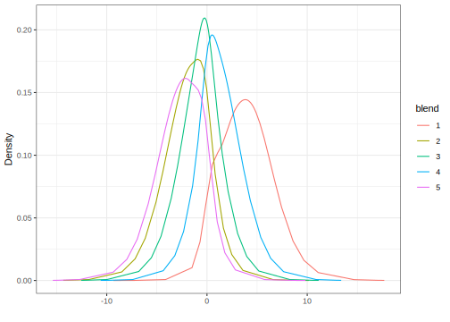
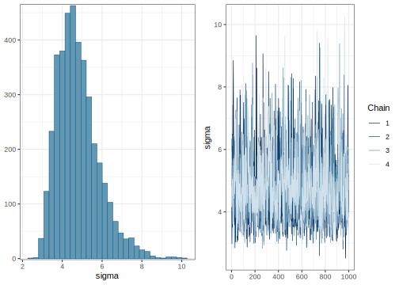

Randomized Block Design
================
[Julian Faraway](https://julianfaraway.github.io/)
05 January 2023

- <a href="#data" id="toc-data">Data</a>
- <a href="#questions" id="toc-questions">Questions</a>
- <a href="#linear-model" id="toc-linear-model">Linear Model</a>
- <a href="#mixed-effect-model" id="toc-mixed-effect-model">Mixed Effect
  Model</a>
- <a href="#inla" id="toc-inla">INLA</a>
  - <a href="#half-normal-priors-on-the-sds"
    id="toc-half-normal-priors-on-the-sds">Half-normal priors on the SDs</a>
  - <a href="#informative-gamma-priors-on-the-precisions"
    id="toc-informative-gamma-priors-on-the-precisions">Informative gamma
    priors on the precisions</a>
  - <a href="#penalized-complexity-prior"
    id="toc-penalized-complexity-prior">Penalized Complexity Prior</a>
- <a href="#stan" id="toc-stan">STAN</a>
  - <a href="#diagnostics" id="toc-diagnostics">Diagnostics</a>
  - <a href="#output-summaries" id="toc-output-summaries">Output
    summaries</a>
  - <a href="#posterior-distributions"
    id="toc-posterior-distributions">Posterior Distributions</a>
- <a href="#brms" id="toc-brms">BRMS</a>
- <a href="#mgcv" id="toc-mgcv">MGCV</a>
  - <a href="#ginla" id="toc-ginla">GINLA</a>
- <a href="#discussion" id="toc-discussion">Discussion</a>
- <a href="#package-version-info" id="toc-package-version-info">Package
  version info</a>

See the [introduction](../index.md) for an overview.

This example is discussed in more detail in my book [Extending the
Linear Model with R](https://julianfaraway.github.io/faraway/ELM/)

Required libraries:

``` r
library(faraway)
library(ggplot2)
library(lme4)
library(INLA)
library(knitr)
library(rstan, quietly=TRUE)
library(brms)
library(mgcv)
```

# Data

Load in and plot the data:

``` r
data(penicillin, package="faraway")
summary(penicillin)
```

     treat    blend       yield   
     A:5   Blend1:4   Min.   :77  
     B:5   Blend2:4   1st Qu.:81  
     C:5   Blend3:4   Median :87  
     D:5   Blend4:4   Mean   :86  
           Blend5:4   3rd Qu.:89  
                      Max.   :97  

``` r
ggplot(penicillin,aes(x=blend,y=yield,group=treat,linetype=treat))+geom_line()
```

<!-- -->

``` r
ggplot(penicillin,aes(x=treat,y=yield,group=blend,linetype=blend))+geom_line()
```

<!-- -->

The production of penicillin uses a raw material, corn steep liquor,
which is quite variable and can only be made in blends sufficient for
four runs. There are four processes, A, B, C and D, for the production.
See `help(penicillin)` for more information about the data.

In this example, the treatments are the four processes. These are the
specific four processes of interest that we wish to compare. The five
blends are five among many blends that would be randomly created during
production. We are not interested in these five specific blends but are
interested in how the blends vary. An interaction between blends and
treatments would complicate matters. But (a) there is no reason to
expect this exists and (b) with only one replicate per treatment and
blend combination, it is difficult to check for an interaction.

The plots show no outliers, no skewness, no obviously unequal variances
and no clear evidence of interaction. Let’s proceed.

# Questions

1.  Is there a difference between treatments? If so, what?
2.  Is there variation between the blends? What is the extent of this
    variation?

# Linear Model

Consider the model: $$
y_{ijk} = \mu + \tau_i + v_j + \epsilon_{ijk}
$$ where the $\mu$, $\tau_i$ and $v_j$ are fixed effects and the error
$\epsilon_{ijk}$ is independent and identically distributed
$N(0,\sigma^2)$. We can fit the model with:

``` r
lmod <- aov(yield ~ blend + treat, penicillin)
summary(lmod)
```

                Df Sum Sq Mean Sq F value Pr(>F)
    blend        4    264    66.0    3.50  0.041
    treat        3     70    23.3    1.24  0.339
    Residuals   12    226    18.8               

There is no significant difference between the treatments. The blends do
meet the 5% level for statistical significance. But this asserts a
difference between these particular five blends. It’s less clear what
this means about blends in general. We can get the estimated parameters
with:

``` r
coef(lmod)
```

    (Intercept) blendBlend2 blendBlend3 blendBlend4 blendBlend5      treatB      treatC      treatD 
             90          -9          -7          -4         -10           1           5           2 

Blend 1 and treatment A are the reference levels. We can also use a sum
(or deviation) coding:

``` r
op <- options(contrasts=c("contr.sum", "contr.poly"))
lmod <- aov(yield ~ blend + treat, penicillin)
coef(lmod)
```

    (Intercept)      blend1      blend2      blend3      blend4      treat1      treat2      treat3 
             86           6          -3          -1           2          -2          -1           3 

``` r
options(op)
```

The fit is the same but the parameterization is different. We can get
the full set of estimated effects as:

``` r
model.tables(lmod)
```

    Tables of effects

     blend 
    blend
    Blend1 Blend2 Blend3 Blend4 Blend5 
         6     -3     -1      2     -4 

     treat 
    treat
     A  B  C  D 
    -2 -1  3  0 

# Mixed Effect Model

Since we are not interested in the blends specifically, we may wish to
treat it as a random effect. The model becomes:
$$y_{ijk} = \mu + \tau_i + v_j + \epsilon_{ijk}$$ where the $\mu$
and$\tau_i$ are fixed effects and the error $\epsilon_{ijk}$ is
independent and identically distributed $N(0,\sigma^2)$. The $v_j$ are
now random effects and are independent and identically distributed
$N(0,\sigma^2_v)$. We fit the model using REML: (again using sum coding)

``` r
op <- options(contrasts=c("contr.sum", "contr.poly"))
mmod <- lmer(yield ~ treat + (1|blend), penicillin)
faraway::sumary(mmod)
```

    Fixed Effects:
                coef.est coef.se
    (Intercept) 86.00     1.82  
    treat1      -2.00     1.68  
    treat2      -1.00     1.68  
    treat3       3.00     1.68  

    Random Effects:
     Groups   Name        Std.Dev.
     blend    (Intercept) 3.43    
     Residual             4.34    
    ---
    number of obs: 20, groups: blend, 5
    AIC = 118.6, DIC = 128
    deviance = 117.3 

``` r
options(op)
```

We get the same fixed effect estimates but now we have an estimated
blend SD. We can get random effect estimates:

``` r
ranef(mmod)$blend
```

           (Intercept)
    Blend1     4.28788
    Blend2    -2.14394
    Blend3    -0.71465
    Blend4     1.42929
    Blend5    -2.85859

which are a shrunk version of the fixed effect estimates. We can test
for a difference of the fixed effects with:

``` r
anova(mmod)
```

    Analysis of Variance Table
          npar Sum Sq Mean Sq F value
    treat    3     70    23.3    1.24

No p-value is supplied because there is some doubt in general over the
validity of the null F-distribution. In this specific example, with a
simple balanced design, it can be shown that the null F is correct. As
it happens, it is the same as that produced in the all fixed effects
analysis earlier:

``` r
anova(lmod)
```

    Analysis of Variance Table

    Response: yield
              Df Sum Sq Mean Sq F value Pr(>F)
    blend      4    264    66.0    3.50  0.041
    treat      3     70    23.3    1.24  0.339
    Residuals 12    226    18.8               

So no evidence of a difference between the treatments. More general
tests are available such as the Kenward-Roger method which adjusts the
degrees of freedom - see [Extending the Linear Model with
R](https://julianfaraway.github.io/faraway/ELM/) for details.

We can test the hypothesis $H_0: \sigma^2_v = 0$ using a parametric
bootstrap method:

``` r
rmod <- lmer(yield ~ treat + (1|blend), penicillin)
nlmod <- lm(yield ~ treat, penicillin)
as.numeric(2*(logLik(rmod)-logLik(nlmod,REML=TRUE)))
```

    [1] 2.7629

``` r
lrstatf <- numeric(1000)
for(i in 1:1000){
   ryield <-  unlist(simulate(nlmod))
   nlmodr <- lm(ryield ~ treat, penicillin)
   rmodr <- lmer(ryield ~ treat + (1|blend), penicillin)
   lrstatf[i] <- 2*(logLik(rmodr)-logLik(nlmodr,REML=TRUE))
  }
mean(lrstatf > 2.7629)
```

    [1] 0.039

The result falls just below the 5% level for significance. Because of
resampling variability, we should repeat with more boostrap samples. At
any rate, the evidence for variation between the blends is not decisive.

# INLA

Integrated nested Laplace approximation is a method of Bayesian
computation which uses approximation rather than simulation. More can be
found on this topic in [Bayesian Regression Modeling with
INLA](http://julianfaraway.github.io/brinla/) and the [chapter on
GLMMs](https://julianfaraway.github.io/brinlabook/chaglmm.html)

Use the most recent computational methodology:

``` r
inla.setOption(inla.mode="compact")
inla.setOption("short.summary",TRUE)
```

Fit the default INLA model:

``` r
formula = yield ~ treat+f(blend, model="iid")
result = inla(formula, family="gaussian", data=penicillin)
summary(result)
```

    Fixed effects:
                  mean   sd 0.025quant 0.5quant 0.975quant   mode kld
    (Intercept) 84.045 2.39     79.325   84.043     88.779 84.039   0
    treatB       0.949 3.38     -5.743    0.952      7.626  0.956   0
    treatC       4.926 3.38     -1.769    4.930     11.600  4.936   0
    treatD       1.943 3.38     -4.749    1.946      8.619  1.951   0

    Model hyperparameters:
                                                mean       sd 0.025quant 0.5quant 0.975quant     mode
    Precision for the Gaussian observations 3.70e-02 1.20e-02      0.017 3.50e-02   6.50e-02    0.032
    Precision for blend                     1.82e+04 1.76e+04   1191.169 1.28e+04   6.47e+04 3256.096

     is computed 

Precision for the blend effect looks implausibly large. There is a
problem with default gamma prior (it needs to be more informative).

## Half-normal priors on the SDs

Try a half-normal prior on the blend precision. I have used variance of
the response to help with the scaling so these are more informative.

``` r
resprec <- 1/var(penicillin$yield)
formula = yield ~ treat+f(blend, model="iid", prior="logtnormal", param=c(0, resprec))
result = inla(formula, family="gaussian", data=penicillin)
summary(result)
```

    Fixed effects:
                  mean    sd 0.025quant 0.5quant 0.975quant   mode kld
    (Intercept) 84.029 2.775     78.511   84.028     89.553 84.026   0
    treatB       0.967 2.699     -4.394    0.970      6.315  0.973   0
    treatC       4.953 2.699     -0.411    4.956     10.297  4.961   0
    treatD       1.964 2.699     -3.398    1.966      7.311  1.970   0

    Model hyperparameters:
                                             mean    sd 0.025quant 0.5quant 0.975quant  mode
    Precision for the Gaussian observations 0.062 0.023      0.027    0.059      0.117 0.052
    Precision for blend                     0.107 0.127      0.013    0.069      0.436 0.032

     is computed 

Looks more plausible. Compute the transforms to an SD scale for the
blend and error. Make a table of summary statistics for the posteriors:

``` r
sigmaalpha <- inla.tmarginal(function(x) 1/sqrt(exp(x)),result$internal.marginals.hyperpar[[2]])
sigmaepsilon <- inla.tmarginal(function(x) 1/sqrt(exp(x)),result$internal.marginals.hyperpar[[1]])
restab=sapply(result$marginals.fixed, function(x) inla.zmarginal(x,silent=TRUE))
restab=cbind(restab, inla.zmarginal(sigmaalpha,silent=TRUE))
restab=cbind(restab, inla.zmarginal(sigmaepsilon,silent=TRUE))
restab=cbind(restab, sapply(result$marginals.random$blend,function(x) inla.zmarginal(x, silent=TRUE)))
colnames(restab) = c("mu","B-A","C-A","D-A","blend","error",levels(penicillin$blend))
data.frame(restab) |> kable()
```

|            | mu     | B.A      | C.A      | D.A     | blend  | error   | Blend1   | Blend2   | Blend3   | Blend4   | Blend5  |
|:-----------|:-------|:---------|:---------|:--------|:-------|:--------|:---------|:---------|:---------|:---------|:--------|
| mean       | 84.029 | 0.96743  | 4.9527   | 1.9638  | 4.1465 | 4.2244  | 4.3615   | -2.1799  | -0.72654 | 1.4532   | -2.9069 |
| sd         | 2.7731 | 2.6976   | 2.6976   | 2.6976  | 1.8773 | 0.80126 | 2.8352   | 2.6305   | 2.5663   | 2.5907   | 2.6852  |
| quant0.025 | 78.509 | -4.3945  | -0.41238 | -3.399  | 1.5262 | 2.932   | -0.66829 | -7.7063  | -6.0169  | -3.551   | -8.5612 |
| quant0.25  | 82.264 | -0.77745 | 3.2084   | 0.21902 | 2.7911 | 3.6499  | 2.3971   | -3.7969  | -2.2717  | -0.17543 | -4.5783 |
| quant0.5   | 84.021 | 0.96314  | 4.9495   | 1.9597  | 3.8019 | 4.122   | 4.2457   | -2.0498  | -0.66213 | 1.33     | -2.7743 |
| quant0.75  | 85.78  | 2.7019   | 6.6879   | 3.6984  | 5.1071 | 4.6939  | 6.1495   | -0.46606 | 0.82147  | 3.0143   | -1.096  |
| quant0.975 | 89.541 | 6.3031   | 10.285   | 7.2987  | 8.7704 | 6.0656  | 10.274   | 2.7466   | 4.3487   | 6.8458   | 1.9834  |

Also construct a plot the SD posteriors:

``` r
ddf <- data.frame(rbind(sigmaalpha,sigmaepsilon),errterm=gl(2,nrow(sigmaalpha),labels = c("blend","error")))
ggplot(ddf, aes(x,y, linetype=errterm))+geom_line()+xlab("yield")+ylab("density")+xlim(0,15)
```

<!-- -->

Posterior for the blend SD is more diffuse than the error SD. Posterior
for the blend SD has zero density at zero.

Is there any variation between blends? We framed this question as an
hypothesis test previously but that is not sensible in this framework.
We might ask the probability that the blend SD is zero. Since we have
posited a continuous prior that places no discrete mass on zero, the
posterior probability will be zero, regardless of the data. Instead we
might ask the probability that the operator SD is small. Given the
response is measured to the nearest integer, 1 is a reasonable
representation of *small* if we take this to mean the smallest amount we
care about. (Clearly you cannot rely on the degree of rounding to make
such decisions in general).

We can compute the probability that the operator SD is smaller than 1:

``` r
inla.pmarginal(1, sigmaalpha)
```

    [1] 0.0017951

The probability is very small.

## Informative gamma priors on the precisions

Now try more informative gamma priors for the precisions. Define it so
the mean value of gamma prior is set to the inverse of the variance of
the fixed-effects model residuals. We expect the two error variances to
be lower than this variance so this is an overestimate. The variance of
the gamma prior (for the precision) is controlled by the `apar` shape
parameter - smaller values are less informative.

``` r
apar <- 0.5
lmod <- lm(yield ~ treat, data=penicillin)
bpar <- apar*var(residuals(lmod))
lgprior <- list(prec = list(prior="loggamma", param = c(apar,bpar)))
formula = yield ~ treat+f(blend, model="iid", hyper = lgprior)
result <- inla(formula, family="gaussian", data=penicillin)
summary(result)
```

    Fixed effects:
                  mean    sd 0.025quant 0.5quant 0.975quant   mode kld
    (Intercept) 84.028 2.879     78.319   84.027     89.743 84.025   0
    treatB       0.969 2.649     -4.288    0.971      6.213  0.974   0
    treatC       4.954 2.649     -0.305    4.957     10.196  4.962   0
    treatD       1.965 2.649     -3.292    1.967      7.209  1.971   0

    Model hyperparameters:
                                             mean    sd 0.025quant 0.5quant 0.975quant  mode
    Precision for the Gaussian observations 0.063 0.023      0.027    0.059      0.117 0.053
    Precision for blend                     0.068 0.054      0.011    0.053      0.210 0.030

     is computed 

Compute the summaries as before:

``` r
sigmaalpha <- inla.tmarginal(function(x) 1/sqrt(exp(x)),result$internal.marginals.hyperpar[[2]])
sigmaepsilon <- inla.tmarginal(function(x) 1/sqrt(exp(x)),result$internal.marginals.hyperpar[[1]])
restab=sapply(result$marginals.fixed, function(x) inla.zmarginal(x,silent=TRUE))
restab=cbind(restab, inla.zmarginal(sigmaalpha,silent=TRUE))
restab=cbind(restab, inla.zmarginal(sigmaepsilon,silent=TRUE))
restab=cbind(restab, sapply(result$marginals.random$blend,function(x) inla.zmarginal(x, silent=TRUE)))
colnames(restab) = c("mu","B-A","C-A","D-A","blend","error",levels(penicillin$blend))
data.frame(restab) |> kable()
```

|            | mu     | B.A      | C.A      | D.A     | blend  | error   | Blend1   | Blend2   | Blend3   | Blend4   | Blend5  |
|:-----------|:-------|:---------|:---------|:--------|:-------|:--------|:---------|:---------|:---------|:---------|:--------|
| mean       | 84.028 | 0.96861  | 4.9545   | 1.9651  | 4.689  | 4.2073  | 4.6884   | -2.3437  | -0.78104 | 1.5628   | -3.125  |
| sd         | 2.8786 | 2.6476   | 2.6476   | 2.6476  | 1.8321 | 0.79899 | 2.8325   | 2.7517   | 2.7275   | 2.7369   | 2.7727  |
| quant0.025 | 78.317 | -4.2885  | -0.30548 | -3.2927 | 2.1934 | 2.9267  | -0.63564 | -7.9765  | -6.273   | -3.778   | -8.8375 |
| quant0.25  | 82.216 | -0.74849 | 3.2379   | 0.24811 | 3.3889 | 3.6341  | 2.8534   | -4.0223  | -2.4547  | -0.15054 | -4.8152 |
| quant0.5   | 84.02  | 0.96425  | 4.951    | 1.9609  | 4.3146 | 4.1021  | 4.586    | -2.2929  | -0.76759 | 1.5159   | -3.0588 |
| quant0.75  | 85.825 | 2.6754   | 6.6618   | 3.672   | 5.5833 | 4.6732  | 6.4033   | -0.61979 | 0.89913  | 3.2219   | -1.3722 |
| quant0.975 | 89.731 | 6.2009   | 10.184   | 7.1967  | 9.2838 | 6.0503  | 10.564   | 2.9554   | 4.5876   | 7.1099   | 2.16    |

Make the plots:

``` r
ddf <- data.frame(rbind(sigmaalpha,sigmaepsilon),errterm=gl(2,nrow(sigmaalpha),labels = c("blend","error")))
ggplot(ddf, aes(x,y, linetype=errterm))+geom_line()+xlab("yield")+ylab("density")+xlim(0,15)
```

<!-- -->

Posterior for blend SD has no weight near zero.

We can compute the probability that the operator SD is smaller than 1:

``` r
inla.pmarginal(1, sigmaalpha)
```

    [1] 2.7311e-05

The probability is very small.

## Penalized Complexity Prior

In [Simpson et al (2015)](http://arxiv.org/abs/1403.4630v3), penalized
complexity priors are proposed. This requires that we specify a scaling
for the SDs of the random effects. We use the SD of the residuals of the
fixed effects only model (what might be called the base model in the
paper) to provide this scaling.

``` r
lmod <- lm(yield ~ treat, data=penicillin)
sdres <- sd(residuals(lmod))
pcprior <- list(prec = list(prior="pc.prec", param = c(3*sdres,0.01)))
formula <- yield ~ treat + f(blend, model="iid", hyper = pcprior)
result <- inla(formula, family="gaussian", data=penicillin)
summary(result)
```

    Fixed effects:
                  mean    sd 0.025quant 0.5quant 0.975quant   mode kld
    (Intercept) 84.030 2.609     78.852   84.029     89.213 84.027   0
    treatB       0.967 2.726     -4.450    0.969      6.369  0.973   0
    treatC       4.952 2.726     -0.468    4.955     10.351  4.961   0
    treatD       1.963 2.726     -3.455    1.966      7.365  1.970   0

    Model hyperparameters:
                                             mean    sd 0.025quant 0.5quant 0.975quant  mode
    Precision for the Gaussian observations 0.062 0.024      0.026    0.059      0.119 0.052
    Precision for blend                     0.159 0.210      0.016    0.096      0.690 0.041

     is computed 

Compute the summaries as before:

``` r
sigmaalpha <- inla.tmarginal(function(x) 1/sqrt(exp(x)),result$internal.marginals.hyperpar[[2]])
sigmaepsilon <- inla.tmarginal(function(x) 1/sqrt(exp(x)),result$internal.marginals.hyperpar[[1]])
restab=sapply(result$marginals.fixed, function(x) inla.zmarginal(x,silent=TRUE))
restab=cbind(restab, inla.zmarginal(sigmaalpha,silent=TRUE))
restab=cbind(restab, inla.zmarginal(sigmaepsilon,silent=TRUE))
restab=cbind(restab, sapply(result$marginals.random$blend,function(x) inla.zmarginal(x, silent=TRUE)))
colnames(restab) = c("mu","B-A","C-A","D-A","blend","error",levels(penicillin$blend))
data.frame(restab) |> kable()
```

|            | mu     | B.A      | C.A      | D.A     | blend  | error   | Blend1   | Blend2   | Blend3   | Blend4   | Blend5   |
|:-----------|:-------|:---------|:---------|:--------|:-------|:--------|:---------|:---------|:---------|:---------|:---------|
| mean       | 84.03  | 0.9668   | 4.9518   | 1.963   | 3.5467 | 4.2309  | 3.9511   | -1.9767  | -0.65885 | 1.3181   | -2.6372  |
| sd         | 2.6078 | 2.724    | 2.724    | 2.724   | 1.7024 | 0.83336 | 2.7195   | 2.4166   | 2.3197   | 2.3568   | 2.4979   |
| quant0.025 | 78.852 | -4.4509  | -0.46927 | -3.4555 | 1.212  | 2.9115  | -0.64925 | -7.1301  | -5.5023  | -3.1579  | -7.9589  |
| quant0.25  | 82.361 | -0.79113 | 3.1945   | 0.20529 | 2.3173 | 3.6326  | 1.9821   | -3.4635  | -2.0285  | -0.16232 | -4.2048  |
| quant0.5   | 84.022 | 0.96258  | 4.9487   | 1.9591  | 3.2234 | 4.1154  | 3.8485   | -1.8045  | -0.55866 | 1.1479   | -2.4754  |
| quant0.75  | 85.684 | 2.7144   | 6.7001   | 3.7108  | 4.4044 | 4.7118  | 5.695    | -0.35614 | 0.7063   | 2.7249   | -0.87208 |
| quant0.975 | 89.201 | 6.357    | 10.339   | 7.3525  | 7.7664 | 6.1674  | 9.6233   | 2.4081   | 3.9115   | 6.3007   | 1.711    |

Make the plots:

``` r
ddf <- data.frame(rbind(sigmaalpha,sigmaepsilon),errterm=gl(2,nrow(sigmaalpha),labels = c("blend","error")))
ggplot(ddf, aes(x,y, linetype=errterm))+geom_line()+xlab("yield")+ylab("density")+xlim(0,15)
```

<!-- -->

Posterior for blend SD has no weight at zero. Results are comparable to
previous analyses.

We can plot the posterior marginals of the random effects:

``` r
nlevels = length(unique(penicillin$blend))
rdf = data.frame(do.call(rbind,result$marginals.random$blend))
rdf$blend = gl(nlevels,nrow(rdf)/nlevels,labels=1:nlevels)
ggplot(rdf,aes(x=x,y=y,group=blend, color=blend)) + 
  geom_line() +
  xlab("") + ylab("Density") 
```

<!-- -->

There is substantial overlap and we cannot distinguish the blends.

We can compute the probability that the operator SD is smaller than 1:

``` r
inla.pmarginal(1, sigmaalpha)
```

    [1] 0.0094577

The probability is still very small.

# STAN

[STAN](https://mc-stan.org/) performs Bayesian inference using MCMC.

Set up STAN to use multiple cores. Set the random number seed for
reproducibility.

``` r
rstan_options(auto_write = TRUE)
options(mc.cores = parallel::detectCores())
set.seed(123)
```

We need to use a STAN command file
[penicillin.stan](../stancode/penicillin.stan) which we view here:

``` r
writeLines(readLines("../stancode/penicillin.stan"))
```

    data {
      int<lower=0> N;
      int<lower=0> Nt;
      int<lower=0> Nb;
      int<lower=1,upper=Nt> treat[N];
      int<lower=1,upper=Nb> blk[N];
      vector[N] y;
    }
    parameters {
      vector[Nb] eta;
      vector[Nt] trt;
      real<lower=0> sigmablk;
      real<lower=0> sigmaepsilon;
    }
    transformed parameters {
      vector[Nb] bld;
      vector[N] yhat;

      bld <- sigmablk * eta;

      for (i in 1:N)
        yhat[i] <- trt[treat[i]]+bld[blk[i]];

    }
    model {
      eta ~ normal(0, 1);

      y ~ normal(yhat, sigmaepsilon);
    }

We have used uninformative priors for the treatment effects and the two
variances. We prepare data in a format consistent with the command file.
Needs to be a list.

``` r
ntreat <- as.numeric(penicillin$treat)
blk <- as.numeric(penicillin$blend)
penidat <- list(N=nrow(penicillin), Nt=max(ntreat), Nb=max(blk), treat=ntreat, blk=blk, y=penicillin$yield)
```

``` r
rt <- stanc(file="../stancode/penicillin.stan")
suppressMessages(sm <- stan_model(stanc_ret = rt, verbose=FALSE))
system.time(fit <- sampling(sm, data=penidat))
```

       user  system elapsed 
      1.840   0.238   0.861 

We get some warnings but nothing too serious.

## Diagnostics

Plot the chains for the block SD

``` r
pname <- "sigmablk"
muc <- rstan::extract(fit, pars=pname,  permuted=FALSE, inc_warmup=FALSE)
mdf <- reshape2::melt(muc)
ggplot(mdf,aes(x=iterations,y=value,color=chains)) + geom_line() + ylab(mdf$parameters[1])
```

<!-- -->

which is satistfactory. The same for the error SD:

``` r
pname <- "sigmaepsilon"
muc <- rstan::extract(fit, pars=pname,  permuted=FALSE, inc_warmup=FALSE)
mdf <- reshape2::melt(muc)
ggplot(mdf,aes(x=iterations,y=value,color=chains)) + geom_line() + ylab(mdf$parameters[1])
```

<!-- -->

which also looks reasonable.

## Output summaries

Examine the output:

``` r
fit
```

    Inference for Stan model: penicillin.
    4 chains, each with iter=2000; warmup=1000; thin=1; 
    post-warmup draws per chain=1000, total post-warmup draws=4000.

                   mean se_mean   sd   2.5%    25%    50%    75%  97.5% n_eff Rhat
    eta[1]         0.90    0.03 0.75  -0.52   0.40   0.88   1.38   2.39   885 1.01
    eta[2]        -0.50    0.02 0.67  -1.83  -0.92  -0.50  -0.07   0.85  1189 1.00
    eta[3]        -0.18    0.02 0.67  -1.44  -0.63  -0.21   0.24   1.20  1087 1.00
    eta[4]         0.28    0.03 0.69  -1.06  -0.17   0.25   0.72   1.70   725 1.00
    eta[5]        -0.65    0.02 0.68  -2.03  -1.07  -0.65  -0.19   0.70  1621 1.00
    trt[1]        84.34    0.18 3.56  77.58  82.08  84.20  86.42  92.44   396 1.00
    trt[2]        85.41    0.17 3.42  78.91  83.21  85.24  87.46  92.84   412 1.00
    trt[3]        89.31    0.17 3.53  82.44  87.13  89.16  91.33  96.89   422 1.00
    trt[4]        86.23    0.17 3.50  79.45  84.02  86.11  88.27  94.13   405 1.00
    sigmablk       5.12    0.15 3.44   0.60   2.84   4.34   6.54  14.43   543 1.00
    sigmaepsilon   4.94    0.03 1.14   3.27   4.11   4.76   5.56   7.58  1305 1.01
    bld[1]         3.84    0.16 3.41  -2.43   1.49   3.69   5.93  11.20   457 1.00
    bld[2]        -2.40    0.16 3.34 -10.11  -4.31  -1.99  -0.22   3.26   439 1.00
    bld[3]        -1.02    0.17 3.25  -8.53  -2.73  -0.77   0.83   5.51   373 1.00
    bld[4]         1.06    0.17 3.33  -6.20  -0.62   0.95   2.99   7.66   376 1.00
    bld[5]        -3.07    0.17 3.49 -11.01  -5.00  -2.62  -0.64   2.67   433 1.00
    yhat[1]       88.18    0.08 3.28  81.40  86.07  88.29  90.38  94.16  1892 1.00
    yhat[2]       89.25    0.07 3.20  82.54  87.22  89.29  91.39  95.25  2036 1.00
    yhat[3]       93.15    0.08 3.28  86.42  91.05  93.30  95.26  99.48  1912 1.00
    yhat[4]       90.07    0.08 3.25  83.32  87.98  90.18  92.27  96.07  1872 1.00
    yhat[5]       81.94    0.05 3.05  76.13  79.93  81.87  83.95  87.98  3531 1.00
    yhat[6]       83.01    0.06 2.99  77.24  81.04  82.99  85.00  88.86  2910 1.00
    yhat[7]       86.92    0.06 2.98  81.09  85.00  86.88  88.80  92.93  2707 1.00
    yhat[8]       83.83    0.06 2.94  77.92  81.96  83.89  85.73  89.50  2833 1.00
    yhat[9]       83.32    0.05 2.91  77.69  81.45  83.28  85.19  89.29  4100 1.00
    yhat[10]      84.39    0.05 2.86  78.79  82.54  84.40  86.19  90.19  3946 1.00
    yhat[11]      88.30    0.05 2.89  82.70  86.41  88.31  90.20  93.98  3331 1.00
    yhat[12]      85.21    0.05 2.88  79.71  83.39  85.20  87.04  91.05  3760 1.00
    yhat[13]      85.40    0.05 3.01  79.45  83.46  85.40  87.36  91.13  3831 1.00
    yhat[14]      86.47    0.05 2.92  80.74  84.58  86.49  88.42  92.30  3623 1.00
    yhat[15]      90.38    0.05 3.02  84.35  88.39  90.44  92.36  96.48  3375 1.00
    yhat[16]      87.29    0.05 2.95  81.46  85.35  87.34  89.18  93.07  3629 1.00
    yhat[17]      81.27    0.06 3.14  75.20  79.19  81.20  83.26  87.62  2813 1.00
    yhat[18]      82.34    0.06 3.01  76.63  80.37  82.30  84.25  88.57  2313 1.00
    yhat[19]      86.25    0.06 3.05  80.48  84.21  86.18  88.24  92.34  2769 1.00
    yhat[20]      83.16    0.06 3.10  77.20  81.16  83.16  85.17  89.39  2442 1.00
    lp__         -39.97    0.14 3.55 -47.90 -42.21 -39.53 -37.33 -34.22   628 1.01

    Samples were drawn using NUTS(diag_e) at Fri Jul  8 14:16:30 2022.
    For each parameter, n_eff is a crude measure of effective sample size,
    and Rhat is the potential scale reduction factor on split chains (at 
    convergence, Rhat=1).

We are not interested in the `yhat` values. In bigger datasets, there
might be a lot of these so we can select which parameters we view:

``` r
print(fit, pars=c("trt","sigmablk","sigmaepsilon","bld"))
```

    Inference for Stan model: penicillin.
    4 chains, each with iter=2000; warmup=1000; thin=1; 
    post-warmup draws per chain=1000, total post-warmup draws=4000.

                  mean se_mean   sd   2.5%   25%   50%   75% 97.5% n_eff Rhat
    trt[1]       84.34    0.18 3.56  77.58 82.08 84.20 86.42 92.44   396 1.00
    trt[2]       85.41    0.17 3.42  78.91 83.21 85.24 87.46 92.84   412 1.00
    trt[3]       89.31    0.17 3.53  82.44 87.13 89.16 91.33 96.89   422 1.00
    trt[4]       86.23    0.17 3.50  79.45 84.02 86.11 88.27 94.13   405 1.00
    sigmablk      5.12    0.15 3.44   0.60  2.84  4.34  6.54 14.43   543 1.00
    sigmaepsilon  4.94    0.03 1.14   3.27  4.11  4.76  5.56  7.58  1305 1.01
    bld[1]        3.84    0.16 3.41  -2.43  1.49  3.69  5.93 11.20   457 1.00
    bld[2]       -2.40    0.16 3.34 -10.11 -4.31 -1.99 -0.22  3.26   439 1.00
    bld[3]       -1.02    0.17 3.25  -8.53 -2.73 -0.77  0.83  5.51   373 1.00
    bld[4]        1.06    0.17 3.33  -6.20 -0.62  0.95  2.99  7.66   376 1.00
    bld[5]       -3.07    0.17 3.49 -11.01 -5.00 -2.62 -0.64  2.67   433 1.00

    Samples were drawn using NUTS(diag_e) at Fri Jul  8 14:16:30 2022.
    For each parameter, n_eff is a crude measure of effective sample size,
    and Rhat is the potential scale reduction factor on split chains (at 
    convergence, Rhat=1).

We see the posterior mean, SE and SD of the samples. We see some
quantiles from which we could construct a 95% credible interval (for
example). The `n_eff` is a rough measure of the sample size taking into
account the correlation in the samples. The effective sample sizes for
the primary parameters is adequate for most purposes. The $\hat R$
statistics are good.

We can also get the posterior means alone.

``` r
(get_posterior_mean(fit, pars=c("eta","trt","sigmablk","sigmaepsilon","bld")))
```

                 mean-chain:1 mean-chain:2 mean-chain:3 mean-chain:4 mean-all chains
    eta[1]            0.98545      0.88283      0.86691      0.86062         0.89895
    eta[2]           -0.47231     -0.50814     -0.53743     -0.46924        -0.49678
    eta[3]           -0.16854     -0.18353     -0.18305     -0.19936        -0.18362
    eta[4]            0.32535      0.26566      0.25906      0.25247         0.27564
    eta[5]           -0.64658     -0.66543     -0.65055     -0.61887        -0.64536
    trt[1]           84.00386     84.50604     84.38091     84.46764        84.33961
    trt[2]           85.12645     85.50641     85.41954     85.58571        85.40953
    trt[3]           88.97437     89.41534     89.33478     89.53429        89.31469
    trt[4]           86.01129     86.33928     86.40588     86.16627        86.23068
    sigmablk          4.82224      5.23179      5.43834      4.98856         5.12023
    sigmaepsilon      4.84526      4.98889      4.89715      5.04419         4.94387
    bld[1]            4.11536      3.80878      3.86032      3.56211         3.83664
    bld[2]           -2.08514     -2.58631     -2.62383     -2.29810        -2.39834
    bld[3]           -0.82229     -1.13483     -1.08247     -1.02825        -1.01696
    bld[4]            1.30725      0.92984      1.06581      0.95115         1.06351
    bld[5]           -2.76032     -3.32024     -3.20931     -2.98423        -3.06852

We see that we get this information for each chain as well as overall.
This gives a sense of why running more than one chain might be helpful
in assessing the uncertainty in the posterior inference.

## Posterior Distributions

We can use extract to get at various components of the STAN fit.

``` r
postsig <- rstan::extract(fit, pars=c("sigmablk","sigmaepsilon"))
ref <- reshape2::melt(postsig,value.name="yield")
ggplot(data=ref,aes(x=yield, color=L1))+geom_density()+guides(color=guide_legend(title="SD"))
```

<!-- -->

We see that the error SD can be localized much more than the block SD.
We can compute the chance that the block SD is less than one. We’ve
chosen 1 as the response is only measured to the nearest integer so an
SD of less than one would not be particularly noticeable.

``` r
mean(postsig$sigmablk < 1)
```

    [1] 0.04875

We see that this probability is small and would be smaller if we had
specified a lower threshold.

We can also look at the blend effects:

``` r
opre <- rstan::extract(fit, pars="bld")
ref <- reshape2::melt(opre, value.name="yield")
ggplot(data=ref,aes(x=yield, color=factor(Var2)))+geom_density()+guides(color=guide_legend(title="blend"))
```

<!-- -->

We see that all five blend distributions clearly overlap zero. We can
also look at the treatment effects:

``` r
opre <- rstan::extract(fit, pars="trt")
ref <- reshape2::melt(opre, value.name="yield")
ref[,2] <- (LETTERS[1:4])[ref[,2]]
ggplot(data=ref,aes(x=yield, color=factor(Var2)))+geom_density()+guides(color=guide_legend(title="treatment"))
```

<!-- -->

We did not include an intercept so the treatment effects are not
differences from zero. We see the distributions overlap substantially.

# BRMS

[BRMS](https://paul-buerkner.github.io/brms/) stands for Bayesian
Regression Models with STAN. It provides a convenient wrapper to STAN
functionality.

Fitting the model is very similar to `lmer` as seen above:

``` r
suppressMessages(bmod <- brm(yield ~ treat + (1|blend), penicillin, cores=4))
```

We get some warnings but not as severe as seen with our STAN fit above.
We can obtain some posterior densities and diagnostics with:

``` r
plot(bmod)
```

<!-- --><!-- -->

Looks OK.

We can look at the STAN code that `brms` used with:

``` r
stancode(bmod)
```

    // generated with brms 2.17.0
    functions {
    }
    data {
      int<lower=1> N;  // total number of observations
      vector[N] Y;  // response variable
      int<lower=1> K;  // number of population-level effects
      matrix[N, K] X;  // population-level design matrix
      // data for group-level effects of ID 1
      int<lower=1> N_1;  // number of grouping levels
      int<lower=1> M_1;  // number of coefficients per level
      int<lower=1> J_1[N];  // grouping indicator per observation
      // group-level predictor values
      vector[N] Z_1_1;
      int prior_only;  // should the likelihood be ignored?
    }
    transformed data {
      int Kc = K - 1;
      matrix[N, Kc] Xc;  // centered version of X without an intercept
      vector[Kc] means_X;  // column means of X before centering
      for (i in 2:K) {
        means_X[i - 1] = mean(X[, i]);
        Xc[, i - 1] = X[, i] - means_X[i - 1];
      }
    }
    parameters {
      vector[Kc] b;  // population-level effects
      real Intercept;  // temporary intercept for centered predictors
      real<lower=0> sigma;  // dispersion parameter
      vector<lower=0>[M_1] sd_1;  // group-level standard deviations
      vector[N_1] z_1[M_1];  // standardized group-level effects
    }
    transformed parameters {
      vector[N_1] r_1_1;  // actual group-level effects
      real lprior = 0;  // prior contributions to the log posterior
      r_1_1 = (sd_1[1] * (z_1[1]));
      lprior += student_t_lpdf(Intercept | 3, 87, 5.9);
      lprior += student_t_lpdf(sigma | 3, 0, 5.9)
        - 1 * student_t_lccdf(0 | 3, 0, 5.9);
      lprior += student_t_lpdf(sd_1 | 3, 0, 5.9)
        - 1 * student_t_lccdf(0 | 3, 0, 5.9);
    }
    model {
      // likelihood including constants
      if (!prior_only) {
        // initialize linear predictor term
        vector[N] mu = Intercept + rep_vector(0.0, N);
        for (n in 1:N) {
          // add more terms to the linear predictor
          mu[n] += r_1_1[J_1[n]] * Z_1_1[n];
        }
        target += normal_id_glm_lpdf(Y | Xc, mu, b, sigma);
      }
      // priors including constants
      target += lprior;
      target += std_normal_lpdf(z_1[1]);
    }
    generated quantities {
      // actual population-level intercept
      real b_Intercept = Intercept - dot_product(means_X, b);
    }

We see that `brms` is using student t distributions with 3 degrees of
freedom for the priors. For the two error SDs, this will be truncated at
zero to form half-t distributions. You can get a more explicit
description of the priors with `prior_summary(bmod)`. These are
qualitatively similar to the half-normal and the PC prior used in the
INLA fit.

We examine the fit:

``` r
summary(bmod)
```

     Family: gaussian 
      Links: mu = identity; sigma = identity 
    Formula: yield ~ treat + (1 | blend) 
       Data: penicillin (Number of observations: 20) 
      Draws: 4 chains, each with iter = 2000; warmup = 1000; thin = 1;
             total post-warmup draws = 4000

    Group-Level Effects: 
    ~blend (Number of levels: 5) 
                  Estimate Est.Error l-95% CI u-95% CI Rhat Bulk_ESS Tail_ESS
    sd(Intercept)     3.76      2.07     0.44     8.76 1.00     1116      920

    Population-Level Effects: 
              Estimate Est.Error l-95% CI u-95% CI Rhat Bulk_ESS Tail_ESS
    Intercept    84.26      2.80    78.71    89.74 1.00     1675     2167
    treatB        0.95      3.09    -5.10     7.09 1.00     2170     2352
    treatC        4.87      3.21    -1.45    11.27 1.00     2377     2310
    treatD        1.97      3.18    -4.65     8.30 1.00     2080     2213

    Family Specific Parameters: 
          Estimate Est.Error l-95% CI u-95% CI Rhat Bulk_ESS Tail_ESS
    sigma     4.81      1.09     3.17     7.40 1.00     1706     2285

    Draws were sampled using sampling(NUTS). For each parameter, Bulk_ESS
    and Tail_ESS are effective sample size measures, and Rhat is the potential
    scale reduction factor on split chains (at convergence, Rhat = 1).

The parameterisation of the treatment effects is different from the STAN
version but not in an important way.

We can estimate the tail probability as before

``` r
bps = posterior_samples(bmod)
mean(bps$sd_blend__Intercept < 1)
```

    [1] 0.0655

A somewhat higher value than seen previously. The priors used here put
greater weight on smaller values of the SD.

# MGCV

It is possible to fit some GLMMs within the GAM framework of the `mgcv`
package. An explanation of this can be found in this
[blog](https://fromthebottomoftheheap.net/2021/02/02/random-effects-in-gams/)

The `blend` term must be a factor for this to work:

``` r
gmod = gam(yield ~ treat + s(blend, bs = 're'), data=penicillin, method="REML")
```

and look at the summary output:

``` r
summary(gmod)
```


    Family: gaussian 
    Link function: identity 

    Formula:
    yield ~ treat + s(blend, bs = "re")

    Parametric coefficients:
                Estimate Std. Error t value Pr(>|t|)
    (Intercept)    84.00       2.47   33.94  3.5e-14
    treatB          1.00       2.74    0.36    0.721
    treatC          5.00       2.74    1.82    0.091
    treatD          2.00       2.74    0.73    0.479

    Approximate significance of smooth terms:
              edf Ref.df   F p-value
    s(blend) 2.86      4 2.5   0.038

    R-sq.(adj) =  0.361   Deviance explained = 55.8%
    -REML = 51.915  Scale est. = 18.833    n = 20

We get the fixed effect estimates. We also get a test on the random
effect (as described in this
[article](https://doi.org/10.1093/biomet/ast038). The hypothesis of no
variation between the operators is rejected.

We can get an estimate of the operator and error SD:

``` r
gam.vcomp(gmod)
```


    Standard deviations and 0.95 confidence intervals:

             std.dev  lower  upper
    s(blend)  3.4339 1.2853 9.1744
    scale     4.3397 2.9088 6.4746

    Rank: 2/2

which is the same as the REML estimate from `lmer` earlier.

The random effect estimates for the four operators can be found with:

``` r
coef(gmod)
```

    (Intercept)      treatB      treatC      treatD  s(blend).1  s(blend).2  s(blend).3  s(blend).4  s(blend).5 
       84.00000     1.00000     5.00000     2.00000     4.28789    -2.14394    -0.71465     1.42930    -2.85859 

which is again the same as before.

## GINLA

In [Wood (2019)](https://doi.org/10.1093/biomet/asz044), a simplified
version of INLA is proposed. The first construct the GAM model without
fitting and then use the `ginla()` function to perform the computation.

``` r
gmod = gam(yield ~ treat + s(blend, bs = 're'), data=penicillin, fit = FALSE)
gimod = ginla(gmod)
```

We get the posterior density for the intercept as:

``` r
plot(gimod$beta[1,],gimod$density[1,],type="l",xlab="yield",ylab="density")
```

<!-- -->

and for the treatment effects as:

``` r
xmat = t(gimod$beta[2:4,])
ymat = t(gimod$density[2:4,])
matplot(xmat, ymat,type="l",xlab="yield",ylab="density")
legend("right",c("B","C","D"),col=1:3,lty=1:3)
```

<!-- -->

``` r
xmat = t(gimod$beta[5:9,])
ymat = t(gimod$density[5:9,])
matplot(xmat, ymat,type="l",xlab="yield",ylab="density")
legend("right",paste0("blend",1:5),col=1:5,lty=1:5)
```

<!-- -->

It is not straightforward to obtain the posterior densities of the
hyperparameters.

# Discussion

See the [Discussion of the single random effect
model](pulp.md#Discussion) for general comments. In this example, the
default model for INLA failed due to a default prior that was
insufficiently informative. But the default prior in STAN produced more
credible results. As in the simple single random effect sample, the
conclusions were very sensitive to the choice of prior. There was a
substantive difference between STAN and INLA, particularly regarding the
lower tail of the blend SD. Although the priors are not identical,
preventing direct comparison, STAN does give higher weight to the lower
tail. This is concerning.

# Package version info

``` r
sessionInfo()
```

    R version 4.2.1 (2022-06-23)
    Platform: x86_64-apple-darwin17.0 (64-bit)
    Running under: macOS Big Sur ... 10.16

    Matrix products: default
    BLAS:   /Library/Frameworks/R.framework/Versions/4.2/Resources/lib/libRblas.0.dylib
    LAPACK: /Library/Frameworks/R.framework/Versions/4.2/Resources/lib/libRlapack.dylib

    locale:
    [1] en_US.UTF-8/en_US.UTF-8/en_US.UTF-8/C/en_US.UTF-8/en_US.UTF-8

    attached base packages:
    [1] parallel  stats     graphics  grDevices utils     datasets  methods   base     

    other attached packages:
     [1] mgcv_1.8-41         nlme_3.1-161        brms_2.18.0         Rcpp_1.0.9          rstan_2.26.13      
     [6] StanHeaders_2.26.13 knitr_1.41          INLA_22.12.16       sp_1.5-1            foreach_1.5.2      
    [11] lme4_1.1-31         Matrix_1.5-3        ggplot2_3.4.0       faraway_1.0.9      

    loaded via a namespace (and not attached):
      [1] minqa_1.2.5          colorspace_2.0-3     ellipsis_0.3.2       markdown_1.4         base64enc_0.1-3     
      [6] rstudioapi_0.14      Deriv_4.1.3          farver_2.1.1         DT_0.26              fansi_1.0.3         
     [11] mvtnorm_1.1-3        bridgesampling_1.1-2 codetools_0.2-18     splines_4.2.1        shinythemes_1.2.0   
     [16] bayesplot_1.10.0     jsonlite_1.8.4       nloptr_2.0.3         shiny_1.7.4          compiler_4.2.1      
     [21] backports_1.4.1      assertthat_0.2.1     fastmap_1.1.0        cli_3.5.0            later_1.3.0         
     [26] htmltools_0.5.4      prettyunits_1.1.1    tools_4.2.1          igraph_1.3.5         coda_0.19-4         
     [31] gtable_0.3.1         glue_1.6.2           reshape2_1.4.4       dplyr_1.0.10         posterior_1.3.1     
     [36] V8_4.2.2             vctrs_0.5.1          svglite_2.1.0        iterators_1.0.14     crosstalk_1.2.0     
     [41] tensorA_0.36.2       xfun_0.36            stringr_1.5.0        ps_1.7.2             mime_0.12           
     [46] miniUI_0.1.1.1       lifecycle_1.0.3      gtools_3.9.4         MASS_7.3-58.1        zoo_1.8-11          
     [51] scales_1.2.1         colourpicker_1.2.0   promises_1.2.0.1     Brobdingnag_1.2-9    inline_0.3.19       
     [56] shinystan_2.6.0      yaml_2.3.6           curl_4.3.3           gridExtra_2.3        loo_2.5.1           
     [61] stringi_1.7.8        highr_0.10           dygraphs_1.1.1.6     checkmate_2.1.0      boot_1.3-28.1       
     [66] pkgbuild_1.4.0       rlang_1.0.6          pkgconfig_2.0.3      systemfonts_1.0.4    matrixStats_0.63.0  
     [71] distributional_0.3.1 evaluate_0.19        lattice_0.20-45      rstantools_2.2.0     htmlwidgets_1.6.0   
     [76] labeling_0.4.2       processx_3.8.0       tidyselect_1.2.0     plyr_1.8.8           magrittr_2.0.3      
     [81] R6_2.5.1             generics_0.1.3       DBI_1.1.3            pillar_1.8.1         withr_2.5.0         
     [86] xts_0.12.2           abind_1.4-5          tibble_3.1.8         crayon_1.5.2         utf8_1.2.2          
     [91] rmarkdown_2.19       grid_4.2.1           callr_3.7.3          threejs_0.3.3        digest_0.6.31       
     [96] xtable_1.8-4         httpuv_1.6.7         RcppParallel_5.1.5   stats4_4.2.1         munsell_0.5.0       
    [101] shinyjs_2.1.0       
