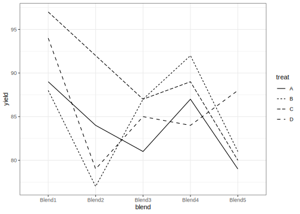
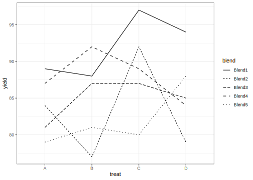

# Randomized Block Design fit using Frequentist Methods
[Julian Faraway](https://julianfaraway.github.io/)
2024-08-20

- [Data](#data)
- [Questions](#questions)
- [Linear Mixed Model](#linear-mixed-model)
- [LME4](#lme4)
- [NLME](#nlme)
- [MMRM](#mmrm)
- [GLMMTMB](#glmmtmb)
- [Discussion](#discussion)
- [Package version info](#package-version-info)

See the [introduction](../index.md) for an overview.

See a [mostly Bayesian analysis](penicillin.md) analysis of the same
data.

This example is discussed in more detail in my book [Extending the
Linear Model with R](https://julianfaraway.github.io/faraway/ELM/)

``` r
library(faraway)
library(ggplot2)
library(knitr)
```

# Data

Load in and plot the data:

``` r
data(penicillin, package="faraway")
summary(penicillin)
```

     treat    blend       yield   
     A:5   Blend1:4   Min.   :77  
     B:5   Blend2:4   1st Qu.:81  
     C:5   Blend3:4   Median :87  
     D:5   Blend4:4   Mean   :86  
           Blend5:4   3rd Qu.:89  
                      Max.   :97  

``` r
ggplot(penicillin,aes(x=blend,y=yield,group=treat,linetype=treat))+geom_line()
```



``` r
ggplot(penicillin,aes(x=treat,y=yield,group=blend,linetype=blend))+geom_line()
```



The production of penicillin uses a raw material, corn steep liquor,
which is quite variable and can only be made in blends sufficient for
four runs. There are four processes, A, B, C and D, for the production.
See `help(penicillin)` for more information about the data.

In this example, the treatments are the four processes. These are the
specific four processes of interest that we wish to compare. The five
blends are five among many blends that would be randomly created during
production. We are not interested in these five specific blends but are
interested in how the blends vary. An interaction between blends and
treatments would complicate matters. But (a) there is no reason to
expect this exists and (b) with only one replicate per treatment and
blend combination, it is difficult to check for an interaction.

The plots show no outliers, no skewness, no obviously unequal variances
and no clear evidence of interaction. Let’s proceed.

# Questions

1.  Is there a difference between treatments? If so, what?
2.  Is there variation between the blends? What is the extent of this
    variation?

# Linear Mixed Model

Consider the model: 

$$
y_{ijk} = \mu + \tau_i + v_j + \epsilon_{ijk}
$$

where the $\mu$ and$\tau_i$ are fixed effects and the error
$\epsilon_{ijk}$ is independent and identically distributed
$N(0,\sigma^2)$. The $v_j$ are random effects and are independent and
identically distributed $N(0,\sigma^2_v)$.

# LME4

``` r
library(lme4)
```

We fit the model using REML:

``` r
mmod <- lmer(yield ~ treat + (1|blend), penicillin)
summary(mmod, cor = FALSE)
```

    Linear mixed model fit by REML ['lmerMod']
    Formula: yield ~ treat + (1 | blend)
       Data: penicillin

    REML criterion at convergence: 103.8

    Scaled residuals: 
       Min     1Q Median     3Q    Max 
    -1.415 -0.502 -0.164  0.683  1.284 

    Random effects:
     Groups   Name        Variance Std.Dev.
     blend    (Intercept) 11.8     3.43    
     Residual             18.8     4.34    
    Number of obs: 20, groups:  blend, 5

    Fixed effects:
                Estimate Std. Error t value
    (Intercept)    84.00       2.47   33.94
    treatB          1.00       2.74    0.36
    treatC          5.00       2.74    1.82
    treatD          2.00       2.74    0.73

We get fixed effect estimates for the treatments but an estimated blend
SD. We can get random effect estimates:

``` r
ranef(mmod)$blend
```

           (Intercept)
    Blend1     4.28788
    Blend2    -2.14394
    Blend3    -0.71465
    Blend4     1.42929
    Blend5    -2.85859

We can test for a difference of the fixed effects with:

``` r
anova(mmod)
```

    Analysis of Variance Table
          npar Sum Sq Mean Sq F value
    treat    3     70    23.3    1.24

No p-value is supplied because there is some doubt in general over the
validity of the null F-distribution. In this specific example, with a
simple balanced design, it can be shown that the null F is correct. (For
other unbalanced or more complex designs, it would not be correct, hence
the caution about testing in `lme4`). Even if we use an F-distribution,
it’s not obvious what degrees of freedom to use for the denominator. The
usual heuristics about counting parameters do not apply because it’s not
clear how to account for the random effects. There are various
adjustment methods for computing the degrees of freedom.

We can use the Kenward-Roger method with:

``` r
library(pbkrtest)
amod <- lmer(yield ~ treat + (1|blend), penicillin, REML=FALSE)
nmod <- lmer(yield ~ 1 + (1|blend), penicillin, REML=FALSE)
KRmodcomp(amod, nmod)
```

    large : yield ~ treat + (1 | blend)
    small : yield ~ 1 + (1 | blend)
           stat   ndf   ddf F.scaling p.value
    Ftest  1.24  3.00 12.00         1    0.34

There is no evidence of a difference between the treatments.

Testing the random effects is more challenging. We can test the
hypothesis $H_0: \sigma^2_v = 0$ using a parametric bootstrap method:

``` r
rmod <- lmer(yield ~ treat + (1|blend), penicillin)
nlmod <- lm(yield ~ treat, penicillin)
as.numeric(2*(logLik(rmod)-logLik(nlmod,REML=TRUE)))
```

    [1] 2.7629

``` r
lrstatf <- numeric(1000)
for(i in 1:1000){
   ryield <-  unlist(simulate(nlmod))
   nlmodr <- lm(ryield ~ treat, penicillin)
   rmodr <- lmer(ryield ~ treat + (1|blend), penicillin)
   lrstatf[i] <- 2*(logLik(rmodr)-logLik(nlmodr,REML=TRUE))
  }
mean(lrstatf > 2.7629)
```

    [1] 0.039

The result falls just below the 5% level for significance. Because of
resampling variability, we should repeat with more bootstrap samples.

We can also test for variation in the random effects using the
[RLRsim](https://github.com/fabian-s/RLRsim) package:

``` r
library(RLRsim)
exactRLRT(mmod)
```


        simulated finite sample distribution of RLRT.
        
        (p-value based on 10000 simulated values)

    data:  
    RLRT = 2.76, p-value = 0.043

Again we get a marginally significant result.

The [emmeans](https://rvlenth.github.io/emmeans/) package computes
estimated marginal means. We can use it to compute the marginal
treatment effects along with confidence intervals”

``` r
library(emmeans)
emmeans(mmod, specs="treat")
```

     treat emmean   SE   df lower.CL upper.CL
     A         84 2.47 11.1     78.6     89.4
     B         85 2.47 11.1     79.6     90.4
     C         89 2.47 11.1     83.6     94.4
     D         86 2.47 11.1     80.6     91.4

    Degrees-of-freedom method: kenward-roger 
    Confidence level used: 0.95 

The difficult issue is the calculation of the appropriate degrees of
freedom for the computation of the intervals. We see that `emmeans` is
using the Kenward-Roger method.

We can also do some pairwise comparisons.

``` r
rem = emmeans(mmod, pairwise ~ treat)
summary(rem$contrasts,infer=TRUE)
```

     contrast estimate   SE df lower.CL upper.CL t.ratio p.value
     A - B          -1 2.74 12    -9.15     7.15  -0.364  0.9827
     A - C          -5 2.74 12   -13.15     3.15  -1.822  0.3105
     A - D          -2 2.74 12   -10.15     6.15  -0.729  0.8838
     B - C          -4 2.74 12   -12.15     4.15  -1.457  0.4905
     B - D          -1 2.74 12    -9.15     7.15  -0.364  0.9827
     C - D           3 2.74 12    -5.15    11.15   1.093  0.7002

    Degrees-of-freedom method: kenward-roger 
    Confidence level used: 0.95 
    Conf-level adjustment: tukey method for comparing a family of 4 estimates 
    P value adjustment: tukey method for comparing a family of 4 estimates 

There are no significant pairwise differences.

# NLME

See the discussion for the [single random effect
example](pulpfreq.md#NLME) for some introduction.

``` r
library(nlme)
```

The syntax is different with the random effect specified as a separate
term:

``` r
nlmod = lme(yield ~ treat, penicillin, ~ 1 | blend)
summary(nlmod)
```

    Linear mixed-effects model fit by REML
      Data: penicillin 
         AIC    BIC  logLik
      115.83 120.47 -51.915

    Random effects:
     Formula: ~1 | blend
            (Intercept) Residual
    StdDev:      3.4339   4.3397

    Fixed effects:  yield ~ treat 
                Value Std.Error DF t-value p-value
    (Intercept)    84    2.4749 12  33.941  0.0000
    treatB          1    2.7447 12   0.364  0.7219
    treatC          5    2.7447 12   1.822  0.0935
    treatD          2    2.7447 12   0.729  0.4802
     Correlation: 
           (Intr) treatB treatC
    treatB -0.555              
    treatC -0.555  0.500       
    treatD -0.555  0.500  0.500

    Standardized Within-Group Residuals:
         Min       Q1      Med       Q3      Max 
    -1.41516 -0.50174 -0.16438  0.68299  1.28365 

    Number of Observations: 20
    Number of Groups: 5 

The estimates and standard errors are the same for the corresponding
`lme4` output. `nlme` is less inhibited about testing and reports
p-values for the fixed effects (although these are not particularly
useful).

`nlme` is also happy to test the fixed effects with an F-test:

``` r
anova(nlmod)
```

                numDF denDF F-value p-value
    (Intercept)     1    12 2241.21  <.0001
    treat           3    12    1.24  0.3387

The result is the same as Kenward-Roger result reported earlier.

The `lme` output also works with `RLRsim` package demonstrated earlier.

``` r
exactRLRT(nlmod)
```


        simulated finite sample distribution of RLRT.
        
        (p-value based on 10000 simulated values)

    data:  
    RLRT = 2.76, p-value = 0.041

Random effects are the same as in `lme4`

``` r
random.effects(nlmod)
```

           (Intercept)
    Blend1     4.28788
    Blend2    -2.14394
    Blend3    -0.71465
    Blend4     1.42929
    Blend5    -2.85859

We can also do some estimated marginal means with `emmeans`:

``` r
emmeans(nlmod, specs="treat")
```

     treat emmean   SE df lower.CL upper.CL
     A         84 2.47  4     77.1     90.9
     B         85 2.47  4     78.1     91.9
     C         89 2.47  4     82.1     95.9
     D         86 2.47  4     79.1     92.9

    Degrees-of-freedom method: containment 
    Confidence level used: 0.95 

The default method for computing the degrees of freedom is “containment”
which is very conservative (underestimates the df - 4 is very low here).
We can specify the more realistic Satterthwaite method:

``` r
emmeans(nlmod, specs="treat", mode = "satterthwaite")
```

     treat emmean   SE df lower.CL upper.CL
     A         84 2.47 11     78.6     89.4
     B         85 2.47 11     79.6     90.4
     C         89 2.47 11     83.6     94.4
     D         86 2.47 11     80.6     91.4

    Degrees-of-freedom method: appx-satterthwaite 
    Confidence level used: 0.95 

We can also do some pairwise comparisons

``` r
rem = emmeans(nlmod, pairwise ~ treat, mode = "satterthwaite")
summary(rem$contrasts,infer=TRUE)
```

     contrast estimate   SE df lower.CL upper.CL t.ratio p.value
     A - B          -1 2.74 12    -9.15     7.15  -0.364  0.9827
     A - C          -5 2.74 12   -13.15     3.15  -1.822  0.3104
     A - D          -2 2.74 12   -10.15     6.15  -0.729  0.8838
     B - C          -4 2.74 12   -12.15     4.15  -1.457  0.4905
     B - D          -1 2.74 12    -9.15     7.15  -0.364  0.9827
     C - D           3 2.74 12    -5.15    11.15   1.093  0.7002

    Degrees-of-freedom method: appx-satterthwaite 
    Confidence level used: 0.95 
    Conf-level adjustment: tukey method for comparing a family of 4 estimates 
    P value adjustment: tukey method for comparing a family of 4 estimates 

We can take a GLS approach to modeling the random part of the model as
used in [single random effect example](pulpfreq.md):

``` r
gmod = gls(yield ~ treat,
           data=penicillin,
           correlation = corCompSymm(form = ~ 1|blend))
summary(gmod)
```

    Generalized least squares fit by REML
      Model: yield ~ treat 
      Data: penicillin 
         AIC    BIC  logLik
      115.83 120.47 -51.915

    Correlation Structure: Compound symmetry
     Formula: ~1 | blend 
     Parameter estimate(s):
        Rho 
    0.38503 

    Coefficients:
                Value Std.Error t-value p-value
    (Intercept)    84    2.4749  33.941  0.0000
    treatB          1    2.7447   0.364  0.7204
    treatC          5    2.7447   1.822  0.0872
    treatD          2    2.7447   0.729  0.4767

     Correlation: 
           (Intr) treatB treatC
    treatB -0.555              
    treatC -0.555  0.500       
    treatD -0.555  0.500  0.500

    Standardized residuals:
            Min          Q1         Med          Q3         Max 
    -1.6263e+00 -5.8728e-01  2.5679e-15  5.4210e-01  1.4456e+00 

    Residual standard error: 5.534 
    Degrees of freedom: 20 total; 16 residual

The fixed effect parts are the same although the F-test:

``` r
anova(gmod)
```

    Denom. DF: 16 
                numDF F-value p-value
    (Intercept)     1 2241.21  <.0001
    treat           3    1.24  0.3283

comes out somewhat differently (wrong) due to a different computation of
the residuals degrees of freedom.

The `emmeans` package also works with `gls` models:

``` r
emmeans(gmod, specs="treat", mode = "satterthwaite")
```

     treat emmean   SE   df lower.CL upper.CL
     A         84 2.47 11.1     78.6     89.4
     B         85 2.47 11.1     79.6     90.4
     C         89 2.47 11.1     83.6     94.4
     D         86 2.47 11.1     80.6     91.4

    Degrees-of-freedom method: satterthwaite 
    Confidence level used: 0.95 

# MMRM

See the discussion for the [single random effect
example](pulpfreq.md#MMRM) for some introduction.

``` r
library(mmrm)
```

As with the `pulp` example, we need to distinguish between the different
replicates for a given level of blend. We don’t need to create a visit
factor as in the previous example as `treat` serves the same purpose:

``` r
mmmod = mmrm(yield ~ treat + cs(treat|blend), penicillin)
summary(mmmod)
```

    mmrm fit

    Formula:     yield ~ treat + cs(treat | blend)
    Data:        penicillin (used 20 observations from 5 subjects with maximum 4 timepoints)
    Covariance:  compound symmetry (2 variance parameters)
    Method:      Satterthwaite
    Vcov Method: Asymptotic
    Inference:   REML

    Model selection criteria:
         AIC      BIC   logLik deviance 
       107.8    107.0    -51.9    103.8 

    Coefficients: 
                Estimate Std. Error    df t value Pr(>|t|)
    (Intercept)    84.00       2.48 11.07   33.94  1.5e-12
    treatB          1.00       2.75 12.00    0.36    0.722
    treatC          5.00       2.75 12.00    1.82    0.094
    treatD          2.00       2.75 12.00    0.73    0.480

    Covariance estimate:
           A      B      C      D
    A 30.625 11.792 11.792 11.792
    B 11.792 30.625 11.792 11.792
    C 11.792 11.792 30.625 11.792
    D 11.792 11.792 11.792 30.625

Fixed effect estimates are the same as in the `gls()` fit but notice
that the degrees of freedom have been adjusted down to 12dfs (as in the
Kenward-Roger adjustment for the `lme4` fit)

The random component is expressed as a covariance matrix. The SD down
the diagonal will give the estimated error variance from previous
models:

``` r
cm = mmmod$cov
sqrt(cm[1,1])
```

    [1] 5.534

We can compute the correlation as:

``` r
cm[1,2]/cm[1,1]
```

    [1] 0.38503

We see this is identical with the `gls()` fit as we would expect.

Performing an F-test on the fixed effects is more complicated than one
might like (and the documentation is lacking in this respect). One must
specify a *contrast matrix* of a form that picks out the combinations of
the parameters that the null hypothesis sets to zero. (Tip: it’s not one
of those contrasts where they have to sum to zero - that’s not a rule
that is universally obeyed) In this example, we are testing
$\beta_2=\beta_3=\beta_4=0$ so we construct a matrix $C$ such that
$C\beta=0$. For our test, we want:

``` r
cm = matrix(0,3,4)
cm[1,2] = cm[2,3] = cm[3,4] = 1
cm
```

         [,1] [,2] [,3] [,4]
    [1,]    0    1    0    0
    [2,]    0    0    1    0
    [3,]    0    0    0    1

and then perform the test:

``` r
df_md(mmmod, cm)
```

    $num_df
    [1] 3

    $denom_df
    [1] 12

    $f_stat
    [1] 1.2389

    $p_val
    [1] 0.33866

We get the same result as seen before. There are options on computing
the denominator degrees of freedom for the tests and confidence
intervals.

An easier way to do the test is to install the `car` package which has
an extension for `mmrm` models:

``` r
library(car)
Anova(mmmod)
```

    Analysis of Fixed Effect Table (Type II F tests)
          Num Df Denom Df F Statistic Pr(>=F)
    treat      3       12        1.24    0.34

We need not concern ourselves with the arcana of whether this is a Type
X test as there is only one term.

The `emmeans` package will also deal with `mmrm` models and produce some
confidence intervals for the marginal means:

``` r
emmeans(mmod, specs="treat")
```

     treat emmean   SE   df lower.CL upper.CL
     A         84 2.47 11.1     78.6     89.4
     B         85 2.47 11.1     79.6     90.4
     C         89 2.47 11.1     83.6     94.4
     D         86 2.47 11.1     80.6     91.4

    Degrees-of-freedom method: kenward-roger 
    Confidence level used: 0.95 

and do some pairwise comparisons:

``` r
rem = emmeans(mmmod, pairwise ~ treat)
summary(rem$contrasts,infer=TRUE)
```

     contrast estimate   SE df lower.CL upper.CL t.ratio p.value
     A - B          -1 2.74 12    -9.15     7.15  -0.364  0.9827
     A - C          -5 2.74 12   -13.15     3.15  -1.822  0.3105
     A - D          -2 2.74 12   -10.15     6.15  -0.729  0.8838
     B - C          -4 2.74 12   -12.15     4.15  -1.457  0.4905
     B - D          -1 2.74 12    -9.15     7.15  -0.364  0.9827
     C - D           3 2.74 12    -5.15    11.15   1.093  0.7002

    Confidence level used: 0.95 
    Conf-level adjustment: tukey method for comparing a family of 4 estimates 
    P value adjustment: tukey method for comparing a family of 4 estimates 

None of the pairwise comparisons are significant

# GLMMTMB

See the discussion for the [single random effect
example](pulpfreq.md#GLMMTMB) for some introduction.

``` r
library(glmmTMB)
```

The default fit uses ML (not REML)

``` r
gtmod <- glmmTMB(yield ~ treat + (1|blend), penicillin)
summary(gtmod)
```

     Family: gaussian  ( identity )
    Formula:          yield ~ treat + (1 | blend)
    Data: penicillin

         AIC      BIC   logLik deviance df.resid 
       129.3    135.3    -58.6    117.3       14 

    Random effects:

    Conditional model:
     Groups   Name        Variance Std.Dev.
     blend    (Intercept)  9.43    3.07    
     Residual             15.07    3.88    
    Number of obs: 20, groups:  blend, 5

    Dispersion estimate for gaussian family (sigma^2): 15.1 

    Conditional model:
                Estimate Std. Error z value Pr(>|z|)
    (Intercept)    84.00       2.21    37.9   <2e-16
    treatB          1.00       2.45     0.4    0.684
    treatC          5.00       2.45     2.0    0.042
    treatD          2.00       2.45     0.8    0.415

This is identical with the `lme4` fit using ML.

We can use the `car` package to test the treatment effects:

``` r
Anova(gtmod)
```

    Analysis of Deviance Table (Type II Wald chisquare tests)

    Response: yield
          Chisq Df Pr(>Chisq)
    treat  4.65  3        0.2

We get a chi-squared test which is less efficient than the F-test. We
could do the simulation-based testing as for `lme4` if we wanted the
F-test.

The `emmeans` package also plays nice with `glmmTMB` models:

``` r
emmeans(gtmod, specs="treat")
```

     treat emmean   SE df lower.CL upper.CL
     A         84 2.21 14     79.3     88.7
     B         85 2.21 14     80.3     89.7
     C         89 2.21 14     84.3     93.7
     D         86 2.21 14     81.3     90.7

    Confidence level used: 0.95 

The results are not the same as for the `mmrm` because a different
degrees of freedom has been used.

``` r
rem = emmeans(gtmod, pairwise ~ treat)
summary(rem$contrasts,infer=TRUE)
```

     contrast estimate   SE df lower.CL upper.CL t.ratio p.value
     A - B          -1 2.45 14    -8.14     6.14  -0.407  0.9763
     A - C          -5 2.45 14   -12.14     2.14  -2.037  0.2214
     A - D          -2 2.45 14    -9.14     5.14  -0.815  0.8466
     B - C          -4 2.45 14   -11.14     3.14  -1.629  0.3948
     B - D          -1 2.45 14    -8.14     6.14  -0.407  0.9763
     C - D           3 2.45 14    -4.14    10.14   1.222  0.6238

    Confidence level used: 0.95 
    Conf-level adjustment: tukey method for comparing a family of 4 estimates 
    P value adjustment: tukey method for comparing a family of 4 estimates 

Again there are some differences due the degrees of freedom calculation.

# Discussion

The main difference between the packages lies in the inference. This is
unsurprising since it is a complex issue. `lme4` and `glmmTMB`
subcontract the inference to other packages. The implementation in
`mmrm` is not straightforward although using the `car` package makes it
easier. `nlme` is less inhibited giving the right answer in this case
(but not for `gls`). Unfortunately, the uninhibited answer will not be
correct in more complex examples.

The `emmeans` package works with all four fitting packages although the
results are not all the same mainly due to the degrees of freedom
adjustment issue.

# Package version info

``` r
sessionInfo()
```

    R version 4.4.1 (2024-06-14)
    Platform: x86_64-apple-darwin20
    Running under: macOS Sonoma 14.6.1

    Matrix products: default
    BLAS:   /Library/Frameworks/R.framework/Versions/4.4-x86_64/Resources/lib/libRblas.0.dylib 
    LAPACK: /Library/Frameworks/R.framework/Versions/4.4-x86_64/Resources/lib/libRlapack.dylib;  LAPACK version 3.12.0

    locale:
    [1] en_US.UTF-8/en_US.UTF-8/en_US.UTF-8/C/en_US.UTF-8/en_US.UTF-8

    time zone: Europe/London
    tzcode source: internal

    attached base packages:
    [1] stats     graphics  grDevices utils     datasets  methods   base     

    other attached packages:
     [1] glmmTMB_1.1.9  car_3.1-2      carData_3.0-5  mmrm_0.3.12    nlme_3.1-165   emmeans_1.10.3 RLRsim_3.1-8  
     [8] pbkrtest_0.5.3 lme4_1.1-35.5  Matrix_1.7-0   knitr_1.48     ggplot2_3.5.1  faraway_1.0.8 

    loaded via a namespace (and not attached):
     [1] utf8_1.2.4          generics_0.1.3      tidyr_1.3.1         stringi_1.8.4       lattice_0.22-6     
     [6] digest_0.6.36       magrittr_2.0.3      estimability_1.5.1  evaluate_0.24.0     grid_4.4.1         
    [11] mvtnorm_1.2-5       fastmap_1.2.0       jsonlite_1.8.8      backports_1.5.0     mgcv_1.9-1         
    [16] purrr_1.0.2         fansi_1.0.6         scales_1.3.0        numDeriv_2016.8-1.1 abind_1.4-5        
    [21] Rdpack_2.6          cli_3.6.3           rlang_1.1.4         rbibutils_2.2.16    munsell_0.5.1      
    [26] splines_4.4.1       withr_3.0.1         yaml_2.3.10         tools_4.4.1         parallel_4.4.1     
    [31] checkmate_2.3.2     coda_0.19-4.1       nloptr_2.1.1        minqa_1.2.7         dplyr_1.1.4        
    [36] colorspace_2.1-1    boot_1.3-30         broom_1.0.6         vctrs_0.6.5         R6_2.5.1           
    [41] lifecycle_1.0.4     stringr_1.5.1       MASS_7.3-61         pkgconfig_2.0.3     pillar_1.9.0       
    [46] gtable_0.3.5        glue_1.7.0          Rcpp_1.0.13         systemfonts_1.1.0   xfun_0.46          
    [51] tibble_3.2.1        tidyselect_1.2.1    rstudioapi_0.16.0   xtable_1.8-4        farver_2.1.2       
    [56] htmltools_0.5.8.1   rmarkdown_2.27      svglite_2.1.3       labeling_0.4.3      TMB_1.9.14         
    [61] compiler_4.4.1     
