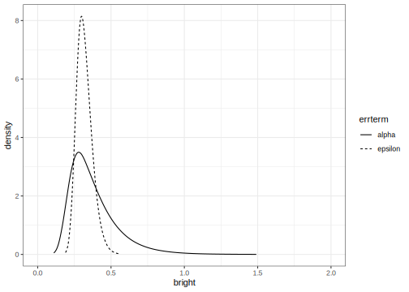
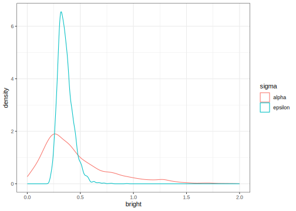

# One Way Anova with a random effect
[Julian Faraway](https://julianfaraway.github.io/)
2024-08-15

- [Data](#data)
- [Questions](#questions)
- [Linear model with fixed effects](#linear-model-with-fixed-effects)
- [Likelihood inference](#likelihood-inference)
  - [Hypothesis testing](#hypothesis-testing)
  - [Confidence intervals](#confidence-intervals)
  - [Random effects](#random-effects)
- [INLA](#inla)
  - [Halfnormal prior on the SDs](#halfnormal-prior-on-the-sds)
  - [Informative gamma priors on the
    precisions](#informative-gamma-priors-on-the-precisions)
  - [Penalized Complexity Prior](#penalized-complexity-prior)
- [STAN](#stan)
  - [Diagnostics](#diagnostics)
  - [Output summaries](#output-summaries)
  - [Posterior Distributions](#posterior-distributions)
  - [Tail probability](#tail-probability)
- [BRMS](#brms)
- [MGCV](#mgcv)
  - [GINLA](#ginla)
- [Discussion](#discussion)
- [Package version info](#package-version-info)

See the [introduction](../index.md) for an overview.

This example is discussed in more detail in my book [Extending the
Linear Model with R](https://julianfaraway.github.io/faraway/ELM/)

Libraries used:

``` r
library(faraway)
library(ggplot2)
library(lme4)
library(INLA)
library(knitr)
library(cmdstanr)
library(brms)
library(mgcv)
register_knitr_engine(override = FALSE)
```

# Data

Load up and look at the data, which concerns the brightness of paper
which may vary between operators of the production machinery.

``` r
data(pulp, package="faraway")
summary(pulp)
```

         bright     operator
     Min.   :59.8   a:5     
     1st Qu.:60.0   b:5     
     Median :60.5   c:5     
     Mean   :60.4   d:5     
     3rd Qu.:60.7           
     Max.   :61.0           

``` r
ggplot(pulp, aes(x=operator, y=bright))+geom_point(position = position_jitter(width=0.1, height=0.0))
```


You can read more about the data by typing `help(pulp)` at the R prompt.

In this example, there are only five replicates per level. There is no
strong reason to reject the normality assumption. We don’t care about
the specific operators, who are named a, b, c and d, but we do want to
know how they vary.

# Questions

1.  Is there a difference between operators in general?
2.  How much is the difference between operators in general?
3.  How does the variation between operators compare to the variation
    within operators?
4.  What is the difference between these four operators?

We are mostly interested in the first three questions.

# Linear model with fixed effects

We start with the simplest analysis although it is not correct. It will
be useful for comparisons. We treat the operator as a fixed effect
meaning that the analysis refers to these four operators and not to
other possible operators. Since we probably don’t care about these
particular four operators, this would not be the best choice.

You can use the `lm()` or `aov()` functions:

``` r
amod = aov(bright ~ operator, pulp)
```

Now test for a difference between operators:

``` r
anova(amod)
```

    Analysis of Variance Table

    Response: bright
              Df Sum Sq Mean Sq F value Pr(>F)
    operator   3   1.34   0.447     4.2  0.023
    Residuals 16   1.70   0.106               

We find a statistically significant difference. We can estimate the
coefficients:

``` r
coef(amod)
```

    (Intercept)   operatorb   operatorc   operatord 
          60.24       -0.18        0.38        0.44 

The treatment coding sets operator a as the reference level. The
intercept is the mean for operator a and the other estimates are
differences in the mean from operator a. We can also test for a
difference between pairs of operators:

``` r
TukeyHSD(amod)
```

      Tukey multiple comparisons of means
        95% family-wise confidence level

    Fit: aov(formula = bright ~ operator, data = pulp)

    $operator
         diff       lwr     upr   p adj
    b-a -0.18 -0.769814 0.40981 0.81854
    c-a  0.38 -0.209814 0.96981 0.29030
    d-a  0.44 -0.149814 1.02981 0.18448
    c-b  0.56 -0.029814 1.14981 0.06579
    d-b  0.62  0.030186 1.20981 0.03767
    d-c  0.06 -0.529814 0.64981 0.99108

Only the d to b difference is found significant.

We have answered the fourth question stated above. We could make some
speculations on the first three questions (what can be said about
operators in general) but our analysis was not designed to do this.

The `aov()` function has been available in R and S before that i.e. at
least 30 years. I do not believe it has changed in a long time. It can
handle some simple models but it is has very limited functionality.

# Likelihood inference

We use a model of the form: $$
y_{ij} = \mu + \alpha_i + \epsilon_{ij} \qquad i=1,\dots ,a
  \qquad j=1,\dots ,n_i,
$$ where the $\alpha_i$ and $\epsilon_{ij}$ are normal with mean zero,
but variances $\sigma_\alpha^2$ and $\sigma^2_\epsilon$, respectively.

The default fit uses the REML estimation method:

``` r
mmod <- lmer(bright ~ 1+(1|operator), pulp)
faraway::sumary(mmod)
```

    Fixed Effects:
    coef.est  coef.se 
       60.40     0.15 

    Random Effects:
     Groups   Name        Std.Dev.
     operator (Intercept) 0.26    
     Residual             0.33    
    ---
    number of obs: 20, groups: operator, 4
    AIC = 24.6, DIC = 14.4
    deviance = 16.5 

We see slightly less variation between operators ( $\hat\sigma_a=0.261$
) than within operators ( $\sigma_\epsilon=0.326$ ).

## Hypothesis testing

We can also use the ML method:

``` r
smod <- lmer(bright ~ 1+(1|operator), pulp, REML = FALSE)
faraway::sumary(smod)
```

    Fixed Effects:
    coef.est  coef.se 
       60.40     0.13 

    Random Effects:
     Groups   Name        Std.Dev.
     operator (Intercept) 0.21    
     Residual             0.33    
    ---
    number of obs: 20, groups: operator, 4
    AIC = 22.5, DIC = 16.5
    deviance = 16.5 

The REML method is preferred for estimation but we must use the ML
method if we wish to make hypothesis tests comparing models.

If we want to test for variation between operators, we fit a null model
containing no operator, compute the likelihood ratio statistic and
corresponding p-value:

``` r
nullmod <- lm(bright ~ 1, pulp)
lrtstat <- as.numeric(2*(logLik(smod)-logLik(nullmod)))
pvalue <- pchisq(lrtstat,1,lower=FALSE)
data.frame(lrtstat, pvalue)
```

      lrtstat  pvalue
    1  2.5684 0.10902

Superficially, the p-value greater than 0.05 suggests no strong evidence
against that hypothesis that there is no variation among the operators.
But there is good reason to doubt the accuracy of the standard
approximation of the chi-squared null distribution when testing a
parameter on the boundary of the space (as we do here at zero). A
parametric bootstrap can be used where we generate samples from the null
and compute the test statistic repeatedly:

``` r
lrstat <- numeric(1000)
set.seed(123)
for(i in 1:1000){
   y <- unlist(simulate(nullmod))
   bnull <- lm(y ~ 1)
   balt <- lmer(y ~ 1 + (1|operator), pulp, REML=FALSE)
   lrstat[i] <- as.numeric(2*(logLik(balt)-logLik(bnull)))
  }
```

Check the proportion of simulated test statistics that are close to
zero:

``` r
mean(lrstat < 0.00001)
```

    [1] 0.703

Clearly, the test statistic does not have a chi-squared distribution
under the null. We can compute the proportion that exceed the observed
test statistic of 2.5684:

``` r
mean(lrstat > 2.5684)
```

    [1] 0.019

This is a more reliable p-value for our hypothesis test which suggest
there is good reason to reject the null hypothesis of no variation
between operators.

More sophisticated methods of inference are discussed in [Extending the
Linear Model with R](https://julianfaraway.github.io/faraway/ELM/)

## Confidence intervals

We can use bootstrap again to compute confidence intervals for the
parameters of interest:

``` r
confint(mmod, method="boot")
```

                   2.5 %   97.5 %
    .sig01       0.00000  0.51451
    .sigma       0.21084  0.43020
    (Intercept) 60.11213 60.69244

We see that the lower end of the confidence interval for the operator SD
extends to zero.

## Random effects

Even though we are most interested in the variation between operators,
we can still estimate their individual effects:

``` r
ranef(mmod)$operator
```

      (Intercept)
    a    -0.12194
    b    -0.25912
    c     0.16767
    d     0.21340

Approximate 95% confidence intervals can be displayed with:

``` r
dd = as.data.frame(ranef(mmod))
ggplot(dd, aes(y=grp,x=condval)) +
        geom_point() +
        geom_errorbarh(aes(xmin=condval -2*condsd,
                           xmax=condval +2*condsd), height=0)
```


# INLA

Integrated nested Laplace approximation is a method of Bayesian
computation which uses approximation rather than simulation. More can be
found on this topic in [Bayesian Regression Modeling with
INLA](http://julianfaraway.github.io/brinla/) and the [chapter on
GLMMs](https://julianfaraway.github.io/brinlabook/chaglmm.html)

At the time of writing, INLA has recently undergone some changes that
have some impact on the fitting of mixed effect models. Previously, the
model fitting proceeded in two stages - the first step computed the
posteriors for most of the parameters while a second step makes a
refinement to compute posteriors for the hyperparameters (the variances
of the random terms in this case). This was termed *classic* mode. In
the new method, the idea is to compute all the posteriors in one stage.
This was called *experimental* mode and is now called *compact* mode.
This *compact* mode is now the default.

You can see an [older
analyis](http://julianfaraway.github.io/brinla/examples/oneway.html) of
the same data using the previous methodology. We use the most recent
computational methodology and also opt for a shorter output summary:

``` r
inla.setOption(inla.mode="compact")
inla.setOption("short.summary",TRUE)
```

Run the INLA model with default priors:

``` r
imod <- inla(bright ~ f(operator, model="iid"),
             family="gaussian",
             data=pulp)
```

The summary of the posterior distribution for the fixed effects (which
is only the intercept in this example):

``` r
imod$summary.fixed |> kable()
```

|             | mean |      sd | 0.025quant | 0.5quant | 0.975quant | mode | kld |
|:------------|-----:|--------:|-----------:|---------:|-----------:|-----:|----:|
| (Intercept) | 60.4 | 0.08809 |     60.226 |     60.4 |     60.574 | 60.4 |   0 |

The posterior mean is the same as the (RE)ML estimate. The posterior
distribution of the hyperparameters (precision of the error and operator
terms)

``` r
imod$summary.hyperpar |> kable()
```

|                                         |       mean |         sd | 0.025quant |   0.5quant | 0.975quant |      mode |
|:----------------------------------------|-----------:|-----------:|-----------:|-----------:|-----------:|----------:|
| Precision for the Gaussian observations |     6.8903 |     2.1299 |     3.4852 |     6.6368 |     11.791 |    6.1554 |
| Precision for operator                  | 17504.1469 | 17051.8380 |  1101.7099 | 12305.8966 |  62746.492 | 2981.3404 |

Precision for the operator term is unreasonably high. This implies a
strong belief that there is no variation between the operators which we
would find hard to believe. This is due to the default diffuse gamma
prior on the precisions which put almost all the weight on the error
variation and not nearly enough on the operator variation. We need to
change the prior.

## Halfnormal prior on the SDs

We try a halfnormal prior with low precision instead. A precision of
0.01 corresponds to an SD of 10. (It is possible to vary the mean but we
have set this to zero to achieve a halfnormal distribution). This is
substantially larger than the SD of the response so the information
supplied is very weak.

``` r
tnprior <- list(prec = list(prior="logtnormal", param = c(0,0.01)))
imod <- inla(bright ~ f(operator, model="iid", hyper = tnprior),
               family="gaussian", 
               data=pulp)
summary(imod)
```

    Fixed effects:
                mean    sd 0.025quant 0.5quant 0.975quant mode   kld
    (Intercept) 60.4 0.306     59.774     60.4     61.026 60.4 0.059

    Model hyperparameters:
                                             mean    sd 0.025quant 0.5quant 0.975quant mode
    Precision for the Gaussian observations 10.65  3.52      5.106    10.20      18.81 9.35
    Precision for operator                  12.74 20.63      0.481     6.52      63.35 1.15

     is computed 

The results appear more plausible. Transform to the SD scale

``` r
sigmaalpha <- inla.tmarginal(function(x)1/sqrt(exp(x)),
                             imod$internal.marginals.hyperpar[[2]])
sigmaepsilon <- inla.tmarginal(function(x)1/sqrt(exp(x)),
                                imod$internal.marginals.hyperpar[[1]])
```

and output the summary statistics (note that transforming the summary
statistics on the precision scale only works for the quantiles)

``` r
sigalpha = c(inla.zmarginal(sigmaalpha, silent = TRUE),
            mode=inla.mmarginal(sigmaalpha))
sigepsilon = c(inla.zmarginal(sigmaepsilon, silent = TRUE),
              mode=inla.mmarginal(sigmaepsilon))
rbind(sigalpha, sigepsilon) 
```

               mean    sd       quant0.025 quant0.25 quant0.5 quant0.75 quant0.975 mode   
    sigalpha   0.48835 0.34812  0.12583    0.26007   0.38996  0.60265   1.4264     0.26504
    sigepsilon 0.3191  0.053609 0.23116    0.28071   0.31272  0.35101   0.44094    0.29913

The posterior mode is most comparable with the (RE)ML estimates computed
above. In this respect, the results are similar.

We can also get summary statistics on the random effects:

``` r
imod$summary.random$operator |> kable()
```

| ID  |     mean |      sd | 0.025quant | 0.5quant | 0.975quant |     mode |     kld |
|:----|---------:|--------:|-----------:|---------:|-----------:|---------:|--------:|
| a   | -0.13063 | 0.32019 |   -0.79984 | -0.11960 |    0.49535 | -0.08799 | 0.04964 |
| b   | -0.27746 | 0.32512 |   -0.97235 | -0.26118 |    0.32551 | -0.23350 | 0.04693 |
| c   |  0.17958 | 0.32151 |   -0.43875 |  0.16625 |    0.85736 |  0.13448 | 0.04885 |
| d   |  0.22847 | 0.32302 |   -0.38191 |  0.21329 |    0.91461 |  0.18576 | 0.04812 |

Plot the posterior densities for the two SD terms:

``` r
ddf <- data.frame(rbind(sigmaalpha,sigmaepsilon),
                  errterm=gl(2,dim(sigmaalpha)[1],labels = c("alpha","epsilon")))
ggplot(ddf, aes(x,y, linetype=errterm))+
  geom_line()+xlab("bright")+ylab("density")+xlim(0,2)
```


We see that the operator SD less precisely known than the error SD.
Although the mode for the operator is smaller, there is a substantial
chance it could be much higher than the error SD.

Is there any variation between operators? We framed this question as an
hypothesis test previously but that is not sensible in this framework.
We might ask the probability that the operator SD is zero. Since we have
posited a continuous prior that places no discrete mass on zero, the
posterior probability will be zero, regardless of the data. Instead we
might ask the probability that the operator SD is small. Given the
response is measured to one decimal place, 0.1 is a reasonable
representation of *small* if we take this to mean the smallest amount we
care about.

We can compute the probability that the operator SD is smaller than 0.1:

``` r
inla.pmarginal(0.1, sigmaalpha)
```

    [1] 0.0085291

The probability is small but not entirely negligible.

## Informative gamma priors on the precisions

Now try more informative gamma priors for the precisions. Define it so
the mean value of gamma prior is set to the inverse of the variance of
the response. We expect the two error variances to be lower than the
response variance so this is an overestimate. The variance of the gamma
prior (for the precision) is controlled by the `apar` shape parameter in
the code. `apar=1` is the exponential distribution. Shape values less
than one result in densities that have a mode at zero and decrease
monotonely. These have greater variance and hence less informative.

``` r
apar <- 0.5
bpar <- var(pulp$bright)*apar
lgprior <- list(prec = list(prior="loggamma", param = c(apar,bpar)))
imod <- inla(bright ~ f(operator, model="iid", hyper = lgprior),
               family="gaussian", 
               data=pulp)
summary(imod)
```

    Fixed effects:
                mean    sd 0.025quant 0.5quant 0.975quant mode   kld
    (Intercept) 60.4 0.207     59.984     60.4     60.816 60.4 0.002

    Model hyperparameters:
                                             mean   sd 0.025quant 0.5quant 0.975quant mode
    Precision for the Gaussian observations 10.63 3.51       5.09    10.18      18.77 9.33
    Precision for operator                  10.95 8.98       1.52     8.54      34.58 4.30

     is computed 

Compute the summaries as before:

``` r
sigmaalpha <- inla.tmarginal(function(x)1/sqrt(exp(x)),
                             imod$internal.marginals.hyperpar[[2]])
sigmaepsilon <- inla.tmarginal(function(x)1/sqrt(exp(x)),
                            imod$internal.marginals.hyperpar[[1]])
sigalpha = c(inla.zmarginal(sigmaalpha, silent = TRUE),
            mode=inla.mmarginal(sigmaalpha))
sigepsilon = c(inla.zmarginal(sigmaepsilon, silent = TRUE),
              mode=inla.mmarginal(sigmaepsilon))
rbind(sigalpha, sigepsilon) 
```

               mean    sd       quant0.025 quant0.25 quant0.5 quant0.75 quant0.975 mode   
    sigalpha   0.37932 0.16436  0.17076    0.26434   0.34096  0.45282   0.80274    0.2794 
    sigepsilon 0.31946 0.053727 0.2314     0.28098   0.31305  0.35143   0.44163    0.29936

Slightly different outcome.

Make the plots:

``` r
ddf <- data.frame(rbind(sigmaalpha,sigmaepsilon),
                  errterm=gl(2,dim(sigmaalpha)[1],labels = c("alpha","epsilon")))
ggplot(ddf, aes(x,y, linetype=errterm))+
  geom_line()+xlab("bright")+ylab("density")+xlim(0,2)
```



The posterior for the error SD is quite similar to that seen previously
but the operator SD is larger and bounded away from zero and less
dispersed.

We can compute the probability that the operator SD is smaller than 0.1:

``` r
inla.pmarginal(0.1, sigmaalpha)
```

    [1] 3.3572e-05

The probability is very small. The choice of prior may be unsuitable in
that no density is placed on an SD=0 (or infinite precision). We also
have very little prior weight on low SD/high precision values. This
leads to a posterior for the operator with very little density assigned
to small values of the SD. But we can see from looking at the data or
from prior analyses of the data that there is some possibility that the
operator SD is very small.

## Penalized Complexity Prior

In [Simpson (2017)](https://doi.org/10.1214/16-STS576), penalized
complexity priors are proposed. This requires that we specify a scaling
for the SDs of the random effects. We use the SD of the residuals of the
fixed effects only model (what might be called the base model in the
paper) to provide this scaling.

``` r
sdres <- sd(pulp$bright)
pcprior <- list(prec = list(prior="pc.prec", param = c(3*sdres,0.01)))
imod <- inla(bright ~ f(operator, model="iid", hyper = pcprior),
               family="gaussian", 
               data=pulp)
summary(imod)
```

    Fixed effects:
                mean    sd 0.025quant 0.5quant 0.975quant mode kld
    (Intercept) 60.4 0.172      60.05     60.4      60.75 60.4   0

    Model hyperparameters:
                                             mean    sd 0.025quant 0.5quant 0.975quant mode
    Precision for the Gaussian observations 10.56  3.51       5.05    10.12      18.70 9.26
    Precision for operator                  25.10 34.61       2.21    14.81     111.99 5.70

     is computed 

Compute the summaries as before:

``` r
sigmaalpha <- inla.tmarginal(function(x)1/sqrt(exp(x)),
                             imod$internal.marginals.hyperpar[[2]])
sigmaepsilon <- inla.tmarginal(function(x)1/sqrt(exp(x)),
                            imod$internal.marginals.hyperpar[[1]])
sigalpha = c(inla.zmarginal(sigmaalpha, silent = TRUE),
            mode=inla.mmarginal(sigmaalpha))
sigepsilon = c(inla.zmarginal(sigmaepsilon, silent = TRUE),
              mode=inla.mmarginal(sigmaepsilon))
rbind(sigalpha, sigepsilon) 
```

               mean    sd       quant0.025 quant0.25 quant0.5 quant0.75 quant0.975 mode   
    sigalpha   0.29077 0.14866  0.095096   0.18461   0.25985  0.36156   0.66617    0.20377
    sigepsilon 0.32048 0.054035 0.23185    0.28178   0.31405  0.35264   0.4433     0.30036

We get a similar result to the truncated normal prior used earlier
although the operator SD is generally smaller.

Make the plots:

``` r
ddf <- data.frame(rbind(sigmaalpha,sigmaepsilon),
                  errterm=gl(2,dim(sigmaalpha)[1],labels = c("alpha","epsilon")))
ggplot(ddf, aes(x,y, linetype=errterm))+
  geom_line()+xlab("bright")+ylab("density")+xlim(0,2)
```


We can compute the probability that the operator SD is smaller than 0.1:

``` r
inla.pmarginal(0.1, sigmaalpha)
```

    [1] 0.03128

The probability is small but not insubstantial.

We can plot the posterior density of $\mu$ along with a 95% credibility
interval:

``` r
mu <- data.frame(imod$marginals.fixed[[1]])
cbound = inla.qmarginal(c(0.025,0.975),mu)
ggplot(mu, aes(x,y)) + geom_line() + 
  geom_vline(xintercept = cbound) +
  xlab("brightness")+ylab("density")
```


We can plot the posterior marginals of the random effects:

``` r
nlevels = length(unique(pulp$operator))
rdf = data.frame(do.call(rbind,imod$marginals.random$operator))
rdf$operator = gl(nlevels,nrow(rdf)/nlevels,labels=1:nlevels)
ggplot(rdf,aes(x=x,y=y,group=operator, color=operator)) + 
  geom_line() +
  xlab("") + ylab("Density")
```


We see that operators 1 and 2 tend to be lower than 3 and 4. There is
substantial overlap so we would hesitate to declare any difference
between a pair of operators.

# STAN

[STAN](https://mc-stan.org/) performs Bayesian inference using MCMC.
There are two ways to access Stan from within R - `rstan` and
`cmdstanr`. Previously I have used `rstan` but there have been some
difficulties in updating the interface with Stan such that only an older
version of Stan can be used and I cannot get `rstan` to work with R
version 4.3. Although updates to fix this have been promised, I am
switching to `cmdstanr` for this section because it works and works with
the most recent version of Stan.

You see below the Stan code to fit our model. Rmarkdown allows the use
of Stan chunks (elsewhere I have R chunks). The chunk header looks like
this.

STAN chunk will be compiled to ‘mod’. Chunk header is:

    cmdstan, output.var="mod", override = FALSE

An alternative approach would be to have the Stan code in a separate
file. This might be more convenient in practice but we use the chunk
approach since we can easily see the code. Compilation of the Stan code
will now occur.

``` stan
data {
  int<lower=0> N;
  int<lower=0> J;
  array[N] int<lower=1,upper=J> predictor;
  array[N] real response;
}
parameters {
  vector[J] eta;
  real mu;
  real<lower=0> sigmaalpha;
  real<lower=0> sigmaepsilon;
}
transformed parameters {
  vector[J] a;
  vector[N] yhat;

  a = mu + sigmaalpha * eta;

  for (i in 1:N)
    yhat[i] = a[predictor[i]];
}
model {
  eta ~ normal(0, 1);

  response ~ normal(yhat, sigmaepsilon);
}
```

We have used uninformative priors for the overall mean and the two
variances. Prepare data in a format consistent with the command file.
Needs to be a list. Can’t use the word `operator` since this is reserved
for system use in STAN.

``` r
pulpdat <- list(N=nrow(pulp),
                J=length(unique(pulp$operator)),
                response=pulp$bright,
                predictor=as.numeric(pulp$operator))
```

Do the MCMC sampling:

``` r
fit <- mod$sample(
  data = pulpdat, 
  seed = 123, 
  chains = 4, 
  parallel_chains = 4,
  refresh = 500 # print update every 500 iters
)
```

    Running MCMC with 4 parallel chains...

    Chain 1 Iteration:    1 / 2000 [  0%]  (Warmup) 
    Chain 2 Iteration:    1 / 2000 [  0%]  (Warmup) 
    Chain 3 Iteration:    1 / 2000 [  0%]  (Warmup) 
    Chain 4 Iteration:    1 / 2000 [  0%]  (Warmup) 
    Chain 3 Iteration:  500 / 2000 [ 25%]  (Warmup) 
    Chain 3 Iteration: 1000 / 2000 [ 50%]  (Warmup) 
    Chain 3 Iteration: 1001 / 2000 [ 50%]  (Sampling) 
    Chain 4 Iteration:  500 / 2000 [ 25%]  (Warmup) 
    Chain 1 Iteration:  500 / 2000 [ 25%]  (Warmup) 
    Chain 1 Iteration: 1000 / 2000 [ 50%]  (Warmup) 
    Chain 1 Iteration: 1001 / 2000 [ 50%]  (Sampling) 
    Chain 1 Iteration: 1500 / 2000 [ 75%]  (Sampling) 
    Chain 1 Iteration: 2000 / 2000 [100%]  (Sampling) 
    Chain 2 Iteration:  500 / 2000 [ 25%]  (Warmup) 
    Chain 2 Iteration: 1000 / 2000 [ 50%]  (Warmup) 
    Chain 2 Iteration: 1001 / 2000 [ 50%]  (Sampling) 
    Chain 2 Iteration: 1500 / 2000 [ 75%]  (Sampling) 
    Chain 2 Iteration: 2000 / 2000 [100%]  (Sampling) 
    Chain 3 Iteration: 1500 / 2000 [ 75%]  (Sampling) 
    Chain 3 Iteration: 2000 / 2000 [100%]  (Sampling) 
    Chain 4 Iteration: 1000 / 2000 [ 50%]  (Warmup) 
    Chain 4 Iteration: 1001 / 2000 [ 50%]  (Sampling) 
    Chain 4 Iteration: 1500 / 2000 [ 75%]  (Sampling) 
    Chain 4 Iteration: 2000 / 2000 [100%]  (Sampling) 
    Chain 1 finished in 0.5 seconds.
    Chain 2 finished in 0.5 seconds.
    Chain 3 finished in 0.5 seconds.
    Chain 4 finished in 0.4 seconds.

    All 4 chains finished successfully.
    Mean chain execution time: 0.5 seconds.
    Total execution time: 0.7 seconds.

By default, we use 2000 iterations but repeated with independent starts
4 times giving 4 chains. We can thin but do not by default. The warmup
period is half the number of observations.

We get warning messages about the fit. Since the default number of 2000
iterations runs in seconds, we can simply run a lot more iterations.
This is rather lazy and would not be viable for more expensive
computations, but sometimes CPU effort is preferred to mental effort. We
stick with the default here.

## Diagnostics

Diagnostics to check the convergence are worthwhile.

Extract the draws into a convenient dataframe format:

``` r
draws_df <- fit$draws(format = "df")
```

Check the diagnostics on the most problematic parameter:

``` r
ggplot(draws_df,
       aes(x=.iteration,y=sigmaalpha,color=factor(.chain))) + geom_line() +
  labs(color = 'Chain', x="Iteration")
```


We see the traces of the four chains overlaid in different colors. The
chains appear roughly stationary although there are some occasional
larger excursions (which is why we prefer more iterations).

The similar plots can be produced for other parameters although these
are less likely to give us trouble.

## Output summaries

We consider only the parameters of immediate interest:

``` r
fit$summary(c("mu","sigmaalpha","sigmaepsilon","a"))
```

    # A tibble: 7 × 10
      variable       mean median     sd    mad      q5    q95  rhat ess_bulk ess_tail
      <chr>         <dbl>  <dbl>  <dbl>  <dbl>   <dbl>  <dbl> <dbl>    <dbl>    <dbl>
    1 mu           60.4   60.4   0.268  0.191  60.0    60.9    1.01     622.     279.
    2 sigmaalpha    0.472  0.374 0.371  0.242   0.0897  1.19   1.01     617.     496.
    3 sigmaepsilon  0.360  0.347 0.0725 0.0630  0.264   0.492  1.00    1427.    1459.
    4 a[1]         60.3   60.3   0.151  0.148  60.0    60.5    1.00    3017.    3228.
    5 a[2]         60.1   60.1   0.169  0.166  59.9    60.4    1.00    2134.    2237.
    6 a[3]         60.6   60.6   0.157  0.150  60.3    60.8    1.00    2325.    2321.
    7 a[4]         60.6   60.6   0.159  0.157  60.4    60.9    1.00    2421.    2606.

We see the posterior mean, median, SD and MAD of the samples. We see
some quantiles from which we could construct a 95% credible interval
(for example). The `ess` are rough measures of the sample size taking
into account the correlation in the samples. The effective sample sizes
for the mean and operator SD primary parameters is not large
(considering the number of iterations) although adequate enough for most
purposes. The Rhat statistic is known as the potential scale reduction
factor. Values much greater than one indicate that additional samples
would significantly improve the inference. In this case, the factors are
all close to one so we feel no inclination to draw more samples.

## Posterior Distributions

Show posterior densities on the two variance terms:

``` r
sdf = stack(draws_df[,startsWith(colnames(draws_df),"sigma")])
colnames(sdf) = c("bright","sigma")
levels(sdf$sigma) = c("alpha","epsilon")
ggplot(sdf, aes(x=bright,color=sigma)) + geom_density() + xlim(0,2)
```



We see that the error SD can be localized much more than the operator
SD. We can also look at the operator random effects:

``` r
adf = stack(draws_df[,startsWith(colnames(draws_df),"a")])
colnames(adf) = c("bright","operator")
levels(adf$operator) = letters[1:4]
ggplot(adf, aes(x=bright,color=operator)) + geom_density()
```


We see that the four operator distributions overlap.

## Tail probability

Previously, we took an interest in whether there is any variation
between operators and answered this question with a computation of the
probability that the operator SD is less than 0.1. We computed the
proportion of sampled values less than 0.1.

Compute the lower tail probability.

``` r
fit$summary("sigmaalpha", tailprob = ~ mean(. <= 0.1))
```

    # A tibble: 1 × 2
      variable   tailprob
      <chr>         <dbl>
    1 sigmaalpha   0.0572

This is a somewhat larger probability than seen previously. The value
obtained is sensitive to the choice of prior on the error SD. This can
be changed within STAN but it is easier to experiment with this using
BRMS.

# BRMS

[BRMS](https://paul-buerkner.github.io/brms/) stands for Bayesian
Regression Models with STAN. It provides a convenient wrapper to STAN
functionality.

Fitting the model is very similar to `lmer` as seen above:

``` r
suppressMessages(bmod <- brm(bright ~ 1+(1|operator), pulp, backend = "cmdstanr"))
```

Notice that we have specified the `cmdstanr` to be used internally due
to the problems with the default choice of `rstan`. We get some warnings
but not as severe as seen with our STAN fit above. We can obtain some
posterior densities and diagnostics with:

``` r
plot(bmod)
```


We can look at the STAN code that `brms` used with:

``` r
stancode(bmod)
```

    // generated with brms 2.19.0
    functions {
      
    }
    data {
      int<lower=1> N; // total number of observations
      vector[N] Y; // response variable
      // data for group-level effects of ID 1
      int<lower=1> N_1; // number of grouping levels
      int<lower=1> M_1; // number of coefficients per level
      array[N] int<lower=1> J_1; // grouping indicator per observation
      // group-level predictor values
      vector[N] Z_1_1;
      int prior_only; // should the likelihood be ignored?
    }
    transformed data {
      
    }
    parameters {
      real Intercept; // temporary intercept for centered predictors
      real<lower=0> sigma; // dispersion parameter
      vector<lower=0>[M_1] sd_1; // group-level standard deviations
      array[M_1] vector[N_1] z_1; // standardized group-level effects
    }
    transformed parameters {
      vector[N_1] r_1_1; // actual group-level effects
      real lprior = 0; // prior contributions to the log posterior
      r_1_1 = sd_1[1] * z_1[1];
      lprior += student_t_lpdf(Intercept | 3, 60.5, 2.5);
      lprior += student_t_lpdf(sigma | 3, 0, 2.5)
                - 1 * student_t_lccdf(0 | 3, 0, 2.5);
      lprior += student_t_lpdf(sd_1 | 3, 0, 2.5)
                - 1 * student_t_lccdf(0 | 3, 0, 2.5);
    }
    model {
      // likelihood including constants
      if (!prior_only) {
        // initialize linear predictor term
        vector[N] mu = rep_vector(0.0, N);
        mu += Intercept;
        for (n in 1 : N) {
          // add more terms to the linear predictor
          mu[n] += r_1_1[J_1[n]] * Z_1_1[n];
        }
        target += normal_lpdf(Y | mu, sigma);
      }
      // priors including constants
      target += lprior;
      target += std_normal_lpdf(z_1[1]);
    }
    generated quantities {
      // actual population-level intercept
      real b_Intercept = Intercept;
    }

We see that `brms` is using student t distributions with 3 degrees of
freedom for the priors. For the two error SDs, this will be truncated at
zero to form half-t distributions. You can get a more explicit
description of the priors with `prior_summary(bmod)`. These are
qualitatively similar to the half-normal and the PC prior used in the
INLA fit. This explains why we encountered fewer problems in the fit
because we are supplying more informative priors. Nevertheless, we do
need to increase the number of iterations for more accurate estimation
of tail probabilities.

``` r
bmod <- brm(bright ~ 1+(1|operator), pulp, iter=10000, cores = 4, backend = "cmdstanr")
```

Because the STAN programme was compiled earlier, this takes much less
time overall even though we are doing 5 times as many iterations as the
default number of 2000. We examine the fit:

``` r
summary(bmod)
```

     Family: gaussian 
      Links: mu = identity; sigma = identity 
    Formula: bright ~ 1 + (1 | operator) 
       Data: pulp (Number of observations: 20) 
      Draws: 4 chains, each with iter = 10000; warmup = 5000; thin = 1;
             total post-warmup draws = 20000

    Multilevel Hyperparameters:
    ~operator (Number of levels: 4) 
                  Estimate Est.Error l-95% CI u-95% CI Rhat Bulk_ESS Tail_ESS
    sd(Intercept)     0.46      0.36     0.05     1.45 1.00     1142      671

    Regression Coefficients:
              Estimate Est.Error l-95% CI u-95% CI Rhat Bulk_ESS Tail_ESS
    Intercept    60.40      0.28    59.77    60.97 1.00     1015      488

    Further Distributional Parameters:
          Estimate Est.Error l-95% CI u-95% CI Rhat Bulk_ESS Tail_ESS
    sigma     0.36      0.07     0.25     0.53 1.00     6286     8555

    Draws were sampled using sample(hmc). For each parameter, Bulk_ESS
    and Tail_ESS are effective sample size measures, and Rhat is the potential
    scale reduction factor on split chains (at convergence, Rhat = 1).

We now have better effective sample sizes. We can estimate the tail
probability as before

``` r
bps = as_draws_df(bmod)
mean(bps$sd_operator__Intercept < 0.1)
```

    [1] 0.05515

A similar value to that seen previously. The priors used here put
greater weight on smaller values of the SD.

# MGCV

It is possible to fit some GLMMs within the GAM framework of the `mgcv`
package. An explanation of this can be found in this
[blog](https://fromthebottomoftheheap.net/2021/02/02/random-effects-in-gams/)
and also in this
[blog](https://www.tjmahr.com/random-effects-penalized-splines-same-thing/)

The `operator` term must be a factor for this to work:

``` r
gmod = gam(bright ~ 1 + s(operator, bs = 're'), data=pulp, method="REML")
```

and look at the summary output:

``` r
summary(gmod)
```


    Family: gaussian 
    Link function: identity 

    Formula:
    bright ~ 1 + s(operator, bs = "re")

    Parametric coefficients:
                Estimate Std. Error t value Pr(>|t|)
    (Intercept)   60.400      0.149     404   <2e-16

    Approximate significance of smooth terms:
                 edf Ref.df   F p-value
    s(operator) 2.29      3 3.2   0.021

    R-sq.(adj) =  0.336   Deviance explained = 41.6%
    -REML = 9.3131  Scale est. = 0.10625   n = 20

We get the estimate and SE for the fixed effect (intercept in this
example). We also get a test on the random effect (as described in this
[article](https://doi.org/10.1093/biomet/ast038). The hypothesis of no
variation between the operators is rejected.

We can get an estimate of the operator and error SD:

``` r
gam.vcomp(gmod)
```


    Standard deviations and 0.95 confidence intervals:

                std.dev    lower   upper
    s(operator) 0.26093 0.090812 0.74971
    scale       0.32596 0.230511 0.46093

    Rank: 2/2

which is the same as the REML estimate from `lmer` earlier.

The random effect estimates for the four operators can be found with:

``` r
coef(gmod)
```

      (Intercept) s(operator).1 s(operator).2 s(operator).3 s(operator).4 
         60.40000      -0.12194      -0.25912       0.16767       0.21340 

which is again the same as before.

## GINLA

In [Wood (2019)](https://doi.org/10.1093/biomet/asz044), a simplified
version of INLA is proposed. The first construct the GAM model without
fitting and then use the `ginla()` function to perform the computation.

``` r
gmod = gam(bright ~ 1 + s(operator, bs = 're'), data=pulp, fit = FALSE)
gimod = ginla(gmod)
```

We get the posterior density for the intercept as:

``` r
plot(gimod$beta[1,],gimod$density[1,],type="l",xlab="brightness",ylab="density")
```


and for the fixed effects as:

``` r
plot(gimod$beta[2,],gimod$density[2,],type="l",xlim=c(-0.8,0.6),
     xlab="brightness",ylab="density")
for(i in 3:5){
  lines(gimod$beta[i,],gimod$density[i,],lty=i-1)
}
```


It is not straightforward to obtain the posterior densities of the
hyperparameters.

# Discussion

It is interesting to compare these methods. We cannot make numerical
comparisons across the whole set because the models, assumptions and
even statistical philosophies are not the same. We cannot hope to claim
one method is objectively better than another. Even so, the researcher,
who wants to know the nature of the difference between the operators,
must decide between them and so a qualitative comparison is worthwhile.

Let us assume the perspective of researcher who is not statistician.
Although such researchers are usually tolerant of complexity and
ambiguity in research questions, they are far less willing to wade into
theoretical and computational marshes of statistics. They would like to
submit a manuscript for publication where questions won’t be raised over
their choice of statistical methodology. They want to software that is
easy to use and does not require opaque, complex and finicky
computations.

> All the software discussed here has been provided free. Researchers
> have gone beyond the call of duty to provide this. Academic research
> articles require only text and perhaps some demonstration of software.
> The production of functional software requires immensely more effort
> and is usually not rewarded in a career or financial sense. The
> efforts of these producers has advanced science immeasurably beyond
> what would have been achieved by purely commercial statistical
> software. Any criticism below should be measured against these huge
> achievements.

1.  The fixed effect linear model solution is by far the easiest to
    implement. The methodology has been established for decades and the
    manner in which such results should be presented is well understood
    and accepted. It requires only the installation of base R and runs
    almost instantly. The only problem is that it does not properly
    answer the main questions of interest.

2.  The likelihood-based analysis using `lme4` is relatively
    straightforward. We need to install only one well-established R
    package: `lme4`. This package has been used and installed so many
    times that we are unlikely to encounter any unexpected problems. We
    do need to understand the difference between ML and REML estimation.
    Testing for the operator effect is more complicated than we might
    like.

3.  Many years ago, `lme4` would produce a likelihood ratio test that
    was not correct for this class of models (more precisely, the null
    distribution was wrong). Some statisticians might have had
    reservations about the use of such tests but for a long time, they
    were routinely used in these circumstances. After all, there are
    many tests used now which we know to be approximations but feel
    comfortable with accepting. No one wants to open that can of worms.
    But eventually the evidence built up against these particular tests
    and the functionality was abruptly withdrawn from `lme4`. Having
    used these tests in the first edition of *Extending the Linear
    Models with R*, I was perturbed. I had recommended a procedure that
    was wrong. Many others who had published results were also
    discomfited. But getting it right is more important than any
    embarassment. The episode illustrated the uncomfortable fact that
    not all statistical procedures can be regarded as incontrovertibly
    correct for all time.

4.  I used a parametric bootstrap procedure here which requires some
    undesirable complication to use from the perspective of the
    non-statistician. There are R packages which provide other good
    tests but also require more advanced understanding. All this is a
    nuisance for the non-statistician writing up results for publication
    in a non-statistics journal. The referees may well not be familiar
    with these tests and trouble may result. The fixed effects analysis
    would not be questioned in this way.

5.  The Bayesian approaches introduce additional aspects of complexity
    into the analysis. Our non-statistician researcher will have to
    decide whether to brave the possible complications of submitting a
    Bayesian analysis to an academic journal. It’s fine for me to extol
    the virtues of a Bayesian analysis but no good if the article gets
    rejected as a result. Putting that aside, we must specify priors. In
    some cases, the priors do not make much difference to the
    conclusions. In this example, the priors make a large difference to
    the chance that the operator variation is negligible. This reflects
    the small size of the data and that we have information on only four
    operators. Although this is the reality, it does contrast with the
    definitive answers provided by the previous analyses.

6.  The Bayesian approaches also entail practical and computational
    complications. Installing INLA or STAN involves various difficulties
    that may or may not arise depending on the operating system and
    other software on your computer. If I were to ask a class of 100
    undergraduates to get INLA or STAN up and running, I would consign
    myself to many hours of dealing with frustrated emails involving
    computer problems that I have only the vaguest ideas about solving.
    It would be more practical to ask them to use a central server where
    everything is installed but this results in other problems regarding
    access and usage. In this example, STAN outputs a slew of obscure
    compiler warnings and even some errors. Some googling reveals that
    some other people receive much the same set of warnings as me. But
    many more do not because otherwise the developers would have fixed
    it. The errors and warnings are probably due to the specific
    configuration of my computer. I never did discover the source of the
    problem - suggestions on the internet required uninstalling and
    reinstalling large pieces of software. Fortunately, I could see that
    the errors and warnings could be ignored. *Update: Now that I run
    the same code again a few months later, the errors and warnings have
    gone away. I don’t know why. They might come back.* *Update no.2:
    After updating R to version 4.3, Stan and BRMS stopped working.
    After much research and experimentation, I found that the solution
    was to switch from `rstan` to `cmdstanr`.* *Update no.3: Now on R
    version 4.4 in August 2004, installation and execution of INLA and
    STAN ran without (obvious) problems* After several decades of
    fiddling with computers to get software to work, I (mostly) possess
    the patience and experience to deal with these sorts of problems.
    That’s far from true for many potential users.

7.  Both STAN and INLA are being actively developed. Of course, it’s
    good to know that functionality and performance are being improved.
    It’s not unusual to complete an analysis, come back to it a year
    later and find that the results are different in some important way
    or that the code does not run at all. Again I can ride along with
    this but less experienced users find this problematic. At some
    point, they may ask “How do I know if this is the right answer?” and
    the reassurance is not entirely convincing. In contrast, it is not
    unusual to feed S vintage code into base R and have it give the same
    results as it did 30 years ago. *Update August 2024: INLA gave
    moderately different results from the previous year, particularly
    for the operator SD, presumably due to a change in the algorithm.
    The STAN results were also slightly different but the MCMC sampling
    is subject to the RNG. A larger MCMC iteration size than the default
    would help with this. BRMS gave very similar results but it is using
    a larger iteration size by default. Nothing obvious changed with the
    other computations based on other packages.*

8.  Specifying and fitting Bayesian models is inherently more
    complicated than standard linear models or those fit by `lme4`. We
    expect to work harder but surely there is some scope for a
    notational advance in model specification. The extended
    Wilkinson-Rogers model notation and the grammar of graphics ideas
    seen in `ggplot2` are examples where notation has helped advance
    understanding beyond simple convenience. STAN requires us to learn a
    new language merely to specify the model. Fortunately, `brms` (and
    `rstanarm`) allow less advanced users to skip these complications.

9.  Fitting Bayesian models is more likely to go wrong than GLMM models.
    For our STAN model, there were perhaps insufficient iterations. We
    did get a warning that suggested the solution of more iterations.
    Some warnings remained but we knew that is was safe to ignore them.
    With the INLA model, the default prior led to some unbelievable
    results. It took some knowledge to know the solution was to use a
    more informative prior (and this would have been another solution to
    the STAN fitting problem.) There were less problems in using `lme4`
    although the bootstrapping does throw large numbers of warnings when
    the parameter estimate falls on the boundary. Again we had to know
    it was safe to let this pass. All this requires some expertise and
    may confuse the non-statistician.

# Package version info

These analyses required a shockingly large number of packages. One
worries that a small change in just one of these packages might cause
the analysis above to fail or change in some unexpected manner. Not all
of the attached packages are actually used but it is hard to know what
we could do without.

``` r
sessionInfo()
```

    R version 4.4.1 (2024-06-14)
    Platform: x86_64-apple-darwin20
    Running under: macOS Sonoma 14.6

    Matrix products: default
    BLAS:   /Library/Frameworks/R.framework/Versions/4.4-x86_64/Resources/lib/libRblas.0.dylib 
    LAPACK: /Library/Frameworks/R.framework/Versions/4.4-x86_64/Resources/lib/libRlapack.dylib;  LAPACK version 3.12.0

    locale:
    [1] en_US.UTF-8/en_US.UTF-8/en_US.UTF-8/C/en_US.UTF-8/en_US.UTF-8

    time zone: Europe/London
    tzcode source: internal

    attached base packages:
    [1] stats     graphics  grDevices utils     datasets  methods   base     

    other attached packages:
     [1] mgcv_1.9-1     nlme_3.1-165   brms_2.21.0    Rcpp_1.0.13    cmdstanr_0.8.1 knitr_1.48     INLA_24.06.27 
     [8] sp_2.1-4       lme4_1.1-35.5  Matrix_1.7-0   ggplot2_3.5.1  faraway_1.0.8 

    loaded via a namespace (and not attached):
     [1] tidyselect_1.2.1     farver_2.1.2         dplyr_1.1.4          loo_2.8.0            fastmap_1.2.0       
     [6] tensorA_0.36.2.1     digest_0.6.36        estimability_1.5.1   lifecycle_1.0.4      Deriv_4.1.3         
    [11] sf_1.0-16            StanHeaders_2.32.10  processx_3.8.4       magrittr_2.0.3       posterior_1.6.0     
    [16] compiler_4.4.1       rlang_1.1.4          tools_4.4.1          utf8_1.2.4           yaml_2.3.10         
    [21] data.table_1.15.4    labeling_0.4.3       bridgesampling_1.1-2 pkgbuild_1.4.4       classInt_0.4-10     
    [26] plyr_1.8.9           abind_1.4-5          KernSmooth_2.23-24   withr_3.0.1          grid_4.4.1          
    [31] stats4_4.4.1         fansi_1.0.6          xtable_1.8-4         e1071_1.7-14         colorspace_2.1-1    
    [36] inline_0.3.19        emmeans_1.10.3       scales_1.3.0         MASS_7.3-61          cli_3.6.3           
    [41] mvtnorm_1.2-5        rmarkdown_2.27       generics_0.1.3       RcppParallel_5.1.8   rstudioapi_0.16.0   
    [46] reshape2_1.4.4       minqa_1.2.7          DBI_1.2.3            proxy_0.4-27         rstan_2.32.6        
    [51] stringr_1.5.1        splines_4.4.1        bayesplot_1.11.1     parallel_4.4.1       matrixStats_1.3.0   
    [56] vctrs_0.6.5          boot_1.3-30          jsonlite_1.8.8       systemfonts_1.1.0    units_0.8-5         
    [61] glue_1.7.0           nloptr_2.1.1         codetools_0.2-20     ps_1.7.7             distributional_0.4.0
    [66] stringi_1.8.4        gtable_0.3.5         QuickJSR_1.3.1       munsell_0.5.1        tibble_3.2.1        
    [71] pillar_1.9.0         htmltools_0.5.8.1    Brobdingnag_1.2-9    R6_2.5.1             fmesher_0.1.7       
    [76] evaluate_0.24.0      lattice_0.22-6       backports_1.5.0      rstantools_2.4.0     class_7.3-22        
    [81] svglite_2.1.3        coda_0.19-4.1        gridExtra_2.3        checkmate_2.3.2      xfun_0.46           
    [86] pkgconfig_2.0.3     
