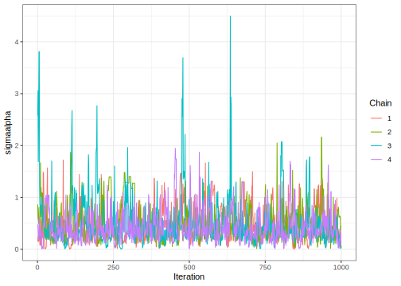

# One Way Anova with a random effect using Cmdstan
[Julian Faraway](https://julianfaraway.github.io/)
2023-06-27

- [Data](#data)
- [CMDSTAN](#cmdstan)

``` r
library(faraway)
library(cmdstanr)
library(ggplot2)
library(posterior)
register_knitr_engine(override = FALSE)
```

# Data

Load up and look at the data, which concerns the brightness of paper
which may vary between operators of the production machinery.

``` r
data(pulp, package="faraway")
summary(pulp)
```

         bright     operator
     Min.   :59.8   a:5     
     1st Qu.:60.0   b:5     
     Median :60.5   c:5     
     Mean   :60.4   d:5     
     3rd Qu.:60.7           
     Max.   :61.0           

``` r
ggplot(pulp, aes(x=operator, y=bright))+geom_point(position = position_jitter(width=0.1, height=0.0))
```


# CMDSTAN

STAN chunk will be compiled to ‘mod’. Chunk header is:

    cmdstan, output.var="mod", override = FALSE

``` stan
data {
  int<lower=0> N;
  int<lower=0> J;
  array[N] int<lower=1,upper=J> predictor;
  array[N] real response;
}
parameters {
  vector[J] eta;
  real mu;
  real<lower=0> sigmaalpha;
  real<lower=0> sigmaepsilon;
}
transformed parameters {
  vector[J] a;
  vector[N] yhat;

  a = mu + sigmaalpha * eta;

  for (i in 1:N)
    yhat[i] = a[predictor[i]];
}
model {
  eta ~ normal(0, 1);

  response ~ normal(yhat, sigmaepsilon);
}
```

Put the data into a format it can be used:

``` r
pulpdat <- list(N=nrow(pulp),
                J=length(unique(pulp$operator)),
                response=pulp$bright,
                predictor=as.numeric(pulp$operator))
```

Do the MCMC sampling:

``` r
fit <- mod$sample(
  data = pulpdat, 
  seed = 123, 
  chains = 4, 
  parallel_chains = 4,
  refresh = 500 # print update every 500 iters
)
```

    Running MCMC with 4 parallel chains...

    Chain 1 Iteration:    1 / 2000 [  0%]  (Warmup) 
    Chain 2 Iteration:    1 / 2000 [  0%]  (Warmup) 
    Chain 3 Iteration:    1 / 2000 [  0%]  (Warmup) 
    Chain 4 Iteration:    1 / 2000 [  0%]  (Warmup) 
    Chain 1 Iteration:  500 / 2000 [ 25%]  (Warmup) 
    Chain 2 Iteration:  500 / 2000 [ 25%]  (Warmup) 
    Chain 2 Iteration: 1000 / 2000 [ 50%]  (Warmup) 
    Chain 2 Iteration: 1001 / 2000 [ 50%]  (Sampling) 
    Chain 1 Iteration: 1000 / 2000 [ 50%]  (Warmup) 
    Chain 1 Iteration: 1001 / 2000 [ 50%]  (Sampling) 
    Chain 1 Iteration: 1500 / 2000 [ 75%]  (Sampling) 
    Chain 1 Iteration: 2000 / 2000 [100%]  (Sampling) 
    Chain 2 Iteration: 1500 / 2000 [ 75%]  (Sampling) 
    Chain 2 Iteration: 2000 / 2000 [100%]  (Sampling) 
    Chain 3 Iteration:  500 / 2000 [ 25%]  (Warmup) 
    Chain 4 Iteration:  500 / 2000 [ 25%]  (Warmup) 
    Chain 4 Iteration: 1000 / 2000 [ 50%]  (Warmup) 
    Chain 4 Iteration: 1001 / 2000 [ 50%]  (Sampling) 
    Chain 1 finished in 0.4 seconds.
    Chain 2 finished in 0.4 seconds.
    Chain 3 Iteration: 1000 / 2000 [ 50%]  (Warmup) 
    Chain 3 Iteration: 1001 / 2000 [ 50%]  (Sampling) 
    Chain 4 Iteration: 1500 / 2000 [ 75%]  (Sampling) 
    Chain 4 Iteration: 2000 / 2000 [100%]  (Sampling) 
    Chain 4 finished in 0.5 seconds.
    Chain 3 Iteration: 1500 / 2000 [ 75%]  (Sampling) 
    Chain 3 Iteration: 2000 / 2000 [100%]  (Sampling) 
    Chain 3 finished in 0.7 seconds.

    All 4 chains finished successfully.
    Mean chain execution time: 0.5 seconds.
    Total execution time: 0.8 seconds.

Get summary on the parameters of interest.

``` r
fit$summary(c("mu","sigmaalpha","sigmaepsilon","a"))
```

    # A tibble: 7 × 10
      variable       mean median     sd    mad      q5    q95  rhat ess_bulk ess_tail
      <chr>         <num>  <num>  <num>  <num>   <num>  <num> <num>    <num>    <num>
    1 mu           60.4   60.4   0.291  0.206  59.9    60.8    1.01     532.     201.
    2 sigmaalpha    0.464  0.363 0.391  0.243   0.0944  1.18   1.01     556.     457.
    3 sigmaepsilon  0.360  0.350 0.0701 0.0629  0.265   0.486  1.00    1328.    1039.
    4 a[1]         60.3   60.3   0.150  0.145  60.0    60.5    1.00    3121.    2838.
    5 a[2]         60.1   60.1   0.165  0.165  59.9    60.4    1.00    1998.    2225.
    6 a[3]         60.6   60.6   0.154  0.148  60.3    60.8    1.01    2424.    2530.
    7 a[4]         60.6   60.6   0.162  0.162  60.3    60.9    1.00    2169.    2060.

Extract the draws into a convenient dataframe format:

``` r
draws_df <- fit$draws(format = "df")
```

Check the diagnostics on the most problematic parameter:

``` r
ggplot(draws_df,
       aes(x=.iteration,y=sigmaalpha,color=factor(.chain))) + geom_line() +
  labs(color = 'Chain', x="Iteration")
```



Looks reasonably OK (other parameters less likely to be an issue)

Show posterior densities on the two variance terms:

``` r
sdf = stack(draws_df[,startsWith(colnames(draws_df),"sigma")])
colnames(sdf) = c("bright","sigma")
levels(sdf$sigma) = c("alpha","epsilon")
ggplot(sdf, aes(x=bright,color=sigma)) + geom_density() + xlim(0,2)
```


Show posteriors on the random effect terms:

``` r
adf = stack(draws_df[,startsWith(colnames(draws_df),"a")])
colnames(adf) = c("bright","operator")
levels(adf$operator) = letters[1:4]
ggplot(adf, aes(x=bright,color=operator)) + geom_density()
```


Compute the lower tail probability.

``` r
fit$summary("sigmaalpha", tailprob = ~ mean(. <= 0.1))
```

    # A tibble: 1 × 2
      variable   tailprob
      <chr>         <num>
    1 sigmaalpha   0.0575

- Results not noticeably different from the rstan version.
- Previous versions of Stan used `n_eff` while this version uses
  `ess_bulk` and `ess_tail`
- Previous version of Stan was rerun with much longer chains because
  default choice seemed inadequate but this current version is not so
  bad with the defaul
- Runs faster (much shorter chains) and worked with the most recent
  version of Stan.
- Seems that cmdstan is a better choice than rstan (but will brms keep
  up?)
