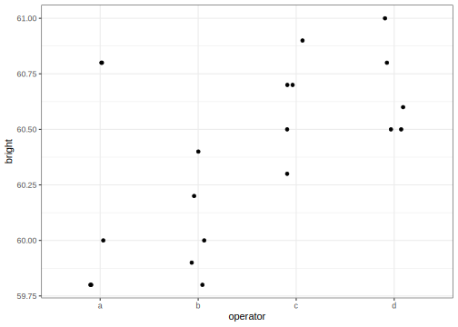

# One Way Anova with a random effect fit using Frequentist methods
[Julian Faraway](https://julianfaraway.github.io/)
2024-08-19

- [Data](#data)
- [Questions](#questions)
- [Linear model with fixed effects](#linear-model-with-fixed-effects)
- [Model specification](#model-specification)
- [LME4](#lme4)
  - [Hypothesis testing](#hypothesis-testing)
  - [Confidence intervals](#confidence-intervals)
  - [Random effects](#random-effects)
- [NLME](#nlme)
- [MMRM](#mmrm)
- [GLMMTMB](#glmmtmb)
- [Discussion](#discussion)
- [Package version info](#package-version-info)

Previously, I compared various [methods for fitting a model with a
single random effect](pulp.md). My focus was on comparing Bayesian
methods. On this page, I turn to Frequentist packages for fitting this
most simple model of its type. At first glance, there might seem to be
little that needs to be said. There are a few fitting methods that are
quite straightforward so any decent package should manage this and
achieve much the same result. But on closer examination, there are some
variations in the approaches taken and some differences in the output.

See the [introduction](../index.md) for an overview.

This example is discussed in more detail in my book [Extending the
Linear Model with R](https://julianfaraway.github.io/faraway/ELM/) with
a emphasis on the `lme4` package. The book does not discuss other
packages.

The data comes from my package, we’ll make some ggplots and format some
output with `knitr`.

``` r
library(faraway)
library(ggplot2)
library(knitr)
```

We’ll be looking at:

- `aov()` from the base stats package in R
- `lmer()` from [lme4](https://github.com/lme4/lme4)
- `lme()` from
  [nlme](https://cran.r-project.org/web/packages/nlme/index.html)
- `mmrm()` from [mmrm](https://openpharma.github.io/mmrm/latest-tag/)
- `glmmTMB` from [glmmTMB](https://glmmtmb.github.io/glmmTMB/)

The first part of this investigation follows the same path as the [more
Bayesian comparison of the one way random effect model](pulp.md)

# Data

Load up and look at the data, which concerns the brightness of paper
which may vary between operators of the production machinery.

``` r
data(pulp, package="faraway")
summary(pulp)
```

         bright     operator
     Min.   :59.8   a:5     
     1st Qu.:60.0   b:5     
     Median :60.5   c:5     
     Mean   :60.4   d:5     
     3rd Qu.:60.7           
     Max.   :61.0           

``` r
ggplot(pulp, aes(x=operator, y=bright))+geom_point(position = position_jitter(width=0.1, height=0.0))
```



You can read more about the data by typing `help(pulp)` at the R prompt.

In this example, there are only five replicates per level. There is no
strong reason to reject the normality assumption. We don’t care about
the specific operators, who are named a, b, c and d, but we do want to
know how they vary.

# Questions

1.  Is there a difference between operators in general?
2.  How much is the difference between operators in general?
3.  How does the variation between operators compare to the variation
    within operators?
4.  What is the difference between these four operators?

We are mostly interested in the first three questions.

# Linear model with fixed effects

We start with the simplest analysis although it is not correct. It will
be useful for comparisons. We treat the operator as a fixed effect
meaning that the analysis refers to these four operators and not to
other possible operators. Since we probably don’t care about these
particular four operators, this would not be the best choice.

You can use the `lm()` or `aov()` functions:

``` r
amod = aov(bright ~ operator, pulp)
```

Now test for a difference between operators:

``` r
anova(amod)
```

    Analysis of Variance Table

    Response: bright
              Df Sum Sq Mean Sq F value Pr(>F)
    operator   3   1.34   0.447     4.2  0.023
    Residuals 16   1.70   0.106               

We find a statistically significant difference. We can estimate the
coefficients:

``` r
coef(amod)
```

    (Intercept)   operatorb   operatorc   operatord 
          60.24       -0.18        0.38        0.44 

The treatment coding sets operator a as the reference level. The
intercept is the mean for operator a and the other estimates are
differences in the mean from operator a. We can also test for a
difference between pairs of operators:

``` r
TukeyHSD(amod)
```

      Tukey multiple comparisons of means
        95% family-wise confidence level

    Fit: aov(formula = bright ~ operator, data = pulp)

    $operator
         diff       lwr     upr   p adj
    b-a -0.18 -0.769814 0.40981 0.81854
    c-a  0.38 -0.209814 0.96981 0.29030
    d-a  0.44 -0.149814 1.02981 0.18448
    c-b  0.56 -0.029814 1.14981 0.06579
    d-b  0.62  0.030186 1.20981 0.03767
    d-c  0.06 -0.529814 0.64981 0.99108

Only the d to b difference is found significant.

We have answered the fourth question stated above. We could make some
speculations on the first three questions (what can be said about
operators in general) but our analysis was not designed to do this.

The `aov()` function has been available in R and S before that i.e. at
least 30 years. I do not believe it has changed in a long time. It can
handle some simple models but it is has very limited functionality.

# Model specification

We use a model of the form: $$
y_{ij} = \mu + \alpha_i + \epsilon_{ij} \qquad i=1,\dots ,a
  \qquad j=1,\dots ,n_i,
$$ where the $\alpha_i$ and $\epsilon_{ij}$ are normal with mean zero,
but variances $\sigma_\alpha^2$ and $\sigma^2_\epsilon$, respectively.

# LME4

`lme4` may be the most popular mixed effect modeling package in R. The
official citation is [Fitting Linear Mixed-Effects Models Using
lme4](https://www.jstatsoft.org/article/view/v067i01) (2015) by D. Bates
et al. but is widely described elsewhere.

``` r
library(lme4)
```

The default fit uses the REML estimation method:

``` r
mmod <- lmer(bright ~ 1+(1|operator), pulp)
summary(mmod)
```

    Linear mixed model fit by REML ['lmerMod']
    Formula: bright ~ 1 + (1 | operator)
       Data: pulp

    REML criterion at convergence: 18.6

    Scaled residuals: 
       Min     1Q Median     3Q    Max 
    -1.467 -0.759 -0.124  0.628  1.601 

    Random effects:
     Groups   Name        Variance Std.Dev.
     operator (Intercept) 0.0681   0.261   
     Residual             0.1062   0.326   
    Number of obs: 20, groups:  operator, 4

    Fixed effects:
                Estimate Std. Error t value
    (Intercept)   60.400      0.149     404

We see slightly less variation between operators ( $\hat\sigma_a=0.261$
) than within operators ( $\hat\sigma_\epsilon=0.326$ ).

## Hypothesis testing

We can also use the ML method:

``` r
smod <- lmer(bright ~ 1+(1|operator), pulp, REML = FALSE)
summary(smod)
```

    Linear mixed model fit by maximum likelihood  ['lmerMod']
    Formula: bright ~ 1 + (1 | operator)
       Data: pulp

         AIC      BIC   logLik deviance df.resid 
        22.5     25.5     -8.3     16.5       17 

    Scaled residuals: 
        Min      1Q  Median      3Q     Max 
    -1.5055 -0.7812 -0.0635  0.6585  1.5623 

    Random effects:
     Groups   Name        Variance Std.Dev.
     operator (Intercept) 0.0458   0.214   
     Residual             0.1062   0.326   
    Number of obs: 20, groups:  operator, 4

    Fixed effects:
                Estimate Std. Error t value
    (Intercept)   60.400      0.129     467

The REML method is preferred for estimation but we must use the ML
method if we wish to make hypothesis tests comparing models.

If we want to test for variation between operators, we fit a null model
containing no operator, compute the likelihood ratio statistic and
corresponding p-value:

``` r
nullmod <- lm(bright ~ 1, pulp)
lrtstat <- as.numeric(2*(logLik(smod)-logLik(nullmod)))
pvalue <- pchisq(lrtstat,1,lower=FALSE)
data.frame(lrtstat, pvalue)
```

      lrtstat  pvalue
    1  2.5684 0.10902

Superficially, the p-value greater than 0.05 suggests no strong evidence
against that hypothesis that there is no variation among the operators.
But there is good reason to doubt the accuracy of the standard
approximation of the chi-squared null distribution when testing a
parameter on the boundary of the space (as we do here at zero). A
parametric bootstrap can be used where we generate samples from the null
and compute the test statistic repeatedly:

``` r
lrstat <- numeric(1000)
set.seed(123)
for(i in 1:1000){
   y <- unlist(simulate(nullmod))
   bnull <- lm(y ~ 1)
   balt <- lmer(y ~ 1 + (1|operator), pulp, REML=FALSE)
   lrstat[i] <- as.numeric(2*(logLik(balt)-logLik(bnull)))
  }
```

Check the proportion of simulated test statistics that are close to
zero:

``` r
mean(lrstat < 0.00001)
```

    [1] 0.703

Clearly, the test statistic does not have a chi-squared distribution
under the null. We can compute the proportion that exceed the observed
test statistic of 2.5684:

``` r
mean(lrstat > 2.5684)
```

    [1] 0.019

This is a more reliable p-value for our hypothesis test which suggests
there is good reason to reject the null hypothesis of no variation
between operators.

More sophisticated methods of inference are discussed in [Extending the
Linear Model with R](https://julianfaraway.github.io/faraway/ELM/)

## Confidence intervals

We can use bootstrap again to compute confidence intervals for the
parameters of interest:

``` r
confint(mmod, method="boot")
```

                   2.5 %   97.5 %
    .sig01       0.00000  0.51451
    .sigma       0.21084  0.43020
    (Intercept) 60.11213 60.69244

We see that the lower end of the confidence interval for the operator SD
extends to zero.

## Random effects

Even though we are most interested in the variation between operators,
we can still estimate their individual effects:

``` r
ranef(mmod)$operator
```

      (Intercept)
    a    -0.12194
    b    -0.25912
    c     0.16767
    d     0.21340

Approximate 95% confidence intervals can be displayed with:

``` r
dd = as.data.frame(ranef(mmod))
ggplot(dd, aes(y=grp,x=condval)) +
        geom_point() +
        geom_errorbarh(aes(xmin=condval -2*condsd,
                           xmax=condval +2*condsd), height=0)
```


# NLME

NLME is the original wide-ranging mixed effects modeling package for R
described in [Mixed-Effects Models in S and
S-PLUS](https://link.springer.com/book/10.1007/b98882) from 2000, but in
use well before then as an S package and predating use of R as the title
of the book suggests. It became one of the small number of recommended R
packages and, as such, has been continuously maintained for many years.
It has not changed much, has been used for many years by many people -
it’s very stable. At one point it seemed that `lme4` would supercede
`nlme` but it has not turned out that way. The package has capabilities
in non-linear modeling and generalized least squares that go beyond the
mixed effect models we consider here.

``` r
library(nlme)
```

The syntax used in `nlme` is different from `lme4` in that the fixed and
random parts of the model are specified in separate arguments:

``` r
nmod = lme(fixed = bright ~ 1, 
           data = pulp, 
           random = ~ 1 | operator)
```

The default fitting method is REML. Given the simplicity of the model,
we would not expect any difference in the fit compared to `lme4`:

``` r
summary(nmod)
```

    Linear mixed-effects model fit by REML
      Data: pulp 
         AIC   BIC  logLik
      24.626 27.46 -9.3131

    Random effects:
     Formula: ~1 | operator
            (Intercept) Residual
    StdDev:     0.26093  0.32596

    Fixed effects:  bright ~ 1 
                Value Std.Error DF t-value p-value
    (Intercept)  60.4   0.14944 16  404.17       0

    Standardized Within-Group Residuals:
         Min       Q1      Med       Q3      Max 
    -1.46662 -0.75952 -0.12435  0.62810  1.60124 

    Number of Observations: 20
    Number of Groups: 4 

Although the details of the summary output vary, the estimated
parameters are the same as before.

If we want to do hypothesis testing, we need to use maximum likelihood
rather than REML:

``` r
nlmod = lme(fixed = bright ~ 1, 
           data = pulp, 
           random = ~ 1 | operator,
           method = "ML")
```

We can check this gives the same log likelihood as calculated as
computed using `lme4`:

``` r
c(logLik(smod), logLik(nlmod))
```

    [1] -8.2558 -8.2558

We could use the same resampling based method to test the variance of
the operator effect and expect to get the same results (subject to
random number generation, of course).

Confidence intervals can be computed with:

``` r
intervals(nlmod)
```

    Approximate 95% confidence intervals

     Fixed effects:
                 lower est.  upper
    (Intercept) 60.126 60.4 60.674

     Random Effects:
      Level: operator 
                       lower    est.   upper
    sd((Intercept)) 0.076549 0.21389 0.59766

     Within-group standard error:
      lower    est.   upper 
    0.23051 0.32596 0.46093 

These are based on a Wald-style calculation. The intervals for the fixed
effect and residual error variance (or SD here) will be reasonably
accurate but no trust should be put in the SD for the operator term. A
bootstrap-based calculation would be better for this purpose.

We can also get the random effects

``` r
random.effects(nmod)
```

      (Intercept)
    a    -0.12194
    b    -0.25912
    c     0.16767
    d     0.21340

which are identical with the `lme4` values but no standard errors are
supplied.

Thus far, we have seen no important differences between `nlme` and
`lme4` but `nlme` has capabilities not seen in `lme4`. Instead of the
model specification above, we could instead make a parameterized
specification of the correlation structure of the random terms. In this
example, we might say that any pair of observations from the same
operator have a correlation (which we shall now estimate). If we do
this, in this case, we won’t have a random term left to specify in
`lme()` but the usual error term won’t have the standard independent and
identical distribution. We can fit this using `gls()` which has a fixed
component like `lme()` or `lm()` but allows correlated structures on the
error. Here we set *compound symmetry* within the operators (which just
means all the pairs of errors for a given operator have the same
correlation):

``` r
gmod = gls(bright ~ 1,
           data=pulp,
           correlation = corCompSymm(form = ~ 1|operator))
summary(gmod)
```

    Generalized least squares fit by REML
      Model: bright ~ 1 
      Data: pulp 
         AIC   BIC  logLik
      24.626 27.46 -9.3131

    Correlation Structure: Compound symmetry
     Formula: ~1 | operator 
     Parameter estimate(s):
        Rho 
    0.39054 

    Coefficients:
                Value Std.Error t-value p-value
    (Intercept)  60.4   0.14944  404.17       0

    Standardized residuals:
         Min       Q1      Med       Q3      Max 
    -1.43701 -0.95801  0.23950  0.77838  1.43701 

    Residual standard error: 0.41753 
    Degrees of freedom: 20 total; 19 residual

The fixed effect is the same for the REML fit. The likelihoods are also
the same:

``` r
c(logLik(nmod), logLik(gmod))
```

    [1] -9.3131 -9.3131

The model fits are the same but the parameterization is different. The
correlation fitted in the `gls()` model of 0.39054 can be identified
with the *intraclass correlation coefficient* of the REML `lme()` model
which can be computed directly using the variance components as:

``` r
0.26093^2/(0.26093^2+0.32596^2)
```

    [1] 0.39054

This specification of correlation structures on the error term can also
be used in `lme()`-fitted models giving us some additional flexibility
not provided by `lme4`. But `lme4` also has advantages in comparison to
`nlme` in that it can fit some classes of models (crossed models e.g.)
that `nlme` cannot do. It is also faster which is important for models
with more complex structures and more data.

# MMRM

The `mmrm` package fits mixed models for repeated measures (MMRM). It
does not use random effects. Instead, all the random components are
specified within a parameterized variance-covariance matrix for the
error term. This is like the `gls` fitting method from the `nlme`
package except `mmrm` provides for a wider class of models and has more
detailed inferential methods.

``` r
library(mmrm)
```

The `mmrm` was built with clinical trial applications in mind where
subjects make multiple visits and is thus oriented towards longitudinal
data. For this simple data set, we can view the multiple responses of
each operator as repeated measures and treat them as “visits”:

``` r
pulp$visit = factor(rep(1:5,4))
```

The compound symmetry assumption for the covariance matrix of the errors
for a subject posits a constant correlation between any pair visits.
This is specified using the `cs()` function in the model specification:

``` r
mmmod = mmrm(bright ~ 1 + cs(visit|operator), pulp)
summary(mmmod)
```

    mmrm fit

    Formula:     bright ~ 1 + cs(visit | operator)
    Data:        pulp (used 20 observations from 4 subjects with maximum 5 timepoints)
    Covariance:  compound symmetry (2 variance parameters)
    Method:      Satterthwaite
    Vcov Method: Asymptotic
    Inference:   REML

    Model selection criteria:
         AIC      BIC   logLik deviance 
        22.6     21.4     -9.3     18.6 

    Coefficients: 
                Estimate Std. Error     df t value Pr(>|t|)
    (Intercept)   60.400      0.149  3.000     404  3.3e-08

    Covariance estimate:
          1     2     3     4     5
    1 0.174 0.068 0.068 0.068 0.068
    2 0.068 0.174 0.068 0.068 0.068
    3 0.068 0.068 0.174 0.068 0.068
    4 0.068 0.068 0.068 0.174 0.068
    5 0.068 0.068 0.068 0.068 0.174

The fixed effects part of the output is the same as seen before when
using REML fits. The AIC and BIC are slightly different due to a
disagreement about how to count parameters. This is not important
provided you only compare models using the same fitting function.

The random component is expressed as a covariance matrix. The SD down
the diagonal will give the estimated error variance from previous
models:

``` r
cm = mmmod$cov
sqrt(cm[1,1])
```

    [1] 0.41753

We can compute the correlation as:

``` r
cm[1,2]/cm[1,1]
```

    [1] 0.39054

We see this is identical with the `gls()` fit.

In this instance, there is no good reason to use `mmrm` but it does lay
the basis for more complex models.

# GLMMTMB

The `glmmTMB` package uses the Template Model Builder package (TMB) to
fit a wide variety of generalized mixed effect models.

Installation is not as straightforward as usual because the versions of
`glmmTMB` and `TMB` (which also depends on `Matrix`) need to match. This
may involve installing older versions of `TMB` and `Matrix` than
current. *I admit to not bothering with this and accepting the warning
message. We are not doing anything cutting edge here so I am not
expecting a problem*.

``` r
library(glmmTMB)
```

We can use the `lme4` syntax for the model:

``` r
tmod = glmmTMB(bright ~ 1 + (1|operator), pulp)
summary(tmod)
```

     Family: gaussian  ( identity )
    Formula:          bright ~ 1 + (1 | operator)
    Data: pulp

         AIC      BIC   logLik deviance df.resid 
        22.5     25.5     -8.3     16.5       17 

    Random effects:

    Conditional model:
     Groups   Name        Variance Std.Dev.
     operator (Intercept) 0.0458   0.214   
     Residual             0.1063   0.326   
    Number of obs: 20, groups:  operator, 4

    Dispersion estimate for gaussian family (sigma^2): 0.106 

    Conditional model:
                Estimate Std. Error z value Pr(>|z|)
    (Intercept)   60.400      0.129     467   <2e-16

The default fit uses ML (not REML). Although the output arranged
slightly differently, it’s the same as the previous ML-based `lme4` fit.

Constructing confidence intervals has some interest. The default uses
the Wald method:

``` r
confint(tmod)
```

                                     2.5 %   97.5 % Estimate
    (Intercept)                  60.146338 60.65366 60.40000
    Std.Dev.(Intercept)|operator  0.076553  0.59763  0.21389

We don’t trust these for the operator term. We can ask for a profile
likelihood computation:

``` r
confint(tmod, method = "profile")
```

                        2.5 %   97.5 %
    (Intercept)        60.071 60.72871
    theta_1|operator.1     NA -0.48143

The confidence interval is on a transformed parameter theta. We get a
warning message and an NA for one of the limits. This is an indication
of the problematic boundary issue.

`glmmTMB` is designed for more complex models so there’s no compelling
reason to use it here.

# Discussion

We have four different packages doing essentially the same thing. There
is some variation in the parameterization and the computation of some
auxiliary quantities such as the distribution of random effects. We
might expect greater differences on more complex model examples.

# Package version info

``` r
sessionInfo()
```

    R version 4.4.1 (2024-06-14)
    Platform: x86_64-apple-darwin20
    Running under: macOS Sonoma 14.6.1

    Matrix products: default
    BLAS:   /Library/Frameworks/R.framework/Versions/4.4-x86_64/Resources/lib/libRblas.0.dylib 
    LAPACK: /Library/Frameworks/R.framework/Versions/4.4-x86_64/Resources/lib/libRlapack.dylib;  LAPACK version 3.12.0

    locale:
    [1] en_US.UTF-8/en_US.UTF-8/en_US.UTF-8/C/en_US.UTF-8/en_US.UTF-8

    time zone: Europe/London
    tzcode source: internal

    attached base packages:
    [1] stats     graphics  grDevices utils     datasets  methods   base     

    other attached packages:
    [1] glmmTMB_1.1.9 mmrm_0.3.12   nlme_3.1-165  lme4_1.1-35.5 Matrix_1.7-0  knitr_1.48    ggplot2_3.5.1 faraway_1.0.8

    loaded via a namespace (and not attached):
     [1] utf8_1.2.4          generics_0.1.3      stringi_1.8.4       lattice_0.22-6      digest_0.6.36      
     [6] magrittr_2.0.3      estimability_1.5.1  evaluate_0.24.0     grid_4.4.1          mvtnorm_1.2-5      
    [11] fastmap_1.2.0       jsonlite_1.8.8      backports_1.5.0     mgcv_1.9-1          fansi_1.0.6        
    [16] scales_1.3.0        numDeriv_2016.8-1.1 Rdpack_2.6          cli_3.6.3           rlang_1.1.4        
    [21] rbibutils_2.2.16    munsell_0.5.1       splines_4.4.1       withr_3.0.1         yaml_2.3.10        
    [26] tools_4.4.1         parallel_4.4.1      coda_0.19-4.1       nloptr_2.1.1        checkmate_2.3.2    
    [31] minqa_1.2.7         dplyr_1.1.4         colorspace_2.1-1    boot_1.3-30         vctrs_0.6.5        
    [36] R6_2.5.1            emmeans_1.10.3      lifecycle_1.0.4     stringr_1.5.1       MASS_7.3-61        
    [41] pkgconfig_2.0.3     pillar_1.9.0        gtable_0.3.5        glue_1.7.0          Rcpp_1.0.13        
    [46] systemfonts_1.1.0   xfun_0.46           tibble_3.2.1        tidyselect_1.2.1    rstudioapi_0.16.0  
    [51] xtable_1.8-4        farver_2.1.2        htmltools_0.5.8.1   rmarkdown_2.27      svglite_2.1.3      
    [56] labeling_0.4.3      TMB_1.9.14          compiler_4.4.1     
