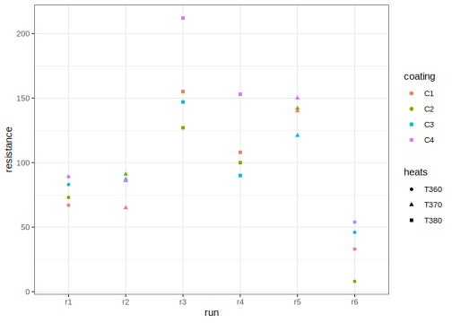

# Split Plot Analysis of Steel Bars using Frequentist methods
[Julian Faraway](https://julianfaraway.github.io/)
2024-10-09

- [Comparison to linear model](#comparison-to-linear-model)

See the [introduction](../index.md) for an overview.

The [irrigation example](irrifreq.md) is another split plot example. The
purpose of this example is to explore other aspects of the analysis.

This example come from Chapter 9 of *Statistics for Experimenters:
Design, Innovation, and Discovery*, 2nd Edition by George E. P. Box, J.
Stuart Hunter, William G. Hunter.

``` r
library(ggplot2)
library(knitr)
library(here)
library(lme4)
```

Read in and examine the data:

``` r
steelbars = read.table(here("data","steelbars.txt"),header = TRUE)
kable(steelbars)
```

| run | heats | coating | resistance |
|:----|:------|:--------|-----------:|
| r1  | T360  | C2      |         73 |
| r1  | T360  | C3      |         83 |
| r1  | T360  | C1      |         67 |
| r1  | T360  | C4      |         89 |
| r2  | T370  | C1      |         65 |
| r2  | T370  | C3      |         87 |
| r2  | T370  | C4      |         86 |
| r2  | T370  | C2      |         91 |
| r3  | T380  | C3      |        147 |
| r3  | T380  | C1      |        155 |
| r3  | T380  | C2      |        127 |
| r3  | T380  | C4      |        212 |
| r4  | T380  | C4      |        153 |
| r4  | T380  | C3      |         90 |
| r4  | T380  | C2      |        100 |
| r4  | T380  | C1      |        108 |
| r5  | T370  | C4      |        150 |
| r5  | T370  | C1      |        140 |
| r5  | T370  | C3      |        121 |
| r5  | T370  | C2      |        142 |
| r6  | T360  | C1      |         33 |
| r6  | T360  | C4      |         54 |
| r6  | T360  | C2      |          8 |
| r6  | T360  | C3      |         46 |

Check the assignment of runs and heat levels:

``` r
xtabs( ~ run + heats, steelbars)
```

        heats
    run  T360 T370 T380
      r1    4    0    0
      r2    0    4    0
      r3    0    0    4
      r4    0    0    4
      r5    0    4    0
      r6    4    0    0

Only one heat level is used within each run. We see that the runs are
whole plots and the heat levels are the whole plot factor. Now look at
the allocation of coating levels:

``` r
xtabs( ~ run + coating, steelbars)
```

        coating
    run  C1 C2 C3 C4
      r1  1  1  1  1
      r2  1  1  1  1
      r3  1  1  1  1
      r4  1  1  1  1
      r5  1  1  1  1
      r6  1  1  1  1

We see each coating is applied once per run. This is the split plot
factor.

We plot the data:

``` r
ggplot(steelbars, aes(y=resistance, x=run, shape=heats, color=coating)) + geom_point()
```



No outliers, skewness or unequal variance are seen.

We fit this model with:

``` r
lmod = lmer(resistance ~ heats*coating + (1|run), steelbars)
summary(lmod, cor=FALSE)
```

    Linear mixed model fit by REML ['lmerMod']
    Formula: resistance ~ heats * coating + (1 | run)
       Data: steelbars

    REML criterion at convergence: 111.2

    Scaled residuals: 
       Min     1Q Median     3Q    Max 
    -1.046 -0.438  0.000  0.438  1.046 

    Random effects:
     Groups   Name        Variance Std.Dev.
     run      (Intercept) 1172     34.2    
     Residual              125     11.2    
    Number of obs: 24, groups:  run, 6

    Fixed effects:
                        Estimate Std. Error t value
    (Intercept)             50.0       25.5    1.96
    heatsT370               52.5       36.0    1.46
    heatsT380               81.5       36.0    2.26
    coatingC2               -9.5       11.2   -0.85
    coatingC3               14.5       11.2    1.30
    coatingC4               21.5       11.2    1.93
    heatsT370:coatingC2     23.5       15.8    1.49
    heatsT380:coatingC2     -8.5       15.8   -0.54
    heatsT370:coatingC3    -13.0       15.8   -0.82
    heatsT380:coatingC3    -27.5       15.8   -1.74
    heatsT370:coatingC4     -6.0       15.8   -0.38
    heatsT380:coatingC4     29.5       15.8    1.87

Notice that the SE on the heating levels are larger because this is the
whole plot term while those for the coating and interaction are smaller
because coating is the split plot term.

We can also try to test the significance of the terms:

``` r
anova(lmod)
```

    Analysis of Variance Table
                  npar Sum Sq Mean Sq F value
    heats            2    686     343    2.75
    coating          3   4289    1430   11.48
    heats:coating    6   3270     545    4.38

The default `anova()` is sequential (also known as Type I sum of
squares). By design, `lme4` does not compute tests either in the
`summary` or `anova` output for reasons discussed in my textbook. The
`lmerTest` package is a convenient way to generate these tests (and
associated p-value). It is necessary to refit the model to use a
modified version of `lmer` loaded by this package.

``` r
library(lmerTest)
lmod = lmer(resistance ~ heats*coating + (1|run), steelbars)
```

The `summary()` output would now contain the p-values but these are not
so interesting since we usually don’t want to consider these tests
directly. We are more interested in the `anova()`:

``` r
anova(lmod)
```

    Type III Analysis of Variance Table with Satterthwaite's method
                  Sum Sq Mean Sq NumDF DenDF F value Pr(>F)
    heats            686     343     2     3    2.75  0.209
    coating         4289    1430     3     9   11.48  0.002
    heats:coating   3270     545     6     9    4.38  0.024

We get a so-called Type III ANOVA but since we have a balanced design,
the particular type does not make a difference so we need not be
concerned with this.

We see a significant interaction. In the presence of significant
interaction, it is problematic to address the significance of the main
effects. But notice the lower denominator degrees of freedom for the
whole plot term. This means the design has less power to detect
differences in the whole plot factor. Essentially, we have only 6 runs
to detect the differences in the heat levels whereas we have n=24 for
testing the split plot factor (and its interaction with the main plot
factor).

Results are essentially the same as BHH although they are presented
differently. BHH uses (intrinsically) a -1/1 coding so their SEs are
twice those presented here (and their effects would also be twice the
size).

We can also use the Kenward-Roger method of approximating the degrees of
freedom in contrast to the default Satterthwaite Method. This method
uses the `pbkrtest` package that was used in the irrigation split plot
example.

``` r
anova(lmod, ddf="Kenward-Roger")
```

    Type III Analysis of Variance Table with Kenward-Roger's method
                  Sum Sq Mean Sq NumDF DenDF F value Pr(>F)
    heats            686     343     2     3    2.75  0.209
    coating         4289    1430     3     9   11.48  0.002
    heats:coating   3270     545     6     9    4.38  0.024

As we see, there is no difference in this example. In general,
Kenward-Roger is considered slightly superior although it is more
expensive to compute.

Check out where the interaction is coming from. The `emmeans` package is
useful for this purpose:

``` r
library(emmeans)
emmeans(lmod, "coating", by="heats")
```

    heats = T360:
     coating emmean   SE   df lower.CL upper.CL
     C1        50.0 25.5 3.48    -25.1      125
     C2        40.5 25.5 3.48    -34.6      116
     C3        64.5 25.5 3.48    -10.6      140
     C4        71.5 25.5 3.48     -3.6      147

    heats = T370:
     coating emmean   SE   df lower.CL upper.CL
     C1       102.5 25.5 3.48     27.4      178
     C2       116.5 25.5 3.48     41.4      192
     C3       104.0 25.5 3.48     28.9      179
     C4       118.0 25.5 3.48     42.9      193

    heats = T380:
     coating emmean   SE   df lower.CL upper.CL
     C1       131.5 25.5 3.48     56.4      207
     C2       113.5 25.5 3.48     38.4      189
     C3       118.5 25.5 3.48     43.4      194
     C4       182.5 25.5 3.48    107.4      258

    Degrees-of-freedom method: kenward-roger 
    Confidence level used: 0.95 

It’s the coating4 by heat at 380 combination producing the highest
response. One might be interested in increasing the temperature further
at the coating4 setting to see if an even better response might be
obtained.

## Comparison to linear model

Let’s consider what happens if we ignore the split plot structure and
treat this as a completely randomized design (which would be
incorrect!):

``` r
smod = lm(resistance ~ heats*coating, steelbars)
summary(smod)
```


    Call:
    lm(formula = resistance ~ heats * coating, data = steelbars)

    Residuals:
       Min     1Q Median     3Q    Max 
     -37.5  -24.0    0.0   24.0   37.5 

    Coefficients:
                        Estimate Std. Error t value Pr(>|t|)
    (Intercept)             50.0       25.5    1.96    0.073
    heatsT370               52.5       36.0    1.46    0.171
    heatsT380               81.5       36.0    2.26    0.043
    coatingC2               -9.5       36.0   -0.26    0.796
    coatingC3               14.5       36.0    0.40    0.694
    coatingC4               21.5       36.0    0.60    0.562
    heatsT370:coatingC2     23.5       50.9    0.46    0.653
    heatsT380:coatingC2     -8.5       50.9   -0.17    0.870
    heatsT370:coatingC3    -13.0       50.9   -0.26    0.803
    heatsT380:coatingC3    -27.5       50.9   -0.54    0.599
    heatsT370:coatingC4     -6.0       50.9   -0.12    0.908
    heatsT380:coatingC4     29.5       50.9    0.58    0.573

    Residual standard error: 36 on 12 degrees of freedom
    Multiple R-squared:  0.687, Adjusted R-squared:  0.399 
    F-statistic: 2.39 on 11 and 12 DF,  p-value: 0.075

Let’s compare the fixed effect coefficients in the two models:

``` r
data.frame(mm=summary(lmod)$coef[,1],lm=coef(smod))
```

                           mm    lm
    (Intercept)          50.0  50.0
    heatsT370            52.5  52.5
    heatsT380            81.5  81.5
    coatingC2            -9.5  -9.5
    coatingC3            14.5  14.5
    coatingC4            21.5  21.5
    heatsT370:coatingC2  23.5  23.5
    heatsT380:coatingC2  -8.5  -8.5
    heatsT370:coatingC3 -13.0 -13.0
    heatsT380:coatingC3 -27.5 -27.5
    heatsT370:coatingC4  -6.0  -6.0
    heatsT380:coatingC4  29.5  29.5

We see they are identical. The fitted values for both models will be the
same.

Now compare the standard errors:

``` r
data.frame(mm=summary(lmod)$coef[,2],lm=summary(smod)$coef[,2])
```

                            mm     lm
    (Intercept)         25.463 25.463
    heatsT370           36.010 36.010
    heatsT380           36.010 36.010
    coatingC2           11.160 36.010
    coatingC3           11.160 36.010
    coatingC4           11.160 36.010
    heatsT370:coatingC2 15.782 50.926
    heatsT380:coatingC2 15.782 50.926
    heatsT370:coatingC3 15.782 50.926
    heatsT380:coatingC3 15.782 50.926
    heatsT370:coatingC4 15.782 50.926
    heatsT380:coatingC4 15.782 50.926

We see these are smaller for the split plot factor, coating and the
interaction term.

Let’s see the analysis of variance of the linear model:

``` r
anova(smod)
```

    Analysis of Variance Table

    Response: resistance
                  Df Sum Sq Mean Sq F value Pr(>F)
    heats          2  26519   13260   10.23 0.0026
    coating        3   4289    1430    1.10 0.3860
    heats:coating  6   3270     545    0.42 0.8518
    Residuals     12  15560    1297               

We see no significance for the interaction term. This is the sequential
ANOVA, so it’s reasonable to now test the coating term which is also not
significant. Only the heating level term remains and shows a significant
difference. But this analysis is incorrect and it matters - the outcome
is quite different from the correct split plot analysis.
