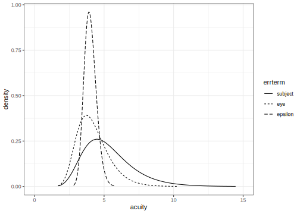
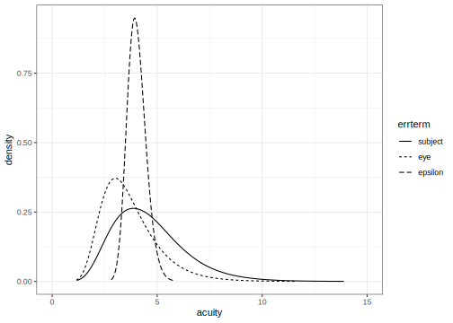
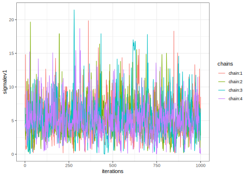
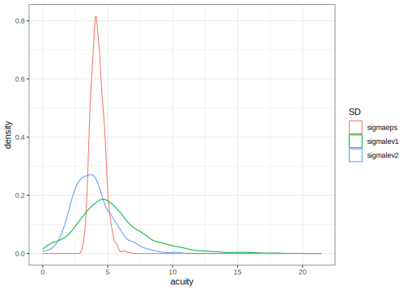
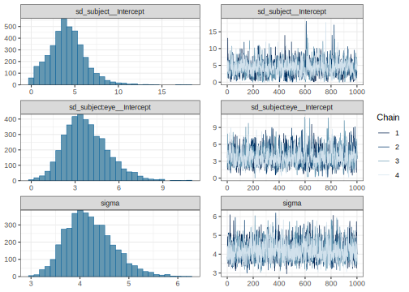

# Repeated Measures Data Analysis example
[Julian Faraway](https://julianfaraway.github.io/)
2024-10-17

- [Data](#data)
- [Mixed Effect Model](#mixed-effect-model)
- [INLA](#inla)
- [Informative Gamma priors on the
  precisions](#informative-gamma-priors-on-the-precisions)
- [Penalized Complexity Prior](#penalized-complexity-prior)
- [STAN](#stan)
  - [Diagnostics](#diagnostics)
  - [Output Summary](#output-summary)
  - [Posterior Distributions](#posterior-distributions)
- [BRMS](#brms)
- [MGCV](#mgcv)
- [GINLA](#ginla)
- [Discussion](#discussion)
- [Package version info](#package-version-info)

See the [introduction](index.md) for an overview.

This example is discussed in more detail in my book [Extending the
Linear Model with R](https://julianfaraway.github.io/faraway/ELM/)

Required libraries:

``` r
library(faraway)
library(ggplot2)
library(lme4)
library(pbkrtest)
library(RLRsim)
library(INLA)
library(knitr)
library(rstan, quietly=TRUE)
library(brms)
library(mgcv)
```

# Data

The acuity of vision for seven subjects was tested. The response is the
lag in milliseconds between a light flash and a response in the cortex
of the eye. Each eye is tested at four different powers of lens. An
object at the distance of the second number appears to be at distance of
the first number.

Load in and look at the data:

``` r
data(vision, package="faraway")
ftable(xtabs(acuity ~ eye + subject + power, data=vision))
```

                  power 6/6 6/18 6/36 6/60
    eye   subject                         
    left  1             116  119  116  124
          2             110  110  114  115
          3             117  118  120  120
          4             112  116  115  113
          5             113  114  114  118
          6             119  115   94  116
          7             110  110  105  118
    right 1             120  117  114  122
          2             106  112  110  110
          3             120  120  120  124
          4             115  116  116  119
          5             114  117  116  112
          6             100   99   94   97
          7             105  105  115  115

We create a numeric version of the power to make a plot:

``` r
vision$npower <- rep(1:4,14)
ggplot(vision, aes(y=acuity, x=npower, linetype=eye)) + geom_line() + facet_wrap(~ subject, ncol=4) + scale_x_continuous("Power",breaks=1:4,labels=c("6/6","6/18","6/36","6/60"))
```


# Mixed Effect Model

The power is a fixed effect. In the model below, we have treated it as a
nominal factor, but we could try fitting it in a quantitative manner.
The subjects should be treated as random effects. Since we do not
believe there is any consistent right-left eye difference between
individuals, we should treat the eye factor as nested within subjects.
We fit this model:

``` r
mmod <- lmer(acuity~power + (1|subject) + (1|subject:eye),vision)
faraway::sumary(mmod)
```

    Fixed Effects:
                coef.est coef.se
    (Intercept) 112.64     2.23 
    power6/18     0.79     1.54 
    power6/36    -1.00     1.54 
    power6/60     3.29     1.54 

    Random Effects:
     Groups      Name        Std.Dev.
     subject:eye (Intercept) 3.21    
     subject     (Intercept) 4.64    
     Residual                4.07    
    ---
    number of obs: 56, groups: subject:eye, 14; subject, 7
    AIC = 342.7, DIC = 349.6
    deviance = 339.2 

This model can be written as:

``` math
y_{ijk} = \mu + p_j + s_i + e_{ik} + \epsilon_{ijk}
```

where $i=1, \dots ,7$ runs over individuals, $j=1, \dots ,4$ runs over
power and $k=1,2$ runs over eyes. The $p_j$ term is a fixed effect, but
the remaining terms are random. Let $s_i \sim N(0,\sigma^2_s)$,
$e_{ik} \sim N(0,\sigma^2_e)$ and
$\epsilon_{ijk} \sim N(0,\sigma^2\Sigma)$ where we take $\Sigma=I$.

We can check for a power effect using a Kenward-Roger adjusted $F$-test:

``` r
mmod <- lmer(acuity~power+(1|subject)+(1|subject:eye),vision,REML=FALSE)
nmod <- lmer(acuity~1+(1|subject)+(1|subject:eye),vision,REML=FALSE)
KRmodcomp(mmod, nmod)
```

    large : acuity ~ power + (1 | subject) + (1 | subject:eye)
    small : acuity ~ 1 + (1 | subject) + (1 | subject:eye)
           stat   ndf   ddf F.scaling p.value
    Ftest  2.83  3.00 39.00         1   0.051

The power just fails to meet the 5% level of significance (although note
that there is a clear outlier in the data which deserves some
consideration). We can also compute bootstrap confidence intervals:

``` r
set.seed(123)
print(confint(mmod, method="boot", oldNames=FALSE, nsim=1000),digits=3)
```

                                 2.5 % 97.5 %
    sd_(Intercept)|subject:eye   0.172   5.27
    sd_(Intercept)|subject       0.000   6.88
    sigma                        2.943   4.70
    (Intercept)                108.623 116.56
    power6/18                   -1.950   3.94
    power6/36                   -3.868   1.88
    power6/60                    0.388   6.22

We see that lower ends of the CIs for random effect SDs are zero or
close to it.

# INLA

Integrated nested Laplace approximation is a method of Bayesian
computation which uses approximation rather than simulation. More can be
found on this topic in [Bayesian Regression Modeling with
INLA](http://julianfaraway.github.io/brinla/) and the [chapter on
GLMMs](https://julianfaraway.github.io/brinlabook/chaglmm.html)

Use the most recent computational methodology:

``` r
inla.setOption(inla.mode="experimental")
inla.setOption("short.summary",TRUE)
```

We fit the default INLA model. We need to created a combined eye and
subject factor.

``` r
vision$eyesub <- paste0(vision$eye,vision$subject)
formula <- acuity ~ power + f(subject, model="iid") + f(eyesub, model="iid")
result <- inla(formula, family="gaussian", data=vision)
summary(result)
```

    Fixed effects:
                   mean    sd 0.025quant 0.5quant 0.975quant    mode kld
    (Intercept) 112.646 1.780    109.129  112.646    116.164 112.646   0
    power6/18     0.781 1.538     -2.251    0.781      3.813   0.781   0
    power6/36    -1.002 1.538     -4.034   -1.002      2.029  -1.002   0
    power6/60     3.278 1.538      0.246    3.278      6.309   3.278   0

    Model hyperparameters:
                                                mean       sd 0.025quant 0.5quant 0.975quant    mode
    Precision for the Gaussian observations 6.30e-02 1.40e-02      0.039 6.20e-02   9.50e-02 5.9e-02
    Precision for subject                   2.23e+04 2.54e+04   1441.113 1.43e+04   8.97e+04 3.9e+03
    Precision for eyesub                    4.30e-02 1.90e-02      0.017 3.90e-02   8.90e-02 3.3e-02

     is computed 

The precisions for the random effects are relatively high. We should try
some more informative priors.

# Informative Gamma priors on the precisions

Now try more informative gamma priors for the precisions. Define it so
the mean value of gamma prior is set to the inverse of the variance of
the residuals of the fixed-effects only model. We expect the error
variances to be lower than this variance so this is an overestimate.

``` r
apar <- 0.5
lmod <- lm(acuity ~ power, vision)
bpar <- apar*var(residuals(lmod))
lgprior <- list(prec = list(prior="loggamma", param = c(apar,bpar)))
formula = acuity ~ power+f(subject, model="iid", hyper = lgprior)+f(eyesub, model="iid", hyper = lgprior)
result <- inla(formula, family="gaussian", data=vision)
summary(result)
```

    Fixed effects:
                   mean    sd 0.025quant 0.5quant 0.975quant    mode kld
    (Intercept) 112.646 2.675    107.308  112.646    117.985 112.646   0
    power6/18     0.781 1.520     -2.215    0.781      3.776   0.781   0
    power6/36    -1.002 1.520     -3.998   -1.002      1.993  -1.002   0
    power6/60     3.278 1.520      0.282    3.279      6.273   3.279   0

    Model hyperparameters:
                                             mean    sd 0.025quant 0.5quant 0.975quant  mode
    Precision for the Gaussian observations 0.064 0.014      0.041    0.063      0.096 0.061
    Precision for subject                   0.049 0.036      0.010    0.039      0.145 0.025
    Precision for eyesub                    0.070 0.040      0.020    0.061      0.173 0.045

     is computed 

Compute the transforms to an SD scale for the random effect terms. Make
a table of summary statistics for the posteriors:

``` r
sigmasubject <- inla.tmarginal(function(x) 1/sqrt(exp(x)),result$internal.marginals.hyperpar[[2]])
sigmaeye <- inla.tmarginal(function(x) 1/sqrt(exp(x)),result$internal.marginals.hyperpar[[3]])
sigmaepsilon <- inla.tmarginal(function(x) 1/sqrt(exp(x)),result$internal.marginals.hyperpar[[1]])
restab=sapply(result$marginals.fixed, function(x) inla.zmarginal(x,silent=TRUE))
restab=cbind(restab, inla.zmarginal(sigmasubject,silent=TRUE))
restab=cbind(restab, inla.zmarginal(sigmaeye,silent=TRUE))
restab=cbind(restab, inla.zmarginal(sigmaepsilon,silent=TRUE))
colnames(restab) = c("mu",names(lmod$coef)[-1],"subject","eyesub","epsilon")
data.frame(restab) |> kable()
```

|            | mu     | power6.18 | power6.36 | power6.60 | subject | eyesub | epsilon |
|:-----------|:-------|:----------|:----------|:----------|:--------|:-------|:--------|
| mean       | 112.65 | 0.78127   | -1.0024   | 3.2784    | 5.3436  | 4.2273 | 4.0104  |
| sd         | 2.672  | 1.519     | 1.519     | 1.519     | 1.8344  | 1.1786 | 0.43864 |
| quant0.025 | 107.31 | -2.2151   | -3.9986   | 0.28183   | 2.6389  | 2.41   | 3.2335  |
| quant0.25  | 110.94 | -0.2317   | -2.0154   | 2.2654    | 4.0256  | 3.3804 | 3.7004  |
| quant0.5   | 112.64 | 0.77799   | -1.0057   | 3.2752    | 5.039   | 4.0544 | 3.979   |
| quant0.75  | 114.34 | 1.7876    | 0.0039126 | 4.2847    | 6.3255  | 4.8871 | 4.2878  |
| quant0.975 | 117.97 | 3.7702    | 1.9867    | 6.2672    | 9.7725  | 7.0085 | 4.9542  |

Also construct a plot the SD posteriors:

``` r
ddf <- data.frame(rbind(sigmasubject,sigmaeye,sigmaepsilon),errterm=gl(3,nrow(sigmaepsilon),labels = c("subject","eye","epsilon")))
ggplot(ddf, aes(x,y, linetype=errterm))+geom_line()+xlab("acuity")+ylab("density")+xlim(0,15)
```



Posteriors for the subject and eye give no weight to values close to
zero.

# Penalized Complexity Prior

In [Simpson et al (2015)](http://arxiv.org/abs/1403.4630v3), penalized
complexity priors are proposed. This requires that we specify a scaling
for the SDs of the random effects. We use the SD of the residuals of the
fixed effects only model (what might be called the base model in the
paper) to provide this scaling.

``` r
lmod <- lm(acuity ~ power, vision)
sdres <- sd(residuals(lmod))
pcprior <- list(prec = list(prior="pc.prec", param = c(3*sdres,0.01)))
formula = acuity ~ power+f(subject, model="iid", hyper = pcprior)+f(eyesub, model="iid", hyper = pcprior)
result <- inla(formula, family="gaussian", data=vision)
summary(result)
```

    Fixed effects:
                   mean    sd 0.025quant 0.5quant 0.975quant    mode kld
    (Intercept) 112.646 2.435    107.783  112.646    117.510 112.646   0
    power6/18     0.781 1.532     -2.237    0.781      3.799   0.781   0
    power6/36    -1.002 1.532     -4.021   -1.002      2.016  -1.002   0
    power6/60     3.278 1.532      0.260    3.278      6.296   3.278   0

    Model hyperparameters:
                                             mean    sd 0.025quant 0.5quant 0.975quant  mode
    Precision for the Gaussian observations 0.064 0.014      0.040    0.063      0.095 0.060
    Precision for subject                   0.071 0.066      0.013    0.052      0.246 0.030
    Precision for eyesub                    0.105 0.080      0.020    0.084      0.317 0.051

     is computed 

Compute the summaries as before:

``` r
sigmasubject <- inla.tmarginal(function(x) 1/sqrt(exp(x)),result$internal.marginals.hyperpar[[2]])
sigmaeye <- inla.tmarginal(function(x) 1/sqrt(exp(x)),result$internal.marginals.hyperpar[[3]])
sigmaepsilon <- inla.tmarginal(function(x) 1/sqrt(exp(x)),result$internal.marginals.hyperpar[[1]])
restab=sapply(result$marginals.fixed, function(x) inla.zmarginal(x,silent=TRUE))
restab=cbind(restab, inla.zmarginal(sigmasubject,silent=TRUE))
restab=cbind(restab, inla.zmarginal(sigmaeye,silent=TRUE))
restab=cbind(restab, inla.zmarginal(sigmaepsilon,silent=TRUE))
colnames(restab) = c("mu",names(lmod$coef)[-1],"subject","eyesub","epsilon")
data.frame(restab) |> kable()
```

|            | mu     | power6.18 | power6.36 | power6.60 | subject | eyesub | epsilon |
|:-----------|:-------|:----------|:----------|:----------|:--------|:-------|:--------|
| mean       | 112.65 | 0.7812    | -1.0024   | 3.2783    | 4.632   | 3.6934 | 4.0278  |
| sd         | 2.4328 | 1.5305    | 1.5305    | 1.5305    | 1.7307  | 1.3457 | 0.44436 |
| quant0.025 | 107.78 | -2.2378   | -4.0213   | 0.25902   | 2.0305  | 1.784  | 3.2414  |
| quant0.25  | 111.09 | -0.23968  | -2.0233   | 2.2574    | 3.3748  | 2.7319 | 3.7137  |
| quant0.5   | 112.64 | 0.7779    | -1.0058   | 3.275     | 4.373   | 3.4436 | 3.9958  |
| quant0.75  | 114.19 | 1.7954    | 0.011747  | 4.2925    | 5.5905  | 4.3827 | 4.3087  |
| quant0.975 | 117.5  | 3.7928    | 2.0094    | 6.2897    | 8.7432  | 7.0069 | 4.9845  |

Make the plots:

``` r
ddf <- data.frame(rbind(sigmasubject,sigmaeye,sigmaepsilon),errterm=gl(3,nrow(sigmaepsilon),labels = c("subject","eye","epsilon")))
ggplot(ddf, aes(x,y, linetype=errterm))+geom_line()+xlab("acuity")+ylab("density")+xlim(0,15)
```



Posteriors for eye and subject come closer to zero compared to the
inverse gamma prior.

# STAN

[STAN](https://mc-stan.org/) performs Bayesian inference using MCMC. Set
up STAN to use multiple cores. Set the random number seed for
reproducibility.

``` r
rstan_options(auto_write = TRUE)
options(mc.cores = parallel::detectCores())
set.seed(123)
```

Fit the model. Requires use of STAN command file
[multilevel.stan](../stancode/multilevel.stan).

We view the code here:

``` r
writeLines(readLines("../stancode/multilevel.stan"))
```

    data {
         int<lower=0> Nobs;
         int<lower=0> Npreds;
         int<lower=0> Nlev1;
         int<lower=0> Nlev2;
         array[Nobs] real y;
         matrix[Nobs,Npreds] x;
         array[Nobs] int<lower=1,upper=Nlev1> levind1;
         array[Nobs] int<lower=1,upper=Nlev2> levind2;
         real<lower=0> sdscal;
    }
    parameters {
               vector[Npreds] beta;
               real<lower=0> sigmalev1;
               real<lower=0> sigmalev2;
               real<lower=0> sigmaeps;

               vector[Nlev1] eta1;
               vector[Nlev2] eta2;
    }
    transformed parameters {
      vector[Nlev1] ran1;
      vector[Nlev2] ran2;
      vector[Nobs] yhat;

      ran1  = sigmalev1 * eta1;
      ran2  = sigmalev2 * eta2;

      for (i in 1:Nobs)
        yhat[i] = x[i]*beta+ran1[levind1[i]]+ran2[levind2[i]];

    }
    model {
      eta1 ~ normal(0, 1);
      eta2 ~ normal(0, 1);
      sigmalev1 ~ cauchy(0, 2.5*sdscal);
      sigmalev2 ~ cauchy(0, 2.5*sdscal);
      sigmaeps ~ cauchy(0, 2.5*sdscal);
      y ~ normal(yhat, sigmaeps);
    }

We have used uninformative priors for the treatment effects but slightly
informative half-cauchy priors for the three variances. The fixed
effects have been collected into a single design matrix. We are using
the same STAN command file as for the [Junior Schools
project](jspmultilevel.md) multilevel example because we have the same
two levels of nesting.

``` r
lmod <- lm(acuity ~ power, vision)
sdscal <- sd(residuals(lmod))
Xmatrix <- model.matrix(lmod)
vision$subjeye <- factor(paste(vision$subject,vision$eye,sep="."))
visdat <- list(Nobs=nrow(vision),
               Npreds=ncol(Xmatrix),
               Nlev1=length(unique(vision$subject)),
               Nlev2=length(unique(vision$subjeye)),
               y=vision$acuity,
               x=Xmatrix,
               levind1=as.numeric(vision$subject),
               levind2=as.numeric(vision$subjeye),
               sdscal=sdscal)
```

Break the fitting of the model into three steps.

``` r
rt <- stanc("../stancode/multilevel.stan")
sm <- stan_model(stanc_ret = rt, verbose=FALSE)
set.seed(123)
system.time(fit <- sampling(sm, data=visdat))
```

       user  system elapsed 
      6.112   0.511   2.465 

## Diagnostics

For the error SD:

``` r
pname <- "sigmaeps"
muc <- rstan::extract(fit, pars=pname,  permuted=FALSE, inc_warmup=FALSE)
mdf <- reshape2::melt(muc)
ggplot(mdf,aes(x=iterations,y=value,color=chains)) + geom_line() + ylab(mdf$parameters[1])
```


For the Subject SD

``` r
pname <- "sigmalev1"
muc <- rstan::extract(fit, pars=pname,  permuted=FALSE, inc_warmup=FALSE)
mdf <- reshape2::melt(muc)
ggplot(mdf,aes(x=iterations,y=value,color=chains)) + geom_line() + ylab(mdf$parameters[1])
```



For the Subject by Eye SD

``` r
pname <- "sigmalev2"
muc <- rstan::extract(fit, pars=pname,  permuted=FALSE, inc_warmup=FALSE)
mdf <- reshape2::melt(muc)
ggplot(mdf,aes(x=iterations,y=value,color=chains)) + geom_line() + ylab(mdf$parameters[1])
```


All these are satisfactory.

## Output Summary

Examine the main parameters of interest:

``` r
print(fit,pars=c("beta","sigmalev1","sigmalev2","sigmaeps"))
```

    Inference for Stan model: multilevel.
    4 chains, each with iter=2000; warmup=1000; thin=1; 
    post-warmup draws per chain=1000, total post-warmup draws=4000.

                mean se_mean   sd   2.5%    25%    50%    75%  97.5% n_eff Rhat
    beta[1]   112.63    0.11 2.86 106.89 111.08 112.66 114.30 118.29   671 1.01
    beta[2]     0.79    0.03 1.62  -2.47  -0.26   0.80   1.87   3.86  2826 1.00
    beta[3]    -1.01    0.03 1.63  -4.13  -2.08  -1.00   0.03   2.24  3164 1.00
    beta[4]     3.27    0.03 1.62   0.00   2.22   3.26   4.33   6.41  3201 1.00
    sigmalev1   5.31    0.09 2.77   0.80   3.54   4.93   6.60  12.15   889 1.00
    sigmalev2   3.89    0.05 1.64   1.28   2.76   3.71   4.73   7.68  1086 1.00
    sigmaeps    4.24    0.01 0.51   3.39   3.87   4.18   4.56   5.36  2489 1.00

    Samples were drawn using NUTS(diag_e) at Mon Sep  2 12:16:07 2024.
    For each parameter, n_eff is a crude measure of effective sample size,
    and Rhat is the potential scale reduction factor on split chains (at 
    convergence, Rhat=1).

Remember that the beta correspond to the following parameters:

``` r
colnames(Xmatrix)
```

    [1] "(Intercept)" "power6/18"   "power6/36"   "power6/60"  

The results are comparable to the maximum likelihood fit. The effective
sample sizes are sufficient.

## Posterior Distributions

We can use extract to get at various components of the STAN fit. First
consider the SDs for random components:

``` r
postsig <- rstan::extract(fit, pars=c("sigmaeps","sigmalev1","sigmalev2"))
ref <- reshape2::melt(postsig,value.name="acuity")
ggplot(data=ref,aes(x=acuity, color=L1))+geom_density()+guides(color=guide_legend(title="SD"))
```



As usual the error SD distribution is more concentrated. The subject SD
is more diffuse and smaller whereas the eye SD is smaller still. Now the
treatment effects:

``` r
ref <- reshape2::melt(rstan::extract(fit, pars="beta"),value.name="acuity",varnames=c("iterations","beta"))
ref$beta <- colnames(Xmatrix)[ref$beta]
subset(ref, grepl("power", beta)) |> ggplot(aes(x=acuity, color=beta))+geom_density()
```


Now just the intercept parameter:

``` r
subset(ref,grepl("Intercept", beta)) |> ggplot(aes(x=acuity))+geom_density()
```


Now for the subjects:

``` r
postsig <- rstan::extract(fit, pars="ran1")
ref <- reshape2::melt(postsig,value.name="acuity",variable.name="subject")
colnames(ref)[2:3] <- c("subject","acuity")
ref$subject <- factor(unique(vision$subject)[ref$subject])
ggplot(ref,aes(x=acuity,color=subject))+geom_density()
```


We can see the variation between subjects.

# BRMS

[BRMS](https://paul-buerkner.github.io/brms/) stands for Bayesian
Regression Models with STAN. It provides a convenient wrapper to STAN
functionality. We specify the model as in `lmer()` above.

``` r
suppressMessages(bmod <- brm(acuity~power + (1|subject) + (1|subject:eye),data=vision, cores=4))
```

We can obtain some posterior densities and diagnostics with:

``` r
plot(bmod, variable = "^s", regex=TRUE)
```



We have chosen only the random effect hyperparameters since this is
where problems will appear first. Looks OK.

We can look at the STAN code that `brms` used with:

``` r
stancode(bmod)
```

    // generated with brms 2.21.0
    functions {
    }
    data {
      int<lower=1> N;  // total number of observations
      vector[N] Y;  // response variable
      int<lower=1> K;  // number of population-level effects
      matrix[N, K] X;  // population-level design matrix
      int<lower=1> Kc;  // number of population-level effects after centering
      // data for group-level effects of ID 1
      int<lower=1> N_1;  // number of grouping levels
      int<lower=1> M_1;  // number of coefficients per level
      array[N] int<lower=1> J_1;  // grouping indicator per observation
      // group-level predictor values
      vector[N] Z_1_1;
      // data for group-level effects of ID 2
      int<lower=1> N_2;  // number of grouping levels
      int<lower=1> M_2;  // number of coefficients per level
      array[N] int<lower=1> J_2;  // grouping indicator per observation
      // group-level predictor values
      vector[N] Z_2_1;
      int prior_only;  // should the likelihood be ignored?
    }
    transformed data {
      matrix[N, Kc] Xc;  // centered version of X without an intercept
      vector[Kc] means_X;  // column means of X before centering
      for (i in 2:K) {
        means_X[i - 1] = mean(X[, i]);
        Xc[, i - 1] = X[, i] - means_X[i - 1];
      }
    }
    parameters {
      vector[Kc] b;  // regression coefficients
      real Intercept;  // temporary intercept for centered predictors
      real<lower=0> sigma;  // dispersion parameter
      vector<lower=0>[M_1] sd_1;  // group-level standard deviations
      array[M_1] vector[N_1] z_1;  // standardized group-level effects
      vector<lower=0>[M_2] sd_2;  // group-level standard deviations
      array[M_2] vector[N_2] z_2;  // standardized group-level effects
    }
    transformed parameters {
      vector[N_1] r_1_1;  // actual group-level effects
      vector[N_2] r_2_1;  // actual group-level effects
      real lprior = 0;  // prior contributions to the log posterior
      r_1_1 = (sd_1[1] * (z_1[1]));
      r_2_1 = (sd_2[1] * (z_2[1]));
      lprior += student_t_lpdf(Intercept | 3, 115, 4.4);
      lprior += student_t_lpdf(sigma | 3, 0, 4.4)
        - 1 * student_t_lccdf(0 | 3, 0, 4.4);
      lprior += student_t_lpdf(sd_1 | 3, 0, 4.4)
        - 1 * student_t_lccdf(0 | 3, 0, 4.4);
      lprior += student_t_lpdf(sd_2 | 3, 0, 4.4)
        - 1 * student_t_lccdf(0 | 3, 0, 4.4);
    }
    model {
      // likelihood including constants
      if (!prior_only) {
        // initialize linear predictor term
        vector[N] mu = rep_vector(0.0, N);
        mu += Intercept;
        for (n in 1:N) {
          // add more terms to the linear predictor
          mu[n] += r_1_1[J_1[n]] * Z_1_1[n] + r_2_1[J_2[n]] * Z_2_1[n];
        }
        target += normal_id_glm_lpdf(Y | Xc, mu, b, sigma);
      }
      // priors including constants
      target += lprior;
      target += std_normal_lpdf(z_1[1]);
      target += std_normal_lpdf(z_2[1]);
    }
    generated quantities {
      // actual population-level intercept
      real b_Intercept = Intercept - dot_product(means_X, b);
    }

We see that `brms` is using student t distributions with 3 degrees of
freedom for the priors. For the error SDs, this will be truncated at
zero to form half-t distributions. You can get a more explicit
description of the priors with `prior_summary(bmod)`. We examine the
fit:

``` r
summary(bmod)
```

     Family: gaussian 
      Links: mu = identity; sigma = identity 
    Formula: acuity ~ power + (1 | subject) + (1 | subject:eye) 
       Data: vision (Number of observations: 56) 
      Draws: 4 chains, each with iter = 2000; warmup = 1000; thin = 1;
             total post-warmup draws = 4000

    Multilevel Hyperparameters:
    ~subject (Number of levels: 7) 
                  Estimate Est.Error l-95% CI u-95% CI Rhat Bulk_ESS Tail_ESS
    sd(Intercept)     4.15      2.09     0.50     8.68 1.00     1035     1042

    ~subject:eye (Number of levels: 14) 
                  Estimate Est.Error l-95% CI u-95% CI Rhat Bulk_ESS Tail_ESS
    sd(Intercept)     3.76      1.50     1.23     7.15 1.00      944     1482

    Regression Coefficients:
              Estimate Est.Error l-95% CI u-95% CI Rhat Bulk_ESS Tail_ESS
    Intercept   112.94      2.08   108.85   117.08 1.00     2469     2384
    power6D18     0.80      1.63    -2.41     4.03 1.00     3457     2770
    power6D36    -0.96      1.63    -4.21     2.20 1.00     3941     3125
    power6D60     3.29      1.61    -0.00     6.45 1.00     3566     2835

    Further Distributional Parameters:
          Estimate Est.Error l-95% CI u-95% CI Rhat Bulk_ESS Tail_ESS
    sigma     4.20      0.48     3.38     5.26 1.00     2654     2555

    Draws were sampled using sampling(NUTS). For each parameter, Bulk_ESS
    and Tail_ESS are effective sample size measures, and Rhat is the potential
    scale reduction factor on split chains (at convergence, Rhat = 1).

The results are consistent with those seen previously.

# MGCV

It is possible to fit some GLMMs within the GAM framework of the `mgcv`
package. An explanation of this can be found in this
[blog](https://fromthebottomoftheheap.net/2021/02/02/random-effects-in-gams/).
The `s()` function requires `person` to be a factor to achieve the
expected outcome.

``` r
gmod = gam(acuity~power + 
             s(subject, bs = 're') + s(subject, eye, bs = 're'), data=vision, method="REML")
```

and look at the summary output:

``` r
summary(gmod)
```


    Family: gaussian 
    Link function: identity 

    Formula:
    acuity ~ power + s(subject, bs = "re") + s(subject, eye, bs = "re")

    Parametric coefficients:
                Estimate Std. Error t value Pr(>|t|)
    (Intercept)  112.643      2.235   50.40   <2e-16
    power6/18      0.786      1.540    0.51    0.613
    power6/36     -1.000      1.540   -0.65    0.520
    power6/60      3.286      1.540    2.13    0.039

    Approximate significance of smooth terms:
                    edf Ref.df     F p-value
    s(subject)     4.49      6 27.75  0.0031
    s(subject,eye) 6.06     13  3.74  0.1552

    R-sq.(adj) =  0.645   Deviance explained = 73.2%
    -REML = 164.35  Scale est. = 16.602    n = 56

We get the fixed effect estimates. We also get tests on the random
effects (as described in this
[article](https://doi.org/10.1093/biomet/ast038)). The hypothesis of no
variation is rejected for the subjects but not for the eyes. This is
somewhat consistent with earlier findings.

We can get an estimate of the subject, eye and error SD:

``` r
gam.vcomp(gmod)
```


    Standard deviations and 0.95 confidence intervals:

                   std.dev  lower  upper
    s(subject)      4.6396 2.1365 10.076
    s(subject,eye)  3.2052 1.5279  6.724
    scale           4.0746 3.2636  5.087

    Rank: 3/3

The point estimates are the same as the REML estimates from `lmer`
earlier. The confidence intervals are different. A bootstrap method was
used for the `lmer` fit whereas `gam` is using an asymptotic
approximation resulting in different results.

The fixed and random effect estimates can be found with:

``` r
coef(gmod)
```

          (Intercept)         power6/18         power6/36         power6/60      s(subject).1      s(subject).2 
            112.64286           0.78571          -1.00000           3.28571           3.81209          -1.89936 
         s(subject).3      s(subject).4      s(subject).5      s(subject).6      s(subject).7  s(subject,eye).1 
              4.84202           1.37770           1.00318          -6.86176          -2.27388           1.08775 
     s(subject,eye).2  s(subject,eye).3  s(subject,eye).4  s(subject,eye).5  s(subject,eye).6  s(subject,eye).7 
              0.52610           0.35418          -0.56155           0.23939           3.17026          -0.27552 
     s(subject,eye).8  s(subject,eye).9 s(subject,eye).10 s(subject,eye).11 s(subject,eye).12 s(subject,eye).13 
              0.73162          -1.43259           1.95674           1.21908           0.23939          -6.44513 
    s(subject,eye).14 
             -0.80971 

# GINLA

In [Wood (2019)](https://doi.org/10.1093/biomet/asz044), a simplified
version of INLA is proposed. The first construct the GAM model without
fitting and then use the `ginla()` function to perform the computation.

``` r
gmod = gam(acuity~power + 
             s(subject, bs = 're') + s(subject, eye, bs = 're'), data=vision,fit = FALSE)
gimod = ginla(gmod)
```

We get the posterior density for the intercept as:

``` r
plot(gimod$beta[1,],gimod$density[1,],type="l",xlab="acuity",ylab="density")
```


and for the power effects as:

``` r
xmat = t(gimod$beta[2:4,])
ymat = t(gimod$density[2:4,])
matplot(xmat, ymat,type="l",xlab="math",ylab="density")
legend("left",levels(vision$power)[-1],col=1:3,lty=1:3)
```


We see the highest power has very little overlap with zero.

``` r
xmat = t(gimod$beta[5:11,])
ymat = t(gimod$density[5:11,])
matplot(xmat, ymat,type="l",xlab="math",ylab="density")
legend("left",paste0("subject",1:7),col=1:7,lty=1:7)
```


In contrast to the STAN posteriors, these posterior densities appear to
have the same variation.

It is not straightforward to obtain the posterior densities of the
hyperparameters.

# Discussion

See the [Discussion of the single random effect
model](pulp.md#Discussion) for general comments.

- There is relatively little disagreement between the methods and much
  similarity.

- There were no major computational issue with the analyses (in contrast
  with some of the other examples)

- The INLA posteriors for the hyperparameters did not put as much weight
  on values close to zero as might be expected.

# Package version info

``` r
sessionInfo()
```

    R version 4.4.1 (2024-06-14)
    Platform: x86_64-apple-darwin20
    Running under: macOS Sonoma 14.7

    Matrix products: default
    BLAS:   /Library/Frameworks/R.framework/Versions/4.4-x86_64/Resources/lib/libRblas.0.dylib 
    LAPACK: /Library/Frameworks/R.framework/Versions/4.4-x86_64/Resources/lib/libRlapack.dylib;  LAPACK version 3.12.0

    locale:
    [1] en_US.UTF-8/en_US.UTF-8/en_US.UTF-8/C/en_US.UTF-8/en_US.UTF-8

    time zone: Europe/London
    tzcode source: internal

    attached base packages:
    [1] stats     graphics  grDevices utils     datasets  methods   base     

    other attached packages:
     [1] mgcv_1.9-1          nlme_3.1-166        brms_2.21.0         Rcpp_1.0.13         rstan_2.32.6       
     [6] StanHeaders_2.32.10 knitr_1.48          INLA_24.06.27       sp_2.1-4            RLRsim_3.1-8       
    [11] pbkrtest_0.5.3      lme4_1.1-35.5       Matrix_1.7-0        ggplot2_3.5.1       faraway_1.0.8      

    loaded via a namespace (and not attached):
     [1] tidyselect_1.2.1     farver_2.1.2         dplyr_1.1.4          loo_2.8.0            fastmap_1.2.0       
     [6] tensorA_0.36.2.1     digest_0.6.37        estimability_1.5.1   lifecycle_1.0.4      Deriv_4.1.3         
    [11] sf_1.0-16            magrittr_2.0.3       posterior_1.6.0      compiler_4.4.1       rlang_1.1.4         
    [16] tools_4.4.1          utf8_1.2.4           yaml_2.3.10          labeling_0.4.3       bridgesampling_1.1-2
    [21] pkgbuild_1.4.4       classInt_0.4-10      plyr_1.8.9           abind_1.4-5          KernSmooth_2.23-24  
    [26] withr_3.0.1          purrr_1.0.2          grid_4.4.1           stats4_4.4.1         fansi_1.0.6         
    [31] xtable_1.8-4         e1071_1.7-14         colorspace_2.1-1     inline_0.3.19        emmeans_1.10.4      
    [36] scales_1.3.0         MASS_7.3-61          cli_3.6.3            mvtnorm_1.2-6        rmarkdown_2.28      
    [41] generics_0.1.3       RcppParallel_5.1.9   rstudioapi_0.16.0    reshape2_1.4.4       minqa_1.2.8         
    [46] DBI_1.2.3            proxy_0.4-27         stringr_1.5.1        splines_4.4.1        bayesplot_1.11.1    
    [51] parallel_4.4.1       matrixStats_1.3.0    vctrs_0.6.5          boot_1.3-31          jsonlite_1.8.8      
    [56] systemfonts_1.1.0    tidyr_1.3.1          units_0.8-5          glue_1.8.0           nloptr_2.1.1        
    [61] codetools_0.2-20     distributional_0.4.0 stringi_1.8.4        gtable_0.3.5         QuickJSR_1.3.1      
    [66] munsell_0.5.1        tibble_3.2.1         pillar_1.9.0         htmltools_0.5.8.1    Brobdingnag_1.2-9   
    [71] R6_2.5.1             fmesher_0.1.7        evaluate_0.24.0      lattice_0.22-6       backports_1.5.0     
    [76] broom_1.0.6          MatrixModels_0.5-3   rstantools_2.4.0     class_7.3-22         svglite_2.1.3       
    [81] coda_0.19-4.1        gridExtra_2.3        checkmate_2.3.2      xfun_0.47            pkgconfig_2.0.3     
