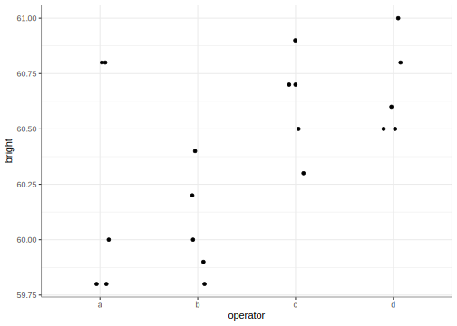
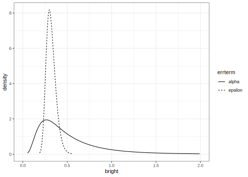
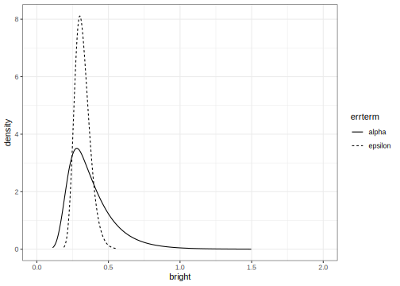

One Way Anova with a random effect
================
[Julian Faraway](https://julianfaraway.github.io/)
21 June 2022

See the [introduction](index.md) for an overview.

This example is discussed in more detail in my book [Extending the
Linear Model with R](https://julianfaraway.github.io/faraway/ELM/)

Required libraries:

``` r
library(faraway)
library(ggplot2)
library(lme4)
library(INLA)
```

# Data

Load up and look at the data, which concerns the brightness of paper
which may vary between operators of the production machinery.

``` r
data(pulp, package="faraway")
summary(pulp)
```

         bright     operator
     Min.   :59.8   a:5     
     1st Qu.:60.0   b:5     
     Median :60.5   c:5     
     Mean   :60.4   d:5     
     3rd Qu.:60.7           
     Max.   :61.0           

``` r
ggplot(pulp, aes(x=operator, y=bright))+geom_point(position = position_jitter(width=0.1, height=0.0))
```

<!-- -->

You can read more about the data by typing `help(pulp)` at the R prompt.

In this example, there are only five replicates per level. There is no
strong reason to reject the normality assumption. We don’t care about
the specific operators, who are named a, b, c and d, but we do want to
know how they vary.

# Likelihood inference

We use a model of the form:


where the

and
s
are normal with mean zero, but variances

and
,
respectively.

The default fit uses the REML estimation method:

``` r
mmod <- lmer(bright ~ 1+(1|operator), pulp)
faraway::sumary(mmod)
```

    Fixed Effects:
    coef.est  coef.se 
       60.40     0.15 

    Random Effects:
     Groups   Name        Std.Dev.
     operator (Intercept) 0.26    
     Residual             0.33    
    ---
    number of obs: 20, groups: operator, 4
    AIC = 24.6, DIC = 14.4
    deviance = 16.5 

We see slightly less variation within operators (SD=0.261) than between
operators (SD=0.326). We can also use the ML method:

``` r
smod <- lmer(bright ~ 1+(1|operator), pulp, REML = FALSE)
faraway::sumary(smod)
```

    Fixed Effects:
    coef.est  coef.se 
       60.40     0.13 

    Random Effects:
     Groups   Name        Std.Dev.
     operator (Intercept) 0.21    
     Residual             0.33    
    ---
    number of obs: 20, groups: operator, 4
    AIC = 22.5, DIC = 16.5
    deviance = 16.5 

The REML method is preferred for estimation but we must use the ML
method if we wish to make hypothesis tests comparing models.

If we want to test for variation between operators, we fit a null model
containing no operator, compute the likelihood ratio statistic and
corresponding p-value:

``` r
nullmod <- lm(bright ~ 1, pulp)
lrtstat <- as.numeric(2*(logLik(smod)-logLik(nullmod)))
pvalue <- pchisq(lrtstat,1,lower=FALSE)
data.frame(lrtstat, pvalue)
```

      lrtstat  pvalue
    1  2.5684 0.10902

Superficially, the p-value greater than 0.05 suggests no strong evidence
against that hypothesis that there is no variation among the operators.
But there is good reason to doubt the chi-squared null distribution when
testing parameter on the boundary of the space (as we do here at zero).
A parametric bootstrap can be used where we generate samples from the
null and compute the test statistic repeatedly:

``` r
lrstat <- numeric(1000)
set.seed(123)
for(i in 1:1000){
   y <- unlist(simulate(nullmod))
   bnull <- lm(y ~ 1)
   balt <- lmer(y ~ 1 + (1|operator), pulp, REML=FALSE)
   lrstat[i] <- as.numeric(2*(logLik(balt)-logLik(bnull)))
  }
```

Check the proportion of simulated test statistics that are close to
zero:

``` r
mean(lrstat < 0.00001)
```

    [1] 0.703

Clearly, the test statistic does not have a chi-squared distribution
under the null. We can compute the proportion that exceed the observed
test statistic of 2.5684:

``` r
mean(lrstat > 2.5684)
```

    [1] 0.019

This is a more reliable p-value for our hypothesis test which suggest
there is good reason to reject the null hypothesis of no variation
between operators.

More sophisticated methods of inference are discussed in [Extending the
Linear Model with R](https://julianfaraway.github.io/faraway/ELM/)

# INLA

Integrated nested Laplace approximation is a method of Bayesian
computation which uses approximation rather than simulation. More can be
found on this topic in [Bayesian Regression Modeling with
INLA](http://julianfaraway.github.io/brinla/) and the [chapter on
GLMMs](https://julianfaraway.github.io/brinlabook/chaglmm.html)

Run the default INLA model:

``` r
formula <- bright ~ f(operator, model="iid")
result <- inla(formula, family="gaussian", data=pulp)
#result <- inla.hyperpar(result)
INLA::inla.setOption("short.summary",TRUE)
summary(result)
```

    Fixed effects:
                mean   sd 0.025quant 0.5quant 0.975quant mode kld
    (Intercept) 60.4 0.09     60.221     60.4     60.579   NA   0

    Model hyperparameters:
                                                mean       sd 0.025quant 0.5quant 0.975quant mode
    Precision for the Gaussian observations     6.92     2.13       3.51     6.67      11.82   NA
    Precision for operator                  15237.41 14428.18     892.22 10739.31   53957.84   NA

     is computed 

Precision for the operator term is unreasonably high. This is due to the
default diffuse gamma prior on the precisions. We can improve the
calculation but result would remain implausible so it is better we
change the prior.

## Informative but weak prior on the SDs

Try a truncated normal prior with low precision instead. A precision of
0.01 corresponds to an SD of 10. This is substantially larger than the
SD of the response so the information supplied is very weak.

``` r
tnprior <- list(prec = list(prior="logtnormal", param = c(0,0.01)))
formula <- bright ~ f(operator, model="iid", hyper = tnprior)
result <- inla(formula, family="gaussian", data=pulp)
#result <- inla.hyperpar(result)
summary(result)
```

    Fixed effects:
                mean    sd 0.025quant 0.5quant 0.975quant mode   kld
    (Intercept) 60.4 0.327     59.706     60.4     61.094   NA 0.024

    Model hyperparameters:
                                             mean    sd 0.025quant 0.5quant 0.975quant mode
    Precision for the Gaussian observations 10.67  3.52      5.105    10.24      18.82   NA
    Precision for operator                  13.01 24.69      0.376     5.89      70.35   NA

     is computed 

The results appear more plausible although something is still wrong with
the `summary()` output. Transform to the SD scale. Make a table of
summary statistics for the posteriors:

``` r
sigmaalpha <- inla.tmarginal(function(x) 1/sqrt(exp(x)),result$internal.marginals.hyperpar[[2]])
sigmaepsilon <- inla.tmarginal(function(x) 1/sqrt(exp(x)),result$internal.marginals.hyperpar[[1]])
restab <- sapply(result$marginals.fixed, function(x) inla.zmarginal(x,silent=TRUE))
restab <- cbind(restab, inla.zmarginal(sigmaalpha,silent=TRUE))
restab <- cbind(restab, inla.zmarginal(sigmaepsilon,silent = TRUE))
restab <- cbind(restab, sapply(result$marginals.random$operator,function(x) inla.zmarginal(x, silent = TRUE)))
colnames(restab)  <-  c("mu","alpha","epsilon",levels(pulp$operator))
data.frame(restab) |> knitr::kable()
```

|            | mu      | alpha   | epsilon  | a        | b         | c        | d        |
|:-----------|:--------|:--------|:---------|:---------|:----------|:---------|:---------|
| mean       | 60.4    | 0.52493 | 0.31874  | -0.13049 | -0.27711  | 0.17981  | 0.22889  |
| sd         | 0.32853 | 0.40031 | 0.053653 | 0.34282  | 0.34805   | 0.34412  | 0.3458   |
| quant0.025 | 59.706  | 0.11967 | 0.23112  | -0.86871 | -1.0423   | -0.50355 | -0.44624 |
| quant0.25  | 60.259  | 0.26501 | 0.28029  | -0.2848  | -0.43746  | 0.012774 | 0.055815 |
| quant0.5   | 60.399  | 0.41001 | 0.31221  | -0.11852 | -0.25804  | 0.16229  | 0.20886  |
| quant0.75  | 60.539  | 0.65026 | 0.35057  | 0.02729  | -0.099539 | 0.33331  | 0.38423  |
| quant0.975 | 61.094  | 1.6068  | 0.44102  | 0.56151  | 0.38946   | 0.92659  | 0.98451  |

The results are now comparable to previous fits to this data. Plot the
posterior densities for the two SD terms:

``` r
ddf <- data.frame(rbind(sigmaalpha,sigmaepsilon),errterm=gl(2,dim(sigmaalpha)[1],labels = c("alpha","epsilon")))
ggplot(ddf, aes(x,y, linetype=errterm))+geom_line()+xlab("bright")+ylab("density")+xlim(0,2)
```

<!-- -->

We see that the operator SD less precisely known than the error SD.

We can compute the probability that the operator SD is smaller than 0.1:

``` r
inla.pmarginal(0.1, sigmaalpha)
```

    [1] 0.011906

The probability is small but not negligible.

# Informative gamma priors on the precisions

Now try more informative gamma priors for the precisions. Define it so
the mean value of gamma prior is set to the inverse of the variance of
the response. We expect the two error variances to be lower than the
response variance so this is an overestimate. The variance of the gamma
prior (for the precision) is controlled by the `apar` shape parameter in
the code. `apar=1` is the exponential distribution. Shape values less
than one result in densities that have a mode at zero and decrease
monotonely. These have greater variance and hence less informative.

``` r
apar <- 0.5
bpar <- var(pulp$bright)*apar
lgprior <- list(prec = list(prior="loggamma", param = c(apar,bpar)))
formula <- bright ~ f(operator, model="iid", hyper = lgprior)
result <- inla(formula, family="gaussian", data=pulp)
#result <- inla.hyperpar(result)
summary(result)
```

    Fixed effects:
                mean    sd 0.025quant 0.5quant 0.975quant mode kld
    (Intercept) 60.4 0.223     59.944     60.4     60.856   NA   0

    Model hyperparameters:
                                             mean   sd 0.025quant 0.5quant 0.975quant mode
    Precision for the Gaussian observations 10.61 3.52       5.10    10.15      18.80   NA
    Precision for operator                  10.95 8.94       1.52     8.55      34.44   NA

     is computed 

Compute the summaries as before:

``` r
sigmaalpha <- inla.tmarginal(function(x) 1/sqrt(exp(x)),result$internal.marginals.hyperpar[[2]])
sigmaepsilon <- inla.tmarginal(function(x) 1/sqrt(exp(x)),result$internal.marginals.hyperpar[[1]])
restab <- sapply(result$marginals.fixed, function(x) inla.zmarginal(x,silent=TRUE))
restab <- cbind(restab, inla.zmarginal(sigmaalpha,silent=TRUE))
restab <- cbind(restab, inla.zmarginal(sigmaepsilon,silent = TRUE))
restab <- cbind(restab, sapply(result$marginals.random$operator,function(x) inla.zmarginal(x, silent = TRUE)))
colnames(restab)  <-  c("mu","alpha","epsilon",levels(pulp$operator))
data.frame(restab) |> knitr::kable()
```

|            | mu      | alpha   | epsilon  | a        | b        | c        | d        |
|:-----------|:--------|:--------|:---------|:---------|:---------|:---------|:---------|
| mean       | 60.4    | 0.37926 | 0.31977  | -0.13259 | -0.2818  | 0.18241  | 0.23214  |
| sd         | 0.22322 | 0.16467 | 0.053679 | 0.24095  | 0.24349  | 0.24163  | 0.24249  |
| quant0.025 | 59.944  | 0.1711  | 0.23126  | -0.63241 | -0.79729 | -0.28991 | -0.23689 |
| quant0.25  | 60.273  | 0.26414 | 0.28135  | -0.27234 | -0.42217 | 0.036889 | 0.084894 |
| quant0.5   | 60.399  | 0.34058 | 0.31357  | -0.12893 | -0.27383 | 0.17596  | 0.22425  |
| quant0.75  | 60.526  | 0.45256 | 0.35185  | 0.010135 | -0.13392 | 0.32088  | 0.37082  |
| quant0.975 | 60.855  | 0.80403 | 0.44137  | 0.3423   | 0.18324  | 0.68637  | 0.74134  |

Make the plots:

``` r
ddf <- data.frame(rbind(sigmaalpha,sigmaepsilon),errterm=gl(2,dim(sigmaalpha)[1],labels = c("alpha","epsilon")))
ggplot(ddf, aes(x,y, linetype=errterm))+geom_line()+xlab("bright")+ylab("density")+xlim(0,2)
```

<!-- -->

The posterior for the error SD is quite similar to that seen previously
but the operator SD is larger and bounded away from zero.

We can compute the probability that the operator SD is smaller than 0.1:

``` r
inla.pmarginal(0.1, sigmaalpha)
```

    [1] 3.3816e-05

The probability is very small. The choice of prior may be unsuitable in
that no density is placed on an SD=0 (or infinite precision). We also
have very little prior weight on low SD/high precision values. This
leads to a posterior for the operator with very little density assigned
to small values of the SD. But we can see from looking at the data or
from prior analyses of the data that there is some possibility that the
operator SD is negligibly small.

# Penalized Complexity Prior

In [Simpson et al (2015)](http://arxiv.org/abs/1403.4630v3), penalized
complexity priors are proposed. This requires that we specify a scaling
for the SDs of the random effects. We use the SD of the residuals of the
fixed effects only model (what might be called the base model in the
paper) to provide this scaling.

``` r
sdres <- sd(pulp$bright)
pcprior <- list(prec = list(prior="pc.prec", param = c(3*sdres,0.01)))
formula <- bright ~ f(operator, model="iid", hyper = pcprior)
result <- inla(formula, family="gaussian", data=pulp)
#result <- inla.hyperpar(result)
summary(result)
```

    Fixed effects:
                mean   sd 0.025quant 0.5quant 0.975quant mode kld
    (Intercept) 60.4 0.17      60.05     60.4      60.75   NA   0

    Model hyperparameters:
                                             mean    sd 0.025quant 0.5quant 0.975quant mode
    Precision for the Gaussian observations 10.54  3.49       5.04    10.10      18.63   NA
    Precision for operator                  40.72 84.06       2.30    18.57     222.90   NA

     is computed 

Compute the summaries as before:

``` r
sigmaalpha <- inla.tmarginal(function(x) 1/sqrt(exp(x)),result$internal.marginals.hyperpar[[2]])
sigmaepsilon <- inla.tmarginal(function(x) 1/sqrt(exp(x)),result$internal.marginals.hyperpar[[1]])
restab <- sapply(result$marginals.fixed, function(x) inla.zmarginal(x,silent=TRUE))
restab <- cbind(restab, inla.zmarginal(sigmaalpha,silent=TRUE))
restab <- cbind(restab, inla.zmarginal(sigmaepsilon,silent = TRUE))
restab <- cbind(restab, sapply(result$marginals.random$operator,function(x) inla.zmarginal(x, silent = TRUE)))
colnames(restab)  <-  c("mu","alpha","epsilon",levels(pulp$operator))
data.frame(restab) |> knitr::kable()
```

|            | mu      | alpha    | epsilon  | a         | b         | c        | d        |
|:-----------|:--------|:---------|:---------|:----------|:----------|:---------|:---------|
| mean       | 60.4    | 0.26527  | 0.3208   | -0.10777  | -0.23014  | 0.14725  | 0.18831  |
| sd         | 0.17021 | 0.15241  | 0.054107 | 0.18887   | 0.20315   | 0.19248  | 0.1977   |
| quant0.025 | 60.05   | 0.067934 | 0.23229  | -0.51932  | -0.6771   | -0.20131 | -0.15638 |
| quant0.25  | 60.303  | 0.15484  | 0.28204  | -0.21516  | -0.35139  | 0.020313 | 0.052501 |
| quant0.5   | 60.4    | 0.23339  | 0.31427  | -0.092908 | -0.21392  | 0.12952  | 0.17074  |
| quant0.75  | 60.496  | 0.33887  | 0.35294  | 0.0052766 | -0.088747 | 0.25768  | 0.30369  |
| quant0.975 | 60.749  | 0.64924  | 0.44398  | 0.24903   | 0.11117   | 0.56987  | 0.62293  |

Make the plots:

``` r
ddf <- data.frame(rbind(sigmaalpha,sigmaepsilon),errterm=gl(2,dim(sigmaalpha)[1],labels = c("alpha","epsilon")))
ggplot(ddf, aes(x,y, linetype=errterm))+geom_line()+xlab("bright")+ylab("density")+xlim(0,2)
```

<!-- -->

We get a similar result to the truncated normal prior used earlier
although the operator SD is generally smaller.

We can compute the probability that the operator SD is smaller than 0.1:

``` r
inla.pmarginal(0.1, sigmaalpha)
```

    [1] 0.086646

The probability is small but not insubstantial.

# Package version info

``` r
sessionInfo()
```

    R version 4.2.0 (2022-04-22)
    Platform: x86_64-apple-darwin17.0 (64-bit)
    Running under: macOS Big Sur/Monterey 10.16

    Matrix products: default
    BLAS:   /Library/Frameworks/R.framework/Versions/4.2/Resources/lib/libRblas.0.dylib
    LAPACK: /Library/Frameworks/R.framework/Versions/4.2/Resources/lib/libRlapack.dylib

    locale:
    [1] en_GB.UTF-8/en_GB.UTF-8/en_GB.UTF-8/C/en_GB.UTF-8/en_GB.UTF-8

    attached base packages:
    [1] parallel  stats     graphics  grDevices utils     datasets  methods   base     

    other attached packages:
    [1] INLA_22.05.07 sp_1.4-7      foreach_1.5.2 lme4_1.1-29   Matrix_1.4-1  ggplot2_3.3.6 faraway_1.0.8

    loaded via a namespace (and not attached):
     [1] tidyselect_1.1.2   xfun_0.31          purrr_0.3.4        splines_4.2.0      lattice_0.20-45    colorspace_2.0-3  
     [7] vctrs_0.4.1        generics_0.1.2     htmltools_0.5.2    yaml_2.3.5         utf8_1.2.2         rlang_1.0.2       
    [13] pillar_1.7.0       nloptr_2.0.3       glue_1.6.2         withr_2.5.0        DBI_1.1.2          lifecycle_1.0.1   
    [19] stringr_1.4.0      MatrixModels_0.5-0 munsell_0.5.0      gtable_0.3.0       codetools_0.2-18   evaluate_0.15     
    [25] labeling_0.4.2     knitr_1.39         fastmap_1.1.0      fansi_1.0.3        highr_0.9          Rcpp_1.0.8.3      
    [31] scales_1.2.0       systemfonts_1.0.4  farver_2.1.0       Deriv_4.1.3        digest_0.6.29      stringi_1.7.6     
    [37] dplyr_1.0.9        grid_4.2.0         cli_3.3.0          tools_4.2.0        magrittr_2.0.3     tibble_3.1.7      
    [43] crayon_1.5.1       pkgconfig_2.0.3    ellipsis_0.3.2     MASS_7.3-57        svglite_2.1.0      assertthat_0.2.1  
    [49] minqa_1.2.4        rmarkdown_2.14     rstudioapi_0.13    iterators_1.0.14   R6_2.5.1           boot_1.3-28       
    [55] nlme_3.1-157       compiler_4.2.0    
