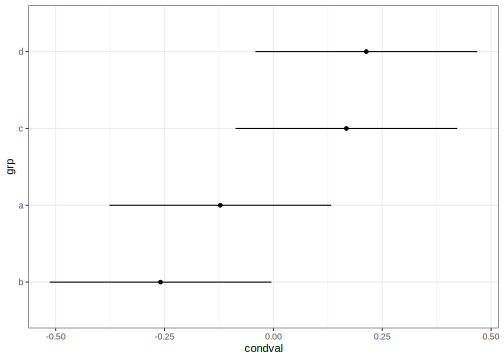
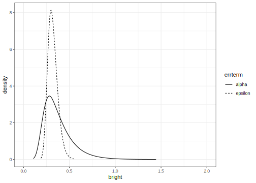
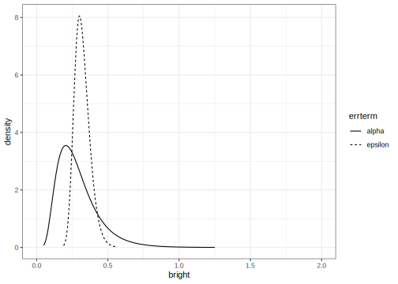
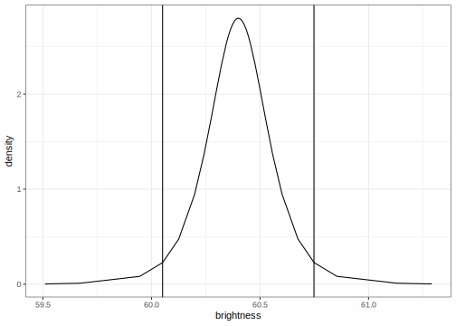
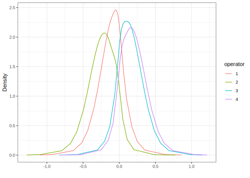
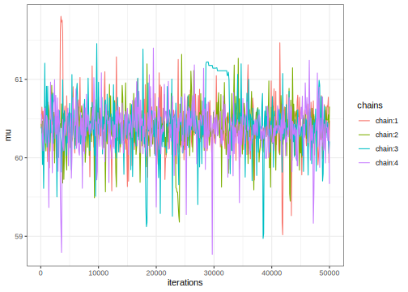
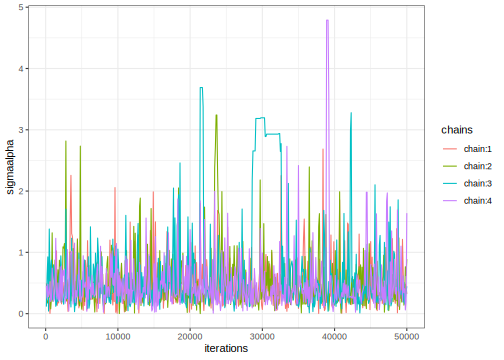
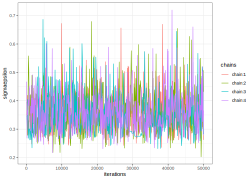
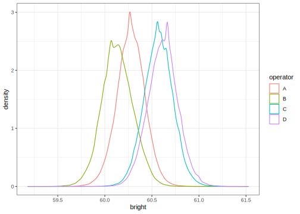

One Way Anova with a random effect
================
[Julian Faraway](https://julianfaraway.github.io/)
23 June 2022

-   <a href="#data" id="toc-data">Data</a>
-   <a href="#likelihood-inference" id="toc-likelihood-inference">Likelihood
    inference</a>
    -   <a href="#hypothesis-testing" id="toc-hypothesis-testing">Hypothesis
        testing</a>
    -   <a href="#confidence-intervals" id="toc-confidence-intervals">Confidence
        intervals</a>
    -   <a href="#random-effects" id="toc-random-effects">Random effects</a>
-   <a href="#inla" id="toc-inla">INLA</a>
    -   <a href="#halfnormal-prior-on-the-sds"
        id="toc-halfnormal-prior-on-the-sds">Halfnormal prior on the SDs</a>
    -   <a href="#informative-gamma-priors-on-the-precisions"
        id="toc-informative-gamma-priors-on-the-precisions">Informative gamma
        priors on the precisions</a>
    -   <a href="#penalized-complexity-prior"
        id="toc-penalized-complexity-prior">Penalized Complexity Prior</a>
-   <a href="#stan" id="toc-stan">STAN</a>
    -   <a href="#diagnostics" id="toc-diagnostics">Diagnostics</a>
    -   <a href="#output-summaries" id="toc-output-summaries">Output
        summaries</a>
    -   <a href="#posterior-distributions"
        id="toc-posterior-distributions">Posterior Distributions</a>
    -   <a href="#tail-probability" id="toc-tail-probability">Tail
        probability</a>
-   <a href="#brms" id="toc-brms">BRMS</a>
-   <a href="#package-version-info" id="toc-package-version-info">Package
    version info</a>

See the [introduction](index.md) for an overview.

This example is discussed in more detail in my book [Extending the
Linear Model with R](https://julianfaraway.github.io/faraway/ELM/)

Required libraries:

``` r
library(faraway)
library(ggplot2)
library(lme4)
library(INLA)
library(knitr)
library(rstan, quietly=TRUE)
library(brms)
```

# Data

Load up and look at the data, which concerns the brightness of paper
which may vary between operators of the production machinery.

``` r
data(pulp, package="faraway")
summary(pulp)
```

         bright     operator
     Min.   :59.8   a:5     
     1st Qu.:60.0   b:5     
     Median :60.5   c:5     
     Mean   :60.4   d:5     
     3rd Qu.:60.7           
     Max.   :61.0           

``` r
ggplot(pulp, aes(x=operator, y=bright))+geom_point(position = position_jitter(width=0.1, height=0.0))
```

<!-- -->

You can read more about the data by typing `help(pulp)` at the R prompt.

In this example, there are only five replicates per level. There is no
strong reason to reject the normality assumption. We don’t care about
the specific operators, who are named a, b, c and d, but we do want to
know how they vary.

# Likelihood inference

We use a model of the form:


where the

and
s
are normal with mean zero, but variances

and
,
respectively.

The default fit uses the REML estimation method:

``` r
mmod <- lmer(bright ~ 1+(1|operator), pulp)
faraway::sumary(mmod)
```

    Fixed Effects:
    coef.est  coef.se 
       60.40     0.15 

    Random Effects:
     Groups   Name        Std.Dev.
     operator (Intercept) 0.26    
     Residual             0.33    
    ---
    number of obs: 20, groups: operator, 4
    AIC = 24.6, DIC = 14.4
    deviance = 16.5 

We see slightly less variation within operators (SD=0.261) than between
operators (SD=0.326).

## Hypothesis testing

We can also use the ML method:

``` r
smod <- lmer(bright ~ 1+(1|operator), pulp, REML = FALSE)
faraway::sumary(smod)
```

    Fixed Effects:
    coef.est  coef.se 
       60.40     0.13 

    Random Effects:
     Groups   Name        Std.Dev.
     operator (Intercept) 0.21    
     Residual             0.33    
    ---
    number of obs: 20, groups: operator, 4
    AIC = 22.5, DIC = 16.5
    deviance = 16.5 

The REML method is preferred for estimation but we must use the ML
method if we wish to make hypothesis tests comparing models.

If we want to test for variation between operators, we fit a null model
containing no operator, compute the likelihood ratio statistic and
corresponding p-value:

``` r
nullmod <- lm(bright ~ 1, pulp)
lrtstat <- as.numeric(2*(logLik(smod)-logLik(nullmod)))
pvalue <- pchisq(lrtstat,1,lower=FALSE)
data.frame(lrtstat, pvalue)
```

      lrtstat  pvalue
    1  2.5684 0.10902

Superficially, the p-value greater than 0.05 suggests no strong evidence
against that hypothesis that there is no variation among the operators.
But there is good reason to doubt the chi-squared null distribution when
testing parameter on the boundary of the space (as we do here at zero).
A parametric bootstrap can be used where we generate samples from the
null and compute the test statistic repeatedly:

``` r
lrstat <- numeric(1000)
set.seed(123)
for(i in 1:1000){
   y <- unlist(simulate(nullmod))
   bnull <- lm(y ~ 1)
   balt <- lmer(y ~ 1 + (1|operator), pulp, REML=FALSE)
   lrstat[i] <- as.numeric(2*(logLik(balt)-logLik(bnull)))
  }
```

Check the proportion of simulated test statistics that are close to
zero:

``` r
mean(lrstat < 0.00001)
```

    [1] 0.703

Clearly, the test statistic does not have a chi-squared distribution
under the null. We can compute the proportion that exceed the observed
test statistic of 2.5684:

``` r
mean(lrstat > 2.5684)
```

    [1] 0.019

This is a more reliable p-value for our hypothesis test which suggest
there is good reason to reject the null hypothesis of no variation
between operators.

More sophisticated methods of inference are discussed in [Extending the
Linear Model with R](https://julianfaraway.github.io/faraway/ELM/)

## Confidence intervals

We can use bootstrap again to compute confidence intervals for the
parameters of interest:

``` r
confint(mmod, method="boot")
```

                   2.5 %   97.5 %
    .sig01       0.00000  0.51451
    .sigma       0.21084  0.43020
    (Intercept) 60.11213 60.69244

We see that the lower end of the confidence interval for the operator SD
extends to zero.

## Random effects

Even though we are most interested in the variation between operators,
we can still estimate their individual effects:

``` r
ranef(mmod)$operator
```

      (Intercept)
    a    -0.12194
    b    -0.25912
    c     0.16767
    d     0.21340

Approximate 95% confidence intervals can be displayed with:

``` r
dd = as.data.frame(ranef(mmod))
ggplot(dd, aes(y=grp,x=condval)) +
        geom_point() +
        geom_errorbarh(aes(xmin=condval -2*condsd,
                           xmax=condval +2*condsd), height=0)
```

<!-- -->

# INLA

Integrated nested Laplace approximation is a method of Bayesian
computation which uses approximation rather than simulation. More can be
found on this topic in [Bayesian Regression Modeling with
INLA](http://julianfaraway.github.io/brinla/) and the [chapter on
GLMMs](https://julianfaraway.github.io/brinlabook/chaglmm.html)

Use the most recent computational methodology:

``` r
inla.setOption(inla.mode="experimental")
inla.setOption("short.summary",TRUE)
```

Run the INLA model with default priors:

``` r
imod <- inla(bright ~ f(operator, model="iid"),
             family="gaussian",
             data=pulp)
```

The summary of the posterior distribution for the fixed effects (which
is only the intercept in this example):

``` r
imod$summary.fixed |> kable()
```

|             | mean |      sd | 0.025quant | 0.5quant | 0.975quant | mode | kld |
|:------------|-----:|--------:|-----------:|---------:|-----------:|-----:|----:|
| (Intercept) | 60.4 | 0.08804 |     60.226 |     60.4 |     60.574 | 60.4 |   0 |

The posterior mean is the same as the (RE)ML estimate. The posterior
distribution of the hyperparameters (precision of the error and operator
terms)

``` r
imod$summary.hyperpar |> kable()
```

|                                         |       mean |         sd | 0.025quant |   0.5quant | 0.975quant |      mode |
|:----------------------------------------|-----------:|-----------:|-----------:|-----------:|-----------:|----------:|
| Precision for the Gaussian observations |     6.9001 |     2.1323 |     3.4886 |     6.6477 |     11.802 |    6.1674 |
| Precision for operator                  | 19274.5392 | 19883.8871 |  1312.5233 | 13253.9873 |  72158.286 | 3591.1178 |

Precision for the operator term is unreasonably high. This implies a
strong belief that there is no variation between the operators which we
would find hard to believe. This is due to the default diffuse gamma
prior on the precisions which put almost all the weight on the error
variation and not nearly enough on the operator variation. We need to
change the prior.

## Halfnormal prior on the SDs

We try a halfnormal prior with low precision instead. A precision of
0.01 corresponds to an SD of 10. (It is possible to vary the mean but we
have set this to zero to achieve a halfnormal distribution). This is
substantially larger than the SD of the response so the information
supplied is very weak.

``` r
tnprior <- list(prec = list(prior="logtnormal", param = c(0,0.01)))
imod <- inla(bright ~ f(operator, model="iid", hyper = tnprior),
               family="gaussian", 
               data=pulp)
summary(imod)
```

    Fixed effects:
                mean    sd 0.025quant 0.5quant 0.975quant mode   kld
    (Intercept) 60.4 0.311     59.763     60.4     61.037 60.4 0.053

    Model hyperparameters:
                                             mean    sd 0.025quant 0.5quant 0.975quant mode
    Precision for the Gaussian observations 10.59  3.54       5.13    10.10      18.91 9.19
    Precision for operator                  12.80 21.07       0.51     6.51      63.96 1.24

     is computed 

The results appear more plausible. Transform to the SD scale

``` r
sigmaalpha <- inla.tmarginal(function(x)1/sqrt(exp(x)),
                             imod$internal.marginals.hyperpar[[2]])
sigmaepsilon <- inla.tmarginal(function(x)1/sqrt(exp(x)),
                                imod$internal.marginals.hyperpar[[1]])
```

and output the summary statistics (note that transforming the summary
statistics on the precision scale only works for the quantiles)

``` r
sigalpha = c(inla.zmarginal(sigmaalpha, silent = TRUE),
            mode=inla.mmarginal(sigmaalpha))
sigepsilon = c(inla.zmarginal(sigmaepsilon, silent = TRUE),
              mode=inla.mmarginal(sigmaepsilon))
rbind(sigalpha, sigepsilon) 
```

               mean    sd       quant0.025 quant0.25 quant0.5 quant0.75 quant0.975 mode   
    sigalpha   0.48357 0.33612  0.12525    0.26083   0.39051  0.59873   1.3857     0.26776
    sigepsilon 0.32005 0.053498 0.23058    0.28183   0.31437  0.35236   0.44011    0.30262

The posterior mode is most comparable with the (RE)ML estimates computed
above. In this respect, the results are similar.

We can also get summary statistics on the random effects:

``` r
imod$summary.random$operator |> kable()
```

| ID  |     mean |      sd | 0.025quant | 0.5quant | 0.975quant |     mode |     kld |
|:----|---------:|--------:|-----------:|---------:|-----------:|---------:|--------:|
| a   | -0.13092 | 0.32473 |   -0.81152 | -0.11969 |    0.50673 | -0.08667 | 0.04493 |
| b   | -0.27809 | 0.32965 |   -0.98417 | -0.26147 |    0.33663 | -0.23234 | 0.04245 |
| c   |  0.17998 | 0.32605 |   -0.45006 |  0.16640 |    0.86908 |  0.13349 | 0.04420 |
| d   |  0.22897 | 0.32755 |   -0.39310 |  0.21347 |    0.92635 |  0.18491 | 0.04356 |

Plot the posterior densities for the two SD terms:

``` r
ddf <- data.frame(rbind(sigmaalpha,sigmaepsilon),
                  errterm=gl(2,dim(sigmaalpha)[1],labels = c("alpha","epsilon")))
ggplot(ddf, aes(x,y, linetype=errterm))+
  geom_line()+xlab("bright")+ylab("density")+xlim(0,2)
```

<!-- -->

We see that the operator SD less precisely known than the error SD.
Although the mode for the operator is smaller, there is a substantial
chance it could be much higher than the error SD.

Is there any variation between operators? We framed this question as an
hypothesis test previously but that is not sensible in this framework.
We might ask the probability that the operator SD is zero. Since we have
posited a continuous prior that places no discrete mass on zero, the
posterior probability will be zero, regardless of the data. Instead we
might ask the probability that the operator SD is small. Given the
response is measured to one decimal place, 0.1 is a reasonable
representation of *small* if we take this to mean the smallest amount we
care about.

We can compute the probability that the operator SD is smaller than 0.1:

``` r
inla.pmarginal(0.1, sigmaalpha)
```

    [1] 0.0088764

The probability is small but not entirely negligible.

## Informative gamma priors on the precisions

Now try more informative gamma priors for the precisions. Define it so
the mean value of gamma prior is set to the inverse of the variance of
the response. We expect the two error variances to be lower than the
response variance so this is an overestimate. The variance of the gamma
prior (for the precision) is controlled by the `apar` shape parameter in
the code. `apar=1` is the exponential distribution. Shape values less
than one result in densities that have a mode at zero and decrease
monotonely. These have greater variance and hence less informative.

``` r
apar <- 0.5
bpar <- var(pulp$bright)*apar
lgprior <- list(prec = list(prior="loggamma", param = c(apar,bpar)))
imod <- inla(bright ~ f(operator, model="iid", hyper = lgprior),
               family="gaussian", 
               data=pulp)
summary(imod)
```

    Fixed effects:
                mean    sd 0.025quant 0.5quant 0.975quant mode   kld
    (Intercept) 60.4 0.209     59.981     60.4     60.819 60.4 0.002

    Model hyperparameters:
                                             mean   sd 0.025quant 0.5quant 0.975quant mode
    Precision for the Gaussian observations 10.61 3.52       5.11    10.15      18.82 9.27
    Precision for operator                  10.87 9.06       1.53     8.41      34.78 4.27

     is computed 

Compute the summaries as before:

``` r
sigmaalpha <- inla.tmarginal(function(x)1/sqrt(exp(x)),
                             imod$internal.marginals.hyperpar[[2]])
sigmaepsilon <- inla.tmarginal(function(x)1/sqrt(exp(x)),
                            imod$internal.marginals.hyperpar[[1]])
sigalpha = c(inla.zmarginal(sigmaalpha, silent = TRUE),
            mode=inla.mmarginal(sigmaalpha))
sigepsilon = c(inla.zmarginal(sigmaepsilon, silent = TRUE),
              mode=inla.mmarginal(sigmaepsilon))
rbind(sigalpha, sigepsilon) 
```

               mean    sd       quant0.025 quant0.25 quant0.5 quant0.75 quant0.975 mode   
    sigalpha   0.38096 0.16371  0.17032    0.2661    0.34368  0.45541   0.8007     0.28317
    sigepsilon 0.31968 0.053599 0.23109    0.28133   0.31357  0.35177   0.44092    0.30077

Slightly different outcome.

Make the plots:

``` r
ddf <- data.frame(rbind(sigmaalpha,sigmaepsilon),
                  errterm=gl(2,dim(sigmaalpha)[1],labels = c("alpha","epsilon")))
ggplot(ddf, aes(x,y, linetype=errterm))+
  geom_line()+xlab("bright")+ylab("density")+xlim(0,2)
```

<!-- -->

The posterior for the error SD is quite similar to that seen previously
but the operator SD is larger and bounded away from zero and less
dispersed.

We can compute the probability that the operator SD is smaller than 0.1:

``` r
inla.pmarginal(0.1, sigmaalpha)
```

    [1] 3.2687e-05

The probability is very small. The choice of prior may be unsuitable in
that no density is placed on an SD=0 (or infinite precision). We also
have very little prior weight on low SD/high precision values. This
leads to a posterior for the operator with very little density assigned
to small values of the SD. But we can see from looking at the data or
from prior analyses of the data that there is some possibility that the
operator SD is very small.

## Penalized Complexity Prior

In [Simpson (2017)](https://doi.org/10.1214/16-STS576), penalized
complexity priors are proposed. This requires that we specify a scaling
for the SDs of the random effects. We use the SD of the residuals of the
fixed effects only model (what might be called the base model in the
paper) to provide this scaling.

``` r
sdres <- sd(pulp$bright)
pcprior <- list(prec = list(prior="pc.prec", param = c(3*sdres,0.01)))
imod <- inla(bright ~ f(operator, model="iid", hyper = pcprior),
               family="gaussian", 
               data=pulp)
summary(imod)
```

    Fixed effects:
                mean    sd 0.025quant 0.5quant 0.975quant mode kld
    (Intercept) 60.4 0.171     60.054     60.4     60.746 60.4   0

    Model hyperparameters:
                                             mean    sd 0.025quant 0.5quant 0.975quant mode
    Precision for the Gaussian observations 10.56  3.52       5.05    10.11      18.75 9.23
    Precision for operator                  24.48 32.14       2.25    14.87     105.92 5.84

     is computed 

Compute the summaries as before:

``` r
sigmaalpha <- inla.tmarginal(function(x)1/sqrt(exp(x)),
                             imod$internal.marginals.hyperpar[[2]])
sigmaepsilon <- inla.tmarginal(function(x)1/sqrt(exp(x)),
                            imod$internal.marginals.hyperpar[[1]])
sigalpha = c(inla.zmarginal(sigmaalpha, silent = TRUE),
            mode=inla.mmarginal(sigmaalpha))
sigepsilon = c(inla.zmarginal(sigmaepsilon, silent = TRUE),
              mode=inla.mmarginal(sigmaepsilon))
rbind(sigalpha, sigepsilon) 
```

               mean    sd       quant0.025 quant0.25 quant0.5 quant0.75 quant0.975 mode   
    sigalpha   0.28994 0.14656  0.097606   0.18561   0.25914  0.35918   0.66087    0.20456
    sigepsilon 0.32052 0.054081 0.23151    0.28181   0.31421  0.35279   0.44317    0.30091

We get a similar result to the truncated normal prior used earlier
although the operator SD is generally smaller.

Make the plots:

``` r
ddf <- data.frame(rbind(sigmaalpha,sigmaepsilon),
                  errterm=gl(2,dim(sigmaalpha)[1],labels = c("alpha","epsilon")))
ggplot(ddf, aes(x,y, linetype=errterm))+
  geom_line()+xlab("bright")+ylab("density")+xlim(0,2)
```

<!-- -->

We can compute the probability that the operator SD is smaller than 0.1:

``` r
inla.pmarginal(0.1, sigmaalpha)
```

    [1] 0.027986

The probability is small but not insubstantial.

We can plot the posterior density of

along with a 95% credibility interval:

``` r
mu <- data.frame(imod$marginals.fixed[[1]])
cbound = inla.qmarginal(c(0.025,0.975),mu)
ggplot(mu, aes(x,y)) + geom_line() + 
  geom_vline(xintercept = cbound) +
  xlab("brightness")+ylab("density")
```

<!-- -->

We can plot the posterior marginals of the random effects:

``` r
nlevels = length(unique(pulp$operator))
rdf = data.frame(do.call(rbind,imod$marginals.random$operator))
rdf$operator = gl(nlevels,nrow(rdf)/nlevels,labels=1:nlevels)
ggplot(rdf,aes(x=x,y=y,group=operator, color=operator)) + 
  geom_line() +
  xlab("") + ylab("Density")
```

<!-- -->

We see that operators 1 and 2 tend to be lower than 3 and 4. There is
substantial overlap so we would hesitate to declare any difference
between a pair of operators.

# STAN

[STAN](https://mc-stan.org/) performs Bayesian inference using MCMC.

Set up STAN to use multiple cores. Set the random number seed for
reproducibility.

``` r
rstan_options(auto_write = TRUE)
options(mc.cores = parallel::detectCores())
set.seed(123)
```

We need the STAN command file `pulp.stan` which we view here:

``` r
writeLines(readLines("stancode/pulp.stan"))
```

    data {
      int<lower=0> N;
      int<lower=0> J;
      int<lower=1,upper=J> predictor[N];
      vector[N] response;
    }
    parameters {
      vector[J] eta;
      real mu;
      real<lower=0> sigmaalpha;
      real<lower=0> sigmaepsilon;
    }
    transformed parameters {
      vector[J] a;
      vector[N] yhat;

      a = mu + sigmaalpha * eta;

      for (i in 1:N)
        yhat[i] = a[predictor[i]];
    }
    model {
      eta ~ normal(0, 1);

      response ~ normal(yhat, sigmaepsilon);
    }

We have used uninformative priors for the overall mean and the two
variances. Prepare data in a format consistent with the command file.
Needs to be a list. Can’t use the word `operator` since this is reserved
for system use in STAN.

``` r
pulpdat <- list(N=nrow(pulp),
                J=length(unique(pulp$operator)),
                response=pulp$bright,
                predictor=as.numeric(pulp$operator))
```

Break the fitting process into three steps:

``` r
rt <- stanc(file="stancode/pulp.stan")
suppressMessages(sm <- stan_model(stanc_ret = rt, verbose=FALSE))
system.time(fit <- sampling(sm, data=pulpdat))
```

       user  system elapsed 
      3.864   0.220   1.459 

By default, we use 2000 iterations but repeated with independent starts
4 times giving 4 chains. We can thin but do not by default. The warmup
period is half the number of observations (which is very conservative in
this instance).

We get warning messages about the fit. Since the default number of 2000
iterations runs in seconds, we can simply run a lot more iterations.
This is rather lazy and would not be viable for more expensive
computations, but sometimes CPU effort is preferred to mental effort.

``` r
system.time(fit <- sampling(sm, data=pulpdat, iter=100000))
```

       user  system elapsed 
     40.275   3.052  18.812 

The same underlying problems remain but the inference will now be more
reliable.

## Diagnostics

Diagnostics to check the convergence are worthwhile. We plot the sampled

in the four chains, choosing only every 100th observation (the plot
becomes very dense if we show everything). The warm-up period is
excluded.

``` r
pname <- "mu"
muc <- rstan::extract(fit, pars=pname,  permuted=FALSE, inc_warmup=FALSE)
mdf <- reshape2::melt(muc)
mdf |> dplyr::filter(iterations %% 100 == 0) |> 
ggplot(aes(x=iterations,y=value,color=chains)) + geom_line() + ylab(mdf$parameters[1])
```

<!-- -->

We see the traces of the four chains overlaid in different colors. The
chains appear roughly stationary although there are some occasional
larger excursions (which is why we needed more iterations).

The similar plots can be produced for the two variance terms although
note that STAN uses the standard deviations (which we also prefer). Here
is the group (operator) SD:

``` r
pname <- "sigmaalpha"
muc <- rstan::extract(fit, pars=pname,  permuted=FALSE, inc_warmup=FALSE)
mdf <- reshape2::melt(muc)
mdf |> dplyr::filter(iterations %% 100 == 0) |> 
  ggplot(aes(x=iterations,y=value,color=chains)) + 
  geom_line() + ylab(mdf$parameters[1])
```

<!-- -->

This looks acceptable. We expect that the distribution will be
asymmetric so this is no concern. The chains stay away from zero (or
close to it). Here’s the same plot for the error SD.

``` r
pname <- "sigmaepsilon"
muc <- rstan::extract(fit, pars=pname,  permuted=FALSE, inc_warmup=FALSE)
mdf <- reshape2::melt(muc)
mdf |> dplyr::filter(iterations %% 100 == 0) |> 
  ggplot(aes(x=iterations,y=value,color=chains)) + 
  geom_line() + ylab(mdf$parameters[1])
```

<!-- -->

Again this looks satisfactory.

## Output summaries

We consider only the parameters of immediate interest:

``` r
print(fit, pars=c("mu","sigmaalpha","sigmaepsilon","a"))
```

    Inference for Stan model: pulp.
    4 chains, each with iter=1e+05; warmup=50000; thin=1; 
    post-warmup draws per chain=50000, total post-warmup draws=2e+05.

                  mean se_mean   sd  2.5%   25%   50%   75% 97.5%  n_eff Rhat
    mu           60.40    0.01 0.30 59.76 60.26 60.40 60.54 61.04   3206    1
    sigmaalpha    0.49    0.01 0.41  0.06  0.23  0.37  0.60  1.63   4405    1
    sigmaepsilon  0.36    0.00 0.07  0.25  0.31  0.35  0.40  0.53  50920    1
    a[1]         60.28    0.00 0.15 59.97 60.18 60.28 60.38 60.57 145412    1
    a[2]         60.14    0.00 0.17 59.82 60.03 60.14 60.25 60.47  82199    1
    a[3]         60.57    0.00 0.16 60.27 60.47 60.57 60.67 60.88 120325    1
    a[4]         60.61    0.00 0.16 60.30 60.51 60.62 60.72 60.93  92336    1

    Samples were drawn using NUTS(diag_e) at Thu Jun 23 13:37:38 2022.
    For each parameter, n_eff is a crude measure of effective sample size,
    and Rhat is the potential scale reduction factor on split chains (at 
    convergence, Rhat=1).

We see the posterior mean, SE and SD of the samples. We see some
quantiles from which we could construct a 95% credible interval (for
example). The `n_eff` is a rough measure of the sample size taking into
account the correlation in the samples. The effective sample sizes for
the mean and operator SD primary parameters is not large (considering
the number of iterations) although adequate enough for most purposes.
The Rhat statistic is known as the potential scale reduction factor.
Values much greater than one indicate that additional samples would
significantly improve the inference. In this case, the factors are all
one so we feel no inclination to draw more samples.

We can also get the posterior means alone.

``` r
(get_posterior_mean(fit, pars=c("mu","sigmaalpha","sigmaepsilon","a")))
```

                 mean-chain:1 mean-chain:2 mean-chain:3 mean-chain:4 mean-all chains
    mu               60.38502     60.41628     60.40734     60.38729        60.39898
    sigmaalpha        0.48663      0.49909      0.48386      0.47429         0.48597
    sigmaepsilon      0.35827      0.35928      0.35942      0.35855         0.35888
    a[1]             60.27633     60.27663     60.27581     60.27688        60.27641
    a[2]             60.13736     60.13864     60.13891     60.13822        60.13828
    a[3]             60.56911     60.56909     60.57060     60.57029        60.56977
    a[4]             60.61529     60.61390     60.61508     60.61410        60.61459

We see that we get this information for each chain as well as overall.
This gives a sense of why running more than one chain might be helpful
in assessing the uncertainty in the posterior inference.

## Posterior Distributions

We can use `extract` to get at various components of the STAN fit. We
plot the posterior densities for the SDs:

``` r
postsig <- rstan::extract(fit, pars=c("sigmaalpha","sigmaepsilon"))
ref <- reshape2::melt(postsig,value.name="bright")
ggplot(ref,aes(x=bright, color=L1))+
  geom_density()+
  xlim(0,2) +
  guides(color=guide_legend(title="SD"))
```

<!-- -->

We see that the error SD can be localized much more than the operator
SD. We can also look at the operator random effects:

``` r
opre <- rstan::extract(fit, pars="a")
ref <- reshape2::melt(opre, value.name="bright")
ref[,2] <- (LETTERS[1:4])[ref[,2]]
ggplot(data=ref,aes(x=bright, color=Var2))+geom_density()+guides(color=guide_legend(title="operator"))
```

<!-- -->

We see that the four operator distributions overlap.

## Tail probability

Previously, we took an interest in whether there is any variation
between operators and answered this question with a computation of the
probability that the operator SD is less than 0.1. We computed the
proportion of sampled values less than 0.1.

``` r
muc <- rstan::extract(fit, pars="sigmaalpha",  permuted=FALSE, inc_warmup=FALSE)
mdf <- reshape2::melt(muc)
mean(mdf$value < 0.1)
```

    [1] 0.05269

This is a somewhat larger probability than seen previously. The value
obtained is sensitive to the choice of prior on the error SD. This can
be changed within STAN but it is easier to experiment with this using
BRMS.

# BRMS

BRMS stands for Bayesian Regression Models with STAN. It provides a
convenient wrapper to STAN functionality.

Fitting the model is very similar to `lmer` as seen above:

``` r
suppressMessages(bmod <- brm(bright ~ 1+(1|operator), pulp))
```

    Running /Library/Frameworks/R.framework/Resources/bin/R CMD SHLIB foo.c
    clang -mmacosx-version-min=10.13 -I"/Library/Frameworks/R.framework/Resources/include" -DNDEBUG   -I"/Library/Frameworks/R.framework/Versions/4.2/Resources/library/Rcpp/include/"  -I"/Library/Frameworks/R.framework/Versions/4.2/Resources/library/RcppEigen/include/"  -I"/Library/Frameworks/R.framework/Versions/4.2/Resources/library/RcppEigen/include/unsupported"  -I"/Library/Frameworks/R.framework/Versions/4.2/Resources/library/BH/include" -I"/Library/Frameworks/R.framework/Versions/4.2/Resources/library/StanHeaders/include/src/"  -I"/Library/Frameworks/R.framework/Versions/4.2/Resources/library/StanHeaders/include/"  -I"/Library/Frameworks/R.framework/Versions/4.2/Resources/library/RcppParallel/include/"  -I"/Library/Frameworks/R.framework/Versions/4.2/Resources/library/rstan/include" -DEIGEN_NO_DEBUG  -DBOOST_DISABLE_ASSERTS  -DBOOST_PENDING_INTEGER_LOG2_HPP  -DSTAN_THREADS  -DUSE_STANC3 -DSTRICT_R_HEADERS  -DBOOST_PHOENIX_NO_VARIADIC_EXPRESSION  -DBOOST_NO_AUTO_PTR  -include '/Library/Frameworks/R.framework/Versions/4.2/Resources/library/StanHeaders/include/stan/math/prim/fun/Eigen.hpp'  -D_REENTRANT -DRCPP_PARALLEL_USE_TBB=1   -I/usr/local/include   -fPIC  -Wall -g -O2  -c foo.c -o foo.o
    In file included from <built-in>:1:
    In file included from /Library/Frameworks/R.framework/Versions/4.2/Resources/library/StanHeaders/include/stan/math/prim/fun/Eigen.hpp:22:
    In file included from /Library/Frameworks/R.framework/Versions/4.2/Resources/library/RcppEigen/include/Eigen/Dense:1:
    In file included from /Library/Frameworks/R.framework/Versions/4.2/Resources/library/RcppEigen/include/Eigen/Core:88:
    /Library/Frameworks/R.framework/Versions/4.2/Resources/library/RcppEigen/include/Eigen/src/Core/util/Macros.h:628:1: error: unknown type name 'namespace'
    namespace Eigen {
    ^
    /Library/Frameworks/R.framework/Versions/4.2/Resources/library/RcppEigen/include/Eigen/src/Core/util/Macros.h:628:16: error: expected ';' after top level declarator
    namespace Eigen {
                   ^
                   ;
    In file included from <built-in>:1:
    In file included from /Library/Frameworks/R.framework/Versions/4.2/Resources/library/StanHeaders/include/stan/math/prim/fun/Eigen.hpp:22:
    In file included from /Library/Frameworks/R.framework/Versions/4.2/Resources/library/RcppEigen/include/Eigen/Dense:1:
    /Library/Frameworks/R.framework/Versions/4.2/Resources/library/RcppEigen/include/Eigen/Core:96:10: fatal error: 'complex' file not found
    #include <complex>
             ^~~~~~~~~
    3 errors generated.
    make: *** [foo.o] Error 1

We get some warnings but not as severe as seen with our STAN fit above.
We can obtain some posterior densities and diagnostics with:

``` r
plot(bmod)
```

<!-- -->

We can look at the STAN code that `brms` used with:

``` r
stancode(bmod)
```

    // generated with brms 2.17.0
    functions {
    }
    data {
      int<lower=1> N;  // total number of observations
      vector[N] Y;  // response variable
      // data for group-level effects of ID 1
      int<lower=1> N_1;  // number of grouping levels
      int<lower=1> M_1;  // number of coefficients per level
      int<lower=1> J_1[N];  // grouping indicator per observation
      // group-level predictor values
      vector[N] Z_1_1;
      int prior_only;  // should the likelihood be ignored?
    }
    transformed data {
    }
    parameters {
      real Intercept;  // temporary intercept for centered predictors
      real<lower=0> sigma;  // dispersion parameter
      vector<lower=0>[M_1] sd_1;  // group-level standard deviations
      vector[N_1] z_1[M_1];  // standardized group-level effects
    }
    transformed parameters {
      vector[N_1] r_1_1;  // actual group-level effects
      real lprior = 0;  // prior contributions to the log posterior
      r_1_1 = (sd_1[1] * (z_1[1]));
      lprior += student_t_lpdf(Intercept | 3, 60.5, 2.5);
      lprior += student_t_lpdf(sigma | 3, 0, 2.5)
        - 1 * student_t_lccdf(0 | 3, 0, 2.5);
      lprior += student_t_lpdf(sd_1 | 3, 0, 2.5)
        - 1 * student_t_lccdf(0 | 3, 0, 2.5);
    }
    model {
      // likelihood including constants
      if (!prior_only) {
        // initialize linear predictor term
        vector[N] mu = Intercept + rep_vector(0.0, N);
        for (n in 1:N) {
          // add more terms to the linear predictor
          mu[n] += r_1_1[J_1[n]] * Z_1_1[n];
        }
        target += normal_lpdf(Y | mu, sigma);
      }
      // priors including constants
      target += lprior;
      target += std_normal_lpdf(z_1[1]);
    }
    generated quantities {
      // actual population-level intercept
      real b_Intercept = Intercept;
    }

We see that `brms` is using student t distributions with 3 degrees of
freedom for the priors. For the two error SDs, this will be truncated at
zero to form half-t distributions. You can get a more explicit
description of the priors with `prior_summary(bmod)`. These are
qualitatively similar to the half-normal and the PC prior used in the
INLA fit. This explains why we encountered fewer problems in the fit
because we are supplying more informative priors. Nevertheless, we do
need to increase the number of iterations for more accurate estimation
of tail probabilities.

``` r
bmod <- brm(bright ~ 1+(1|operator), pulp, iter=10000, cores = 4, silent = 2)
```

    Running /Library/Frameworks/R.framework/Resources/bin/R CMD SHLIB foo.c
    clang -mmacosx-version-min=10.13 -I"/Library/Frameworks/R.framework/Resources/include" -DNDEBUG   -I"/Library/Frameworks/R.framework/Versions/4.2/Resources/library/Rcpp/include/"  -I"/Library/Frameworks/R.framework/Versions/4.2/Resources/library/RcppEigen/include/"  -I"/Library/Frameworks/R.framework/Versions/4.2/Resources/library/RcppEigen/include/unsupported"  -I"/Library/Frameworks/R.framework/Versions/4.2/Resources/library/BH/include" -I"/Library/Frameworks/R.framework/Versions/4.2/Resources/library/StanHeaders/include/src/"  -I"/Library/Frameworks/R.framework/Versions/4.2/Resources/library/StanHeaders/include/"  -I"/Library/Frameworks/R.framework/Versions/4.2/Resources/library/RcppParallel/include/"  -I"/Library/Frameworks/R.framework/Versions/4.2/Resources/library/rstan/include" -DEIGEN_NO_DEBUG  -DBOOST_DISABLE_ASSERTS  -DBOOST_PENDING_INTEGER_LOG2_HPP  -DSTAN_THREADS  -DUSE_STANC3 -DSTRICT_R_HEADERS  -DBOOST_PHOENIX_NO_VARIADIC_EXPRESSION  -DBOOST_NO_AUTO_PTR  -include '/Library/Frameworks/R.framework/Versions/4.2/Resources/library/StanHeaders/include/stan/math/prim/fun/Eigen.hpp'  -D_REENTRANT -DRCPP_PARALLEL_USE_TBB=1   -I/usr/local/include   -fPIC  -Wall -g -O2  -c foo.c -o foo.o
    In file included from <built-in>:1:
    In file included from /Library/Frameworks/R.framework/Versions/4.2/Resources/library/StanHeaders/include/stan/math/prim/fun/Eigen.hpp:22:
    In file included from /Library/Frameworks/R.framework/Versions/4.2/Resources/library/RcppEigen/include/Eigen/Dense:1:
    In file included from /Library/Frameworks/R.framework/Versions/4.2/Resources/library/RcppEigen/include/Eigen/Core:88:
    /Library/Frameworks/R.framework/Versions/4.2/Resources/library/RcppEigen/include/Eigen/src/Core/util/Macros.h:628:1: error: unknown type name 'namespace'
    namespace Eigen {
    ^
    /Library/Frameworks/R.framework/Versions/4.2/Resources/library/RcppEigen/include/Eigen/src/Core/util/Macros.h:628:16: error: expected ';' after top level declarator
    namespace Eigen {
                   ^
                   ;
    In file included from <built-in>:1:
    In file included from /Library/Frameworks/R.framework/Versions/4.2/Resources/library/StanHeaders/include/stan/math/prim/fun/Eigen.hpp:22:
    In file included from /Library/Frameworks/R.framework/Versions/4.2/Resources/library/RcppEigen/include/Eigen/Dense:1:
    /Library/Frameworks/R.framework/Versions/4.2/Resources/library/RcppEigen/include/Eigen/Core:96:10: fatal error: 'complex' file not found
    #include <complex>
             ^~~~~~~~~
    3 errors generated.
    make: *** [foo.o] Error 1

Because the STAN programme was compiled earlier, this takes much less
time overall even though we are doing 5 times as many iterations as the
default number of 2000. We examine the fit:

``` r
summary(bmod)
```

     Family: gaussian 
      Links: mu = identity; sigma = identity 
    Formula: bright ~ 1 + (1 | operator) 
       Data: pulp (Number of observations: 20) 
      Draws: 4 chains, each with iter = 10000; warmup = 5000; thin = 1;
             total post-warmup draws = 20000

    Group-Level Effects: 
    ~operator (Number of levels: 4) 
                  Estimate Est.Error l-95% CI u-95% CI Rhat Bulk_ESS Tail_ESS
    sd(Intercept)     0.43      0.30     0.06     1.24 1.00     3068     4637

    Population-Level Effects: 
              Estimate Est.Error l-95% CI u-95% CI Rhat Bulk_ESS Tail_ESS
    Intercept    60.40      0.25    59.85    60.92 1.00     2544     2109

    Family Specific Parameters: 
          Estimate Est.Error l-95% CI u-95% CI Rhat Bulk_ESS Tail_ESS
    sigma     0.36      0.07     0.25     0.53 1.00     7351     9592

    Draws were sampled using sampling(NUTS). For each parameter, Bulk_ESS
    and Tail_ESS are effective sample size measures, and Rhat is the potential
    scale reduction factor on split chains (at convergence, Rhat = 1).

We now have better effective sample sizes. We can estimate the tail
probability as before

``` r
bps = posterior_samples(bmod)
mean(bps$sd_operator__Intercept < 0.1)
```

    [1] 0.05585

A somewhat higher value than seen previously. The priors used here put
greater weight on smaller values of the SD.

# Package version info

``` r
sessionInfo()
```

    R version 4.2.0 (2022-04-22)
    Platform: x86_64-apple-darwin17.0 (64-bit)
    Running under: macOS Big Sur/Monterey 10.16

    Matrix products: default
    BLAS:   /Library/Frameworks/R.framework/Versions/4.2/Resources/lib/libRblas.0.dylib
    LAPACK: /Library/Frameworks/R.framework/Versions/4.2/Resources/lib/libRlapack.dylib

    locale:
    [1] en_GB.UTF-8/en_GB.UTF-8/en_GB.UTF-8/C/en_GB.UTF-8/en_GB.UTF-8

    attached base packages:
    [1] parallel  stats     graphics  grDevices utils     datasets  methods   base     

    other attached packages:
     [1] brms_2.17.0         Rcpp_1.0.8.3        rstan_2.26.11       StanHeaders_2.26.11 knitr_1.39         
     [6] INLA_22.06.20-2     sp_1.4-7            foreach_1.5.2       lme4_1.1-29         Matrix_1.4-1       
    [11] ggplot2_3.3.6       faraway_1.0.8      

    loaded via a namespace (and not attached):
      [1] minqa_1.2.4          colorspace_2.0-3     ellipsis_0.3.2       ggridges_0.5.3       markdown_1.1        
      [6] base64enc_0.1-3      rstudioapi_0.13      Deriv_4.1.3          farver_2.1.0         DT_0.23             
     [11] fansi_1.0.3          mvtnorm_1.1-3        bridgesampling_1.1-2 codetools_0.2-18     splines_4.2.0       
     [16] shinythemes_1.2.0    bayesplot_1.9.0      jsonlite_1.8.0       nloptr_2.0.3         shiny_1.7.1         
     [21] compiler_4.2.0       backports_1.4.1      assertthat_0.2.1     fastmap_1.1.0        cli_3.3.0           
     [26] later_1.3.0          htmltools_0.5.2      prettyunits_1.1.1    tools_4.2.0          igraph_1.3.1        
     [31] coda_0.19-4          gtable_0.3.0         glue_1.6.2           reshape2_1.4.4       dplyr_1.0.9         
     [36] posterior_1.2.2      V8_4.2.0             vctrs_0.4.1          svglite_2.1.0        nlme_3.1-157        
     [41] iterators_1.0.14     crosstalk_1.2.0      tensorA_0.36.2       xfun_0.31            stringr_1.4.0       
     [46] ps_1.7.0             mime_0.12            miniUI_0.1.1.1       lifecycle_1.0.1      gtools_3.9.2.1      
     [51] MASS_7.3-57          zoo_1.8-10           scales_1.2.0         colourpicker_1.1.1   promises_1.2.0.1    
     [56] Brobdingnag_1.2-7    inline_0.3.19        shinystan_2.6.0      yaml_2.3.5           curl_4.3.2          
     [61] gridExtra_2.3        loo_2.5.1            stringi_1.7.6        highr_0.9            dygraphs_1.1.1.6    
     [66] checkmate_2.1.0      boot_1.3-28          pkgbuild_1.3.1       rlang_1.0.2          pkgconfig_2.0.3     
     [71] systemfonts_1.0.4    matrixStats_0.62.0   distributional_0.3.0 evaluate_0.15        lattice_0.20-45     
     [76] purrr_0.3.4          rstantools_2.2.0     htmlwidgets_1.5.4    labeling_0.4.2       processx_3.5.3      
     [81] tidyselect_1.1.2     plyr_1.8.7           magrittr_2.0.3       R6_2.5.1             generics_0.1.2      
     [86] DBI_1.1.2            pillar_1.7.0         withr_2.5.0          xts_0.12.1           abind_1.4-5         
     [91] tibble_3.1.7         crayon_1.5.1         utf8_1.2.2           rmarkdown_2.14       grid_4.2.0          
     [96] callr_3.7.0          threejs_0.3.3        digest_0.6.29        xtable_1.8-4         httpuv_1.6.5        
    [101] RcppParallel_5.1.5   stats4_4.2.0         munsell_0.5.0        shinyjs_2.1.0       
